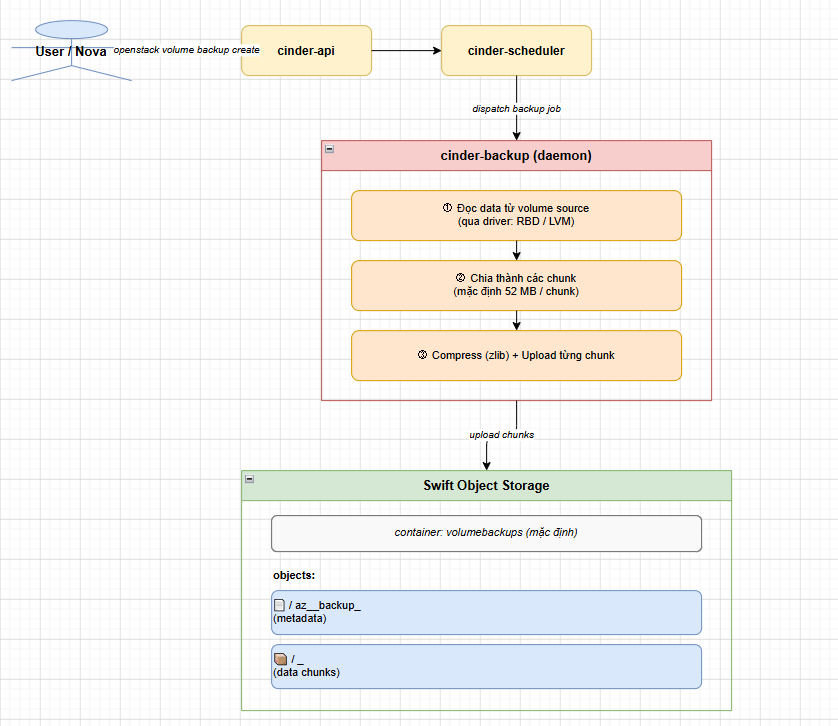

# CINDER DÙNG SWIFT LÀM BACKEND

> **Phiên bản tham chiếu**: OpenStack **2026.1 Gazpacho** + Ceph **Squid (19.x)**

## I. SWIFT BACKUP DRIVER VS SWIFT VOLUME DRIVER

### 1. Phân biệt rõ trước khi cấu hình

Đây là điểm **hay nhầm lẫn nhất** khi tích hợp Cinder với Swift:

| Khái niệm                    | Swift là gì trong trường hợp này | Dùng cho                                           |
|------------------------------|----------------------------------|----------------------------------------------------|
| **Swift làm Volume Backend** | Lưu trữ primary volume (block)   |  **Không hỗ trợ** — Swift không phải block storage |
| **Swift làm Backup Backend** | Nơi lưu bản sao backup của volume|  **Đây là use case đúng** — Cinder Backup          |

```text
ĐÚNG:
  Cinder Volume (primary) → LVM / Ceph RBD  ← block storage thật sự
  Cinder Backup           → Swift            ← lưu backup dạng object

SAI (không thể làm):
  Cinder Volume (primary) → Swift            ← Swift không có block I/O
```

### 2. Kiến trúc Cinder Backup với Swift



### 3. So sánh backend cho Cinder Backup

| Backend           | Ưu điểm                                           | Nhược điểm                                  |
|-------------------|---------------------------------------------------|---------------------------------------------|
| **Swift**         | Không cần hạ tầng riêng, dùng object store có sẵn | Latency cao hơn, phụ thuộc network          |
| **Ceph RBD**      | Incremental native, nhanh, COW                    | Cần Ceph cluster riêng cho backup           |
| **NFS**           | Đơn giản                                          | SPOF, không scale                           |
| **POSIX (local)** | Lab only                                          | Không production                            |

> **Khuyến nghị**: Dùng **Ceph RBD** làm backup backend nếu đã có Ceph. Dùng **Swift** nếu muốn backup offsite hoặc không có Ceph.

## II. CẤU HÌNH CINDER-BACKUP DÙNG SWIFT

### 1. Cấu hình cinder.conf

```bash
nano /etc/cinder/cinder.conf
```

```ini
[DEFAULT]
# Bật backup service:
backup_driver = cinder.backup.drivers.swift.SwiftBackupDriver

# Swift endpoint (public hoặc internal):
backup_swift_url = http://controller:8080/v1/AUTH_

# Xác thực với Swift qua Keystone (per_user = dùng token của user tạo backup):
backup_swift_auth = per_user

# Hoặc dùng service account cố định (xem Mục VI):
# backup_swift_auth = single_user
# backup_swift_user = cinder
# backup_swift_key  = Tien123
# backup_swift_tenant = service

# Container lưu backup (tự tạo nếu chưa tồn tại):
backup_swift_container = volumebackups

# Kích thước mỗi chunk khi upload (bytes, mặc định 52428800 = 50MB):
backup_swift_object_size = 52428800

# Số lần retry khi upload chunk lỗi:
backup_swift_retry_attempts = 3
backup_swift_retry_backoff = 2

# Nén data trước khi upload (giảm dung lượng ~30-50% với data thông thường):
backup_compression_algorithm = zlib

# Backup incremental: số chunk lưu metadata per backup:
backup_swift_enable_progress_timer = True

# Region của Swift (nếu multi-region):
# backup_swift_auth_version = 3
# backup_swift_user_domain = Default
# backup_swift_project_domain = Default
```

### 2. Cấu hình Keystone auth cho cinder-backup

```ini
[DEFAULT]
# Nếu dùng per_user auth, cinder-backup cần biết Keystone endpoint
# để validate token của user:
auth_uri = http://controller:5000

[keystone_authtoken]
www_authenticate_uri = http://controller:5000
auth_url = http://controller:5000
memcached_servers = controller:11211
auth_type = password
project_domain_name = Default
user_domain_name = Default
project_name = service
username = cinder
password = Tien123
```

### 3. Khởi động cinder-backup

```bash
# Khởi động và enable service:
systemctl enable --now cinder-backup

# Kiểm tra service running:
systemctl status cinder-backup

# Verify cinder-backup đã đăng ký:
source /root/admin-openrc
openstack volume service list

# Output mẫu:
# | Binary         | Host            | Zone | Status  | State |
# | cinder-backup  | controller@swift| nova | enabled | up    |
```

### 4. Kiểm tra kết nối Swift từ cinder-backup

```bash
# Xem log cinder-backup:
journalctl -u cinder-backup -n 50 --no-pager

# Test kết nối Swift thủ công (dùng credentials của cinder):
source /root/admin-openrc
swift stat
swift list

# Tạo container test:
swift post volumebackups-test
swift stat volumebackups-test
swift delete volumebackups-test
```

## III. CINDER BACKUP WORKFLOW

### 1. Tạo Full Backup

```bash
source /root/admin-openrc

# Tạo volume cần backup (hoặc dùng volume có sẵn):
openstack volume create --size 5 test-vol
openstack volume list

# Backup volume (volume phải ở trạng thái available hoặc in-use):
openstack volume backup create \
  --name backup-test-vol-full \
  test-vol

# Theo dõi trạng thái (đợi status = available):
watch openstack volume backup list

# Xem chi tiết backup:
openstack volume backup show backup-test-vol-full
```

**Output mẫu**:

```text
+-------------------+--------------------------------------+
| Field             | Value                                |
+-------------------+--------------------------------------+
| availability_zone | nova                                 |
| container         | volumebackups                        |
| created_at        | 2026-05-31T...                       |
| id                | <backup-uuid>                        |
| name              | backup-test-vol-full                 |
| object_count      | 22                                   |  ← số object trên Swift
| size              | 5                                    |  ← GB
| status            | available                            |
| volume_id         | <volume-uuid>                        |
| is_incremental    | False                                |
+-------------------+--------------------------------------+
```

### 2. Tạo Incremental Backup

```bash
# Backup incremental (chỉ lưu phần thay đổi so với backup trước):
openstack volume backup create \
  --name backup-test-vol-inc1 \
  --incremental \
  test-vol

# Incremental backup nhỏ hơn nhiều (chỉ backup phần changed blocks):
openstack volume backup show backup-test-vol-inc1
# is_incremental: True
# object_count: 3  ← ít hơn nhiều so với full backup
```

> **Lưu ý**: Incremental backup với Swift backend dùng **SHA256 hash** của từng chunk để phát hiện thay đổi — không native như Ceph COW snapshot.

### 3. Verify object trên Swift

```bash
# Xem container volumebackups:
swift list volumebackups

# Output — mỗi backup có nhiều object:
# <backup-uuid>/az_nova_backup_<volume-uuid>        ← metadata file
# <backup-uuid>/<sha256hash>_00001                  ← chunk 1
# <backup-uuid>/<sha256hash>_00002                  ← chunk 2
# ...

# Xem chi tiết metadata object:
BACKUP_ID=$(openstack volume backup show backup-test-vol-full -f value -c id)
swift stat volumebackups "${BACKUP_ID}/az_nova_backup_$(openstack volume show test-vol -f value -c id)"

# Đếm số chunk:
swift list volumebackups --prefix "${BACKUP_ID}/" | wc -l
```

### 4. Backup volume đang được attach (in-use)

```bash
# Backup volume đang attach vào VM (cần --force):
openstack volume backup create \
  --name backup-live-vol \
  --force \
  test-vol

# --force: cho phép backup khi volume đang in-use
# Cảnh báo: có thể backup data không nhất quán nếu VM đang ghi
# Khuyến nghị: freeze filesystem trong VM trước:
# Trong VM: sudo fsfreeze -f /mountpoint
# Backup xong: sudo fsfreeze -u /mountpoint
```

## IV. RESTORE BACKUP TỪ SWIFT

### 1. Restore vào volume mới

```bash
source /root/admin-openrc

# Liệt kê backup:
openstack volume backup list

# Restore vào volume mới (Swift download → tạo volume):
openstack volume backup restore \
  <backup-id> \
  <new-volume-id>

# Hoặc để Cinder tự tạo volume mới:
openstack volume backup restore --force <backup-id>

# Theo dõi (đợi volume status = available):
watch openstack volume list

# Verify volume restored:
openstack volume show <restored-volume-id>
```

### 2. Restore incremental backup — thứ tự quan trọng

```text
Chuỗi backup:
  full-backup → inc-backup-1 → inc-backup-2 → inc-backup-3

Restore về inc-backup-3:
  Cinder tự động resolve chain: full → inc-1 → inc-2 → inc-3
  (không cần restore thủ công từng bước)

Restore về inc-backup-1:
  Chỉ apply: full → inc-1
  → Volume ở trạng thái tại thời điểm tạo inc-1
```

```bash
# Cinder tự xử lý chain — chỉ cần chỉ định backup muốn restore:
openstack volume backup restore \
  backup-test-vol-inc2 \
  restored-vol
```

### 3. Xử lý lỗi restore

**Lỗi thường gặp khi restore**:

```bash
# Lỗi 1: Backup status = error
openstack volume backup list | grep error

# Xem lý do lỗi:
openstack volume backup show <backup-id>
# Xem log cinder-backup:
journalctl -u cinder-backup -n 100 | grep ERROR

# Lỗi 2: Swift object bị mất (object_count không khớp)
# Kiểm tra:
swift list volumebackups --prefix "<backup-id>/" | wc -l
openstack volume backup show <backup-id> -f value -c object_count
# Nếu khác nhau → backup bị corrupt → không restore được

# Lỗi 3: Restore timeout (volume lớn, network chậm)
# Tăng timeout trong cinder.conf:
# [DEFAULT]
# restore_timeout = 3600

# Lỗi 4: Không đủ quota volume
openstack quota show --volume <project-id>
openstack quota set --volumes 50 <project-id>
```

### 4. Xóa backup

```bash
# Xóa backup đơn:
openstack volume backup delete backup-test-vol-inc1

# Xóa nhiều backup:
openstack volume backup list -f value -c ID | xargs openstack volume backup delete

# Xóa backup trên Swift (nếu record Cinder đã mất nhưng Swift còn):
swift delete volumebackups --prefix "<backup-id>/"

# Verify đã xóa trên Swift:
swift list volumebackups | grep <backup-id>
```

## V. CẤU HÌNH GLOBALS.YML KOLLA CHO CINDER + SWIFT

### 1. Enable Cinder Backup với Swift backend

```bash
nano /etc/kolla/globals.yml
```

```yaml
# Bật Cinder Backup service:
enable_cinder_backup: "yes"

# Chọn backend cho cinder-backup:
cinder_backup_driver: "swift"

# Swift phải được enable (nếu dùng Swift nội bộ):
enable_swift: "yes"

# Hoặc nếu Swift ngoài (external):
# enable_swift: "no"
# Cấu hình backup_swift_url thủ công trong /etc/kolla/config/cinder/cinder-backup.conf
```

### 2. Cấu hình override cho cinder-backup (Kolla)

```bash
# Tạo file override cho cinder-backup:
mkdir -p /etc/kolla/config/cinder
nano /etc/kolla/config/cinder/cinder-backup.conf
```

```ini
[DEFAULT]
backup_driver = cinder.backup.drivers.swift.SwiftBackupDriver
backup_swift_url = http://controller:8080/v1/AUTH_
backup_swift_auth = per_user
backup_swift_container = volumebackups
backup_swift_object_size = 52428800
backup_swift_retry_attempts = 3
backup_swift_retry_backoff = 2
backup_compression_algorithm = zlib
```

### 3. Deploy/Reconfigure

```bash
# Reconfigure Cinder (áp dụng cấu hình mới):
kolla-ansible -i /etc/kolla/multinode reconfigure \
  --tags cinder

# Hoặc chỉ deploy cinder-backup:
kolla-ansible -i /etc/kolla/multinode deploy \
  --tags cinder-backup

# Verify container đang chạy:
docker ps | grep cinder_backup

# Xem log cinder-backup container:
docker logs cinder_backup -f --tail 50
```

### 4. Verify Swift endpoint trong Cinder container

```bash
# Vào container cinder-backup kiểm tra:
docker exec -it cinder_backup bash

# Kiểm tra Swift endpoint:
cat /etc/cinder/cinder.conf | grep backup_swift

# Test kết nối Swift từ container:
swift --os-auth-url http://controller:5000/v3 \
      --os-project-name service \
      --os-username cinder \
      --os-password Tien123 \
      --os-user-domain-name Default \
      --os-project-domain-name Default \
      --auth-version 3 \
      stat
```

## VI. KEYRING & CREDENTIAL CHO CINDER-BACKUP

### 1. Hai chế độ xác thực

| Chế độ         | Cách hoạt động                                            | Phù hợp                                                |
|----------------|-----------------------------------------------------------|--------------------------------------------------------|
| `per_user`     | Dùng token của user tạo backup để auth với Swift          | Multi-tenant, mỗi user backup vào account Swift của họ |
| `single_user`  | Dùng service account cố định (cinder) để auth với Swift   | Tập trung, admin kiểm soát hoàn toàn                   |

### 2. Cấu hình per_user (mặc định, khuyến nghị)

```ini
[DEFAULT]
backup_swift_auth = per_user
backup_swift_url = http://controller:8080/v1/AUTH_

# cinder-backup sẽ dùng token của user tạo backup request
# Token được truyền từ cinder-api → cinder-backup qua message queue
```

**Lưu ý với per_user**:

- User tạo backup phải có role `swiftoperator` hoặc `member` trong project của họ.
- Backup sẽ nằm trong Swift account của project user đó.
- User A không thể restore backup của User B.

### 3. Cấu hình single_user (service account)

```bash
# Tạo user cinder-backup trong Keystone:
openstack user create --domain default --password CinderBackup123 cinder-backup
openstack role add --project service --user cinder-backup admin

# Hoặc tạo role tối thiểu (không cần admin):
openstack role create swiftbackup
openstack role add --project service --user cinder-backup swiftbackup
```

```ini
# /etc/cinder/cinder.conf
[DEFAULT]
backup_swift_auth = single_user

# Credentials service account:
backup_swift_user   = cinder-backup
backup_swift_key    = CinderBackup123
backup_swift_tenant = service

# Keystone v3 (bắt buộc với OpenStack 2026.1):
backup_swift_auth_version    = 3
backup_swift_user_domain     = Default
backup_swift_project_domain  = Default

# Swift URL:
backup_swift_url = http://controller:8080/v1/AUTH_
```

### 4. Đảm bảo role đúng cho Swift

```bash
source /root/admin-openrc

# Kiểm tra role của cinder trong project service:
openstack role assignment list \
  --user cinder \
  --project service \
  --names

# Nếu thiếu role, thêm:
openstack role add --project service --user cinder admin
# Hoặc tối thiểu:
openstack role add --project service --user cinder swiftoperator

# Verify cinder có thể gọi Swift:
TOKEN=$(openstack token issue -f value -c id)
SWIFT_URL="http://controller:8080/v1/AUTH_$(openstack project show service -f value -c id)"

curl -s -H "X-Auth-Token: $TOKEN" "$SWIFT_URL" -o /dev/null -w "HTTP %{http_code}\n"
# Phải là HTTP 200 hoặc 204
```

### 5. Kiểm tra credential end-to-end

```bash
source /root/admin-openrc

# Tạo volume nhỏ để test:
openstack volume create --size 1 test-backup-cred

# Tạo backup:
openstack volume backup create \
  --name test-cred-backup \
  test-backup-cred

# Theo dõi (mất vài phút):
watch openstack volume backup list

# Nếu status = error: xem log
journalctl -u cinder-backup -n 50 | grep -E "ERROR|Swift|Auth"

# Nếu status = available: xác nhận object tồn tại trên Swift
openstack volume backup show test-cred-backup -f value -c id | \
  xargs -I{} swift list volumebackups --prefix "{}"

# Dọn dẹp sau test:
openstack volume backup delete test-cred-backup
openstack volume delete test-backup-cred
```

### 6. Bảng lỗi credential phổ biến

| Lỗi trong log                              | Nguyên nhân                                    | Fix                                                       |
|--------------------------------------------|------------------------------------------------|-----------------------------------------------------------|
| `401 Unauthorized to Swift`                | Sai password hoặc user không tồn tại           | Kiểm tra `backup_swift_user` và `backup_swift_key`        |
| `403 Forbidden`                            | User không có role trên project service        | `openstack role add --project service --user cinder admin`|
| `503 Service Unavailable`                  | Swift endpoint sai hoặc Swift down             | Kiểm tra `backup_swift_url`, `swift stat`                 |
| `Connection refused`                       | Proxy Swift không chạy hoặc sai port           | `systemctl status swift-proxy`, kiểm tra port 8080        |
| `invalid literal for int() with base 10`   | `backup_swift_auth_version` không phải số      | Đặt `backup_swift_auth_version = 3`                       |
| `No module named swiftclient`              | Thiếu python3-swiftclient                      | `pip3 install python-swiftclient`                         |
