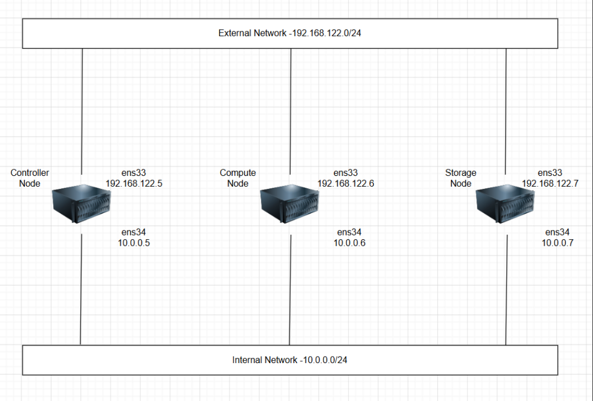
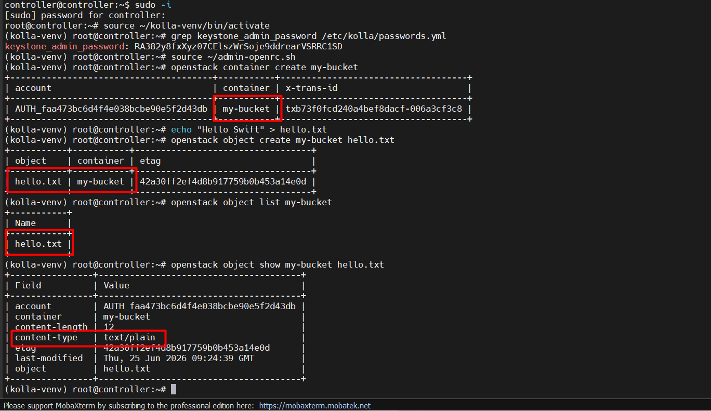
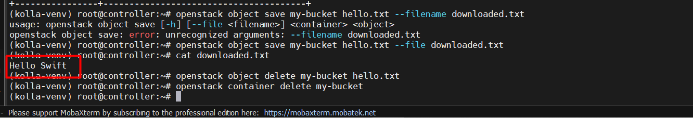
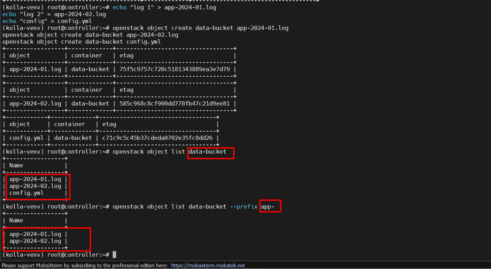
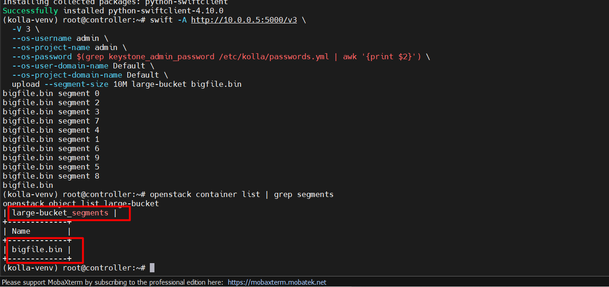
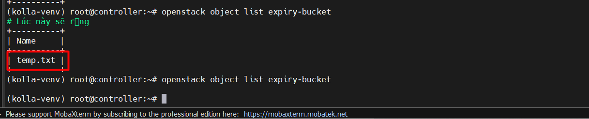
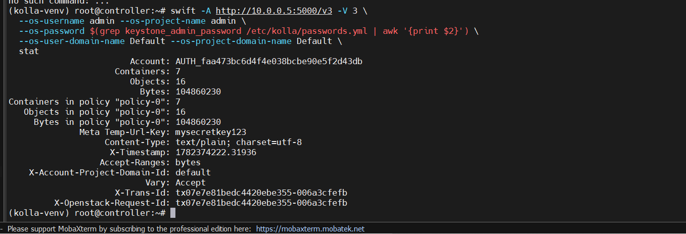
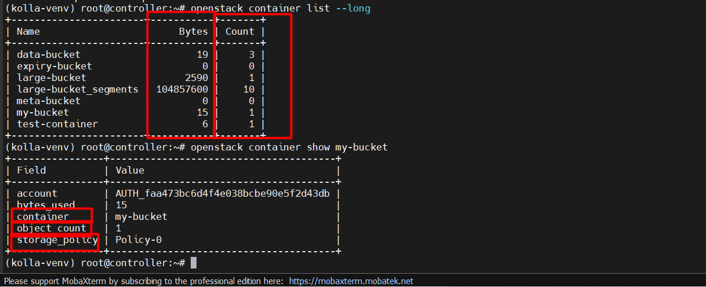
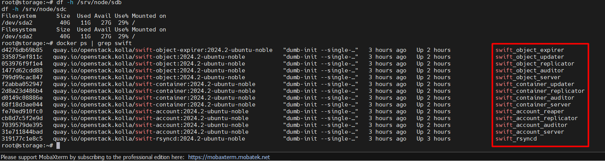

# CÁC BÀI LAB CƠ BẢN VỀ SWIFT

## I. MÔI TRƯỜNG



Môi trường Lab là ta sẽ thực hiện trên cụm OpenStack mà ta đã dựng sau [đây](https://github.com/tiend9/Tim-hieu-OPNsense/blob/main/15.Deployment_OPS/05.Deploy_OPS_with_Kolla_Ansible/04.Deploying_OpenStack_Backend_Swift_With_KollaAnsible.md)

## II. THỰC HÀNH LAB

### `Lab 1` - Tạo Container và Upload Object

**Mục tiêu**: Làm quen với thao tác cơ bản nhất của Swift — tạo container, upload file.

```bash
source ~/admin-openrc.sh

# Tạo container
openstack container create my-bucket

# Tạo file test
echo "Hello Swift" > hello.txt

# Upload
openstack object create my-bucket hello.txt

# List object trong container
openstack object list my-bucket
```

Kiểm tra:

```bash
openstack object show my-bucket hello.txt
# Phải thấy: content_type, last_modified, content_length
```



### `Lab 2` — Download và Xoá Object

**Mục tiêu**: Download object về local (Controller), xoá object và container.

```bash
# Download về file khác tên
openstack object save my-bucket hello.txt --file downloaded.txt
cat downloaded.txt

# Xoá object
openstack object delete my-bucket hello.txt

# Xoá container (phải rỗng)
openstack container delete my-bucket
```



### `Lab 3`: Upload nhiều file và List theo Prefix

**Mục tiêu**: Quản lý nhiều object, dùng prefix để lọc như "thư mục ảo".

```bash
openstack container create data-bucket

# Tạo nhiều file
echo "log 1" > app-2024-01.log
echo "log 2" > app-2024-02.log
echo "config" > config.yml

# Upload với prefix (giả lập thư mục)
openstack object create data-bucket app-2024-01.log
openstack object create data-bucket app-2024-02.log
openstack object create data-bucket config.yml

# List tất cả
openstack object list data-bucket

# List theo prefix
openstack object list data-bucket --prefix app-
```



### `Lab 4`: Upload File Lớn (Large Object)

**Mục tiêu**: Upload file lớn hơn `5GB` bằng cơ chế **Static Large Object (SLO)** của Swift.(Ở đây chỉ `100MB` để minh hoạ)

```bash
# Tạo file 100MB để test (thay bằng file thật nếu có)
dd if=/dev/urandom of=bigfile.bin bs=1M count=100

# Upload bình thường (dưới 5GB vẫn được, nhưng dùng swift CLI để test segment)
pip install python-swiftclient

swift -A http://10.0.0.5:5000/v3 \
  -V 3 \
  --os-username admin \
  --os-project-name admin \
  --os-password $(grep keystone_admin_password /etc/kolla/passwords.yml | awk '{print $2}') \
  --os-user-domain-name Default \
  --os-project-domain-name Default \
  upload --segment-size 10M large-bucket bigfile.bin

# List container segment
openstack container list | grep segments
openstack object list large-bucket
```

**Giải thích**:

- `-A http://10.0.0.5:5000/v3`: Auth URL — endpoint Keystone để xác thực
- `-V 3`: Keystone version 3
- `--os-username admin`: Tên user đăng nhập
- `--os-project-name admin`: Project/tenant sẽ làm việc trong đó
- `--os-password $(...)`: Lấy password từ file `passwords.yml` thay vì gõ tay
- `--os-user-domain-name Default`:Domain của user
- `--os-project-domain-name Default`: Domain của project
- uploadLệnh upload của swift CLI
- `--segment-size 10M`:Chia file thành từng đoạn `10MB`. Swift sẽ upload từng segment riêng, sau đó tạo manifest ghép lại. Đây là cơ chế Dynamic Large Object (DLO)
- `large-bucket`: Tên container đích
- `bigfile.bin`: File cần upload

Output:



### `Lab 5`: Set Metadata cho Object

**Mục tiêu**: Gắn **metadata** tùy chỉnh lên object để phân loại hoặc tra cứu.

```bash
openstack container create meta-bucket
echo "important document" > report.pdf

# Set metadata sau bằng swift post 
swift -A http://10.0.0.5:5000/v3 \
  -V 3 \
  --os-username admin \
  --os-project-name admin \
  --os-password $(grep keystone_admin_password /etc/kolla/passwords.yml | awk '{print $2}') \
  --os-user-domain-name Default \
  --os-project-domain-name Default \
  post meta-bucket report.pdf \
  -H "X-Object-Meta-owner: teamA" \
  -H "X-Object-Meta-env: production" \
  -H "X-Object-Meta-version: 1.0"

# Xem metadata
openstack object show meta-bucket report.pdf
```

### `Lab 6`: Set Object Expiry (Tự động xoá)

**Mục tiêu**: Upload object có thời hạn, sau thời gian nhất định Swift tự xoá.

```bash
# Tính epoch time = thời điểm hiện tại + 300 giây (5 phút)
EXPIRE=$(date -d "+2 minutes" +%s)

echo "temp data" > temp.txt

# Upload với header X-Delete-At
swift -A http://10.0.0.5:5000/v3 \
  -V 3 \
  --os-username admin \
  --os-project-name admin \
  --os-password $(grep keystone_admin_password /etc/kolla/passwords.yml | awk '{print $2}') \
  --os-user-domain-name Default \
  --os-project-domain-name Default \
  upload --header "X-Delete-At: $EXPIRE" expiry-bucket temp.txt

# Sau 2 phút, object tự biến mất
openstack object list expiry-bucket
```



### `Bài 7`: Tạo Temp URL (Chia sẻ file có thời hạn)

**Mục tiêu**: Tạo URL tạm thời để chia sẻ object mà không cần account OpenStack.

```bash
# Bước 1: Set secret key cho account
swift -A http://10.0.0.5:5000/v3 -V 3 \
  --os-username admin --os-project-name admin \
  --os-password $(grep keystone_admin_password /etc/kolla/passwords.yml | awk '{print $2}') \
  --os-user-domain-name Default --os-project-domain-name Default \
  post -m "Temp-Url-Key:mysecretkey123"

# Bước 2: Upload file
openstack container create my-bucket
openstack object create my-bucket shared.txt
echo "shared content" > shared.txt
openstack object create my-bucket shared.txt

# Bước 3: Lấy Account ID
swift -A http://10.0.0.5:5000/v3 -V 3 \
  --os-username admin --os-project-name admin \
  --os-password $(grep keystone_admin_password /etc/kolla/passwords.yml | awk '{print $2}') \
  --os-user-domain-name Default --os-project-domain-name Default \
  stat | grep "Account:"

# Bước 4: Tạo temp URL (hiệu lực 1 giờ = 3600 giây)
swift tempurl GET 3600 \
  /v1/AUTH_<account-id>/my-bucket/shared.txt \
  mysecretkey123

# Dùng curl để test
curl "http://10.0.0.5:8080/v1/<Account_ID>/my-bucket/shared.txt?temp_url_sig=<sig>&temp_url_expires=<expires>"
```

**Giải thích**:

- `post`: Lệnh cập nhật metadata — ở đây là set metadata cho account (không phải container hay object)
- `-m "Temp-Url-Key:mysecretkey123"`: Là viết tắt của `--meta`, set metadata dạng `key:value` lên account. `Temp-Url-Key` là key đặc biệt Swift dùng làm **secret key để ký Temp URL**

Vì khi mày tạo Temp URL, Swift sẽ:

1. Lấy Temp-Url-Key từ account
2. Dùng nó để tính chữ ký `HMAC-SHA1` cho URL
3. Khi có request vào Temp URL, Swift verify chữ ký bằng đúng key đó

-> Nếu không set key này trước → Swift không có gì để ký → tạo Temp URL sẽ lỗi.

Xem lại key đã set chưa:

```bash
swift -A http://10.0.0.5:5000/v3 -V 3 \
  --os-username admin --os-project-name admin \
  --os-password $(grep keystone_admin_password /etc/kolla/passwords.yml | awk '{print $2}') \
  --os-user-domain-name Default --os-project-domain-name Default \
  stat
# Xem dòng: Meta Temp-Url-Key: mysecretkey123
```

Output:



=> Là `OKE`

**Giải thích**:

- `7 containers, 16 objects, ~100MB` đã dùng — đúng với những gì ta đã làm từ đầu các bài lab.
- Meta Temp-Url-Key: `mysecretkey123`

### `Bài 8`: Kiểm tra Swift Service và Disk Usage

**Mục tiêu**: Theo dõi trạng thái Swift và dung lượng đã dùng.

```bash
# Xem tất cả container trong account
openstack container list --long
# Cột: bytes, object_count

# Xem dung lượng từng container
openstack container show my-bucket

# Xem trực tiếp trên Storage node
df -h /srv/node/sdb
df -h /srv/node/sdc

# Xem Swift containers đang chạy
docker ps | grep swift
```



Trên Storage Node:


