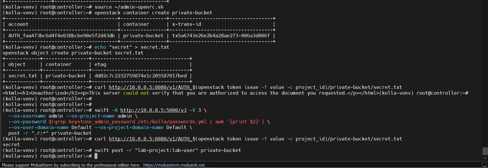
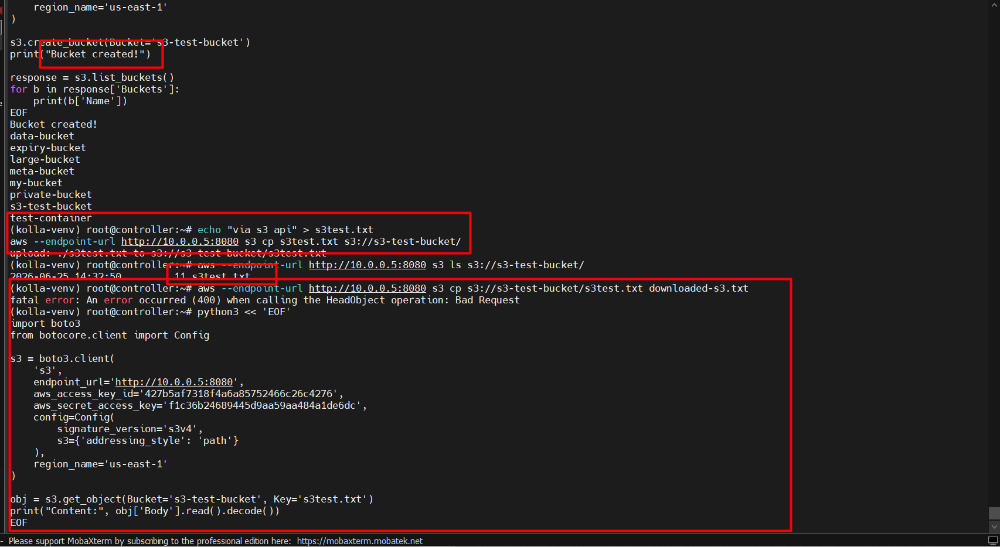
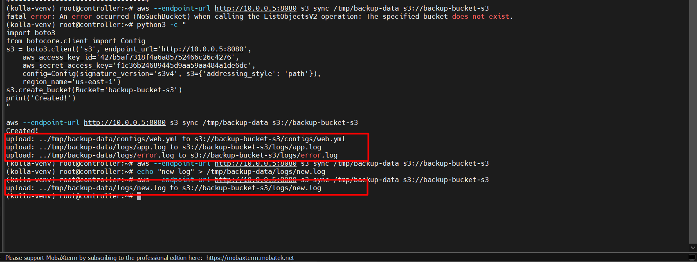
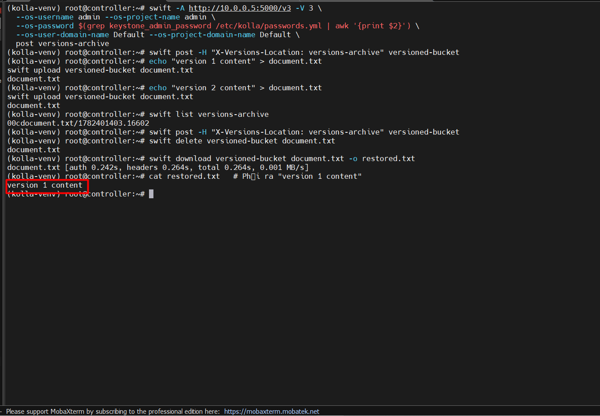
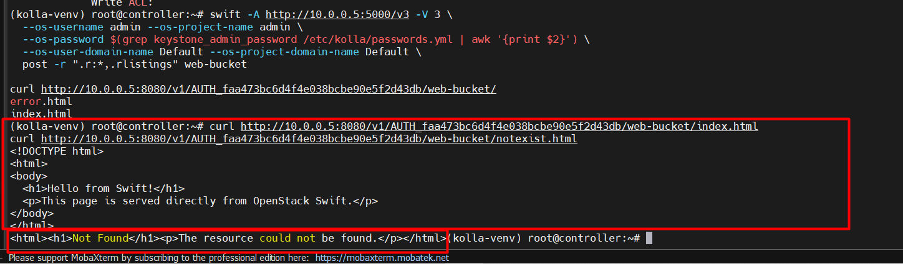
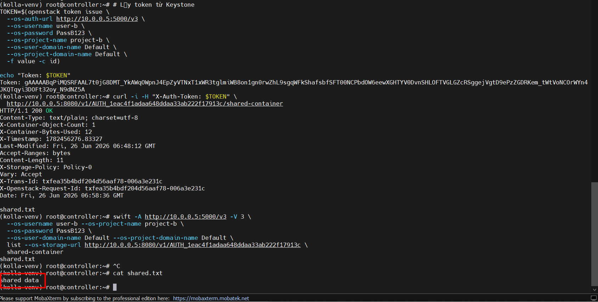

# CÁC BÀI LAB CƠ BẢN VỀ SWIFT

## I. MÔI TRƯỜNG


Môi trường Lab là ta sẽ thực hiện trên cụm OpenStack mà ta đã dựng sau [đây](https://github.com/tiend9/Tim-hieu-OPNsense/blob/main/15.Deployment_OPS/05.Deploy_OPS_with_Kolla_Ansible/04.Deploying_OpenStack_Backend_Swift_With_KollaAnsible.md)

## II. THỰC HÀNH

### `Lab 1` : Hiểu cơ chế ACL của Swift — cho phép user khác hoặc public truy cập container

```bash
source ~/admin-openrc.sh

# Tạo container mặc định (private)
openstack container create private-bucket
echo "secret" > secret.txt
openstack object create private-bucket secret.txt

# Thử truy cập không xác thực -> phải bị 401
curl http://10.0.0.5:8080/v1/AUTH_$(openstack token issue -f value -c project_id)/private-bucket/secret.txt

# Set container thành PUBLIC (read-only cho tất cả)
swift -A http://10.0.0.5:5000/v3 -V 3 \
  --os-username admin --os-project-name admin \
  --os-password $(grep keystone_admin_password /etc/kolla/passwords.yml | awk '{print $2}') \
  --os-user-domain-name Default --os-project-domain-name Default \
  post -r ".r:*" private-bucket

# Thử lại -> phải trả về content
curl http://10.0.0.5:8080/v1/AUTH_$(openstack token issue -f value -c project_id)/private-bucket/secret.txt

# Giới hạn chỉ một user cụ thể được đọc
swift post -r "lab-project:lab-user" private-bucket
```



### `Lab 2` : Swift S3 API với AWS CLI

**Mục tiêu**: Truy cập Swift bằng giao thức S3 tương thích — dùng được các tool AWS ecosystem.

```bash
# Tạo EC2 credentials
source ~/admin-openrc.sh
openstack ec2 credentials create
# Ghi lại Access (như username ) và Secret (như password)

# Cài AWS CLI
pip install awscli

# Cấu hình
aws configure
# AWS Access Key ID: <access key>
# AWS Secret Access Key: <secret key>
# Default region: RegionOne
# Output format: json

# Xài 1 số tool của AWS với chuẩn SwiftS3API
# Tạo bucket (= Swift container)
aws configure set default.s3.signature_version s3v4

aws --endpoint-url http://10.0.0.5:8080 s3 mb s3://s3-test-bucket --region RegionOne

# Upload file
echo "via s3 api" > s3test.txt
aws --endpoint-url http://10.0.0.5:8080 s3 cp s3test.txt s3://s3-test-bucket/

# List
aws --endpoint-url http://10.0.0.5:8080 s3 ls s3://s3-test-bucket/

# Download
aws --endpoint-url http://10.0.0.5:8080 s3 cp s3://s3-test-bucket/s3test.txt downloaded-s3.txt

# Xoá
aws --endpoint-url http://10.0.0.5:8080 s3 rm s3://s3-test-bucket/s3test.txt
aws --endpoint-url http://10.0.0.5:8080 s3 rb s3://s3-test-bucket
```



### `Lab 3`: Sync thư mục local lên Swift (Backup use case)

**Mục tiêu**: Dùng `swift upload` hoặc `aws s3 sync` để backup cả thư mục lên Swift.

```bash
# Tạo thư mục giả lập data cần backup
mkdir -p /tmp/backup-data/logs /tmp/backup-data/configs

# Tạo data giả 
echo "log entry 1" > /tmp/backup-data/logs/app.log
echo "log entry 2" > /tmp/backup-data/logs/error.log
echo "server: nginx" > /tmp/backup-data/configs/web.yml

# Cách 1: swift CLI upload cả thư mục hay đặt tên object giống dir thư mục
swift -A http://10.0.0.5:5000/v3 -V 3 \
  --os-username admin --os-project-name admin \
  --os-password $(grep keystone_admin_password /etc/kolla/passwords.yml | awk '{print $2}') \
  --os-user-domain-name Default --os-project-domain-name Default \
  upload backup-bucket /tmp/backup-data

# Nếu muốn bỏ phần prefix đường dẫn thì chạy lệnh ở:
cd /tmp

# Object sẽ là: backup-data/logs/app.log (không có /tmp ở đầu)

openstack object list backup-bucket

# Cách 2: aws s3 sync (chỉ upload file thay đổi)
# Nhớ tạo backup-bucket trước
aws --endpoint-url http://10.0.0.5:8080 s3 sync /tmp/backup-data s3://backup-bucket-s3

# Thêm file mới và sync lại -> chỉ upload file mới
echo "new log" > /tmp/backup-data/logs/new.log
aws --endpoint-url http://10.0.0.5:8080 s3 sync /tmp/backup-data s3://backup-bucket-s3
```

Output:



**Giải thích**:

- Lần sync đầu: upload cả 3 file `web.yml`, `app.log`, `error.log`
- Lần sync thứ 2 (không thêm file): không upload gì — sync thông minh, chỉ upload file thay đổi
- Lần sync thứ 3 (thêm `new.log`): chỉ upload đúng file mới `new.log`, bỏ qua 3 file cũ không đổi

=> Đây là điểm mạnh của `s3 sync` so với `swift upload` thông thường — phù hợp cho backup định kỳ vì không upload lại toàn bộ mỗi lần.

### `Lab 4`: Versioning Object (Static Website / Version Control)

**Mục tiêu**: Dùng **Swift versioning** để giữ lại các phiên bản cũ của object khi bị overwrite.

```bash
# Tạo container lưu trữ version cũ
swift -A http://10.0.0.5:5000/v3 -V 3 \
  --os-username admin --os-project-name admin \
  --os-password $(grep keystone_admin_password /etc/kolla/passwords.yml | awk '{print $2}') \
  --os-user-domain-name Default --os-project-domain-name Default \
  post versions-archive

# Tạo container chính với header versioning
swift post -H "X-Versions-Location: versions-archive" versioned-bucket

# Upload version 1
echo "version 1 content" > document.txt
swift upload versioned-bucket document.txt

# Overwrite bằng version 2
echo "version 2 content" > document.txt
swift upload versioned-bucket document.txt

# Xem container archive (version cũ được lưu ở đây)
swift list versions-archive

# Xoá object hiện tại -> tự động rollback về version cũ
swift delete versioned-bucket document.txt
swift download versioned-bucket document.txt -o restored.txt
cat restored.txt   # Phải ra "version 1 content"
```



### `Lab 5`: Static Website trên Swift

**Mục tiêu**: Host một trang HTML tĩnh trực tiếp từ Swift container — không cần web server.

```bash
# Tạo HTML đơn giản
cat > index.html <<EOF
<!DOCTYPE html>
<html>
<body>
  <h1>Hello from Swift!</h1>
  <p>This page is served directly from OpenStack Swift.</p>
</body>
</html>
EOF

cat > error.html <<EOF
<!DOCTYPE html>
<html><body><h1>404 - Not Found</h1></body></html>
EOF

# Upload lên container
swift -A http://10.0.0.5:5000/v3 -V 3 \
  --os-username admin --os-project-name admin \
  --os-password $(grep keystone_admin_password /etc/kolla/passwords.yml | awk '{print $2}') \
  --os-user-domain-name Default --os-project-domain-name Default \
  upload web-bucket index.html error.html

# Set container thành website
swift post \
  -m "web-index:index.html" \
  -m "web-error:error.html" \
  -r ".r:*" \
  web-bucket

# Truy cập qua browser hoặc curl
ACCOUNT_ID=$(openstack token issue -f value -c project_id)
curl http://10.0.0.5:8080/v1/AUTH_${ACCOUNT_ID}/web-bucket/
curl http://10.0.0.5:8080/v1/AUTH_${ACCOUNT_ID}/web-bucket/notexist.html
```



### `Lab 6`: Cross-Project Access (Chia sẻ container giữa các tenant)

**Mục tiêu**: Cho phép user của project khác đọc/ghi vào container của mình.

```bash
source ~/admin-openrc.sh

# Tạo 2 project
openstack project create project-a
openstack project create project-b

openstack user create --password "PassA123" user-a
openstack user create --password "PassB123" user-b

openstack role add --project project-a --user user-a member
openstack role add --project project-b --user user-b member

# user-a tạo container và upload file
source /dev/stdin <<EOF
export OS_AUTH_URL=http://10.0.0.5:5000/v3
export OS_USERNAME=user-a
export OS_PASSWORD=PassA123
export OS_PROJECT_NAME=project-a
export OS_USER_DOMAIN_NAME=Default
export OS_PROJECT_DOMAIN_NAME=Default
export OS_IDENTITY_API_VERSION=3
EOF

openstack container create shared-container
echo "shared data" > shared.txt
openstack object create shared-container shared.txt

# Set ACL cho phép project-b:user-b đọc
swift -A http://10.0.0.5:5000/v3 -V 3 \
  --os-username user-a --os-project-name project-a \
  --os-password PassA123 \
  --os-user-domain-name Default --os-project-domain-name Default \
  post -r "project-b:user-b" shared-container

# user-b đọc container của user-a
swift -A http://10.0.0.5:5000/v3 -V 3 \
  --os-username user-b --os-project-name project-b \
  --os-password PassB123 \
  --os-user-domain-name Default --os-project-domain-name Default \
  list shared-container

# Hoặc dùng swift với --os-storage-url trực tiếp
swift -A http://10.0.0.5:5000/v3 -V 3 \
  --os-username user-b --os-project-name project-b \
  --os-password PassB123 \
  --os-user-domain-name Default --os-project-domain-name Default \
  list --os-storage-url http://10.0.0.5:8080/v1/AUTH_1eac4f1adaa648ddaa33ab222f17913c \
  shared-container
shared.txt
```



### `Lab 7`: Benchmark Swift với swift-bench

```bash
# Mục tiêu: Đo throughput thực tế của cluster Swift trong lab.

pip install python-swiftclient
apt install swift-bench

ADMIN_PASS=$(grep keystone_admin_password /etc/kolla/passwords.yml | awk '{print $2}')

# Chạy benchmark: 100 object, mỗi object 10KB, 10 concurrency = Cachs taoj file config
cat > /tmp/bench.conf << EOF
[bench]
auth = http://10.0.0.5:5000/v3
auth_version = 3
user = admin:admin
key = $ADMIN_PASS
os_tenant_name = admin
os_user_domain_name = Default
os_project_domain_name = Default
concurrency = 10
object_size = 10240
num_objects = 100
num_gets = 100
delete = yes
EOF

swift-bench /tmp/bench.conf

# Output sẽ cho:
# PUT: x ops/s
# GET: x ops/s
# DELETE: x ops/s

#  Chạy 3 lần benchmark theo yêu cầu lab
# Lần 1: baseline (c=10, s=10KB)
swift-bench /tmp/bench.conf

# Lần 2: tăng concurrency (c=50, s=10KB)
sed -i 's/concurrency = 10/concurrency = 50/' /tmp/bench.conf
swift-bench /tmp/bench.conf

# Lần 3: tăng object size (c=50, s=1MB)
sed -i 's/object_size = 10240/object_size = 1048576/' /tmp/bench.conf
swift-bench /tmp/bench.conf
```

So sánh với các giá trị sau khi:

- Tăng `-c` (concurrency) lên 50
- Tăng `-s` (object size) lên 1MB

Ghi lại bảng kết quả để phân tích bottleneck.
