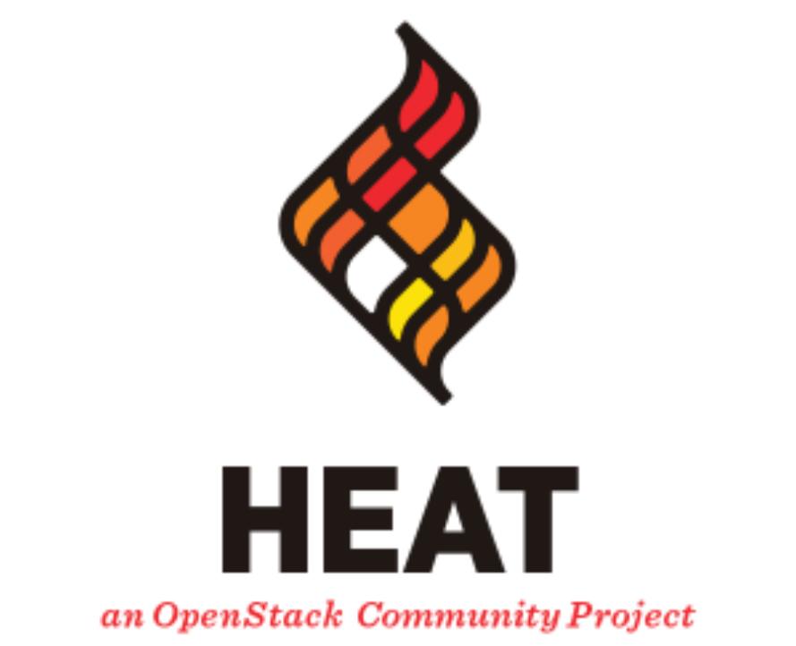
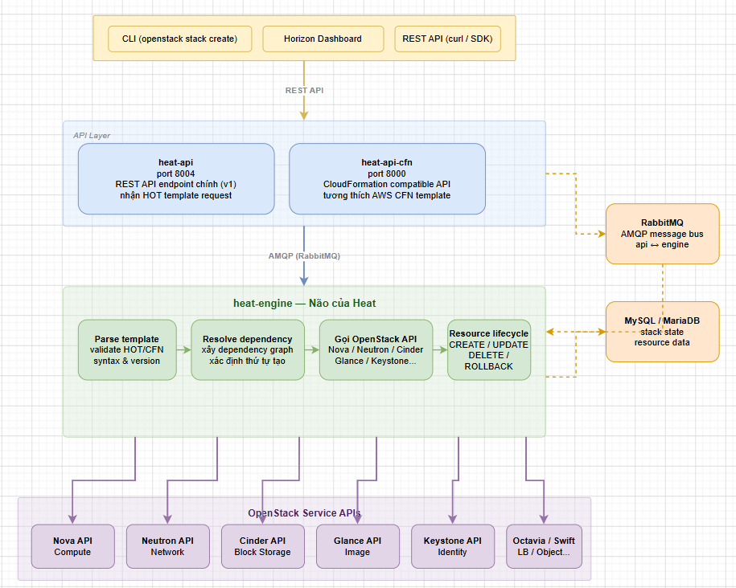

# KIẾN TRÚC VÀ KHÁI NIỆM CỐT LÕI HEAT

> **Phiên bản tham chiếu**: OpenStack **2026.1 Gazpacho** + Heat **21.x**



## I. HEAT LÀ GÌ, DÙNG ĐỂ LÀM GÌ?

### 1. Định nghĩa

**OpenStack Heat** là dịch vụ **Orchestration** của OpenStack — cho phép mô tả và triển khai toàn bộ hạ tầng cloud (VM, network, storage, security group, floating IP...) thông qua **template văn bản** theo mô hình **Infrastructure as Code (IaC)**.

```text
Thay vì:
  openstack server create ...       (1 lệnh)
  openstack network create ...      (1 lệnh)
  openstack volume create ...       (1 lệnh)
  openstack router create ...       (1 lệnh)
  ... (10-20 lệnh, dễ sai, không tái sử dụng)

Với Heat:
  openstack stack create -t my-infra.yaml my-stack
  → Heat tự tạo tất cả resource theo đúng thứ tự dependency
  → 1 lệnh, idempotent, version control được
```

### 2. So sánh Heat với các công cụ IaC khác

| Tiêu chí               | Heat                          | Terraform                    | Ansible                        | AWS CloudFormation           |
|------------------------|-------------------------------|------------------------------|--------------------------------|------------------------------|
| **Nền tảng**           | OpenStack native              | Multi-cloud                  | Multi-platform                 | AWS only                     |
| **Ngôn ngữ template**  | YAML (HOT)                    | HCL                          | YAML (Playbook)                | JSON / YAML                  |
| **State management**   | Lưu trong Heat DB             | terraform.tfstate file       | Không có state                 | Lưu trong CloudFormation     |
| **Drift detection**    | Có (`stack-check`)            | `terraform plan`             | Không (idempotent tasks)       | Có (drift detection)         |
| **Mô hình**            | Declarative                   | Declarative                  | Imperative / Declarative       | Declarative                  |
| **Rollback**           | Tự động khi tạo thất bại      | Không tự động                | Không                          | Tự động                      |
| **Tích hợp OpenStack** | Native (dùng API nội bộ)      | Qua provider                 | Qua module                     | Không                        |
| **Scaling**            | AutoScaling Group + policy    | Cần viết module              | Cần code thêm                  | Auto Scaling natively        |

### 3. Các use case của Heat

```text
1. Environment provisioning:
   → Tạo môi trường dev/staging/prod hoàn chỉnh từ 1 template
   → Xóa toàn bộ khi không dùng → tiết kiệm chi phí

2. Application stack deployment:
   → VM + network + volume + security group + floating IP
   → Đúng thứ tự dependency tự động

3. Auto Scaling:
   → Scale out VM theo CPU/RAM metric (tích hợp Ceilometer/Aodh)
   → Scale in khi tải giảm

4. Disaster Recovery:
   → Template mô tả hạ tầng → recreate ở region khác trong vài phút

5. Blue/Green deployment:
   → Tạo stack mới (green) → chuyển traffic → xóa stack cũ (blue)

6. Multi-tenant template library:
   → Admin tạo template chuẩn → user tự deploy với tham số riêng
```

## II. CÁC THÀNH PHẦN CHÍNH

### 1. Tổng quan kiến trúc



### 2. heat-api

- **Vai trò**: Nhận request từ client qua **REST API v1** (port **8004**).
- **Chức năng**: Validate request, xác thực Keystone token, chuyển tiếp sang `heat-engine` qua **RabbitMQ**.
- **Endpoint**: `http://controller:8004/v1/<project-id>`
- **Stateless**: Không xử lý logic, chỉ route message.

```bash
# Kiểm tra heat-api:
systemctl status openstack-heat-api
# Hoặc Kolla:
docker ps | grep heat_api

# Kiểm tra endpoint:
openstack endpoint list --service heat
openstack endpoint list --service orchestration
```

### 3. heat-api-cfn

- **Vai trò**: Cung cấp **AWS CloudFormation-compatible API** (port **8000**).
- **Dùng khi**: Muốn tái sử dụng template CloudFormation cũ mà không viết lại.
- **Ít dùng trong thực tế** — hầu hết deployment hiện đại dùng HOT format.

```bash
systemctl status openstack-heat-api-cfn
```

### 4. heat-engine

- **Vai trò**: Xử lý toàn bộ **business logic** của Heat.
- **Chức năng**:
  - Parse và validate template HOT/CFN.
  - Xây dựng **dependency graph** giữa các resource.
  - Tạo/update/xóa resource theo đúng thứ tự.
  - Gọi API của các dịch vụ OpenStack khác (Nova, Neutron, Cinder...).
  - Lưu trạng thái stack vào database.
  - Xử lý **rollback** khi có lỗi.
- **Scale**: Chạy nhiều `heat-engine` instance để xử lý song song (distributed via RabbitMQ).

```bash
systemctl status openstack-heat-engine

# Xem log engine (debug dependency resolution):
journalctl -u openstack-heat-engine -f
```

### 5. heat-api-cloudwatch (deprecated)

- Cung cấp AWS CloudWatch-compatible API cho metric/alarm.
- **Deprecated từ OpenStack Ussuri** — thay bằng Ceilometer + Aodh.
- Không cần cài trong OpenStack 2026.1.

### 6. Database

- Heat dùng **MySQL/MariaDB** để lưu:
  - Stack metadata và trạng thái.
  - Resource trạng thái (CREATE_COMPLETE, UPDATE_IN_PROGRESS...).
  - Event history (log từng bước tạo/xóa resource).
  - Template đã validate.

```bash
# Kiểm tra DB:
mysql -u heat -p heat -e "SHOW TABLES;"
mysql -u heat -p heat -e "SELECT id, name, status FROM stacks LIMIT 10;"
```

## III. STACK — ĐƠN VỊ TRIỂN KHAI

### 1. Stack là gì?

**Stack** là tập hợp các **resource** được tạo, quản lý và xóa **cùng nhau** từ một template. Đây là đơn vị triển khai cơ bản nhất của Heat.

```text
Stack "my-web-app"
  ├── OS::Neutron::Net        → private-net
  ├── OS::Neutron::Subnet     → private-subnet
  ├── OS::Neutron::Router     → app-router
  ├── OS::Neutron::RouterInterface → router-interface
  ├── OS::Nova::KeyPair       → app-keypair
  ├── OS::Neutron::SecurityGroup → web-sg
  ├── OS::Nova::Server        → web-server-1
  ├── OS::Cinder::Volume      → data-volume
  ├── OS::Nova::VolumeAttachment → vol-attach
  └── OS::Neutron::FloatingIP → public-ip
```

### 2. Vòng đời của Stack

```text
Tạo:    stack create → CREATE_IN_PROGRESS → CREATE_COMPLETE
                                          → CREATE_FAILED (rollback)

Update: stack update → UPDATE_IN_PROGRESS → UPDATE_COMPLETE
                                          → UPDATE_FAILED (rollback)

Xóa:    stack delete → DELETE_IN_PROGRESS → xóa sạch tất cả resource
```

### 3. Các lệnh quản lý Stack

```bash
source /root/admin-openrc

# Tạo stack từ template:
openstack stack create \
  --template my-infra.yaml \
  --parameter "key_name=mykey" \
  --parameter "image=cirros" \
  my-stack

# Xem danh sách stack:
openstack stack list

# Xem chi tiết stack:
openstack stack show my-stack

# Xem resource trong stack:
openstack stack resource list my-stack

# Xem output của stack:
openstack stack output list my-stack
openstack stack output show my-stack server_ip

# Xem event history:
openstack stack event list my-stack

# Update stack (áp dụng template mới):
openstack stack update \
  --template my-infra-v2.yaml \
  my-stack

# Check drift (so sánh actual state với template):
openstack stack check my-stack

# Suspend stack (dừng tất cả VM):
openstack stack suspend my-stack

# Resume stack:
openstack stack resume my-stack

# Xóa stack (xóa tất cả resource):
openstack stack delete my-stack --yes
```

### 4. Stack status quan trọng

| Status                  | Ý nghĩa                                          |
|-------------------------|--------------------------------------------------|
| `CREATE_IN_PROGRESS`    | Đang tạo resource                                |
| `CREATE_COMPLETE`       | Tất cả resource tạo thành công                   |
| `CREATE_FAILED`         | Có lỗi, đã rollback (xóa resource đã tạo)        |
| `UPDATE_IN_PROGRESS`    | Đang update resource                             |
| `UPDATE_COMPLETE`       | Update thành công                                |
| `UPDATE_FAILED`         | Update thất bại (rollback về trạng thái trước)   |
| `DELETE_IN_PROGRESS`    | Đang xóa resource                                |
| `DELETE_COMPLETE`       | Đã xóa toàn bộ                                   |
| `ROLLBACK_IN_PROGRESS`  | Đang rollback sau khi tạo thất bại               |
| `ROLLBACK_COMPLETE`     | Rollback hoàn tất                                |
| `CHECK_COMPLETE`        | Drift check xong, state còn match                |
| `SNAPSHOT_COMPLETE`     | Stack snapshot đã lưu                            |

## IV. HOT VS CFN TEMPLATE FORMAT

### 1. HOT — Heat Orchestration Template

**HOT** là format template chuẩn của Heat, viết bằng **YAML**. Đây là format được khuyến nghị cho mọi deployment mới.

**Cấu trúc file HOT**:

```yaml
heat_template_version: 2021-04-16   # Version HOT (mới nhất trong Gazpacho)

description: |
  Mô tả ngắn về template này

# Tham số đầu vào (user cung cấp khi create stack):
parameters:
  param_name:
    type: string | number | json | comma_delimited_list | boolean
    label: "Tên hiển thị"
    description: "Mô tả tham số"
    default: "giá trị mặc định"
    constraints:
      - allowed_values: [value1, value2]
      - length: {min: 1, max: 255}

# Điều kiện (có thể dùng trong resources và outputs):
conditions:
  is_production: {equals: [{get_param: environment}, "prod"]}

# Tài nguyên cần tạo (bắt buộc):
resources:
  resource_logical_name:
    type: OS::Nova::Server
    properties:
      name: my-server
      image: {get_param: image_id}
      flavor: m1.small

# Giá trị trả về sau khi stack create xong:
outputs:
  output_name:
    description: "Mô tả output"
    value: {get_attr: [resource_logical_name, property]}
```

**Các version HOT**:

| Version          | OpenStack release     | Tính năng mới                     |
|------------------|-----------------------|-----------------------------------|
| `2013-05-23`     | Havana                | Version đầu tiên                  |
| `2015-10-15`     | Liberty               | Conditions cơ bản                 |
| `2016-10-14`     | Newton                | `repeat` function                 |
| `2018-08-31`     | Rocky                 | `equals`, `if` condition          |
| `2021-04-16`     | Wallaby+              | `contains` function, latest stable|

### 2. CFN — CloudFormation Compatible Format

Format tương thích AWS CloudFormation — dùng khi migrate template từ AWS:

```json
{
  "AWSTemplateFormatVersion": "2010-09-09",
  "Description": "Simple EC2-like instance",
  "Parameters": {
    "KeyName": {
      "Type": "String",
      "Description": "Key pair name"
    }
  },
  "Resources": {
    "MyInstance": {
      "Type": "AWS::EC2::Instance",
      "Properties": {
        "ImageId": "ami-12345",
        "InstanceType": "m1.small",
        "KeyName": {"Ref": "KeyName"}
      }
    }
  }
}
```

### 3. So sánh HOT vs CFN

| Tiêu chí             | HOT                              | CFN                                  |
|----------------------|----------------------------------|--------------------------------------|
| **Format**           | YAML                             | JSON hoặc YAML                       |
| **API endpoint**     | heat-api (port 8004)             | heat-api-cfn (port 8000)             |
| **Resource type**    | `OS::Nova::Server`               | `AWS::EC2::Instance`                 |
| **Intrinsic func**   | `get_param`, `get_attr`          | `Ref`, `Fn::GetAtt`                  |
| **Conditions**       | Đầy đủ                           | Hạn chế                              |
| **Khuyến nghị**      | Dùng cho mọi deployment mới      | Chỉ dùng khi migrate từ AWS          |

### 4. Intrinsic functions trong HOT

```yaml
# get_param — lấy giá trị tham số:
image: {get_param: image_name}
# hoặc list:
image: {get_param: [images, 0]}

# get_attr — lấy attribute của resource đã tạo:
server_ip: {get_attr: [my_server, first_address]}
# Attribute lồng:
port_ip: {get_attr: [my_port, fixed_ips, 0, ip_address]}

# get_resource — lấy ID của resource:
subnet: {get_resource: my_subnet}

# str_replace — thay chuỗi:
user_data:
  str_replace:
    template: |
      #!/bin/bash
      echo "Hello $NAME"
    params:
      $NAME: {get_param: instance_name}

# list_join — nối list thành string:
commands:
  list_join:
    - ", "
    - [{get_param: cmd1}, {get_param: cmd2}]

# if — điều kiện:
flavor:
  if:
    - is_production
    - m1.large
    - m1.small

# repeat — vòng lặp tạo nhiều resource:
resources:
  repeat:
    for_each:
      %port%: [80, 443, 8080]
    template:
      rule_%port%:
        type: OS::Neutron::SecurityGroupRule
        properties:
          port_range_min: "%port%"
          port_range_max: "%port%"
```

## V. LUỒNG XỬ LÝ STACK CREATE END-TO-END

### 1. Luồng tổng quan

```text
[1] Client gửi request:
    openstack stack create --template app.yaml my-stack
          │
          ▼
[2] heat-api nhận request:
    - Xác thực Keystone token
    - Validate template syntax cơ bản
    - Publish message lên RabbitMQ queue
          │
          ▼
[3] heat-engine nhận message:
    - Parse template đầy đủ
    - Validate tất cả resource type
    - Resolve parameters (default + user input)
    - Evaluate conditions
          │
          ▼
[4] heat-engine xây dựng dependency graph:
    - Phân tích get_resource, get_attr giữa resource
    - Xác định thứ tự tạo (topological sort)
    - Ví dụ: Subnet phải tạo sau Network, Server phải tạo sau Port
          │
          ▼
[5] heat-engine tạo resource song song theo graph:
    - Các resource không phụ thuộc nhau → tạo song song
    - Resource có dependency → chờ dependency xong mới tạo
    - Mỗi resource: gọi API tương ứng (Nova/Neutron/Cinder...)
          │
          ▼
[6] Mỗi resource lifecycle:
    CREATE_IN_PROGRESS → poll status → CREATE_COMPLETE hoặc CREATE_FAILED
          │
          ▼
[7] Khi TẤT CẢ resource COMPLETE:
    Stack status → CREATE_COMPLETE
    Outputs được evaluate và lưu vào DB
          │
          ▼
[8] Nếu BẤT KỲ resource FAILED:
    Stack status → ROLLBACK_IN_PROGRESS
    heat-engine xóa ngược lại các resource đã tạo
    Stack status → ROLLBACK_COMPLETE (hoặc CREATE_FAILED nếu tắt rollback)
```

### 2. Dependency graph ví dụ

```text
Template có 5 resource:
  my_net → my_subnet → my_port → my_server
                               → my_floating_ip → my_fip_assoc

Dependency graph:
  my_net
    └── my_subnet
          └── my_port ──────────────────────┐
                └── my_server               │
                                            ▼
                      my_floating_ip → my_fip_assoc

Thứ tự tạo (Heat tối ưu song song):
  t=0: my_net + my_floating_ip (song song, không phụ thuộc)
  t=1: my_subnet (sau my_net)
  t=2: my_port (sau my_subnet)
  t=3: my_server (sau my_port)
  t=4: my_fip_assoc (sau my_server + my_floating_ip)
```

### 3. Theo dõi tiến trình create

```bash
# Xem event realtime khi stack đang create:
openstack stack event list my-stack --follow

# Output mẫu:
# 2026-05-31 06:10:00 my-stack       CREATE_IN_PROGRESS  Stack CREATE started
# 2026-05-31 06:10:01 my_net         CREATE_IN_PROGRESS  state changed
# 2026-05-31 06:10:03 my_net         CREATE_COMPLETE     state changed
# 2026-05-31 06:10:03 my_subnet      CREATE_IN_PROGRESS  state changed
# 2026-05-31 06:10:05 my_subnet      CREATE_COMPLETE     state changed
# 2026-05-31 06:10:05 my_port        CREATE_IN_PROGRESS  state changed
# 2026-05-31 06:10:07 my_server      CREATE_IN_PROGRESS  state changed
# 2026-05-31 06:10:25 my_server      CREATE_COMPLETE     state changed
# 2026-05-31 06:10:25 my-stack       CREATE_COMPLETE     Stack CREATE completed

# Xem resource status trong stack:
openstack stack resource list my-stack -c resource_name -c resource_status

# Xem chi tiết 1 resource bị lỗi:
openstack stack resource show my-stack my_server
```

## VI. RESOURCE TYPE & RESOURCE REGISTRY

### 1. Các resource type cơ bản

**Compute (Nova)**:

| Resource Type             | Mô tả                                    |
|---------------------------|------------------------------------------|
| `OS::Nova::Server`        | Tạo instance (VM)                        |
| `OS::Nova::KeyPair`       | Tạo SSH key pair                         |
| `OS::Nova::ServerGroup`   | Anti-affinity/affinity group             |
| `OS::Nova::Flavor`        | Tạo flavor (admin only)                  |

**Network (Neutron)**:

| Resource Type                        | Mô tả                                |
|--------------------------------------|--------------------------------------|
| `OS::Neutron::Net`                   | Tạo network                          |
| `OS::Neutron::Subnet`                | Tạo subnet                           |
| `OS::Neutron::Router`                | Tạo router                           |
| `OS::Neutron::RouterInterface`       | Gắn subnet vào router                |
| `OS::Neutron::RouterGateway`         | Set external gateway cho router      |
| `OS::Neutron::Port`                  | Tạo port (NIC)                       |
| `OS::Neutron::FloatingIP`            | Allocate floating IP                 |
| `OS::Neutron::FloatingIPAssociation` | Gán floating IP vào port             |
| `OS::Neutron::SecurityGroup`         | Tạo security group                   |
| `OS::Neutron::SecurityGroupRule`     | Thêm rule vào security group         |

**Storage (Cinder)**:

| Resource Type                     | Mô tả                                |
|-----------------------------------|--------------------------------------|
| `OS::Cinder::Volume`              | Tạo block volume                     |
| `OS::Cinder::VolumeAttachment`    | Gắn volume vào server                |
| `OS::Cinder::EncryptedVolumeType` | Tạo encrypted volume type            |

**Object Storage (Swift)**:

| Resource Type           | Mô tả                                |
|-------------------------|--------------------------------------|
| `OS::Swift::Container`  | Tạo Swift container                  |

**Identity (Keystone)**:

| Resource Type            | Mô tả                               |
|--------------------------|-------------------------------------|
| `OS::Keystone::User`     | Tạo user                            |
| `OS::Keystone::Project`  | Tạo project                         |
| `OS::Keystone::Role`     | Tạo role                            |

**Orchestration (Heat)**:

| Resource Type                   | Mô tả                                    |
|---------------------------------|------------------------------------------|
| `OS::Heat::Stack`               | Nested stack (stack trong stack)         |
| `OS::Heat::AutoScalingGroup`    | Group VM với scaling policy              |
| `OS::Heat::ScalingPolicy`       | Định nghĩa scale up/down action          |
| `OS::Heat::WaitCondition`       | Chờ signal từ VM (cfn-signal)            |
| `OS::Heat::RandomString`        | Sinh chuỗi ngẫu nhiên (password...)      |
| `OS::Heat::SoftwareConfig`      | Cấu hình phần mềm (cloud-init, ansible)  |
| `OS::Heat::SoftwareDeployment`  | Áp dụng SoftwareConfig lên server        |

### 2. Xem tất cả resource type

```bash
# Liệt kê tất cả resource type có thể dùng:
openstack orchestration resource type list

# Xem schema của 1 resource type:
openstack orchestration resource type show OS::Nova::Server

# Tìm resource type theo keyword:
openstack orchestration resource type list | grep -i neutron

# Xem template mẫu của resource type:
openstack orchestration resource type show \
  --template-type hot \
  OS::Nova::Server
```

### 3. Resource Registry — Tùy chỉnh resource type

Resource Registry cho phép **alias** hoặc **override** resource type bằng template tùy chỉnh:

```yaml
# /etc/heat/environment.d/custom.yaml
resource_registry:
  # Alias resource type:
  MyCompany::Compute::Server: OS::Nova::Server

  # Override bằng template tùy chỉnh:
  OS::Nova::Server: file:///etc/heat/templates/my_server.yaml

  # Override bằng URL:
  MyApp::WebServer: https://example.com/templates/webserver.yaml
```

```bash
# Dùng environment file khi create stack:
openstack stack create \
  --template my-app.yaml \
  --environment /etc/heat/environment.d/custom.yaml \
  my-stack

# Xem resource registry đang active:
openstack orchestration resource type list --filter name=MyCompany::
```

### 4. Template ví dụ hoàn chỉnh

```yaml
heat_template_version: 2021-04-16

description: Web server với network và floating IP

parameters:
  key_name:
    type: string
    label: Key Pair
    description: SSH key pair để truy cập server
  image:
    type: string
    default: Ubuntu-22.04
  flavor:
    type: string
    default: m1.small
  public_net:
    type: string
    description: ID của external network
    default: public

resources:
  # Network
  private_net:
    type: OS::Neutron::Net
    properties:
      name: private-net

  private_subnet:
    type: OS::Neutron::Subnet
    properties:
      network: {get_resource: private_net}
      cidr: 10.10.10.0/24
      dns_nameservers: [8.8.8.8]

  router:
    type: OS::Neutron::Router
    properties:
      external_gateway_info:
        network: {get_param: public_net}

  router_interface:
    type: OS::Neutron::RouterInterface
    properties:
      router: {get_resource: router}
      subnet: {get_resource: private_subnet}

  # Security Group
  web_sg:
    type: OS::Neutron::SecurityGroup
    properties:
      rules:
        - protocol: tcp
          port_range_min: 22
          port_range_max: 22
        - protocol: tcp
          port_range_min: 80
          port_range_max: 80
        - protocol: icmp

  # Server
  web_server:
    type: OS::Nova::Server
    properties:
      name: web-server
      image: {get_param: image}
      flavor: {get_param: flavor}
      key_name: {get_param: key_name}
      networks:
        - port: {get_resource: server_port}
      user_data_format: RAW
      user_data: |
        #!/bin/bash
        apt-get update -y
        apt-get install -y nginx
        systemctl enable --now nginx

  server_port:
    type: OS::Neutron::Port
    properties:
      network: {get_resource: private_net}
      security_groups:
        - {get_resource: web_sg}

  floating_ip:
    type: OS::Neutron::FloatingIP
    properties:
      floating_network: {get_param: public_net}
      port_id: {get_resource: server_port}

outputs:
  server_ip:
    description: Floating IP của web server
    value: {get_attr: [floating_ip, floating_ip_address]}

  server_id:
    description: UUID của server
    value: {get_resource: web_server}
```

```bash
# Deploy template trên:
openstack stack create \
  --template web-server.yaml \
  --parameter "key_name=mykey" \
  --parameter "public_net=$(openstack network show public -f value -c id)" \
  web-stack

# Xem output:
openstack stack output show web-stack server_ip
# value: 192.168.100.x
```
