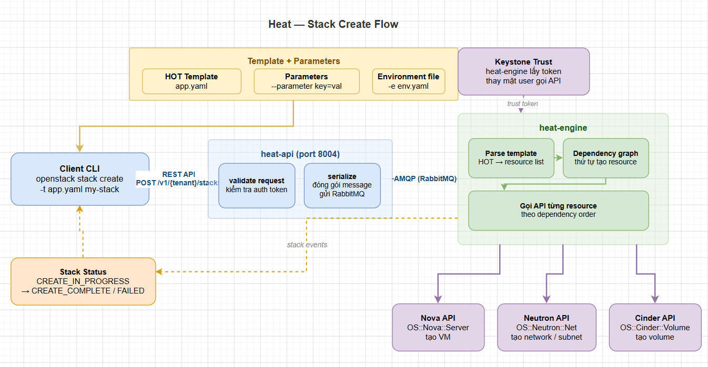

# QUẢN LÝ STACK TRONG HEAT

> **Phiên bản tham chiếu**: OpenStack **2026.1 Gazpacho** + Heat **21.x**

## I. STACK CREATE / UPDATE / DELETE

Quá trình quản lý vòng đời của một stack trong Heat được thực hiện chủ yếu thông qua OpenStack CLI. 



### 1. Tạo Stack (`create`)

Lệnh khởi tạo stack từ một file template cụ thể. Có thể truyền trực tiếp tham số đầu vào qua dòng lệnh:

```bash
source /etc/kolla/admin-openrc

# Tạo stack cơ bản với các tham số:
openstack stack create \
  --template /path/to/template.yaml \
  --parameter "key_name=admin-key" \
  --parameter "flavor=m1.small" \
  --timeout 20 \
  --enable-rollback \
  production-web-stack
```

**Các tùy chọn quan trọng khi tạo**:

- `--template` (`-t`): Đường dẫn đến file template HOT (định dạng YAML).
- `--parameter` (`-P`): Truyền các cặp giá trị `key=value` khớp với phần `parameters` trong template.
- `--timeout`: Thiết lập thời gian chờ tối đa (tính bằng phút). Nếu quá thời gian này mà stack chưa hoàn thành, Heat sẽ đưa stack về trạng thái `FAILED`.
- `--enable-rollback` hoặc `--disable-rollback`: Nếu quá trình tạo gặp lỗi ở bất kỳ resource nào, rollback sẽ tự động kích hoạt xóa ngược lại toàn bộ tài nguyên đã tạo trước đó để tránh dư thừa và tốn tài nguyên. (Khuyến nghị bật trong Production).

### 2. Theo dõi tiến trình tạo (`events`)

Khi stack đang ở trạng thái `CREATE_IN_PROGRESS`, ta có thể theo dõi trực tiếp quá trình khởi tạo các tài nguyên phụ thuộc theo thời gian thực:

```bash
# Theo dõi tiến trình tạo stack trực quan theo thời gian thực:
openstack stack event list --follow production-web-stack
```

### 3. Cập nhật Stack (`update`)

Khi cần thay đổi cấu hình hạ tầng (ví dụ: thay đổi size disk, thêm security group, nâng cấp flavor VM), ta chỉ cần chỉnh sửa file template và chạy lệnh update. Heat sẽ so sánh sự khác biệt và chỉ cập nhật những phần thay đổi.

```bash
# Xem trước các thay đổi trước khi thực thi thực tế (Dry-Run):
openstack stack preview \
  --template /path/to/new-template.yaml \
  --parameter "flavor=m1.medium" \
  production-web-stack

# Thực hiện cập nhật stack:
openstack stack update \
  --template /path/to/new-template.yaml \
  --parameter "flavor=m1.medium" \
  production-web-stack
```

### 4. Xóa Stack (`delete`)

Khi không còn nhu cầu sử dụng, lệnh delete sẽ tự động gỡ bỏ toàn bộ tài nguyên được quản lý bởi stack đó theo thứ tự ngược lại với thứ tự khi tạo (ví dụ: xóa VM trước, sau đó xóa Port, Subnet và cuối cùng là Network).

```bash
# Xóa stack ngay lập tức:
openstack stack delete production-web-stack --yes
```

## II. STACK UPDATE — ROLLING VS REPLACE

Khi ta cập nhật một stack bằng lệnh `openstack stack update`, Heat sẽ kiểm tra sự thay đổi thuộc tính của từng resource và đưa ra quyết định xử lý theo hai cơ chế: **UpdateInPlace** hoặc **UpdateReplace**.

```text
Khi Update thuộc tính của một Resource:
  ├── Thuộc tính thay đổi cho phép cập nhật trực tiếp ──▶ UpdateInPlace (Không downtime)
  └── Thuộc tính thay đổi bắt buộc phải build lại ──▶ UpdateReplace (Downtime / Recreate)
```

### 1. UpdateInPlace (Cập nhật tại chỗ)

- **Đặc điểm**: Tài nguyên vật lý không bị xóa đi tạo lại. Heat chỉ gọi API để thay đổi cấu hình trực tiếp của đối tượng đó.
- **Ví dụ**:

  - Thay đổi danh sách `dns_nameservers` trong `OS::Neutron::Subnet`.
  - Thay đổi metadata, tên hiển thị hoặc thuộc tính `admin_state_up` của Port.
  - Thay đổi cấu hình rules của Security Group.

- **Lợi ích**: Không gây downtime, không làm mất ID/UUID của tài nguyên.

### 2. UpdateReplace (Xóa và tạo lại mới)

- **Đặc điểm**: Bắt buộc phải hủy tài nguyên cũ và sinh ra một tài nguyên hoàn toàn mới với ID mới, do API của OpenStack không hỗ trợ sửa đổi nóng các thuộc tính đó.

- **Ví dụ**:

  - Thay đổi thuộc tính `cidr` của một `OS::Neutron::Subnet` (Neutron không cho phép đổi CIDR của subnet đang hoạt động).
  - Thay đổi `image` hệ điều hành của một `OS::Nova::Server` (Nova bắt buộc phải rebuild hoặc recreate VM mới từ image mới).

- **Nguy cơ**: Gây downtime cho hệ thống và làm thay đổi địa chỉ IP/ID của tài nguyên.

### 3. Cấu hình Rolling Update đối với AutoScaling Group

Đối với các cụm máy ảo tự động mở rộng (`OS::Heat::AutoScalingGroup`), ta có thể cấu hình chính sách `update_policy` để tránh downtime khi cập nhật image/flavor hàng loạt bằng cách cập nhật cuốn chiếu (rolling update):

```yaml
resources:
  my_scaling_group:
    type: OS::Heat::AutoScalingGroup
    update_policy:
      rolling_update:
        # Số lượng VM tối thiểu phải luôn hoạt động trong quá trình update:
        min_in_service: 2
        # Số lượng VM tối đa được update đồng thời trong 1 lô:
        max_batch_size: 1
        # Thời gian chờ (giây) giữa các đợt update lô tiếp theo:
        pause_time: 30
    properties:
      # ... cấu hình VM
```

## III. STACK ABANDON & ADOPT

Đây là tính năng nâng cao cho phép tách rời (detach) và nhập lại (import) tài nguyên thực tế với sự quản lý của Heat mà không làm ảnh hưởng đến tài nguyên vật lý đang chạy.

```text
                  [Abandon Stack]
   Heat DB (Metadata) ──(Xóa sạch)──▶ (Không còn quản trị)
   Nova/Neutron VMs   ──────▶ Vẫn chạy bình thường trên Cloud (Orphaned)

                  [Adopt Stack]
   JSON State File + Template ──▶ Heat DB phục hồi metadata ──▶ Quản trị lại VM cũ
```

### 1. Stack Abandon (Bỏ rơi Stack)

Lệnh này xóa toàn bộ cấu trúc logic và metadata của stack trong cơ sở dữ liệu của Heat, nhưng **giữ lại nguyên vẹn** toàn bộ máy ảo, mạng ảo, ổ đĩa thực tế trên OpenStack.

- Lệnh abandon sẽ xuất ra một chuỗi JSON mô tả chi tiết trạng thái vật lý thực tại của các tài nguyên (State File).

```bash
# Tiến hành bỏ rơi stack và xuất trạng thái ra file JSON:
openstack stack abandon production-web-stack > /tmp/stack-state.json
```

Mở file `/tmp/stack-state.json`, ta sẽ thấy Heat lưu lại cấu trúc dạng:

```json
{
  "status": "COMPLETE",
  "name": "production-web-stack",
  "resources": {
    "web_server": {
      "status": "COMPLETE",
      "name": "web_server",
      "resource_id": "5c8f89e2-34ab-41c2-bd12-f8c0e29b12",
      "type": "OS::Nova::Server"
    }
  }
}
```

### 2. Stack Adopt (Tiếp nhận lại Stack)

Dùng để khôi phục quyền quản trị của Heat đối với các tài nguyên đang chạy tự do bên ngoài bằng cách sử dụng file trạng thái JSON đã được xuất từ quá trình `abandon` trước đó.

```bash
# Import lại tài nguyên vào stack quản lý mới:
openstack stack adopt \
  --adopt-file /tmp/stack-state.json \
  --template /path/to/template.yaml \
  recovered-production-stack
```

Heat sẽ đọc file JSON, map ngược lại các ID tài nguyên vật lý đang chạy vào database của stack mới mà không cần phải khởi tạo lại bất kỳ máy ảo nào.

## IV. STACK EVENTS & RESOURCE STATUS

Việc kiểm tra trạng thái và đọc hiểu các sự kiện (events) là chìa khóa quan trọng để gỡ lỗi (troubleshoot) nhanh chóng.

### 1. Trạng thái của Resource và Stack

Mỗi tài nguyên trong stack trải qua các chu kỳ trạng thái:

| Trạng thái | Ý nghĩa |
| :--- | :--- |
| `CREATE_IN_PROGRESS` | Heat đang gửi API request và chờ OpenStack tạo tài nguyên vật lý. |
| `CREATE_COMPLETE` | Tài nguyên đã được khởi tạo và sẵn sàng sử dụng. |
| `CREATE_FAILED` | Quá trình khởi tạo lỗi (Sai image, hết RAM, lỗi mạng...). |
| `UPDATE_IN_PROGRESS` | Đang cập nhật thay đổi thuộc tính của tài nguyên. |
| `UPDATE_COMPLETE` | Cập nhật hoàn tất thành công. |
| `UPDATE_FAILED` | Cập nhật lỗi, tài nguyên có thể bị kẹt ở trạng thái không nhất quán. |
| `DELETE_IN_PROGRESS` | Heat đang tiến hành xóa tài nguyên vật lý. |
| `DELETE_FAILED` | Không thể xóa tài nguyên (ví dụ: Volume đang được mount, Port đang bận). |

### 2. Lệnh kiểm tra danh sách tài nguyên trong Stack

```bash
openstack stack resource list recovered-production-stack
```

**Output mẫu**:

```text
+---------------+--------------------------------------+-----------------+-----------------+-----------------+
| resource_name | physical_resource_id                 | resource_type   | resource_status | updated_time    |
+---------------+--------------------------------------+-----------------+-----------------+-----------------+
| web_server    | 5c8f89e2-34ab-41c2-bd12-f8c0e29b12   | OS::Nova::Server| CREATE_COMPLETE | 2026-06-01...   |
| app_network   | a7b8c9d0-1234-abcd-efgh-56789abcdef0 | OS::Neutron::Net| CREATE_COMPLETE | 2026-06-01...   |
+---------------+--------------------------------------+-----------------+-----------------+-----------------+
```

### 3. Đọc log chi tiết lỗi khi có trạng thái FAILED

Khi một stack báo trạng thái `CREATE_FAILED`, hãy truy cập log sự kiện ngay để tìm nguyên nhân:

```bash
# Xem danh sách các event của stack:
openstack stack event list recovered-production-stack

# Xem chi tiết lý do lỗi của một resource cụ thể:
openstack stack resource show recovered-production-stack web_server -c resource_status_reason
```

**Ví dụ một lỗi điển hình trả về từ Nova**:
> *resource_status_reason: "ResourceInError: Went to status ERROR due to "Message: No valid host was found. There are not enough hosts available., Code: 500""*
>
> → **Phân tích**: Lỗi do hypervisor của OpenStack đã hết tài nguyên CPU/RAM trống để tạo flavor VM yêu cầu.

## V. ENVIRONMENT FILE

**Environment file** là một file YAML độc lập được truyền song song với template khi tạo stack. Mục đích là **tách biệt cấu hình và định nghĩa tham số** ra khỏi code template gốc, giúp tăng khả năng tái sử dụng.

```text
[Template gốc: infra.yaml] ──(Gọi resource type: Custom::Server)──┐
                                                                  ├──▶ [Deploy Stack]
[Environment: dev.yaml]─────────(Map: Custom::Server -> dev.yaml)─┘
```

### 1. Cấu trúc của Environment File

Một environment file tiêu chuẩn gồm 2 phần chính: `parameters` và `resource_registry`.

```yaml
# /etc/kolla/config/heat/environments/dev-env.yaml
parameters:
  # Cung cấp các tham số cụ thể cho môi trường phát triển (Dev)
  instance_flavor: m1.tiny
  image: Cirros-6.0
  dns_servers: "8.8.8.8"

resource_registry:
  # 1. Override hoặc định nghĩa loại Resource tùy biến:
  Custom::WebServer: file:///path/to/custom_web_server.yaml
  
  # 2. Thay thế một resource type có sẵn bằng cấu hình riêng:
  OS::Nova::Server: file:///path/to/my_hardened_server.yaml
```

### 2. Sử dụng Environment File khi deploy

Ta có thể gộp nhiều environment file cùng lúc, các file truyền vào sau sẽ ghi đè giá trị cấu hình của các file truyền vào trước:

```bash
openstack stack create \
  -t /path/to/infra-template.yaml \
  -e /etc/kolla/config/heat/environments/dev-env.yaml \
  dev-stack
```

## VI. NESTED STACK — CHIA NHỎ TEMPLATE LỚN

Khi xây dựng một hệ thống hạ tầng lớn (ví dụ: Hệ thống gồm Load Balancer, 3 Web Nodes, 2 DB Nodes, cụm Network riêng biệt), việc viết chung tất cả vào một file template duy nhất sẽ khiến code cực kỳ dài (lên tới hàng ngàn dòng), rất khó quản lý và bảo trì.

**Nested Stack (Stack lồng nhau)** cho phép ta chia nhỏ hạ tầng thành các template con (Sub-templates) và gọi chúng từ một template cha (Parent template).

```text
[Parent Template: master.yaml]
   ├── Gọi Sub-template: OS::Heat::Stack ──▶ [network.yaml] (Tạo Net, Subnet, Router)
   └── Gọi Sub-template: OS::Heat::Stack ──▶ [web-tier.yaml] (Tạo VM, Port, SG)
```

### 1. Khai báo Sub-template mạng (`network.yaml`)

```yaml
# network.yaml
heat_template_version: 2021-04-16
description: Template con tao mang luoi
resources:
  private_net:
    type: OS::Neutron::Net
  private_subnet:
    type: OS::Neutron::Subnet
    properties:
      network: { get_resource: private_net }
      cidr: 10.0.0.0/24
outputs:
  net_id:
    value: { get_resource: private_net }
```

### 2. Gọi Sub-template từ Parent Template (`master.yaml`)

Sử dụng resource type `OS::Heat::Stack` để nhúng sub-template vào và truyền tham số xuyên suốt giữa các stack:

```yaml
# master.yaml
heat_template_version: 2021-04-16
description: Template cha dieu phoi he thong

parameters:
  key_name:
    type: string

resources:
  # Gọi stack mạng con:
  network_tier:
    type: OS::Heat::Stack
    properties:
      context:
        region_name: RegionOne
      template: file:///path/to/network.yaml # Đường dẫn hoặc URL trỏ đến sub-template

  # Gọi stack máy ảo web con:
  web_tier:
    type: OS::Heat::Stack
    depends_on: network_tier # Chờ mạng tạo xong mới deploy VM
    properties:
      template: file:///path/to/web-tier.yaml
      parameters:
        # Truyền ID mạng được sinh ra từ stack mạng con sang cho stack VM:
        private_network_id: { get_attr: [network_tier, outputs, net_id] }
        key_name: { get_param: key_name }
```

### 3. Ưu điểm của kiến trúc Nested Stack

- **Module hóa code**: Giúp dễ dàng đóng gói các phần hạ tầng riêng biệt và giao cho các đội ngũ khác nhau viết và test độc lập.
- **Dễ bảo trì**: Khi cần sửa đổi mạng, ta chỉ cần tập trung update file `network.yaml` mà không sợ làm thay đổi cấu trúc của VM.
- **Có thể tái sử dụng**: Template `network.yaml` có thể được tái sử dụng để nhúng vào nhiều stack cha khác nhau trong toàn công ty.
