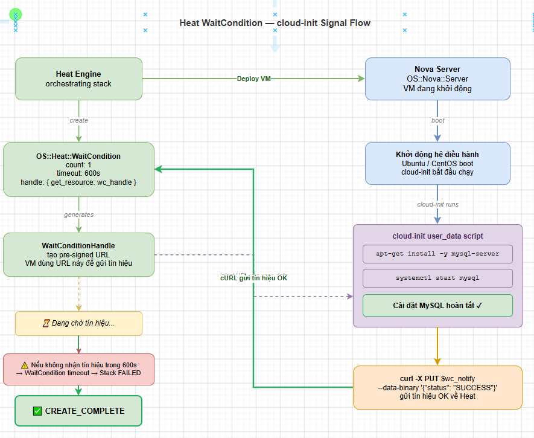

# DEPLOY CỤM OPENSTACK BẰNG HEAT

> **Phiên bản tham chiếu**: OpenStack **2026.1 Gazpacho** + Heat **21.x** + Octavia **14.x** + Aodh **17.x**

## I. NETWORK STACK — NEUTRON RESOURCES

Một hạ tầng điện toán luôn bắt đầu từ việc quy hoạch mạng lưới. Heat cho phép thiết lập toàn bộ cấu trúc mạng riêng (Private Network), dải Subnet, Router định tuyến kết nối ra ngoài internet (External Network) và cấp phát IP động.

```text
  [Internet / External Net]
             │
             ▼ (Floating IP)
         [Router]
             │ (Router Interface)
         [Subnet] (10.10.0.0/24)
             │
      ┌──────┴──────┐
   [Port]        [Port]
     │             │
   [VM-1]        [VM-2]
```

### Ví dụ cấu trúc Network Template hoàn chỉnh

```yaml
heat_template_version: 2021-04-16
description: Template khoi tao Network va Router huong ngoai

parameters:
  public_net_id:
    type: string
    description: ID hoac ten cua mang Public/External hien co trong OpenStack
    constraints:
      - custom_constraint: neutron.network

resources:
  # 1. Khai bao mang Private (Internal Network)
  private_network:
    type: OS::Neutron::Net
    properties:
      name: internal-app-net

  # 2. Khai bao dai Subnet trong mang Private
  private_subnet:
    type: OS::Neutron::Subnet
    properties:
      network: { get_resource: private_network }
      cidr: 10.10.0.0/24
      ip_version: 4
      gateway_ip: 10.10.0.1
      allocation_pools:
        - start: 10.10.0.50
          end: 10.10.0.200
      dns_nameservers: [8.8.8.8, 1.1.1.1]

  # 3. Khai bao Router huong ngoai
  app_router:
    type: OS::Neutron::Router
    properties:
      name: gateway-router
      external_gateway_info:
        network: { get_param: public_net_id }

  # 4. Gắn Interface noi Subnet vao Router de cho phep VM di ra ngoai
  router_interface:
    type: OS::Neutron::RouterInterface
    properties:
      router: { get_resource: app_router }
      subnet: { get_resource: private_subnet }
```

## II. SECURITY GROUP STACK

Security Group đóng vai trò như tường lửa trạng thái (Stateful Firewall) bảo vệ các interface của VM. Để tối ưu hóa và tái sử dụng, ta có thể tham số hóa (parameterize) các port và dải IP nguồn cho phép truy cập.

```yaml
resources:
  # Khai bao Security Group cho Web Server
  web_security_group:
    type: OS::Neutron::SecurityGroup
    properties:
      name: web-secgroup
      description: Cho phep giao thong SSH, HTTP, HTTPS va ICMP di vao
      rules:
        # Rule 1: Cho phep SSH tu dai IP quan tri xac dinh
        - protocol: tcp
          port_range_min: 22
          port_range_max: 22
          remote_ip_prefix: 0.0.0.0/0 # co the gioi han bang parameter
          direction: ingress
        # Rule 2: HTTP (Port 80)
        - protocol: tcp
          port_range_min: 80
          port_range_max: 80
          remote_ip_prefix: 0.0.0.0/0
          direction: ingress
        # Rule 3: HTTPS (Port 443)
        - protocol: tcp
          port_range_min: 443
          port_range_max: 443
          remote_ip_prefix: 0.0.0.0/0
          direction: ingress
        # Rule 4: Cho phep Ping (ICMP) tu moi noi
        - protocol: icmp
          remote_ip_prefix: 0.0.0.0/0
          direction: ingress
```

## III. COMPUTE STACK — NOVA RESOURCES

Resource `OS::Nova::Server` là trung tâm của Compute stack. Nó cho phép gắn cấu hình mạng, bảo mật, khoá SSH công cộng, gán Floating IP và nhúng mã script khởi tạo thông qua `user_data` (cloud-init).

```yaml
resources:
  # 1. Khai bao Virtual Port chuyên biệt cho VM
  web_server_port:
    type: OS::Neutron::Port
    properties:
      network: { get_resource: private_network }
      fixed_ips:
        - subnet: { get_resource: private_subnet }
      security_groups:
        - { get_resource: web_security_group }

  # 2. Khai bao virtual machine Nova
  app_server:
    type: OS::Nova::Server
    properties:
      name: production-web-vm
      image: Ubuntu-22.04
      flavor: m1.small
      key_name: { get_param: admin_keypair }
      networks:
        - port: { get_resource: web_server_port }
      # Truyen script cau hinh thong qua cloud-init
      user_data_format: RAW
      user_data: |
        #!/bin/bash
        apt-get update -y
        apt-get install -y nginx
        systemctl enable nginx
        systemctl start nginx

  # 3. Cap phat Floating IP tu mang public
  web_floating_ip:
    type: OS::Neutron::FloatingIP
    properties:
      floating_network: { get_param: public_net_id }

  # 4. Gan Floating IP vao virtual Port cua VM
  associate_floating_ip:
    type: OS::Neutron::FloatingIPAssociation
    properties:
      floatingip_id: { get_resource: web_floating_ip }
      port_id: { get_resource: web_server_port }
```

## IV. VOLUME STACK — CINDER RESOURCES

Để dữ liệu không bị mất đi khi VM bị xóa hoặc lỗi hệ điều hành, ta cần tạo ổ đĩa thứ cấp (Persistent Volume) qua Cinder và liên kết trực tiếp vào máy ảo.

```yaml
resources:
  # 1. Khoi tao persistent volume tu Cinder
  database_storage:
    type: OS::Cinder::Volume
    properties:
      name: web-db-data
      size: 20 # 20 GB
      volume_type: standard
      availability_zone: nova

  # 2. Gan volume vao VM thong qua Volume Attachment
  attach_database_storage:
    type: OS::Cinder::VolumeAttachment
    properties:
      instance_uuid: { get_resource: app_server }
      volume_id: { get_resource: database_storage }
      # Mount point vat ly trong he dieu hanh khach (Guest OS)
      mountpoint: /dev/vdb
```

## V. AUTOSCALING STACK

Cơ chế tự động mở rộng (AutoScaling) trong OpenStack được xây dựng bằng cách kết hợp:

- **`OS::Heat::AutoScalingGroup`**: Quản lý cụm các VM sinh ra từ một template định sẵn.
- **`OS::Heat::ScalingPolicy`**: Định nghĩa hành động cần làm (tăng hoặc giảm bao nhiêu node).
- **`OS::Aodh::GnocchiAggregationResourcesThresholdAlarm`**: Định nghĩa điều kiện kích hoạt chính sách (ví dụ: CPU trung bình của cụm vượt quá 80% trong 2 phút).

```yaml
resources:
  # 1. Dinh nghia Group tu dong co gian
  web_scaling_group:
    type: OS::Heat::AutoScalingGroup
    properties:
      min_size: 1
      max_size: 5
      desired_capacity: 2
      cooldown: 60 # thoi gian cho giua cac dot scale (giay)
      resource:
        type: OS::Nova::Server
        properties:
          name: scaled-web-node
          image: Ubuntu-22.04
          flavor: m1.small
          networks:
            - network: { get_resource: private_network }

  # 2. Chinh sach scale up (Tang them 1 VM)
  scale_up_policy:
    type: OS::Heat::ScalingPolicy
    properties:
      adjustment_type: change_in_capacity
      auto_scaling_group_id: { get_resource: web_scaling_group }
      scaling_adjustment: 1
      cooldown: 60

  # 3. Chinh sach scale down (Giam di 1 VM)
  scale_down_policy:
    type: OS::Heat::ScalingPolicy
    properties:
      adjustment_type: change_in_capacity
      auto_scaling_group_id: { get_resource: web_scaling_group }
      scaling_adjustment: -1
      cooldown: 60

  # 4. Trigger Alarm qua Aodh do CPU trung binh de goi scale_up
  cpu_alarm_high:
    type: OS::Aodh::GnocchiAggregationResourcesThresholdAlarm
    properties:
      description: Canh bao khi CPU ca cum > 80%
      metric: cpu
      aggregation_method: mean
      threshold: 80.0
      comparison_operator: gt
      granularity: 60
      evaluation_periods: 2
      resource_type: instance
      alarm_actions:
        # Trigger webhook goi den scaling policy
        - { get_attr: [scale_up_policy, alarm_url] }
```

## VI. LOAD BALANCER STACK — OCTAVIA RESOURCES

Dịch vụ Load Balancer (Octavia) chịu trách nhiệm phân phối lưu lượng truy cập công cộng vào các Node Web phía sau của cụm AutoScaling hoặc Compute stack.

```yaml
resources:
  # 1. Khoi tao Load Balancer vat ly
  app_loadbalancer:
    type: OS::Octavia::LoadBalancer
    properties:
      name: web-lb
      vip_subnet: { get_resource: private_subnet }

  # 2. Khai bao cong lang nghe (Listener) cong 80
  lb_listener:
    type: OS::Octavia::Listener
    properties:
      name: web-lb-listener
      loadbalancer: { get_resource: app_loadbalancer }
      protocol: HTTP
      protocol_port: 80

  # 3. Khai bao cum dieu phoi phia sau (Pool)
  lb_pool:
    type: OS::Octavia::Pool
    properties:
      name: web-lb-pool
      listener: { get_resource: lb_listener }
      lb_algorithm: ROUND_ROBIN
      protocol: HTTP

  # 4. Gắn co dinh cac VM phia sau lam Member cua Pool (Vi du gan VM-1 va VM-2 thu cong)
  lb_member_1:
    type: OS::Octavia::Member
    properties:
      pool: { get_resource: lb_pool }
      address: { get_attr: [app_server, first_address] }
      protocol_port: 80
      subnet: { get_resource: private_subnet }
```

## VII. WAITCONDITION & CLOUD-INIT PHỐI HỢP

Khi Heat tạo một máy ảo (`OS::Nova::Server`), ngay khi Nova báo trạng thái máy ảo chuyển sang `ACTIVE`, Heat sẽ coi như resource đó đã tạo xong và chuyển sang resource tiếp theo. Tuy nhiên, lúc này bên trong hệ điều hành máy ảo mới bắt đầu chạy script cloud-init để cài đặt phần mềm (ví dụ: cài MySQL mất 5 phút).

Nếu các dịch vụ phía sau cần MySQL sẵn sàng trước khi kết nối, Heat sẽ lỗi. **WaitCondition** giải quyết vấn đề này bằng cách bắt Heat **chờ tín hiệu phản hồi** thành công từ máy ảo gửi về mới được coi là `CREATE_COMPLETE`.



### Ví dụ cấu hình WaitCondition

```yaml
resources:
  # 1. Khai bao Handle nhan tin hieu
  my_wait_handle:
    type: OS::Heat::WaitConditionHandle

  # 2. Khai bao dieu kien cho phan hoi
  my_wait_condition:
    type: OS::Heat::WaitCondition
    properties:
      handle: { get_resource: my_wait_handle }
      timeout: 300 # Thoi gian cho toi da (giay)
      count: 1     # So luong tin hieu thanh cong can nhan duoc

  # 3. May chu goi curl bao hieu sau khi hoan tat script
  app_server_waiting:
    type: OS::Nova::Server
    properties:
      name: database-app-server
      image: Ubuntu-22.04
      flavor: m1.small
      networks:
        - network: { get_resource: private_network }
      user_data_format: RAW
      user_data:
        str_replace:
          template: |
            #!/bin/bash
            apt-get update -y
            apt-get install -y mariadb-server
            systemctl start mariadb
            # ... thuc hien cac setup an toan database ...

            # Gui tin hieu thanh cong "SUCCESS" ve cho Heat Engine
            wc_notify --data-binary '{"status": "SUCCESS", "reason": "MariaDB deployed successfully"}'
          params:
            # Inject URL cua Wait Condition Handle vao script tu dong
            wc_notify: { get_attr: [my_wait_handle, curl_cli] }
```

## VIII. FULL STACK: NETWORK + VM + VOLUME + FLOATING IP

Dưới đây là một template **Full Stack** hoàn chỉnh và file **Environment** tương ứng để tự động dựng toàn bộ một cụm hạ tầng từ A-Z một cách tự động và nhất quán.

### 1. Template hạ tầng chính (`fullstack.yaml`)

```yaml
# fullstack.yaml
heat_template_version: 2021-04-16
description: Template Full Stack dung toan bo ha tang co ban cua ung dung web

parameters:
  public_net_id:
    type: string
    description: ID mang external de cap Floating IP
  flavor:
    type: string
    default: m1.small
  image:
    type: string
    default: Ubuntu-22.04
  key_name:
    type: string

resources:
  # 1. Mang noi bo
  app_net:
    type: OS::Neutron::Net
    properties:
      name: production-network

  # 2. Subnet
  app_sub:
    type: OS::Neutron::Subnet
    properties:
      network: { get_resource: app_net }
      cidr: 10.50.0.0/24
      ip_version: 4
      gateway_ip: 10.50.0.1
      dns_nameservers: [8.8.8.8]

  # 3. Router huong ngoai
  app_router:
    type: OS::Neutron::Router
    properties:
      name: production-router
      external_gateway_info:
        network: { get_param: public_net_id }

  # 4. Gan Subnet vao Router
  router_sub_join:
    type: OS::Neutron::RouterInterface
    properties:
      router: { get_resource: app_router }
      subnet: { get_resource: app_sub }

  # 5. Security Group
  web_sg:
    type: OS::Neutron::SecurityGroup
    properties:
      name: production-web-sg
      rules:
        - protocol: tcp
          port_range_min: 22
          port_range_max: 22
          remote_ip_prefix: 0.0.0.0/0
          direction: ingress
        - protocol: tcp
          port_range_min: 80
          port_range_max: 80
          remote_ip_prefix: 0.0.0.0/0
          direction: ingress

  # 6. Virtual Port cho Web VM
  web_port:
    type: OS::Neutron::Port
    properties:
      network: { get_resource: app_net }
      fixed_ips:
        - subnet: { get_resource: app_sub }
      security_groups:
        - { get_resource: web_sg }

  # 7. Khoi tao o dia luu tru
  web_data_disk:
    type: OS::Cinder::Volume
    properties:
      name: web-persistent-disk
      size: 30

  # 8. Khoi tao Virtual Machine
  web_vm:
    type: OS::Nova::Server
    depends_on: router_sub_join
    properties:
      name: production-web-instance
      image: { get_param: image }
      flavor: { get_param: flavor }
      key_name: { get_param: key_name }
      networks:
        - port: { get_resource: web_port }

  # 9. Gắn ổ cứng vao VM
  attach_disk:
    type: OS::Cinder::VolumeAttachment
    properties:
      instance_uuid: { get_resource: web_vm }
      volume_id: { get_resource: web_data_disk }
      mountpoint: /dev/vdb

  # 10. Khoi tao Floating IP
  fip:
    type: OS::Neutron::FloatingIP
    properties:
      floating_network: { get_param: public_net_id }

  # 11. Gan Floating IP vao VM Port
  associate_fip:
    type: OS::Neutron::FloatingIPAssociation
    properties:
      floatingip_id: { get_resource: fip }
      port_id: { get_resource: web_port }

outputs:
  server_public_ip:
    description: Truy cap Web Nginx thong qua dia chi Floating IP nay
    value: { get_attr: [fip, floating_ip_address] }
```

### 2. File cấu hình môi trường (`fullstack-env.yaml`)

```yaml
# fullstack-env.yaml
parameters:
  public_net_id: public1 # Ten mang public dang co san tren OpenStack
  flavor: m1.medium
  image: Ubuntu-22.04
  key_name: admin-ssh-key
```

### 3. Thực thi triển khai toàn bộ cụm

Chạy lệnh duy nhất để thiết lập toàn bộ hạ tầng bằng cách gộp cả template và file môi trường:

```bash
openstack stack create \
  --template fullstack.yaml \
  --environment fullstack-env.yaml \
  --enable-rollback \
  web-production-stack
```

Toàn bộ mạng riêng, subnet, định tuyến ra ngoài, tường lửa bảo mật, ổ đĩa Cinder, máy chủ Web và địa chỉ Floating IP hướng ngoại sẽ được Heat phân tích mối liên kết phụ thuộc và khởi tạo song song một cách tự động và đồng bộ tuyệt đối.
