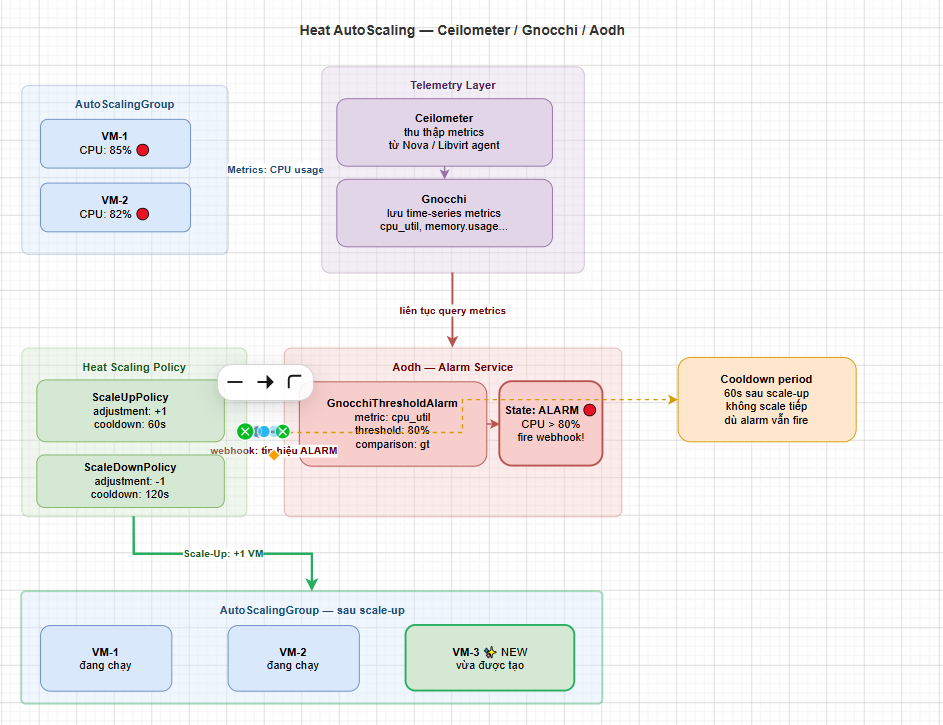

# AUTOSCALING & HIGH AVAILABILITY

> **Phiên bản tham chiếu**: OpenStack **2026.1 Gazpacho** + Heat **21.x** + Aodh **17.x**

## I. AUTOSCALINGGROUP — SCALE THEO SỐ LƯỢNG

`OS::Heat::AutoScalingGroup` là tài nguyên cốt lõi được sử dụng để duy trì hoặc tự động co giãn số lượng các tài nguyên đồng nhất (thường là máy ảo `OS::Nova::Server`) dựa trên nhu cầu thực tế của hệ thống.

```text
                           [AutoScalingGroup]
                      ┌────────────┼────────────┐
                      ▼            ▼            ▼
                    [VM-1]       [VM-2]       [VM-3]
```

### 1. Các thuộc tính quan trọng điều khiển hành vi của Group

- **`min_size`**: Số lượng tài nguyên tối thiểu mà group bắt buộc phải duy trì. Dù có chính sách scale-down kích hoạt, số lượng tài nguyên cũng không thể giảm xuống dưới mức này.
- **`max_size`**: Số lượng tài nguyên tối đa được phép sinh ra trong group nhằm tránh vượt ngưỡng tài nguyên vật lý của cloud và kiểm soát chi phí.
- **`desired_capacity`**: Số lượng tài nguyên mong muốn ban đầu khi stack được tạo. Nếu không cấu hình, Heat sẽ mặc định khởi tạo số lượng bằng `min_size`.
- **`cooldown`**: Khoảng thời gian khóa (giây) sau khi thực hiện xong một hành động co giãn (scale-up hoặc scale-down). Trong thời gian cooldown, mọi yêu cầu co giãn mới gửi đến từ alarm sẽ bị Heat bỏ qua để tránh hiện tượng "đập mạch" (thrashing) do độ trễ khởi động của VM.

### 2. Ví dụ khai báo cấu trúc cơ bản của AutoScalingGroup

```yaml
resources:
  web_node_group:
    type: OS::Heat::AutoScalingGroup
    properties:
      min_size: 2
      max_size: 10
      desired_capacity: 3
      cooldown: 120
      resource:
        type: OS::Nova::Server
        properties:
          name: scaling-web-instance
          image: Ubuntu-22.04
          flavor: m1.small
          networks:
            - network: private-net
```

## II. AODH ALARM → HEAT SIGNAL

Mô hình tự động co giãn hoàn chỉnh hoạt động bằng cách kết hợp giám sát số liệu (telemetry) của máy ảo và gửi tín hiệu kích hoạt hành vi co giãn.

### 1. Phân cấp nhiệm vụ giữa các dịch vụ



- **Ceilometer/Gnocchi**: Thu thập số liệu hiệu năng (CPU, RAM, Network) từ các host hypervisor và máy ảo theo chu kỳ.
- **Aodh (Alarm Service)**: Định kỳ lấy dữ liệu từ Gnocchi để so sánh với ngưỡng quy định (threshold). Nếu vượt ngưỡng, Aodh sẽ trigger một webhook gửi tín hiệu (Signal) đến URL của Heat Scaling Policy.
- **Heat Scaling Policy**: Hứng tín hiệu từ Aodh và ra lệnh cho `AutoScalingGroup` điều chỉnh số lượng VM (`desired_capacity`).

### 2. File Template chi tiết phối hợp Aodh Alarm và Heat Signal

```yaml
heat_template_version: 2021-04-16
description: He thong AutoScaling tu dong tang giam VM dua tren canh bao CPU tu Aodh

resources:
  # 1. Nhóm máy ảo co giãn
  scaling_group:
    type: OS::Heat::AutoScalingGroup
    properties:
      min_size: 1
      max_size: 5
      desired_capacity: 1
      cooldown: 60
      resource:
        type: OS::Nova::Server
        properties:
          name: scaled-app-node
          image: Ubuntu-22.04
          flavor: m1.small
          networks:
            - network: private-net

  # 2. Chinh sach Scale-Up (Tăng thêm 1 VM)
  scale_up_policy:
    type: OS::Heat::ScalingPolicy
    properties:
      adjustment_type: change_in_capacity
      auto_scaling_group_id: { get_resource: scaling_group }
      scaling_adjustment: 1
      cooldown: 60

  # 3. Chinh sach Scale-Down (Giảm bớt 1 VM)
  scale_down_policy:
    type: OS::Heat::ScalingPolicy
    properties:
      adjustment_type: change_in_capacity
      auto_scaling_group_id: { get_resource: scaling_group }
      scaling_adjustment: -1
      cooldown: 60

  # 4. Aodh Alarm theo doi CPU de kich hoat Scale-Up
  cpu_alarm_high:
    type: OS::Aodh::GnocchiAggregationResourcesThresholdAlarm
    properties:
      description: Canh bao khi CPU trung binh cua nhom vuot 80% trong 2 chu ky
      metric: cpu
      aggregation_method: mean
      threshold: 80.0
      comparison_operator: gt
      granularity: 60
      evaluation_periods: 2
      resource_type: instance
      alarm_actions:
        - { get_attr: [scale_up_policy, alarm_url] }

  # 5. Aodh Alarm theo doi CPU de kich hoat Scale-Down
  cpu_alarm_low:
    type: OS::Aodh::GnocchiAggregationResourcesThresholdAlarm
    properties:
      description: Canh bao de scale down khi CPU trung binh xuong duoi 15%
      metric: cpu
      aggregation_method: mean
      threshold: 15.0
      comparison_operator: lt
      granularity: 60
      evaluation_periods: 2
      resource_type: instance
      alarm_actions:
        - { get_attr: [scale_down_policy, alarm_url] }
```

## III. ROLLING UPDATE CHO AUTOSCALINGGROUP

Khi cập nhật một stack chứa `OS::Heat::AutoScalingGroup` (ví dụ: đổi Image OS hoặc nâng cấp cấu hình phần cứng Flavor của VM), nếu không có cơ chế rolling update, Heat sẽ hủy và tạo mới toàn bộ các VM cùng lúc, dẫn tới **downtime hoàn toàn** (dịch vụ ngừng hoạt động).

Để giải quyết vấn đề này, Heat hỗ trợ cơ chế **Rolling Update** (Cập nhật cuốn chiếu) thông qua thuộc tính `update_policy`.

```text
Cập nhật cụm gồm 3 VM theo lô (Batch size = 1):
  [VM-1 (Old), VM-2 (Old), VM-3 (Old)]
                    │
                    ▼ (Tạo VM-4 New)
  [VM-1 (Old), VM-2 (Old), VM-3 (Old), VM-4 (New)]
                    │
                    ▼ (Xóa VM-1 Old, tạo VM-5 New)
  [VM-2 (Old), VM-3 (Old), VM-4 (New), VM-5 (New)]
                    │
                    ▼ (Tiếp tục cuốn chiếu cho đến khi toàn bộ là New)
```

### Các tham số quan trọng trong `rolling_update`

- **`min_in_service`**: Số lượng máy ảo tối thiểu phải luôn giữ ở trạng thái hoạt động bình thường trong suốt quá trình cập nhật để duy trì khả năng phục vụ lưu lượng truy cập của cụm.
- **`max_batch_size`**: Số lượng máy ảo tối đa được phép tiến hành cập nhật trong cùng một đợt (lô).
- **`pause_time`**: Khoảng thời gian nghỉ (giây) giữa các đợt cập nhật. Thời gian này dùng để chờ hệ điều hành guest OS khởi động hoàn chỉnh và gia nhập lại vào Load Balancer trước khi tiếp tục hạ các máy ảo cũ khác.

### Ví dụ cấu hình Rolling Update

```yaml
resources:
  web_group:
    type: OS::Heat::AutoScalingGroup
    update_policy:
      rolling_update:
        min_in_service: 2   # Luon giu it nhat 2 VM hoat dong binh thuong
        max_batch_size: 1   # Update tung VM mot
        pause_time: 45      # Nghi 45 giay moi batch de VM kip setup dich vu
    properties:
      min_size: 2
      max_size: 5
      desired_capacity: 3
      resource:
        type: OS::Nova::Server
        properties:
          # ... thong tin VM ...
```

## IV. RESOURCEGROUP — DEPLOY NHIỀU RESOURCE ĐỒNG NHẤT

Mặc dù `AutoScalingGroup` rất tốt cho máy ảo, nhưng nó chỉ hỗ trợ việc co giãn tự động động (dynamic scaling) theo số liệu tải. Nếu ta chỉ muốn deploy nhanh một số lượng cố định các tài nguyên đồng nhất (ví dụ: tạo 5 mạng ảo giống nhau, tạo 3 port mạng tĩnh, hoặc tạo 4 Volume lưu trữ đồng loạt), ta nên sử dụng **`OS::Heat::ResourceGroup`**.

```text
                        [ResourceGroup] (count = 3)
                      ┌────────────┼────────────┐
                      ▼            ▼            ▼
                   [Port-0]     [Port-1]     [Port-2]
```

### 1. Cơ chế hoạt động

`ResourceGroup` tạo ra một số lượng cụ thể các tài nguyên (xác định bởi thuộc tính `count`). Ta có thể sử dụng biến đại diện `%index%` để gán tên hoặc thuộc tính riêng biệt cho từng tài nguyên theo số thứ tự (0, 1, 2...).

### 2. Ví dụ tạo cụm Port mạng tĩnh bằng ResourceGroup

```yaml
heat_template_version: 2021-04-16
description: Khoi tao danh sach nhieu Port neutron dong nhat bang ResourceGroup

resources:
  # Khoi tao nhom cac Port mang bang ResourceGroup
  port_group:
    type: OS::Heat::ResourceGroup
    properties:
      # So luong tai nguyen muon tao ra
      count: 3
      resource_def:
        type: OS::Neutron::Port
        properties:
          # index tu dong thay the bang 0, 1, 2...
          name:
            str_replace:
              template: app-port-%index%
              params:
                # Thay the chuoi %index% bang so thu tu cua resource
                "%index%": "%index%"
          network: private-network
          fixed_ips:
            - subnet: private-subnet

outputs:
  # Lay danh sach tat ca cac IP duoc cap phat tu ResourceGroup
  port_ips:
    description: Danh sach cac dia chi IP tuong ung cua cac Port vua tao
    value: { get_attr: [port_group, fixed_ips, 0, ip_address] }
```

### 3. So sánh nhanh giữa AutoScalingGroup và ResourceGroup

| Tiêu chí | OS::Heat::AutoScalingGroup | OS::Heat::ResourceGroup |
| :--- | :--- | :--- |
| **Mục đích sử dụng** | Co giãn động số lượng VM dựa trên tải hệ thống (CPU, RAM). | Khởi tạo nhanh một số lượng tài nguyên tĩnh đồng nhất. |
| **Loại tài nguyên hỗ trợ** | Thường chỉ giới hạn cho các máy ảo (`OS::Nova::Server`). | Hỗ trợ cho mọi loại resource của OpenStack (Port, Net, Volume, Subnet...). |
| **Cơ chế kích hoạt** | Kích hoạt tự động qua webhook/signal của các dịch vụ bên ngoài (Aodh, cURL). | Chỉ thay đổi số lượng khi người dùng chỉnh sửa thuộc tính `count` và update stack. |
| **Cú pháp định vị index** | Không hỗ trợ biến chỉ số `%index%` cho từng resource con. | Hỗ trợ mạnh mẽ biến `%index%` để định danh phân biệt tên tài nguyên. |
