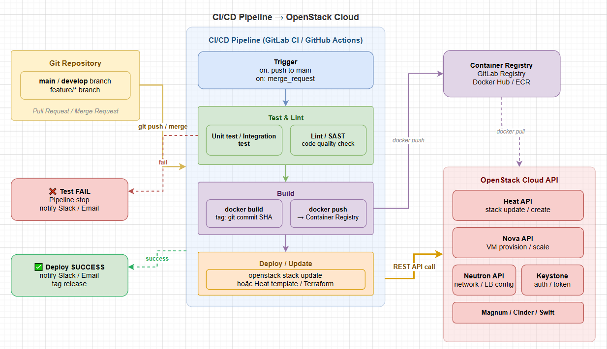

# TROUBLESHOOTING & PRACTICE

> **Phiên bản tham chiếu**: OpenStack **2026.1 Gazpacho** + Heat **21.x**

## I. STACK STUCK CREATE_IN_PROGRESS HAY GẶP

Trong vận hành thực tế, tình trạng stack bị kẹt ở trạng thái `CREATE_IN_PROGRESS` hoặc `UPDATE_IN_PROGRESS` trong một khoảng thời gian dài là lỗi phổ biến nhất. Điều này xảy ra do Heat đang chờ phản hồi từ các dịch vụ core (Nova, Neutron, Cinder) hoặc do lỗi cấu hình bên trong máy ảo guest OS.

### 1. Phân tích nguyên nhân bằng Stack Events

Khi stack bị treo, ta cần xác định chính xác tài nguyên nào đang bị kẹt bằng cách liệt kê lịch sử các sự kiện của stack:

```bash
source /etc/kolla/admin-openrc

# Liệt kê toàn bộ các sự kiện của stack sắp xếp theo thời gian:
openstack stack event list production-stack
```

**Output phân tích mẫu**:

```text
+-----------------------+--------------------------------------+---------------------------------+----------------------+----------------------------+
| resource_name         | physical_resource_id                 | resource_status                 | resource_status_reas | event_time                 |
+-----------------------+--------------------------------------+---------------------------------+----------------------+----------------------------+
| production-stack      | 8e9c20a1-773a-4fb4-8123-d8c91a084ef1 | CREATE_IN_PROGRESS              | Stack creation star  | 2026-06-01T09:30:00.000000 |
| app_network           | a7b8c9d0-1234-abcd-efgh-56789abcdef0 | CREATE_COMPLETE                 | state changed        | 2026-06-01T09:30:05.000000 |
| app_subnet            | b8c9d0e1-2345-bcde-fghi-67890abcdef1 | CREATE_COMPLETE                 | state changed        | 2026-06-01T09:30:10.000000 |
| web_server            | 5c8f89e2-34ab-41c2-bd12-f8c0e29b12   | CREATE_IN_PROGRESS              | state changed        | 2026-06-01T09:30:12.000000 |
| my_wait_condition     | 1d2e3f4g-5678-hijk-lmno-98765abcdef2 | CREATE_IN_PROGRESS              | state changed        | 2026-06-01T09:30:15.000000 |
+-----------------------+--------------------------------------+---------------------------------+----------------------+----------------------------+
```

→ **Nhận định**: Nhìn vào bảng trên, `web_server` đã kích hoạt thành công, nhưng `my_wait_condition` đang bị treo ở trạng thái `CREATE_IN_PROGRESS`. Điều này có nghĩa là máy ảo `web_server` đã chạy nhưng chưa gửi được tín hiệu thành công về cho Heat thông qua webhook (do lỗi mạng nội bộ hoặc lỗi script cài đặt phần mềm).

### 2. Kiểm tra log của hệ thống

Nếu CLI không hiển thị đủ chi tiết, ta cần truy cập trực tiếp vào log của dịch vụ Heat trên các node controller:

```bash
# Kiểm tra log container heat-engine để phát hiện lỗi giao tiếp RabbitMQ hoặc API timeout:
docker logs --tail 200 heat_engine
```

**Các từ khóa cần tìm trong log**:

- `Keystone trigger failure`: Lỗi xác thực token hoặc lỗi uỷ quyền Trust.
- `MessagingTimeout`: RabbitMQ quá tải hoặc mất kết nối khiến `heat-engine` không nhận được tin nhắn xác nhận từ Nova/Neutron.
- `DBConnectionError`: Lỗi nghẽn kết nối database MariaDB.

## II. RESOURCE ROLLBACK KHI STACK FAIL

Theo mặc định, khi một tài nguyên trong stack gặp lỗi (ví dụ: tạo VM bị lỗi do thiếu dung lượng RAM), Heat sẽ tự động kích hoạt tiến trình **Rollback** – xóa sạch toàn bộ các tài nguyên khác đã được tạo thành công trước đó (như Network, Subnet, Security Group) để đưa hệ thống về trạng thái sạch ban đầu.

```text
Quá trình tạo lỗi (Bật Rollback):
  [Tạo Net: OK] ──▶ [Tạo Subnet: OK] ──▶ [Tạo VM: Lỗi] ──▶ [Rollback kích hoạt] ──▶ [Xóa Subnet, Net]
  (Hạ tầng sạch nhưng khó debug vì tài nguyên bị lỗi đã bị xóa mất)

Quá trình tạo lỗi (Tắt Rollback):
  [Tạo Net: OK] ──▶ [Tạo Subnet: OK] ──▶ [Tạo VM: Lỗi] ──▶ [Dừng lại]
  (Tài nguyên lỗi được giữ nguyên tại chỗ để admin vào kiểm tra cấu hình)
```

### 1. Sử dụng flag `--disable-rollback` để Debug

Để giữ lại hiện trường phục vụ cho việc debug (ví dụ: truy cập vào VM xem log boot, kiểm tra IP của Port), ta phải tắt tính năng rollback khi tạo stack:

```bash
# Tạo stack và tắt tự động xóa khi gặp lỗi:
openstack stack create \
  --template /path/to/template.yaml \
  --disable-rollback \
  debug-stack
```

### 2. Tiến hành điều tra lỗi tại chỗ

Khi stack báo trạng thái `CREATE_FAILED` nhưng không bị xóa nhờ `--disable-rollback`, ta có thể:

1. Kiểm tra trạng thái máy ảo lỗi trong Nova:

   ```bash
   openstack server show <VM_ID>
   ```

2. Xem log console khởi động của máy ảo để phát hiện lỗi kernel hoặc cloud-init script:

   ```bash
   openstack console log show <VM_ID> | tail -n 100
   ```

3. Truy vấn chi tiết thuộc tính lỗi của port hoặc volume liên kết:

   ```bash
   openstack port show <PORT_ID>
   ```

## III. DEPENDS_ON VS GET_RESOURCE

Heat xây dựng một biểu đồ quan hệ phụ thuộc (Dependency Graph) giữa các tài nguyên để quyết định thứ tự khởi tạo song song hoặc tuần tự. Có hai cách để khai báo sự phụ thuộc này: **Ngầm định (Implicit)** và **Tường minh (Explicit)**.

```text
Sự phụ thuộc Ngầm định (Implicit Dependency via get_resource):
  app_subnet: { properties: { network: { get_resource: app_network } } }
  (Heat tự hiểu app_network phải tạo trước app_subnet)

Sự phụ thuộc Tường minh (Explicit Dependency via depends_on):
  app_server: { depends_on: db_server }
  (Dù hai thực thể không truyền tham số cho nhau, Heat vẫn bắt db_server tạo xong trước)
```

### 1. Sự phụ thuộc ngầm định (`get_resource`)

Khi một tài nguyên sử dụng hàm nội tại `{ get_resource: <tên_tài_nguyên_khác> }` hoặc `{ get_attr: [ <tên_tài_nguyên_khác>, ... ] }` trong phần cấu hình `properties` của nó, Heat sẽ tự động phân tích và gán quan hệ phụ thuộc mà không cần khai báo thêm.

*Ví dụ*:

```yaml
resources:
  my_net:
    type: OS::Neutron::Net
  my_subnet:
    type: OS::Neutron::Subnet
    properties:
      # Tự động tạo dependency: my_net sẽ được tạo trước my_subnet
      network: { get_resource: my_net }
```

### 2. Sự phụ thuộc tường minh (`depends_on`)

Được sử dụng khi hai tài nguyên **không có mối quan hệ trực tiếp** về mặt tham số cấu hình trong template, nhưng lại có mối quan hệ phụ thuộc về mặt logic ứng dụng.

*Ví dụ điển hình*: Máy chủ ứng dụng (Web Server) chỉ được phép khởi động sau khi máy chủ cơ sở dữ liệu (Database Server) đã hoạt động hoàn toàn để tránh ứng dụng web bị crash khi khởi động do không kết nối được database.

```yaml
resources:
  database_server:
    type: OS::Nova::Server
    properties:
      name: db-node
      # ... cấu hình db ...

  web_server:
    type: OS::Nova::Server
    # Khai báo tường minh: Bắt buộc database_server tạo xong mới tạo web_server
    depends_on: database_server
    properties:
      name: web-node
      # ... cấu hình web ...
```

## IV. TEMPLATE VERSIONING & CI/CD

Để đưa việc quản lý hạ tầng bằng Heat lên môi trường Production chuyên nghiệp, ta cần áp dụng quy trình GitOps – lưu trữ code hạ tầng tập trung và triển khai tự động qua pipeline CI/CD.



### 1. Quản lý phiên bản Template trên Git

- Lưu trữ toàn bộ thư mục template và environment file vào một kho mã nguồn Git chung.
- Cấu trúc thư mục khuyến nghị:

  ```text
  ├── production-infra/
  │   ├── base-network.yaml
  │   ├── app-servers.yaml
  │   ├── environment-prod.yaml
  │   └── environment-staging.yaml
  ```

### 2. Tích hợp Heat Stack Update vào Pipeline CI/CD

Dưới đây là một ví dụ cấu hình bước deploy tự động hạ tầng trong file pipeline `.gitlab-ci.yml` sử dụng OpenStack CLI:

```yaml
stages:
  - validate
  - deploy

# Bước 1: Validate kiểm tra cú pháp template trước khi merge
validate_template:
  stage: validate
  image: python:3.10-slim
  script:
    - pip install python-openstackclient
    - openstack orchestration template validate -t production-infra/base-network.yaml

# Bước 2: Deploy hoặc cập nhật hạ tầng tự động
deploy_infrastructure:
  stage: deploy
  image: python:3.10-slim
  only:
    - main
  variables:
    OS_AUTH_URL: "http://controller:5000/v3"
    OS_PROJECT_NAME: "production"
    OS_USERNAME: "gitlab-ci-user"
    OS_PASSWORD: $CI_PROD_PASSWORD
    OS_PROJECT_DOMAIN_NAME: "Default"
    OS_USER_DOMAIN_NAME: "Default"
    OS_IDENTITY_API_VERSION: "3"
  script:
    - pip install python-openstackclient
    # Kiểm tra xem stack đã tồn tại chưa để quyết định tạo mới hoặc update cuốn chiếu
    - |
      if openstack stack show production-web-stack > /dev/null 2>&1; then
        echo "Stack ton tai. Tien hanh update..."
        openstack stack update -t production-infra/base-network.yaml -e production-infra/environment-prod.yaml production-web-stack --wait
      else
        echo "Stack chua ton tai. Tien hanh khoi tao..."
        openstack stack create -t production-infra/base-network.yaml -e production-infra/environment-prod.yaml production-web-stack --wait
      fi
```

## V. HEAT VS TERRAFORM — KHI NÀO DÙNG CÁI NÀO

Cả Heat và Terraform đều là những công cụ Infrastructure as Code (IaC) mạnh mẽ cho phép khai báo tài nguyên theo dạng lập trình (declarative). Tuy nhiên, chúng có kiến trúc và mục đích sử dụng khác nhau phù hợp cho từng hoàn cảnh.

### 1. So sánh chi tiết tính năng

| Tiêu chí | OpenStack Heat | HashiCorp Terraform |
| :--- | :--- | :--- |
| **Kiến trúc quản lý** | **Server-side**: Trạng thái (State) được lưu trực tiếp trong DB của OpenStack. Không có nguy cơ mất file state. | **Client-side**: Trạng thái được lưu trong file `terraform.tfstate`. Phải tự cấu hình Remote State (S3, Swift) để cộng tác nhóm. |
| **Tính độc lập phần mềm** | Không cần cài đặt tool ngoài. Tích hợp sẵn trong mọi cụm OpenStack, quản trị trực tiếp qua Horizon Web UI và CLI gốc. | Yêu cầu tải công cụ Terraform CLI về máy khách hoặc chạy trên agent CI/CD độc lập. |
| **Phạm vi hỗ trợ Cloud** | Chỉ hỗ trợ duy nhất OpenStack Cloud (Native Orchestration). | Hỗ trợ Multi-Cloud (AWS, Azure, GCP, OpenStack, vSphere...) nhờ hệ thống Provider phong phú. |
| **Độ phủ tài nguyên** | Cập nhật tính năng song song với phiên bản OpenStack. Hỗ trợ 100% các tính năng nội bộ đặc thù của OpenStack nhanh nhất. | Phụ thuộc vào tốc độ phát triển và cập nhật của cộng đồng đối với OpenStack Provider. |
| **Cơ chế xử lý logic** | Hỗ trợ mạnh mẽ việc tương tác runtime bên trong VM qua các resource đặc thù như `OS::Heat::WaitCondition` và `SoftwareConfig`. | Khó tương tác sâu với guest OS trong quá trình boot trừ khi tích hợp thêm Ansible/Cloud-init thủ công. |

### 2. Lời khuyên lựa chọn công cụ

- **Nên dùng OpenStack Heat khi**:
  - Hạ tầng của doanh nghiệp hoàn toàn là OpenStack Private Cloud và không có kế hoạch dịch chuyển sang các Cloud công cộng khác.
  - Cần tận dụng tối đa các tính năng tự động co giãn nội bộ liên quan chặt chẽ đến Telemetry (Gnocchi/Aodh).
  - Muốn quản lý hạ tầng tập trung ngay trên giao diện Web UI (Horizon) của OpenStack cho các phòng ban tự phục vụ (Self-service).
- **Nên dùng Terraform khi**:
  - Doanh nghiệp triển khai mô hình **Hybrid Cloud** hoặc **Multi-Cloud** (ví dụ: máy ảo chạy trên OpenStack kết nối với database chạy trên AWS RDS).
  - Đội ngũ kỹ sư DevOps đã có sẵn kỹ năng viết ngôn ngữ HCL (HashiCorp Configuration Language) và muốn chuẩn hóa công cụ IaC đồng nhất trên toàn công ty.
