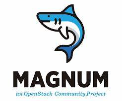
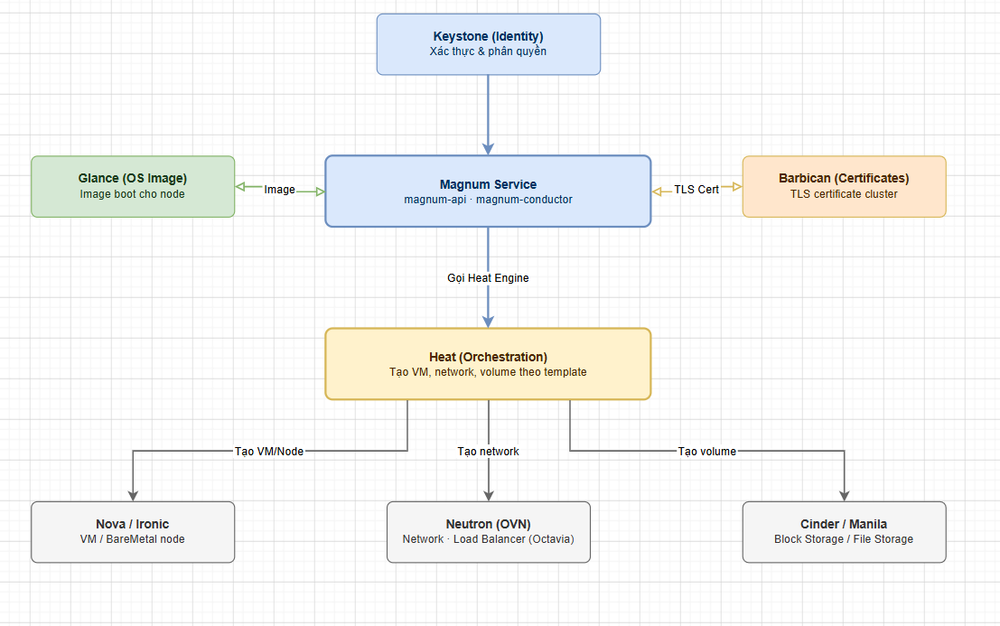
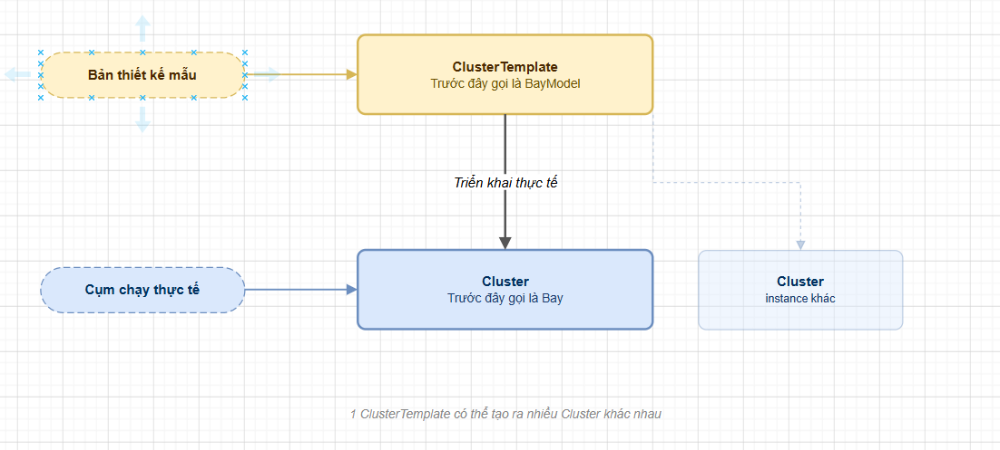

# TỔNG QUAN VỀ OPENSTACK MAGNUM

> **Phiên bản tham chiếu**: OpenStack **2026.1 Gazpacho** + Magnum **18.x**

## I. MAGNUM LÀ GÌ?



**OpenStack Magnum** là một dịch vụ API của OpenStack (Container Infrastructure Management service) được thiết kế nhằm mục đích tích hợp và cung cấp các công cụ điều phối container (Container Orchestration Engines - COEs) như **Kubernetes** như là các tài nguyên chính quy (first-class resources) trong hệ sinh thái OpenStack.

```text
               +-------------------------------------------+
               |              OpenStack API                |
               +----------------------+--------------------+
                                      |
                                      ▼
               +-------------------------------------------+
               |             OpenStack Magnum              |
               +----------------------+--------------------+
                                      |
                                      ▼ (Deploy qua Heat)
               +-------------------------------------------+
               |  Container Orchestration Engines (COEs)   |
               |         (Kubernetes / Swarm)              |
               +-------------------------------------------+
```

Magnum cho phép người dùng tự phục vụ (self-service) khởi tạo, mở rộng, quản lý và vận hành các cụm container cluster chạy trực tiếp trên tài nguyên ảo hóa (Virtual Machines của Nova) hoặc máy chủ vật lý (Bare Metal của Ironic) mà không cần phải thực hiện cài đặt thủ công từng cấu phần hệ thống.

## II. LỊCH SỬ PHÁT TRIỂN VÀ VỊ TRÍ TRONG HỆ SINH THÁI OPENSTACK

### 1. Lịch sử phát triển

- **Khởi đầu (Kilo release)**: Magnum được giới thiệu lần đầu tiên như một dự án thử nghiệm vào chu kỳ OpenStack Kilo (2015) nhằm đón đầu làn sóng Containerization đang bùng nổ mạnh mẽ với sự dẫn dắt của Docker và Kubernetes.
- **Tiến hóa (Liberty -> Queens)**: Dự án nhanh chóng trưởng thành và trở thành một dự án chính thức. Magnum ban đầu hỗ trợ nhiều loại COE khác nhau bao gồm Docker Swarm, Apache Mesos và Kubernetes.
- **Hiện tại (OpenStack 2026.1 Gazpacho)**: Với sự thống trị tuyệt đối của Kubernetes trong mảng điều phối container, Magnum hiện tại tập trung tối đa nguồn lực phát triển cho **Kubernetes**, các driver cho Mesos và Swarm cũ dần được đưa về trạng thái legacy hoặc loại bỏ để đơn giản hóa kiến trúc. Magnum hiện tại hỗ trợ Kubernetes phiên bản mới nhất cùng tích hợp chặt chẽ với cơ chế bảo mật Keystone và mạng Neutron OVN.

### 2. Vị trí và vai trò của Magnum trong kiến trúc OpenStack

Magnum hoạt động như một dịch vụ điều phối cấp cao (Orchestration Service), đóng vai trò cầu nối tích hợp sâu sắc giữa mảng hạ tầng (IaaS) và mảng nền tảng container (CaaS - Container as a Service).



- **Tích hợp Nova/Ironic**: Cấp phát các máy ảo (VM) hoặc máy vật lý (Bare Metal) để đóng vai trò làm các node Master và Worker trong cụm Kubernetes.
- **Tích hợp Neutron**: Tự động cấu hình dải mạng ảo, router, và tạo ra các Load Balancer (thông qua Octavia) để làm API Endpoint cho Kubernetes Control Plane hoặc cung cấp dịch vụ Kubernetes Service type `LoadBalancer`.
- **Tích hợp Cinder/Manila**: Cung cấp persistent storage cho các ứng dụng chạy trong container thông qua cơ chế CSI (Container Storage Interface) driver của OpenStack.
- **Tích hợp Glance**: Cung cấp các image hệ điều hành chuyên biệt được tối ưu cho container (như Fedora CoreOS, Debian) để làm nền tảng boot VM trong cluster.
- **Tích hợp Keystone**: Đồng bộ cơ chế xác thực. Token của Keystone được dùng để đăng nhập và phân quyền RBAC trên cụm Kubernetes Cluster.
- **Tích hợp Barbican**: Lưu trữ các chứng chỉ TLS/SSL được tạo ra tự động để bảo mật giao tiếp giữa các node và API server của Kubernetes.

## III. CÁC KHÁI NIỆM CỐT LÕI: CLUSTERTEMPLATE, CLUSTER, BAY, BAYMODEL

Kiến trúc quản lý tài nguyên của Magnum xoay quanh các khái niệm khai báo và triển khai thực tế.



### 1. ClusterTemplate (Trước đây gọi là BayModel)

- **Định nghĩa**: Là một bản thiết kế mẫu (Blueprint) quy định các thông số kỹ thuật cấu hình cho cụm Kubernetes sẽ được tạo ra. Khái niệm này tương đương với "Flavor" xtrong Nova nhưng dành cho cả cụm máy chủ container.
- **Các thông số khai báo**:
  - Loại COE (mặc định: `kubernetes`).
  - Image OS sử dụng (ví dụ: Fedora CoreOS).
  - Kích thước phần cứng (Flavor) cho node master và node worker.
  - Driver mạng sử dụng bên trong Kubernetes (như Calico, Flannel).
  - Trạng thái kích hoạt Load Balancer hướng ngoại cho Kubernetes API.
  - Các tham số bảo mật (Keystone Auth, TLS).

### 2. Cluster (Trước đây gọi là Bay)

- **Định nghĩa**: Là thực thể vật lý hoạt động đại diện cho một cụm Kubernetes thực tế được tạo ra dựa trên cấu hình khai báo của một `ClusterTemplate`.
- **Thành phần**: Một Cluster bao gồm tối thiểu một node Master đóng vai trò Control Plane và các node Worker chịu trách nhiệm chạy các container workloads. Người dùng có thể thực hiện scale tăng/giảm số lượng worker node trực tiếp qua Magnum API.

### 3. Lịch sử đổi tên: Bay/BayModel chuyển thành Cluster/ClusterTemplate

Trong các phiên bản OpenStack thời kỳ đầu (khi Mesos và Docker Swarm vẫn còn phổ biến), Magnum sử dụng thuật ngữ **BayModel** và **Bay** để định danh tài nguyên để tránh xung đột thuật ngữ do các COE khác nhau có cách gọi khác nhau (ví dụ: Kubernetes gọi là *Cluster*, Swarm gọi là *Swarm*, Mesos gọi là *Cluster*).

> [!NOTE]
>
> Kể từ phiên bản OpenStack Newton, cộng đồng đã thống nhất đổi tên toàn bộ:
>
> - **BayModel** ──▶ **ClusterTemplate**
> - **Bay** ──────▶ **Cluster**
>
> Việc đổi tên này giúp Magnum trở nên thân thiện, dễ hiểu hơn và tiệm cận với ngôn ngữ tiêu chuẩn của ngành công nghiệp điện toán đám mây. Trên hệ thống API và CLI hiện tại của bản 2026.1 Gazpacho, các endpoint `bay` và `baymodel` cũ đã bị loại bỏ hoàn toàn, thay thế bằng `cluster` và `cluster-template`.

## IV. SO SÁNH MAGNUM VỚI CÁC GIẢI PHÁP KHÁC (RANCHER, KUBEADM, KOPS)

Để hiểu rõ tại sao nên sử dụng Magnum thay vì các giải pháp cài đặt Kubernetes khác, ta hãy cùng so sánh dựa trên các tiêu chí vận hành thực tế:

| Tiêu chí | OpenStack Magnum | Rancher | Kubeadm | kOps |
| :--- | :--- | :--- | :--- | :--- |
| **Kiến trúc tích hợp** | **Native OpenStack**: Tích hợp trực tiếp vào Keystone, Neutron, Cinder và Heat. | **Platform-agnostic**: Quản lý đa đám mây, cần cài agent trên VM. | **Tool cài đặt**: Chỉ cài đặt trên hệ điều hành có sẵn, không tự tạo hạ tầng. | **Cloud-native**: Chủ yếu tối ưu cho AWS/GCP, hỗ trợ OpenStack hạn chế. |
| **Cấp phát hạ tầng** | **Tự động**: Tự tạo VM, Port mạng, Load Balancer, Router và Volume thông qua Heat. | **Bán tự động**: Cần có sẵn máy ảo hoặc sử dụng Cloud driver của Rancher. | **Thủ công**: Quản trị viên phải tự chuẩn bị VM và mạng trước khi chạy lệnh. | **Tự động**: Tự tạo VM, ASG và Network trên nền tảng Cloud chỉ định. |
| **Quản lý xác thực (Auth)** | Đồng bộ tài khoản Keystone của OpenStack làm User Kubernetes. | Quản lý User riêng biệt qua AD, LDAP, hoặc cấu hình local. | Quản lý thủ công qua Certificate hoặc RBAC riêng của Kubernetes. | Quản lý qua IAM của AWS/GCP hoặc cấu hình xác thực riêng. |
| **Mô hình dịch vụ** | **CaaS (Container as a Service)** tự phục vụ cho Tenant của OpenStack. | **Enterprise Management Platform** quản lý tập trung đa cụm. | **Bootstrap Tool** cấp thấp dành cho quản trị viên hệ thống. | **CLI Tool** quản lý vòng đời cụm dành cho kỹ sư cloud. |
| **Độ phức tạp vận hành** | **Thấp**: Người dùng chỉ cần gõ 1 lệnh CLI OpenStack để sở hữu cụm K8s sạch. | **Trung bình**: Cần cài đặt và duy trì cụm Rancher Management độc lập. | **Cao**: Đòi hỏi kỹ năng cài đặt thủ công và hiểu sâu về hệ thống Linux/K8s. | **Thấp**: Rất dễ dùng nếu chạy trên AWS/GCP, phức tạp trên OpenStack. |

### Kết luận

- **Magnum** là sự lựa chọn tối ưu nhất nếu doanh nghiệp của bạn đang vận hành một hệ thống OpenStack Private Cloud và muốn cung cấp tính năng **Kubernetes-as-a-Service (K8s-as-a-Service)** cho các phòng ban nội bộ thuê tài nguyên một cách nhanh chóng và tự động, tận dụng tối đa các tài nguyên sẵn có (Keystone, Neutron, Cinder, Octavia).
- Các giải pháp như **Rancher**, **Kubeadm**, **kOps** sẽ phù hợp hơn cho các môi trường chạy trên Public Cloud (AWS/GCP), hoặc khi cần một công cụ quản lý đa đám mây phức tạp không phụ thuộc vào hạ tầng OpenStack
