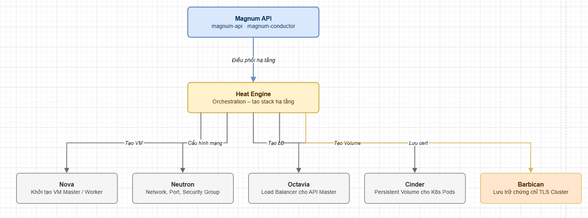
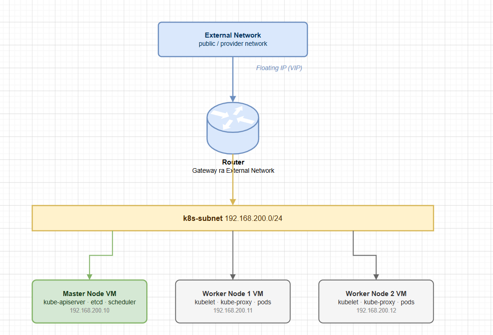

# CHUẨN BỊ MÔI TRƯỜNG OPENSTACK ĐỂ CÀI MAGNUM

> **Phiên bản tham chiếu**: OpenStack **2026.1 Gazpacho** + Magnum **18.x**

## I. KIỂM TRA CÁC SERVICE BẮT BUỘC ĐÃ CÓ CHƯA

Trước khi cài đặt và cấu hình dịch vụ Magnum, ta bắt buộc phải đảm bảo toàn bộ hệ thống OpenStack nền tảng đã sẵn sàng và các dịch vụ bổ trợ đang chạy ổn định. Bản thân Magnum là một bộ điều phối cấp cao, nó không trực tiếp quản lý ảo hóa hay mạng mà gọi đến API của các dịch vụ khác thông qua Heat.



Hãy thực thi lệnh kiểm tra danh sách dịch vụ trên máy chủ điều khiển (Controller Node):

```bash
source /etc/kolla/admin-openrc

# Kiểm tra danh sách dịch vụ đang đăng ký trong Keystone:
openstack service list
```

Dưới đây là danh sách các dịch vụ **bắt buộc phải hoạt động** và mục đích sử dụng của chúng đối với Magnum:

- **Nova (Compute)**: Cung cấp tài nguyên tính toán để chạy máy ảo làm các Master Node và Worker Node của cụm Kubernetes.
- **Neutron (Networking)**: Cấp phát địa chỉ IP, cấu hình Router, Private Subnet cho các node K8s giao tiếp nội bộ và cấp phát Floating IP để người quản trị kết nối từ xa.
- **Glance (Image Service)**: Lưu trữ các bản cài hệ điều hành (như Fedora CoreOS) được tối ưu hóa riêng cho các cluster node.
- **Heat (Orchestration)**: **Trái tim vận hành của Magnum**. Mỗi khi có lệnh tạo cụm Cluster, Magnum sẽ dịch cấu hình ClusterTemplate thành một template HOT của Heat và gọi Heat chạy để sinh ra toàn bộ tài nguyên VM, Network, Disk một cách tự động. Nếu dịch vụ Heat gặp sự cố, Magnum sẽ không thể tạo được bất kỳ cụm cluster nào.
- **Octavia (Load Balancer)**: Bắt buộc phải có để tạo Load Balancer đứng trước cụm Master Node. LB này cung cấp địa chỉ Virtual IP (VIP) làm Endpoint API của Kubernetes, đồng thời phân phối tải kết nối từ Worker Node và người dùng ngoài đến Control Plane.
- **Barbican (Key Manager)**: Cung cấp tính năng quản lý khóa bảo mật. Khi cụm Kubernetes được tạo, Magnum sẽ tự động tạo ra một hệ thống chứng chỉ TLS nội bộ để mã hóa đường truyền API và lưu trữ các chứng chỉ, khóa riêng tư (Private Keys) này một cách an toàn trong Barbican.

## II. TẠO IMAGE HỆ ĐIỀU HÀNH CHO NODE

Cụm Kubernetes do Magnum sinh ra đòi hỏi hệ điều hành trên các máy ảo node phải cài đặt sẵn các agent như Docker, Containerd, Kubelet, Kubeadm và công cụ cấu hình ban đầu (như cloud-init hoặc Ignition). Do đó, ta không thể sử dụng các image Linux Cloud thông thường.

### 1. Lựa chọn hệ điều hành khuyến nghị

- **Fedora CoreOS (FCOS)** (Khuyến nghị số 1): Đây là hệ điều hành phân phối mặc định được hỗ trợ tốt nhất trong các template của Magnum. FCOS sử dụng công cụ cấu hình **Ignition** thay thế cho cloud-init, giúp tốc độ boot máy ảo cực nhanh và khả năng tự động thiết lập bảo mật/mạng rất đáng tin cậy.
- **Ubuntu Cloud Image** (Tùy chọn): Có thể sử dụng các phiên bản Ubuntu LTS đã được build kèm công cụ cấu hình đặc thù của Magnum.

### 2. Tải và Import Image Fedora CoreOS vào Glance

Hãy tải bản Fedora CoreOS phù hợp với phiên bản Magnum hiện tại và import vào dịch vụ Glance.

> [!WARNING]
> Khi tạo image trong Glance cho Magnum, ta **bắt buộc phải gắn thẻ Metadata `os_distro`** thích hợp. Nếu thiếu thuộc tính này, Magnum sẽ không nhận dạng được loại hệ điều hành để chọn Driver Heat tương ứng và quá trình tạo cluster sẽ thất bại ngay lập tức.

Chạy các lệnh sau trên Controller Node:

```bash
# 1. Tải bản image Fedora CoreOS đã được tối ưu hóa cho OpenStack:
wget https://tarballs.openstack.org/magnum/images/fedora-coreos-38.qcow2 -O /tmp/fedora-coreos-38.qcow2

# 2. Upload image lên Glance:
openstack image create \
  --name "fedora-coreos-38-magnum" \
  --disk-format qcow2 \
  --container-format bare \
  --file /tmp/fedora-coreos-38.qcow2 \
  --property os_distro=fedora-coreos \
  --public

# 3. Xác minh thuộc tính os_distro của image:
openstack image show "fedora-coreos-38-magnum" -c properties
```

## III. CHUẨN BỊ KEYPAIR VÀ FLAVOR

### 1. Tạo SSH Keypair

Khi khởi tạo cụm Kubernetes, Magnum yêu cầu chỉ định một Keypair để inject vào tất cả các node trong cụm. Điều này cho phép quản trị viên có thể truy cập SSH vào các node Master/Worker bằng khóa bảo mật để khắc phục sự cố hoặc kiểm tra hệ thống.

```bash
# Tạo keypair mới từ key SSH hiện có của user:
openstack keypair create --public-key ~/.ssh/id_rsa.pub magnum-ssh-key
```

### 2. Cấu hình các Flavor (Kích thước phần cứng máy ảo)

Kubernetes có yêu cầu phần cứng khác nhau đối với Control Plane (Master Node) và Worker Node. Ta cần thiết kế các Flavor phần cứng đáp ứng tối thiểu yêu cầu hệ thống:

- **Master Node Flavor**: Chạy các tiến trình quản trị quan trọng (etcd, kube-apiserver, kube-controller-manager, kube-scheduler). Etcd yêu cầu ghi đĩa nhanh và dung lượng RAM ổn định để tránh tình trạng cụm bị mất đồng bộ.
  - *Cấu hình tối thiểu*: 2 vCPU, 4 GB RAM, 20 GB Disk.
  - *Cấu hình khuyến nghị*: 4 vCPU, 8 GB RAM, 40 GB Disk.
- **Worker Node Flavor**: Chạy ứng dụng thực tế (Pod workloads). Cần cấu hình dựa trên nhu cầu thực tế của ứng dụng.
  - *Cấu hình tối thiểu*: 1 vCPU, 2 GB RAM, 20 GB Disk.
  - *Cấu hình khuyến nghị*: 2 vCPU, 4 GB RAM, 40 GB Disk.

Lệnh CLI khởi tạo các Flavor mẫu dành riêng cho Kubernetes:

```bash
# Tạo flavor cho Master Node:
openstack flavor create --id auto --ram 4096 --disk 20 --vcpus 2 k8s.master

# Tạo flavor cho Worker Node:
openstack flavor create --id auto --ram 4096 --disk 40 --vcpus 2 k8s.worker
```

## IV. CHUẨN BỊ NETWORK

Các máy ảo chạy trong cụm Kubernetes cần một cấu trúc mạng ảo hoàn chỉnh để có thể kết nối Internet (để kéo image từ Docker Hub, Quay, gcr.io) và giao tiếp ổn định lẫn nhau.



### Các bước thiết lập mạng ảo chi tiết

```bash
# 1. Xác minh hệ thống đã có mạng Public/External kết nối internet chưa:
openstack network list --external

# Giả sử mạng external hiện có tên là "public"

# 2. Tạo mạng Private dành riêng cho các Kubernetes Cluster (Tenant Network):
openstack network create k8s-global-net

# 3. Tạo Subnet nội bộ nằm trong mạng Private vừa tạo:
openstack subnet create \
  --network k8s-global-net \
  --subnet-range 192.168.200.0/24 \
  --dns-nameserver 8.8.8.8 \
  --dns-nameserver 1.1.1.1 \
  k8s-global-subnet

# 4. Tạo Router để kết nối mạng nội bộ ra Internet:
openstack router create k8s-global-router

# 5. Gắn cổng mạng External làm gateway cho Router:
openstack router set --external-gateway public k8s-global-router

# 6. Gắn cổng Subnet nội bộ vào Router:
openstack router add subnet k8s-global-router k8s-global-subnet
```

Sau khi hoàn tất 4 bước chuẩn bị hạ tầng trên (Kiểm tra Core Service, Cấp phát OS Image, Tạo SSH Keypair/Flavors và Quy hoạch mạng lưới), môi trường OpenStack của ta đã hoàn toàn sẵn sàng cho việc cài đặt dịch vụ Magnum.
