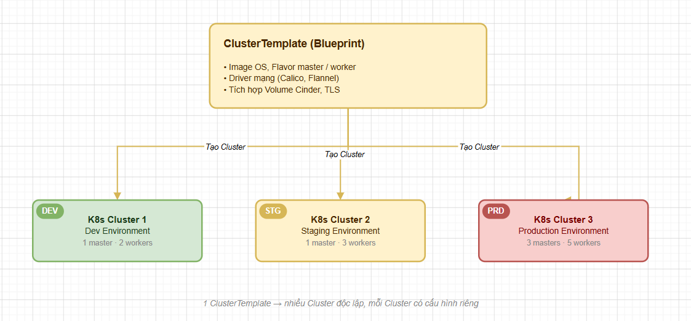

# TẠO CLUSTER TEMPLATE

> **Phiên bản tham chiếu**: OpenStack **2026.1 Gazpacho** + Magnum **18.x**

## I. CLUSTER TEMPLATE LÀ GÌ – VAI TRÒ NHƯ MỘT "BẢN THIẾT KẾ" CỤM

Trong kiến trúc OpenStack Magnum, **ClusterTemplate** (trước đây gọi là *BayModel*) đóng vai trò là một bản thiết kế mẫu (Blueprint) quy hoạch toàn bộ các tham số kỹ thuật, quy tắc mạng, cơ chế bảo mật và kích thước phần cứng của một cụm Kubernetes trước khi nó thực sự được khởi tạo.



Việc định nghĩa ClusterTemplate giúp quản trị viên đám mây chuẩn hóa các gói dịch vụ Kubernetes khác nhau (ví dụ: gói nhỏ cho thử nghiệm, gói lớn tích hợp High Availability cho sản xuất). Người dùng cuối (Tenant Users) chỉ việc chọn tên ClusterTemplate mong muốn và khởi tạo cụm Kubernetes nhanh chóng mà không cần bận tâm đến việc cấu hình tham số hạ tầng phức tạp.

## II. CÁC THAM SỐ BẮT BUỘC

Khi sử dụng lệnh tạo ClusterTemplate (`openstack coe cluster template create`), ta bắt buộc phải cung cấp nhóm tham số nền tảng để Magnum và Heat định hình hạ tầng máy chủ:

- **`--coe kubernetes`**: Định nghĩa Container Orchestration Engine. Kể từ phiên bản mới nhất, `kubernetes` là COE chính thống duy nhất được tối ưu hóa sâu.
- **`--image <TÊN_HOẶC_ID_IMAGE>`**: Chỉ định image hệ điều hành lưu trữ trong Glance (ví dụ: `fedora-coreos-38-magnum`) đã được import và cấu hình đúng metadata `os_distro`.
- **`--keypair <TÊN_KEYPAIR>`**: Chỉ định SSH keypair đã đăng ký trong Nova để tự động inject vào tài khoản quản trị hệ thống (`core` đối với Fedora CoreOS hoặc `ubuntu` đối với Ubuntu) trên các node.
- **`--external-network <TÊN_HOẶC_ID_MẠNG_NGOÀI>`**: Tên hoặc ID của Provider/External Network trong Neutron (ví dụ: `public`). Mạng này dùng để định tuyến Internet và làm dải cấp phát IP VIP cho Load Balancer.
- **`--master-flavor <TÊN_HOẶC_ID_FLAVOR>`**: Flavor phần cứng cho VM Master Node (Control Plane), quyết định RAM, CPU và kích thước ổ cứng boot (ví dụ: `k8s.master`).
- **`--flavor <TÊN_HOẶC_ID_FLAVOR>`**: Flavor phần cứng cho VM Worker Node (Compute/Workload Nodes) (ví dụ: `k8s.worker`).
- **`--network-driver <calico|flannel>`**: Chọn driver mạng (CNI) nội bộ cho Kubernetes. Calico là tùy chọn khuyến nghị nhờ hiệu năng định tuyến Layer-3 tối ưu và khả năng quản lý Security Policy mạnh mẽ.
- **`--dns-nameserver <IP_DNS>`**: Địa chỉ IP DNS server (ví dụ: `8.8.8.8`) để cấu hình cho hệ thống mạng của các node, giúp cluster phân giải được tên miền ra Internet.

## III. CÁC THAM SỐ QUAN TRỌNG NÊN ĐẶT (PROD-READY)

Để xây dựng một cụm Kubernetes đạt tiêu chuẩn vận hành thực tế (Production-ready), có độ sẵn sàng cao (HA) và tích hợp đầy đủ tính năng, ta cần cấu hình bổ sung các tùy chọn nâng cao sau:

- **`--master-lb-enabled`**: Bật tính năng tích hợp dịch vụ Octavia Load Balancer đứng trước cụm Master. Tùy chọn này là bắt buộc nếu ta muốn triển khai cụm có nhiều node Master (Multi-master HA). Load Balancer sẽ tạo một IP VIP đại diện kết nối API của cụm, phân phối lưu lượng truy cập của các node worker và client một cách cân bằng.
- **`--floating-ip-enabled`**: Xác định xem có cấp phát Floating IP công cộng trực tiếp cho các node K8s hay không.
  - *Bật (`true`)*: Phù hợp cho môi trường Lab, giúp dễ dàng SSH trực tiếp từ ngoài vào từng node.
  - *Tắt (`false`)*: Khuyến nghị cho Production để bảo mật. Toàn bộ VM Master và Worker sẽ nằm trong mạng Private kín, chỉ truy cập API thông qua cổng Load Balancer duy nhất.
- **`--volume-driver cinder`**: Kích hoạt việc tích hợp khối lưu trữ Cinder CSI (Container Storage Interface). Khi tham số này được bật, các lập trình viên khi deploy app lên Kubernetes có thể yêu cầu Persistent Volume Claim (PVC) để lưu trữ dữ liệu vĩnh viễn, Kubernetes sẽ tự động gọi OpenStack Cinder tạo và gắn disk vào VM.

## IV. CÂU LỆNH TẠO CLUSTERTEMPLATE VÀ KIỂM TRA KẾT QUẢ

### 1. Câu lệnh tạo mẫu hoàn chỉnh

Dưới đây là câu lệnh CLI đầy đủ để tạo một ClusterTemplate có cấu hình bảo mật cao, tích hợp Load Balancer Octavia và Cinder Storage:

```bash
source /etc/kolla/admin-openrc

# Tạo ClusterTemplate mang tên "k8s-prod-template":
openstack coe cluster template create k8s-prod-template \
  --coe kubernetes \
  --image fedora-coreos-38-magnum \
  --keypair magnum-ssh-key \
  --external-network public \
  --master-flavor k8s.master \
  --flavor k8s.worker \
  --network-driver calico \
  --dns-nameserver 8.8.8.8 \
  --master-lb-enabled \
  --volume-driver cinder \
  --floating-ip-enabled false
```

### 2. Liệt kê danh sách các Template

```bash
# Kiểm tra danh sách các template hiện có trên cloud:
openstack coe cluster template list
```

**Output mong đợi**:

```text
+--------------------------------------+-------------------+
| uuid                                 | name              |
+--------------------------------------+-------------------+
| f3a2b1c0-abcd-1234-5678-abcdef123456 | k8s-prod-template |
+--------------------------------------+-------------------+
```

### 3. Xem chi tiết thông số cấu hình của Template

Để xem toàn bộ metadata và tham số mặc định của template vừa tạo, chạy lệnh:

```bash
openstack coe cluster template show k8s-prod-template
```

**Output phân tích chi tiết**:
```text
+-----------------------+--------------------------------------+
| Property              | Value                                |
+-----------------------+--------------------------------------+
| apiserver_port        | None                                 |
| coe                   | kubernetes                           |
| created_at            | 2026-06-01T04:15:00+00:00            |
| dns_nameserver        | 8.8.8.8                              |
| docker_storage_driver | overlay2                             |
| docker_volume_size    | None                                 |
| fixed_network         | None                                 |
| fixed_subnet          | None                                 |
| flavor_id             | k8s.worker                           |
| floating_ip_enabled   | False                                |
| http_proxy            | None                                 |
| https_proxy           | None                                 |
| image_id              | fedora-coreos-38-magnum              |
| keypair_id            | magnum-ssh-key                       |
| labels                | {}                                   |
| master_flavor_id      | k8s.master                           |
| master_lb_enabled     | True                                 |
| name                  | k8s-prod-template                    |
| network_driver        | calico                               |
| no_proxy              | None                                 |
| public                | False                                |
| registry_enabled      | False                                |
| server_type           | vm                                   |
| tls_disabled          | False                                |
| updated_at            | None                                 |
| uuid                  | f3a2b1c0-abcd-1234-5678-abcdef123456 |
| volume_driver         | cinder                               |
+-----------------------+--------------------------------------+
```

Bản thiết kế `k8s-prod-template` đã được tạo lập thành công. Giờ đây, bất kỳ người dùng nào có quyền hạn trong dự án đều có thể sử dụng template này để tạo các cụm Kubernetes Cluster tiêu chuẩn với chỉ một câu lệnh duy nhất.
