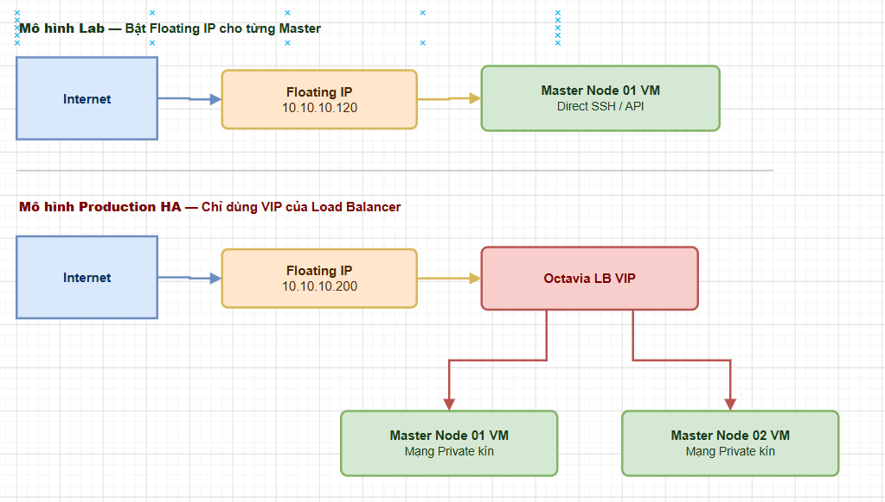
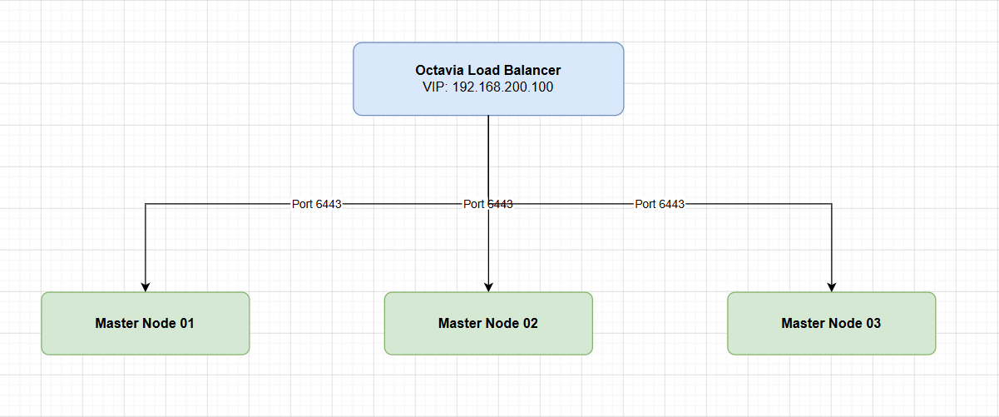

# NETWORKING TRONG KUBE CỦA MAGNUM

> **Phiên bản tham chiếu**: OpenStack **2026.1 Gazpacho** + Magnum **18.x** + Octavia **14.x**

## I. CNI PLUGIN MẶC ĐỊNH (FLANNEL) VÀ CÁCH ĐỔI SANG CALICO QUA LABEL

CNI (Container Network Interface) là thành phần chịu trách nhiệm cấu hình và quản trị mạng nội bộ giữa các Pod trong cụm Kubernetes.

### 1. Phân tích CNI mặc định và lựa chọn thay thế

- **Flannel (Mặc định)**: Trong các cấu hình cơ bản hoặc legacy của Magnum, Flannel thường được chọn làm mặc định nhờ cơ chế mạng overlay (thường qua VXLAN) cực kỳ đơn giản và nhẹ. Tuy nhiên, điểm yếu cốt lõi của Flannel là không hỗ trợ các quy tắc an ninh mạng **Kubernetes NetworkPolicies** (tất cả các Pod mặc định được thông suốt với nhau mà không có tường lửa chặn lại).
- **Calico (Khuyến nghị cho Production)**: Calico cung cấp mạng hiệu năng cao nhờ cơ chế định tuyến không overlay (hoặc tùy chọn IPIP/VXLAN) và hỗ trợ đầy đủ các tính năng bảo mật NetworkPolicy ở lớp ứng dụng.

### 2. Cách thay đổi mạng sang Calico qua Label

Khi tạo lập ClusterTemplate, ta có thể chỉ định driver mạng thông qua tham số trực tiếp hoặc sử dụng hệ thống Label (nhãn cấu hình mở rộng) của Magnum:

```bash
source /etc/kolla/admin-openrc

# Cách 1: Chỉ định trực tiếp driver mạng Calico:
openstack coe cluster template create k8s-calico-template \
  --coe kubernetes \
  --image fedora-coreos-38-magnum \
  --keypair magnum-ssh-key \
  --external-network public \
  --master-flavor k8s.master \
  --flavor k8s.worker \
  --network-driver calico \
  --dns-nameserver 8.8.8.8

# Cách 2: Sử dụng tham số --labels để cấu hình sâu cho Calico:
openstack coe cluster template create k8s-calico-advanced \
  --coe kubernetes \
  --image fedora-coreos-38-magnum \
  --keypair magnum-ssh-key \
  --external-network public \
  --master-flavor k8s.master \
  --flavor k8s.worker \
  --dns-nameserver 8.8.8.8 \
  --labels network_driver=calico,calico_ipv4pool_ipip=Always
```

## II. FLOATING IP CHO MASTER NODE

Floating IP (IP động hướng ngoại) đóng vai trò làm địa chỉ public để truy cập và quản trị máy ảo từ bên ngoài Internet. Trong cụm Kubernetes của Magnum, việc quy hoạch Floating IP cho các Master Node cần cân nhắc kỹ giữa nhu cầu tiện ích và an toàn thông tin:



### 1. Cấu hình Lab/Thử nghiệm (`--floating-ip-enabled true`)

- **Đặc điểm**: Mỗi máy ảo Master và Worker sinh ra đều được cấp phát tự động một Floating IP từ dải mạng external.
- **Ưu điểm**: Dễ dàng kết nối SSH trực tiếp vào từng VM để kiểm tra log hệ thống hoặc quản trị trực tiếp.
- **Nhược điểm**: Tiêu tốn nhiều tài nguyên Floating IP của hệ thống mạng Neutron và mở rộng bề mặt tấn công bảo mật lên tất cả các node.

### 2. Cấu hình Production an toàn (`--floating-ip-enabled false`)

- **Đặc điểm**: Các máy ảo node chỉ nhận IP nội bộ (Private IP) từ dải mạng mạng riêng (Tenant Network).
- **Ưu điểm**: Bảo mật tối đa. Các node được bảo vệ tuyệt đối trong mạng kín.
- **Định tuyến kết nối**: Quản trị viên truy cập API K8s thông qua duy nhất một IP VIP hướng ngoại của Octavia Load Balancer đứng trước cụm Master, còn truy cập SSH kỹ thuật sẽ đi qua một máy chủ trung chuyển (Bastion Host/Jumpbox).

## III. OCTAVIA LOAD BALANCER CHO KUBERNETES API SERVER (HA)

Để cụm Kubernetes đạt trạng thái High Availability (HA) với nhiều Master Node, Magnum tích hợp chặt chẽ với dịch vụ cân bằng tải **Octavia** của OpenStack.



### Cơ chế hoạt động của Master Load Balancer

- **Kích hoạt**: Được kích hoạt bằng cờ `--master-lb-enabled` trong ClusterTemplate.
- **Khởi tạo**: Khi stack Heat chạy, nó yêu cầu Octavia khởi tạo một Load Balancer vật lý (thông qua máy ảo cân bằng tải chuyên dụng Amphora).
- **Cấu hình Listeners & Pools**:
  - Octavia tạo một Listener lắng nghe trên cổng `6443` (hoặc cổng bảo mật HTTPS tùy cấu hình) đại diện cho Kubernetes API Server.
  - Pool của Load Balancer sẽ bao gồm tất cả các địa chỉ IP nội bộ của các máy ảo Master Node.
- **Cơ chế Health Check**: Octavia liên tục gửi gói tin giám sát trạng thái (health monitor) tới cổng 6443 của các Master. Nếu một node Master gặp sự cố ngắt kết nối, Octavia lập tức loại bỏ node đó ra khỏi pool điều phối để đảm bảo các yêu cầu kết nối của `kubectl` và Worker Nodes không bị gián đoạn.

## IV. TẠO SERVICE TYPE LOADBALANCER VÀ CÁCH MAGNUM TÍCH HỢP VỚI OCTAVIA

Một trong những ưu điểm lớn nhất của cụm Kubernetes được deploy qua Magnum là khả năng tích hợp Native với Cloud Provider OpenStack để cung cấp tài nguyên động cho các ứng dụng chạy bên trong.

### 1. Vai trò của OpenStack Cloud Controller Manager (CCM)

Magnum tự động đóng gói và cài đặt sẵn cấu phần **OpenStack CCM** làm DaemonSet chạy trong cụm K8s. Khi một lập trình viên khai báo triển khai ứng dụng và yêu cầu một Service có `type: LoadBalancer`, CCM sẽ lắng nghe sự kiện này và tương tác trực tiếp với API của OpenStack Octavia để xin cấp phát Load Balancer tương ứng ngoài đời thực.


### 2. Ví dụ khai báo YAML Service của Kubernetes

Dưới đây là file cấu hình Kubernetes Service mẫu để tự động xin cấp phát một Load Balancer Octavia hướng ngoại:

```yaml
apiVersion: v1
kind: Service
metadata:
  name: production-web-lb
  namespace: default
  annotations:
    # Chỉ định ID của mạng ngoài dùng để cấp Floating IP VIP cho LB:
    octavia.openstack.org/floating-network-id: "4d9a2c10-1234-abcd-efgh-56789abcdef0"
spec:
  selector:
    app: production-web-app
  ports:
    - protocol: TCP
      port: 80          # Cổng dịch vụ ngoài của Load Balancer
      targetPort: 8080  # Cổng ứng dụng thực tế chạy trong Pod
  type: LoadBalancer
```

### 3. Thực thi kiểm tra kết quả

Khi người dùng chạy lệnh áp dụng cấu hình:

```bash
kubectl apply -f web-service.yaml

# Theo dõi quá trình cấp phát IP VIP của OpenStack Octavia:
kubectl get svc production-web-lb -w
```

**Kết quả hiển thị**:

```text
NAME                TYPE           CLUSTER-IP      EXTERNAL-IP    PORT(S)        AGE
production-web-lb   LoadBalancer   10.254.120.45   10.10.10.201   80:31254/TCP   2m
```

Trường `EXTERNAL-IP` nhận giá trị IP thực tế `10.10.10.201` chứng minh OpenStack CCM đã gọi thành công Octavia để tạo Load Balancer hạ tầng và gắn Floating IP hướng ngoại kết nối trực tiếp vào dịch vụ ứng dụng container phía sau.
