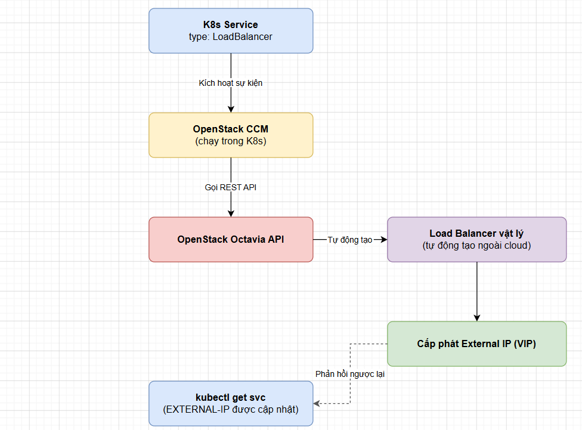

# STORAGE CHO CỤM K8S TRÊN MAGNUM

> **Phiên bản tham chiếu**: OpenStack **2026.1 Gazpacho** + Magnum **18.x** + Cinder **24.x**

## I. CINDER CSI DRIVER – TỰ ĐỘNG CÀI HAY CẤU HÌNH THỦ CÔNG

Để các container chạy trong Kubernetes có thể lưu trữ dữ liệu vĩnh viễn (Persistent Data), cụm K8s cần giao tiếp được với hạ tầng lưu trữ khối (Block Storage) bên dưới của OpenStack. Thành phần chịu trách nhiệm làm cầu nối này là **Cinder CSI (Container Storage Interface) Driver**.

### 1. Cơ chế tự động cài đặt của Magnum (Khuyến nghị)

Khi sử dụng OpenStack Magnum, việc tích hợp Cinder CSI được thực hiện **hoàn toàn tự động** và đồng bộ. Quản trị viên chỉ cần kích hoạt cờ cấu hình lưu trữ trong quá trình thiết lập ClusterTemplate ban đầu:

```bash
# Sử dụng tham số --volume-driver cinder để Magnum tự động kích hoạt Cinder CSI:
openstack coe cluster template create k8s-storage-template \
  --coe kubernetes \
  --volume-driver cinder \
  # ... các tham số bắt buộc khác ...
```

Khi cụm Kubernetes được khởi tạo từ template này:

1. **Heat Engine** tự động cấu hình các thông số bảo mật, uỷ thác quyền truy cập Keystone (Trusts) cho cụm.
2. **Magnum Conductor** tự động nạp các tệp manifest cấu hình của Cinder CSI và nạp vào API Server của Kubernetes trong quá trình khởi tạo Control Plane.
3. **Ignition/Cloud-init** trên các node tự động chuẩn bị các thư mục mount vật lý hệ thống đĩa.

### 2. Các thành phần CSI hoạt động bên trong cụm Kubernetes

Sau khi cụm khởi tạo thành công, Magnum sẽ tự động triển khai các Pod điều phối lưu trữ trong namespace `kube-system`. Ta có thể kiểm tra trạng thái của các Pod này:

```bash
# Kiểm tra các Pod liên quan đến CSI của OpenStack:
kubectl get pods -n kube-system | grep csi
```

**Các thành phần cốt lõi được tự động cài đặt**:

- **`openstack-cinder-csi-controller`** (Deployment/ReplicaSet): Thường chạy trên Master Node. Nó lắng nghe các yêu cầu từ Kubernetes API để tương tác trực tiếp với OpenStack Cinder API nhằm thực hiện các tác vụ tạo mới, xóa, thay đổi kích thước hoặc tạo bản chụp (Snapshot) volume vật lý.
- **`openstack-cinder-csi-node`** (DaemonSet): Chạy trên tất cả các Worker Nodes. Nhiệm vụ của nó là gắn kết (Attach) volume vật lý do controller tạo vào trực tiếp máy ảo Nova Node và định dạng hệ thống tệp (format file system như ext4, xfs) để các Container Pod có thể đọc/ghi dữ liệu.



### 3. Khi nào cần cấu hình thủ công?

Người quản trị chỉ cần thực hiện cài đặt hoặc cập nhật thủ công Cinder CSI khi:

- Muốn nâng cấp phiên bản CSI driver độc lập để sửa lỗi bảo mật mà không muốn nâng cấp toàn bộ hệ thống OpenStack.
- Cần tùy biến các tham số nâng cao liên quan đến bảo mật Key Manager (Barbican) để mã hóa ổ cứng của container mà Magnum driver mặc định chưa hỗ trợ đầy đủ.

## II. TẠO STORAGECLASS DÙNG CINDER

**StorageClass** trong Kubernetes là một tài nguyên khai báo định nghĩa cấu hình lưu trữ, cho phép lập trình viên tự phục vụ (Self-service) yêu cầu đĩa ảo mà không cần sự can thiệp thủ công của quản trị viên hệ thống.

### 1. Viết tệp khai báo StorageClass mẫu

Dưới đây là tệp YAML định nghĩa StorageClass kết nối trực tiếp với backend Cinder của OpenStack:

```yaml
# cinder-storageclass.yaml
apiVersion: storage.k8s.io/v1
kind: StorageClass
metadata:
  name: cinder-ssd
  annotations:
    # Thiết lập đây là StorageClass mặc định của cụm K8s
    storageclass.kubernetes.io/is-default-class: "true"
provisioner: cinder.csi.openstack.org
volumeBindingMode: WaitForFirstConsumer
reclaimPolicy: Delete
allowVolumeExpansion: true
parameters:
  # Tên Volume Type đã được quy hoạch sẵn trong OpenStack Cinder
  type: ceph-ssd
  # Chỉ định Availability Zone của Cinder
  availability: nova
```

### 2. Giải thích các tham số cấu hình quan trọng

- **`provisioner: cinder.csi.openstack.org`**: Đây là khóa định danh bắt buộc chỉ ra rằng mọi yêu cầu cấp phát từ StorageClass này sẽ được xử lý bởi Cinder CSI driver do Magnum cài đặt.
- **`volumeBindingMode: WaitForFirstConsumer`** (Khuyến nghị cao cho Production):

  - *Immediate*: Tạo volume trên Cinder ngay khi nhận được yêu cầu của người dùng, bất kể Pod chạy ở node nào. Điều này dễ dẫn đến lỗi nếu volume được tạo ở Availability Zone (AZ) A nhưng máy ảo chạy Pod sau đó lại được Nova xếp lịch chạy ở AZ B (không thể attach chéo AZ).
  - *WaitForFirstConsumer*: Trì hoãn việc tạo volume cho đến khi Pod được lập lịch chạy cụ thể trên một Worker Node. CSI sẽ dựa vào vị trí địa lý của Node đó để yêu cầu Cinder tạo volume ở cùng AZ, đảm bảo khả năng attach tuyệt đối thành công.

- **`reclaimPolicy: Delete`**: Khi PersistentVolumeClaim (PVC) của người dùng bị xóa, volume tương ứng trên OpenStack Cinder cũng sẽ tự động bị xóa theo để giải phóng dung lượng đĩa. (Nếu đổi thành `Retain`, đĩa vật lý sẽ được giữ lại an toàn cho mục đích backup dữ liệu).
- **`allowVolumeExpansion: true`**: Cho phép tăng trực tiếp dung lượng của ổ đĩa ảo (ví dụ từ 10GB lên 20GB) mà không làm mất mát dữ liệu đang có bên trong.

### 3. Thực thi khai báo hệ thống

```bash
# Áp dụng StorageClass vào cụm Kubernetes:
kubectl apply -f cinder-storageclass.yaml

# Xác minh danh sách StorageClass hiện có:
kubectl get sc
```

**Output mong đợi**:

```text
NAME                   PROVISIONER                  RECLAIMPOLICY   VOLUMEBINDINGMODE      ALLOWVOLUMEEXPANSION   AGE
cinder-ssd (default)   cinder.csi.openstack.org     Delete          WaitForFirstConsumer   true                   45s
```

## III. TEST BẰNG PERSISTENTVOLUMECLAIM ĐƠN GIẢN

Để kiểm nghiệm tính thông suốt của toàn bộ hệ thống lưu trữ tự động, ta sẽ tiến hành chạy thử nghiệm một kịch bản deploy ứng dụng thực tiễn đòi hỏi lưu trữ dữ liệu vĩnh viễn.

### 1. Viết tệp khai báo PersistentVolumeClaim (PVC)

Tạo yêu cầu cấp phát đĩa ảo với dung lượng 5 GB sử dụng StorageClass `cinder-ssd` vừa tạo:

```yaml
# test-pvc.yaml
apiVersion: v1
kind: PersistentVolumeClaim
metadata:
  name: test-cinder-pvc
spec:
  accessModes:
    - ReadWriteOnce
  storageClassName: cinder-ssd
  resources:
    requests:
      storage: 5Gi
```

### 2. Viết tệp khai báo Pod sử dụng Volume làm đĩa Web

Tạo một Web Server Nginx đơn giản, mount volume vừa xin cấp phát vào thư mục chứa mã nguồn HTML của Nginx:

```yaml
# test-web-pod.yaml
apiVersion: v1
kind: Pod
metadata:
  name: nginx-storage-test
spec:
  containers:
    - name: web-server
      image: nginx:latest
      ports:
        - containerPort: 80
      volumeMounts:
        - name: html-storage
          mountPath: /usr/share/nginx/html
  volumes:
    - name: html-storage
      persistentVolumeClaim:
        claimName: test-cinder-pvc
```

### 3. Thực thi triển khai kịch bản test

Tiến hành apply cả hai file cấu hình vào cụm:

```bash
kubectl apply -f test-pvc.yaml
kubectl apply -f test-web-pod.yaml
```

### 4. Kiểm tra trạng thái liên kết trên Kubernetes

Vì ta sử dụng chế độ `WaitForFirstConsumer`, quá trình cấp phát volume vật lý sẽ chỉ được kích hoạt khi Pod `nginx-storage-test` bắt đầu được lập lịch chạy:

```bash
# 1. Kiểm tra trạng thái PVC:
kubectl get pvc
```

**Output mong đợi**:

```text
NAME              STATUS   VOLUME                                     CAPACITY   ACCESS MODES   STORAGECLASS   AGE
test-cinder-pvc   Bound    pvc-1a2b3c4d-5678-abcd-efgh-98765abcdef0   5Gi        RWO            cinder-ssd     1m
```

```bash
# 2. Kiểm tra trạng thái PV (PersistentVolume được tự sinh ra tương ứng):
kubectl get pv
```

**Output mong đợi**:

```text
NAME                                       CAPACITY   ACCESS MODES   RECLAIM POLICY   STATUS   CLAIM                     STORAGECLASS   AGE
pvc-1a2b3c4d-5678-abcd-efgh-98765abcdef0   5Gi        RWO            Delete           Bound    default/test-cinder-pvc   cinder-ssd     1m
```

### 5. Kiểm tra trạng thái vật lý trên OpenStack Cloud

Để chứng minh sự kỳ diệu của CSI Driver, hãy truy cập vào CLI OpenStack của Cloud để tìm kiếm volume thực tế:

```bash
source /etc/kolla/admin-openrc

# Liệt kê danh sách Volume Cinder đang chạy:
openstack volume list
```

**Output phân tích đối chiếu thực tế**:

```text
+--------------------------------------+------------------------------------------+--------+------+---------------------------------------------+
| ID                                   | Name                                     | Status | Size | Attached to                                 |
+--------------------------------------+------------------------------------------+--------+------+---------------------------------------------+
| e3d2c1b0-1234-abcd-5678-abcdef098765 | kubernetes-dynamic-pvc-1a2b3c4d-5678...  | in-use |    5 | Attached to k8s-worker-node01 on /dev/vdb   |
+--------------------------------------+------------------------------------------+--------+------+---------------------------------------------+
```

→ **Nhận định**:

- OpenStack Cinder đã tự động sinh ra một volume vật lý mang tên khớp với mã UUID của PersistentVolume trong Kubernetes (`kubernetes-dynamic-pvc-1a2b3c4d-5678...`).
- Dung lượng volume được cấp phát chính xác là `5 GB` với định dạng lưu trữ SSD.
- Trạng thái đĩa vật lý báo `in-use` và được tự động cắm nóng (Attach) trực tiếp vào máy ảo Nova đóng vai trò làm Node Worker (`k8s-worker-node01`) qua cổng kết nối `/dev/vdb` mà không cần bất kỳ thao tác thủ công nào từ phía quản trị viên đám mây.
