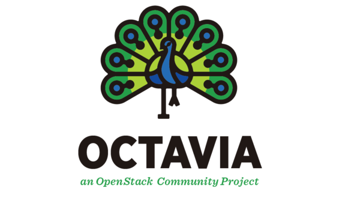
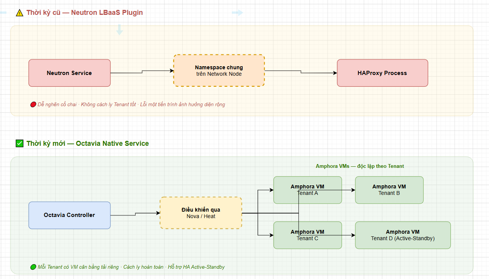
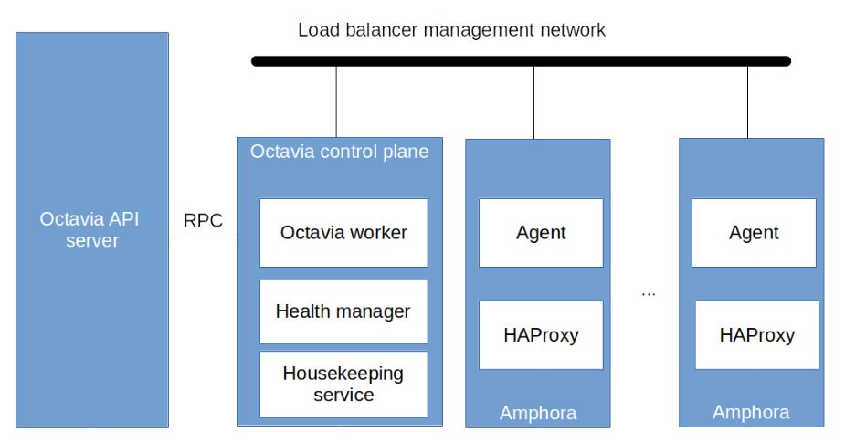
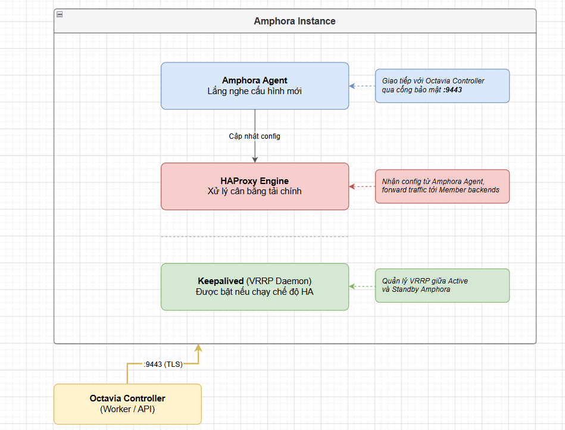
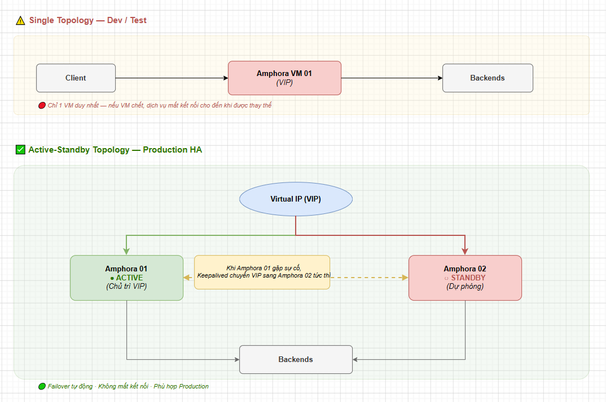

# TỔNG QUAN & KIẾN TRÚC OPENSTACK OCTAVIA

> **Phiên bản tham chiếu**: OpenStack **2026.1 Gazpacho** + Octavia **14.x**

## I. OCTAVIA LÀ GÌ, VÌ SAO CẦN DÙNG THAY VÌ HAPROXY THUẦN?

**OpenStack Octavia** là dịch vụ cân bằng tải chuyên dụng mã nguồn mở cấp doanh nghiệp (Enterprise-grade Load Balancing-as-a-Service - LBaaS), đóng vai trò phân phối lưu lượng truy cập mạng đến một nhóm các máy chủ backend (Compute instances) nhằm đảm bảo hiệu năng, tính mở rộng và khả năng phục hồi lỗi cao cho ứng dụng.

### 1. Tại sao nên sử dụng Octavia thay vì HAProxy thuần?

Mặc dù HAProxy là một phần mềm cân bằng tải rất mạnh mẽ, nhưng việc tự dựng và quản trị thủ công cụm HAProxy trong môi trường điện toán đám mây quy mô lớn bộc lộ nhiều hạn chế so với dịch vụ đám mây Octavia:

- **Tính tự phục vụ (Self-service Cloud Integration)**:

  - *HAProxy thuần*: Người quản trị hệ thống hoặc DevOps phải tự tạo máy ảo, cài đặt phần mềm, viết file cấu hình thủ công và đăng ký IP.
  - *Octavia*: Cung cấp giao tiếp chuẩn hóa qua REST API. Người dùng có thể yêu cầu tạo Load Balancer ngay lập tức qua câu lệnh CLI hoặc giao diện web Horizon, thích hợp với các tiến trình tự động hóa như Kubernetes ingress controller.

- **Tự động hóa vòng đời (Auto-provisioning & Lifecycle Management)**:

  - Octavia quản lý toàn bộ vòng đời của các thực thể cân bằng tải. Nó tự động gọi Nova để sinh máy ảo, tự gọi Neutron cấu hình port/router, tự cài đặt phần mềm cân bằng tải, và tự động nâng cấp/cấu hình lại khi người dùng thay đổi danh sách máy chủ backend.

- **Tự động khắc phục sự cố (Auto-healing)**:

  - Nếu một máy ảo cân bằng tải HAProxy thuần bị hỏng phần cứng host bên dưới, hệ thống sẽ bị gián đoạn cho đến khi con người vào can thiệp.
  - Octavia liên tục giám sát trạng thái của các node cân bằng tải. Nếu phát hiện node hỏng, hệ thống tự động khởi tạo node mới, đồng bộ cấu hình và chuyển hướng lưu lượng mà không cần admin can thiệp.

- **Khả năng mở rộng không giới hạn (Scalability)**:

  - Octavia hỗ trợ điều phối tải cho hàng nghìn tenant (dự án) khác nhau trên đám mây bằng cách tách biệt hoàn toàn tài nguyên của từng tenant trên các máy ảo cân bằng tải độc lập, tránh hiện tượng tranh chấp tài nguyên (Noisy neighbor).

## II. SO SÁNH OCTAVIA VS NEUTRON LBAAS (V1/V2)

Trước khi Octavia trở thành dịch vụ Load Balancer chính thức và duy nhất của OpenStack, tính năng cân bằng tải được tích hợp trực tiếp bên trong Neutron thông qua các plugin (Neutron LBaaS).

Dưới đây là bảng đối chiếu chi tiết để thấy rõ sự tiến hóa công nghệ:

| Tiêu chí | Neutron LBaaS v1 | Neutron LBaaS v2 | OpenStack Octavia (Khuyên dùng) |
| :--- | :--- | :--- | :--- |
| **Kiến trúc phân phối** | Chạy trong Linux Network Namespace dùng chung trên Network Node. | Chạy trên agent của Network Node (vẫn phụ thuộc hạ tầng Neutron). | **Độc lập hoàn toàn**: Sử dụng các máy ảo chuyên dụng (Amphora) độc lập cho từng cụm. |
| **Độ sẵn sàng (HA)** | Hạn chế. Nếu Network Node chết, toàn bộ LB của các Tenant sẽ chết theo. | Có cải tiến nhưng kiến trúc Active-Active/Active-Passive ở lớp dưới rất phức tạp. | **Hỗ trợ HA tự nhiên**: Cấu hình Active-Standby sử dụng Keepalived và VRRP tự động giữa các VM. |
| **Hiệu năng & Cách ly** | Kém. Các tiến trình HAProxy của nhiều Tenant cùng chia sẻ CPU/RAM của Network Node. | Khá hơn nhưng vẫn chịu rủi ro quá tải lẫn nhau ở lớp Network Node. | **Tối ưu**: Mỗi Load Balancer chạy trên một máy ảo/container riêng biệt biệt lập tài nguyên. |
| **Trạng thái dự án** | Đã bị khai tử (Deprecated từ bản Liberty). | Đã bị khai tử (Deprecated từ bản Queens). | **Dự án chính thức**: Được phát triển liên tục, hỗ trợ đầy đủ giao thức TLS 1.3, HTTP/2, và OVN. |

## III. CÁC THÀNH PHẦN CHÍNH TRONG KIẾN TRÚC OCTAVIA

Kiến trúc bên trong của Octavia được chia nhỏ thành các dịch vụ stateless (không lưu trạng thái) nhằm tối ưu hóa khả năng chịu lỗi và dễ dàng scale-out trên nhiều node Controller.

- **Octavia API**: Cổng tiếp nhận các yêu cầu cấu hình REST API của người dùng (tạo Load Balancer, Listener, Pool, Member, Health Monitor). Nó thực hiện kiểm tra tính hợp lệ của tham số, xác thực quyền truy cập qua Keystone và ghi nhận thông tin vào database.

- **Octavia Controller Worker**: Trí tuệ điều phối chính của Octavia. Nó lắng nghe các tác vụ từ hàng đợi RabbitMQ, sau đó gọi Nova để tạo VM cân bằng tải, gọi Neutron để kết nối mạng, và giao tiếp với Agent bên trong VM cân bằng tải để cấu hình HAProxy.

- **Octavia Health Manager**: Thành phần giám sát sức khỏe của các thực thể cân bằng tải (Amphorae). Nó liên tục nhận các gói tin heartbeat gửi về từ các Amphora Node. Nếu quá thời gian cấu hình không nhận được heartbeat, Health Manager sẽ phát tín hiệu yêu cầu Controller Worker tiến hành thay thế (failover) máy ảo lỗi bằng máy ảo mới.

- **Octavia Housekeeping Manager**: Đảm nhận các công việc dọn dẹp hệ thống theo định kỳ, bao gồm:

  - Thu hồi các máy ảo Amphora bị lỗi hoặc bị xóa.
  - Quản lý và luân chuyển (rotate) các chứng chỉ mã hóa TLS dùng để bảo mật kênh truyền điều khiển giữa Controller và Amphora Agent.
  - Đảm bảo số lượng máy ảo Amphora dự phòng luôn sẵn sàng (Spare pool) để giảm thiểu thời gian chờ đợi khi người dùng tạo Load Balancer mới.

- **Amphora**: Thực thể trực tiếp thực hiện nhiệm vụ cân bằng tải, tiếp nhận và phân phối lưu lượng truy cập thực tế của người dùng.

## IV. MÔ HÌNH AMPHORA (VM/CONTAINER CHẠY HAPROXY BÊN TRONG)

Khái niệm cốt lõi tạo nên sự khác biệt của Octavia là **Amphora** (số nhiều là *Amphorae*). Một Amphora là một thực thể ảo (ảo hóa qua máy ảo Nova hoặc container) được Octavia tự động sinh ra từ một image hệ điều hành đặc thù (thường dùng Diskimage-builder để đóng gói Ubuntu/CentOS).

### Các thành phần bên trong một Amphora Node

- **Amphora Agent**: Một dịch vụ siêu nhẹ viết bằng Python chạy bên trong máy ảo, lắng nghe trên cổng bảo mật `9443`. Agent này chỉ chấp nhận các yêu cầu REST API được mã hóa hai chiều bằng chứng chỉ TLS từ Octavia Controller để tiến hành thay đổi cấu hình hệ thống.

- **HAProxy**: Phần mềm cân bằng tải xử lý chính. Khi người dùng tạo một Listener, Amphora Agent sẽ sinh ra file cấu hình HAProxy tương ứng và reload dịch vụ.

- **Keepalived**: Daemon xử lý giao thức VRRP (Virtual Router Redundancy Protocol). Keepalived chịu trách nhiệm duy trì địa chỉ VIP (Virtual IP) dùng chung giữa hai máy ảo Amphora khi chạy ở chế độ dự phòng lỗi.

## V. ACTIVE-STANDBY VS SINGLE TOPOLOGY

Khi khởi tạo Load Balancer trong Octavia, người dùng có thể lựa chọn hai kiểu mô hình cấu trúc hệ thống (Topology) tùy theo yêu cầu về độ sẵn sàng và ngân sách tài nguyên:

### 1. Mô hình Single Topology

- **Cấu hình**: Octavia chỉ khởi tạo duy nhất **một** máy ảo Amphora để gánh toàn bộ lưu lượng tải.

- **Ưu điểm**: Tiết kiệm tài nguyên CPU, RAM và IP trong đám mây (chỉ tốn 1 VM).

- **Nhược điểm**: Không có tính dự phòng lỗi tức thời. Nếu máy ảo Amphora bị lỗi hoặc host vật lý gặp sự cố sập nguồn, dịch vụ Load Balancer sẽ ngừng hoạt động tạm thời cho đến khi hệ thống phát hiện lỗi và khởi tạo xong máy ảo mới thay thế (thường mất 2-3 phút).

### 2. Mô hình Active-Standby Topology (HA Khuyên dùng)

- **Cấu hình**: Octavia khởi tạo **hai** máy ảo Amphora hoạt động song hành cho một Load Balancer.

- **Cơ chế hoạt động**:

  - Giao thức **VRRP** chạy ngầm qua daemon `keepalived` liên tục gửi các gói tin kiểm tra trạng thái lẫn nhau (VRRP Heartbeat).
  - Một máy ảo giữ vai trò **Active** trực tiếp gánh địa chỉ Virtual IP (VIP) và điều phối lưu lượng. Máy ảo còn lại ở trạng thái **Standby** (chờ đợi dự phòng).
  - Nếu máy Active bị chết đột ngột, máy Standby sẽ phát hiện việc mất gói tin VRRP heartbeat chỉ sau vài giây và lập tức tự động gán địa chỉ IP VIP lên card mạng của mình để tiếp quản toàn bộ lưu lượng truy cập mà khách hàng bên ngoài không hề nhận biết được sự gián đoạn.
