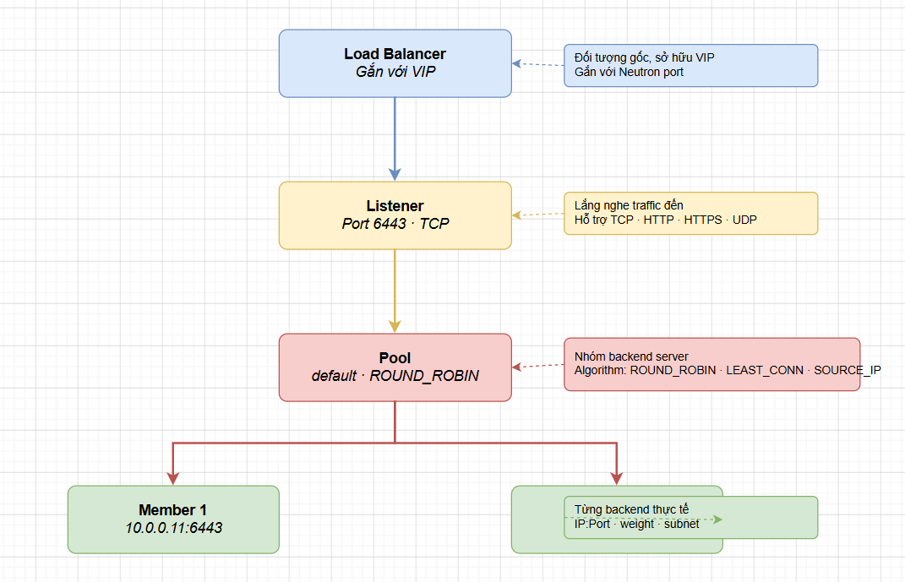
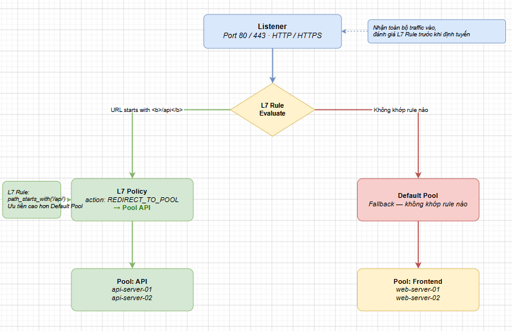

# CÁC KHÁI NIỆM CỐT LÕI CỦA OCTAVIA

> **Phiên bản tham chiếu**: OpenStack **2026.1 Gazpacho** + Octavia **14.x**

## I. LOAD BALANCER — ĐỐI TƯỢNG GỐC, GẮN VỚI VIP

Trong mô hình tài nguyên của Octavia, **Load Balancer** là đối tượng gốc cao nhất (Parent Object) đại diện cho toàn bộ hệ thống cân bằng tải vật lý hoặc ảo hóa chạy trên nền tảng đám mây.



### 1. Bản chất và nhiệm vụ

- Khi ta tạo một Load Balancer, Octavia sẽ kích hoạt các máy ảo Amphora và yêu cầu Neutron cấp phát một địa chỉ IP ảo duy nhất gọi là **Virtual IP (VIP)**.
- VIP là cổng tiếp nhận lưu lượng duy nhất công bố ra ngoài để người dùng hoặc các dịch vụ khác (như Kubernetes nodes) kết nối tới.
- Tất cả các đối tượng cấu hình cân bằng tải cấp dưới (Listeners, Pools, Members) đều phải phụ thuộc và thuộc quyền quản lý trực tiếp của thực thể Load Balancer gốc này.

## II. LISTENER — LẮNG NGHE PORT/PROTOCOL

**Listener** là thực thể logic nằm ngay dưới Load Balancer, chịu trách nhiệm định nghĩa cổng mạng (Port) và giao thức (Protocol) mà hệ thống cân bằng tải sẽ lắng nghe để tiếp nhận lưu lượng truy cập đi vào.

Một Load Balancer có thể sở hữu nhiều Listener chạy song song trên các cổng khác nhau (ví dụ: một Listener cổng 80 cho HTTP, và một Listener cổng 443 cho HTTPS).

### Các giao thức được hỗ trợ đầy đủ trên bản mới nhất

- **HTTP**: Lắng nghe lưu lượng web không mã hóa cổng `80`. Cho phép Load Balancer can thiệp đọc/ghi các trường HTTP Headers (như chèn header `X-Forwarded-For` để truyền IP thực của client về backend).

- **HTTPS**: Chuyển tiếp nguyên bản gói tin HTTPS đã mã hóa (Layer-4 TCP Passthrough) đến backend xử lý trực tiếp.

- **TERMINATED_HTTPS**: **Tính năng giải mã SSL chuyên dụng (SSL Termination)**.

  - Load Balancer sẽ trực tiếp tải chứng chỉ bảo mật (TLS/SSL Certificate) từ dịch vụ Barbican và thực hiện giải mã gói tin ngay tại tầng Amphora.
  - Lưu lượng từ Amphora chuyển tiếp về các backend server phía sau sẽ là HTTP không mã hóa để giảm tải CPU xử lý mã hóa cho máy chủ ứng dụng.

- **TCP**: Chuyển tiếp dòng dữ liệu thô cổng Layer-4, thích hợp cho các dịch vụ phi web như database (MySQL, PostgreSQL) hoặc Kubernetes API Server (cổng `6443`).

- **UDP**: Hỗ trợ cân bằng tải các dịch vụ hướng không kết nối như DNS (cổng `53`), Syslog, hoặc các ứng dụng streaming, game online.

## III. POOL & MEMBER — NHÓM BACKEND SERVER VÀ CÁC NODE THỰC TẾ

Khi lưu lượng truy cập đi qua Listener, hệ thống cần biết phải điều phối dòng dữ liệu này tới đâu. Đây là nhiệm vụ của **Pool** và **Member**.

### 1. Pool (Nhóm Máy Chủ Backend)

- Pool là một tập hợp logic nhóm các máy chủ backend có cùng chức năng phục vụ ứng dụng.

- Mỗi Listener thường được liên kết với một Pool mặc định (Default Pool) hoặc chuyển tiếp tới các Pool khác nhau dựa trên các quy tắc định tuyến nâng cao L7.

- **Thuật toán điều phối tải trong Pool**:

  - *ROUND_ROBIN*: Phân phối luân phiên đều đặn lần lượt cho từng máy chủ.
  - *LEAST_CONNECTIONS*: Ưu tiên chuyển kết nối mới tới server đang có ít phiên kết nối hoạt động nhất.
  - *SOURCE_IP*: Băm (hash) địa chỉ IP của Client để đảm bảo một người dùng luôn luôn kết nối đến duy nhất một server backend cố định trong suốt phiên làm việc (Session Persistence).

### 2. Member (Thành Viên Thực Sự)

- Member là một đối tượng vật lý đại diện cho một node máy chủ thực tế (thường là địa chỉ IP nội bộ của máy ảo Nova hoặc Bare Metal Ironic) gia nhập vào Pool.

- Mỗi Member được định danh bởi cặp giá trị **IP Address** và **Port** nhận tin. Một máy ảo Nova có thể tham gia vào nhiều Pool khác nhau với các cổng dịch vụ khác nhau.

## IV. HEALTH MONITOR — CƠ CHẾ KIỂM TRA SỨC KHỎE

Để đảm bảo Load Balancer không chuyển tiếp lưu lượng của người dùng vào một máy chủ đang bị crash hoặc lỗi hệ điều hành, Octavia cung cấp cơ chế giám sát sức khỏe tự động gọi là **Health Monitor**.

Health Monitor được liên kết trực tiếp với một Pool. Máy ảo Amphora sẽ định kỳ gửi các gói tin thăm dò đến từng Member trong Pool. Nếu một Member không phản hồi đạt chuẩn trong số lần quy định, trạng thái của nó sẽ chuyển sang `OFFLINE` và Amphora sẽ ngừng phân phối lưu lượng đến Member này cho đến khi nó khỏe mạnh trở lại.

### Các giao thức Health Check được hỗ trợ

- **PING**: Gửi gói tin ICMP echo thô để kiểm tra xem máy ảo backend có phản hồi mạng hay không (Cơ bản nhất nhưng không phát hiện được ứng dụng web bị treo).

- **TCP**: Thực hiện bắt tay 3 bước (Three-way handshake) vào cổng dịch vụ của backend. Nếu kết nối TCP thiết lập thành công, member được coi là sống.

- **HTTP / HTTPS**: Gửi một gói tin HTTP Request thực tế (ví dụ: `GET /healthz`) tới backend và mong đợi nhận lại mã phản hồi HTTP trạng thái đạt chuẩn (ví dụ: `200 OK`). Đây là phương thức kiểm tra chính xác nhất sức sống của ứng dụng web.

- **TLS-HELLO**: Thực hiện gửi gói tin bắt tay bắt đầu mã hóa TLS để kiểm tra tính sẵn sàng của các cổng bảo mật.

## V. L7 POLICY & L7 RULE — ĐỊNH TUYẾN NÂNG CAO THEO URL/HEADER/COOKIE

**L7 (Layer 7) Switching** là một tính năng cực kỳ mạnh mẽ của Octavia, cho phép hệ thống phân tích sâu nội dung bên trong gói tin ứng dụng (Application Layer) để đưa ra quyết định định tuyến thông minh, thay vì chỉ chuyển tiếp thô ở tầng mạng.



### 1. L7 Rule (Quy tắc lọc)

Định nghĩa điều kiện cần thỏa mãn dựa trên thông tin gói tin HTTP. Các loại Rule hỗ trợ:

- **PATH**: Kiểm tra đường dẫn URL của request (ví dụ: đường dẫn bắt đầu bằng `/api` hoặc kết thúc bằng `.jpg`).
- **HEADER**: Kiểm tra sự tồn tại hoặc giá trị của một trường HTTP Header cụ thể.
- **COOKIE**: Kiểm tra thông tin cookie định danh người dùng.
- **HOST_NAME**: Kiểm tra tên miền được gọi tới (ví dụ: `api.example.com` vs `www.example.com`).

### 2. L7 Policy (Hành động thực thi)

Khi một hoặc nhiều L7 Rule được đánh giá là đúng (thỏa mãn điều kiện), L7 Policy sẽ kích hoạt hành động tương ứng:

- **REDIRECT_TO_POOL**: Chuyển hướng lưu lượng truy cập sang một Pool backend chuyên biệt khác (ví dụ: chuyển các request `/api` sang cụm server xử lý API riêng).

- **REDIRECT_TO_URL**: Gửi mã HTTP redirect bắt trình duyệt của client chuyển hướng sang một địa chỉ URL hoàn toàn khác.

- **REJECT**: Chặn đứng kết nối và trả về mã lỗi bảo mật (ví dụ: từ chối các kết nối cố tình truy cập vào thư mục quản trị `/admin`).

## VI. FLAVOR / FLAVOR PROFILE — CHỌN LOẠI AMPHORA THEO NHU CẦU

Trong môi trường điện toán đám mây doanh nghiệp đa dạng, các dự án (Tenants) khác nhau có nhu cầu sử dụng Load Balancer với tải trọng khác nhau. Một số cụm ứng dụng nhỏ chỉ cần tính năng định tuyến cơ bản, trong khi các hệ thống lõi xử lý hàng triệu giao dịch mã hóa HTTPS yêu cầu năng lực tính toán cực lớn.

Octavia giải quyết bài toán này thông qua cơ chế **Flavor** và **Flavor Profile**:

- **Flavor Profile**: Là đối tượng cấu hình do người quản trị đám mây (Cloud Admin) định nghĩa trong hệ thống. Nó quy định cụ thể các tham số hạ tầng sẽ được sử dụng để build máy ảo Amphora, bao gồm:

  - Máy ảo Nova Flavor nào sẽ chạy Amphora (ví dụ: chọn máy ảo nhiều CPU để xử lý SSL Termination nhanh hơn).
  - Sử dụng mạng ảo nào làm mạng quản trị.
  - Sử dụng Driver cân bằng tải nào (ví dụ: mặc định là driver Amphora HAProxy hoặc driver tích hợp phần cứng của bên thứ ba như F5 BIG-IP).

- **Flavor**: Là nhãn dịch vụ được công bố rộng rãi cho người dùng lựa chọn khi khởi tạo Load Balancer (tương tự như cách chọn cấu hình RAM/CPU cho máy ảo Nova).

```bash
# Lệnh liệt kê các Flavor Load Balancer có sẵn trên hệ thống:
openstack loadbalancer flavor list
```

Người dùng chỉ cần chỉ định tham số `--flavor <TÊN_FLAVOR>` khi tạo Load Balancer, Octavia sẽ tự động chọn đúng khuôn mẫu máy ảo Amphora tương ứng để khởi chạy hệ thống, đảm bảo đáp ứng chuẩn xác cam kết chất lượng dịch vụ (SLA).
