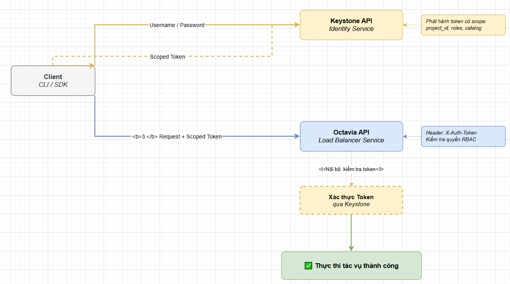

# OCTAVIA API VÀ GIAO TIẾP HỆ THỐNG

> **Phiên bản tham chiếu**: OpenStack **2026.1 Gazpacho** + Octavia **14.x**

## I. REST API ENDPOINTS CỦA OCTAVIA

Octavia cung cấp một hệ thống REST API v2 hoàn chỉnh, được phân tách rõ ràng để quản trị toàn bộ cấu trúc và tài nguyên của dịch vụ cân bằng tải. API của Octavia thường lắng nghe mặc định trên cổng `9876` hoặc thông qua HAProxy Proxy Endpoint trên Controller Node.

### Các Endpoints cơ bản thường gặp:

- **`/v2/lbaas/loadbalancers`**:
  - `GET`: Liệt kê tất cả các Load Balancer thuộc dự án.
  - `POST`: Khởi tạo một Load Balancer mới (cấp phát VIP).
- **`/v2/lbaas/listeners`**:
  - `POST`: Khởi tạo Listener lắng nghe trên một Port chỉ định gắn với Load Balancer.
- **`/v2/lbaas/pools`**:
  - `POST`: Tạo Pool chứa các máy chủ backend cùng thuật toán điều phối tải.
- **`/v2/lbaas/pools/{pool_id}/members`**:
  - `POST`: Đăng ký thêm Member (địa chỉ IP/cổng dịch vụ của VM) vào Pool.
- **`/v2/lbaas/pools/{pool_id}/healthmonitors`**:
  - `POST`: Tạo lập cơ chế kiểm tra sức khỏe tự động cho các Member trong Pool.
- **`/v2/lbaas/l7policies`** & **`/v2/lbaas/l7policies/{l7policy_id}/rules`**:
  - Thiết lập và quản lý các chính sách chuyển mạch mềm Layer-7.

## II. PHÂN BIỆT OCTAVIA API VS NEUTRON LBAAS API

Mặc dù có cùng mục tiêu cung cấp Load Balancer, nhưng Octavia API và Neutron LBaaS API (đã bị khai tử) có kiến trúc lưu trữ và cách xử lý khác nhau hoàn toàn:

### 1. Về mặt API Gateway

- **Neutron LBaaS API**: Nằm chung trong lõi xử lý API của Neutron. Mọi lệnh gọi tạo Load Balancer đều đi qua cổng `9696` của Neutron và do Neutron DB ghi nhận trực tiếp.
- **Octavia API**: Hoạt động như một dịch vụ Cloud độc lập hoàn toàn với endpoint riêng biệt (cổng `9876`). Nó sở hữu một cơ sở dữ liệu (Database) riêng để lưu trữ metadata của Load Balancer, giải phóng gánh nặng xử lý và giảm nguy cơ sập chéo dịch vụ của Neutron.

### 2. Về mặt mô hình tài nguyên (Resource Model)

- **Neutron LBaaS (v1)**: Sử dụng mô hình tuyến tính cũ, kết nối trực tiếp `VIP` vào `Pool`. (Không có khái niệm `Listener`, khiến một Load Balancer không thể chạy đồng thời cả cổng 80 và 443 trên cùng một địa chỉ IP ảo).
- **Octavia API (v2)**: Áp dụng mô hình hướng đối tượng hiện đại chuẩn hóa công nghiệp đám mây:
  
  `LoadBalancer` ( VIP ) ──► `Listener` ( Cổng mạng ) ──► `Pool` ( Backend ) ──► `Members` ( VMs )

## III. XÁC THỰC KEYSTONE VÀ SCOPE TOKEN

Mọi giao tiếp gửi đến Octavia API đều bắt buộc phải đi qua lớp xác thực tập trung **OpenStack Keystone**.



### Quy tắc Token và Phân quyền (RBAC)

- **Scoped Token**: Token gửi đến Octavia phải được "scope" (định danh giới hạn) vào một Project (Tenant) cụ thể. Octavia API sẽ phân tích token để đảm bảo người dùng chỉ được quyền nhìn thấy và thao tác trên các Load Balancer thuộc sở hữu của dự án đó.

- **Service Tokens**: Khi Octavia Conductor tự động gọi đến API của Nova (để tạo VM Amphora) hoặc API của Neutron (để cấu hình Port mạng), nó sử dụng tài khoản hệ thống chuyên dụng `octavia` với quyền hạn `admin` được Keystone cấp phát riêng.

- **Quy tắc chính sách (Policies)**: Các hành động tạo/xem/xóa của user được kiểm soát chặt chẽ bởi file cấu hình policy của Octavia (`/etc/octavia/policy.yaml` trên bản 2026.1). Mặc định hệ thống tuân theo mô hình phân quyền hệ thống chuẩn: `system-admin`, `project-member`, và `project-reader`.

## IV. STATEFUL VS ASYNC OPERATIONS — CÁC TRẠNG THÁI

Một trong những điểm quan trọng nhất khi lập trình hoặc quản trị Octavia là hiểu được cơ chế hoạt động **bất đồng bộ (Asynchronous)** của API. Khi ta gửi một request tạo mới hoặc cập nhật tài nguyên, API Server sẽ phản hồi mã HTTP `202 Accepted` ngay lập tức để giải phóng client, trong khi tiến trình khởi tạo máy ảo thực tế vẫn đang chạy ngầm ở phía sau.

Để kiểm soát quá trình này, Octavia sử dụng hai hệ thống trạng thái song song:

### 1. Provisioning Status (Trạng thái triển khai hạ tầng)

Cho biết tiến trình khởi tạo hoặc cập nhật máy ảo Amphora vật lý đang ở bước nào:

- **`PENDING_CREATE`**: Request đã được API tiếp nhận thành công và ghi vào DB. Octavia Controller Worker đang gọi Nova và Neutron để build máy ảo Amphora. Ở trạng thái này, tài nguyên bị **khóa tạm thời**, mọi yêu cầu chỉnh sửa tiếp theo gửi lên sẽ bị từ chối với lỗi `409 Conflict`.

- **`ACTIVE`**: Máy ảo Amphora đã chạy, đồng bộ cấu hình hoàn tất và Load Balancer đang hoạt động bình thường. Tài nguyên được mở khóa để tiếp tục cấu hình.

- **`PENDING_UPDATE`**: Người dùng vừa gửi yêu cầu chỉnh sửa (ví dụ: thêm Member mới vào Pool). Hệ thống đang nạp lại cấu hình vào HAProxy.

- **`PENDING_DELETE`**: Hệ thống đang thực hiện xóa bỏ tài nguyên, thu hồi IP và hủy máy ảo Nova.

- **`ERROR`**: Quá trình khởi tạo vật lý gặp sự cố nghiêm trọng (ví dụ: Nova hết tài nguyên RAM không tạo được VM Amphora, hoặc Octavia không thể SSH kết nối vào Agent cổng 9443).

### 2. Operating Status (Trạng thái hoạt động của ứng dụng)

Cho biết tình trạng sức khỏe thực tế của luồng dữ liệu dựa trên kết quả Health Check:

- **`ONLINE`**: Listener hoặc Pool đang chạy bình thường, có ít nhất một Member backend phản hồi tốt.
- **`OFFLINE`**: Toàn bộ các Member backend trong Pool đều chết hoặc Listener bị vô hiệu hóa cấu hình.
- **`DEGRADED`**: Cụm Load Balancer có nhiều Member nhưng có ít nhất một Member bị hỏng (hệ thống vẫn phục vụ được lưu lượng nhưng hiệu năng giảm sút).

## V. SỬ DỤNG OPENSTACK CLI: OPENSTACK LOADBALANCER *

OpenStack CLI cung cấp bộ công cụ trực quan để quản trị nhanh Octavia. Mọi câu lệnh đều bắt đầu bằng tiền tố `openstack loadbalancer`.

### Quy trình khởi tạo một cụm cân bằng tải Web nhanh bằng CLI

```bash
source /etc/kolla/admin-openrc

# 1. Khởi tạo Load Balancer (gắn vào Private Subnet có sẵn):
openstack loadbalancer create --name web-lb --vip-subnet-id private-subnet

# Chờ trạng thái chuyển sang ACTIVE (Sử dụng lệnh show để kiểm tra)
openstack loadbalancer show web-lb -c provisioning_status

# 2. Tạo Listener lắng nghe cổng HTTP 80:
openstack loadbalancer listener create --name web-listener \
  --protocol HTTP --protocol-port 80 web-lb

# 3. Tạo Pool điều phối thuật toán ROUND_ROBIN:
openstack loadbalancer pool create --name web-pool \
  --protocol HTTP --lb-algorithm ROUND_ROBIN --listener web-listener

# 4. Đăng ký hai máy ảo ứng dụng (Backend Members) vào Pool:
openstack loadbalancer member create --subnet-id private-subnet \
  --address 192.168.100.15 --protocol-port 8080 web-pool

openstack loadbalancer member create --subnet-id private-subnet \
  --address 192.168.100.16 --protocol-port 8080 web-pool

# 5. Tạo cơ chế kiểm tra sức khỏe HTTP tự động:
openstack loadbalancer healthmonitor create --name web-hm \
  --delay 5 --timeout 3 --max-retries 3 --type HTTP web-pool
```

## VI. SỬ DỤNG PYTHON SDK (OPENSTACK.LOAD_BALANCER.*)

Đối với các kỹ sư phát triển phần mềm hoặc viết công cụ tự động hóa hệ thống (Automation scripting), Python OpenStack SDK cung cấp thư viện lập trình trực tiếp cực kỳ mạnh mẽ để tương tác với Octavia API.

### Kịch bản Python mẫu tạo và truy vấn trạng thái Load Balancer

```python
import time
from openstack import connection

# 1. Khởi tạo kết nối tới OpenStack Cloud qua file clouds.yaml
conn = connection.from_config(cloud='openstack')

def create_and_wait_lb(lb_name, subnet_id):
    print(f"Đang gửi yêu cầu khởi tạo Load Balancer: {lb_name}...")
    
    # 2. Tạo Load Balancer qua SDK
    lb = conn.load_balancer.create_load_balancer(
        name=lb_name,
        vip_subnet_id=subnet_id
    )
    
    # 3. Vòng lặp chờ trạng thái PENDING_CREATE chuyển sang ACTIVE (Async check)
    lb_id = lb.id
    while True:
        lb_current = conn.load_balancer.get_load_balancer(lb_id)
        status = lb_current.provisioning_status
        print(f"Trạng thái hiện tại: {status}")
        
        if status == 'ACTIVE':
            print("Chúc mừng! Load Balancer đã khởi tạo thành công và sẵn sàng.")
            return lb_current
        elif status == 'ERROR':
            raise Exception("Lỗi nghiêm trọng! Không thể khởi dựng Load Balancer vật lý.")
            
        time.sleep(10)  # Chờ 10 giây trước khi truy vấn lại

# Chạy thử nghiệm hàm
if __name__ == "__main__":
    # Thay thế ID bằng subnet thực tế trong hệ thống của bạn
    MY_SUBNET_ID = "6c8e9d01-abcd-1234-5678-abcdef098765"
    try:
        my_lb = create_and_wait_lb("sdk-production-lb", MY_SUBNET_ID)
        print(f"Địa chỉ IP ảo (VIP) của cụm: {my_lb.vip_address}")
    except Exception as e:
        print(f"Thất bại: {e}")
```
