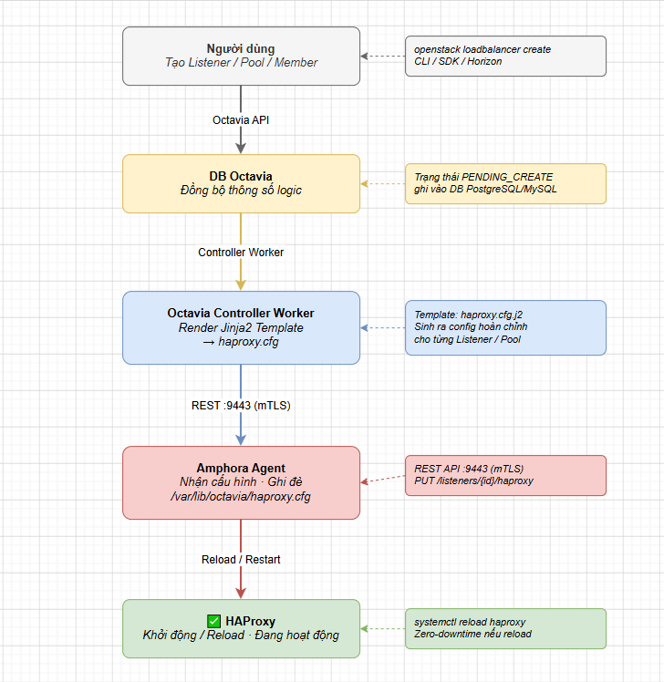
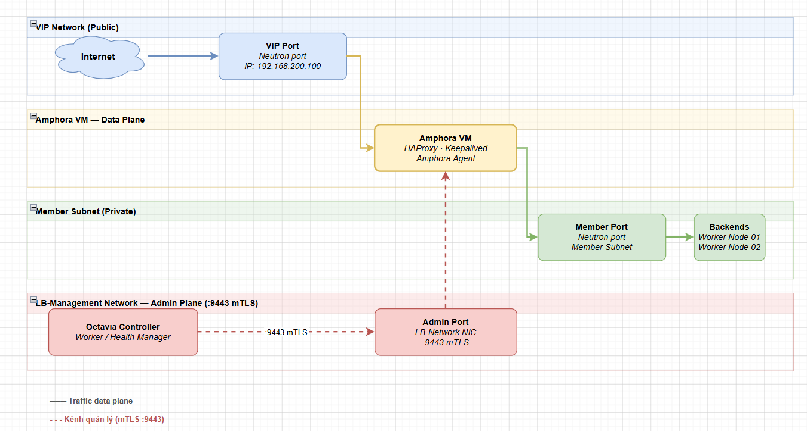
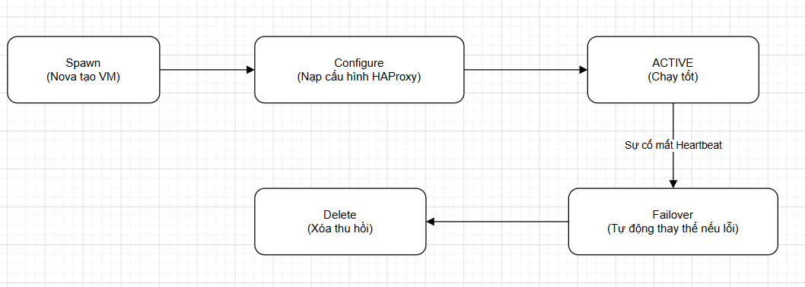

# TÌM HIỂU VỀ AMPHORA

> **Phiên bản tham chiếu**: OpenStack **2026.1 Gazpacho** + Octavia **14.x**

## I. AMPHORA IMAGE BUILD (DISKIMAGE-BUILDER VÀ OCTAVIA-DISKIMAGE-CREATE.SH)

Một máy ảo Amphora bản chất là một hệ điều hành Linux siêu nhẹ (Ubuntu, Rocky Linux hoặc CentOS) đã được tối ưu hóa bảo mật và tích hợp sẵn các gói phần mềm cần thiết như HAProxy, Keepalived, cùng dịch vụ Agent điều khiển (`octavia-amphora-agent`).

Để có được file image định dạng qcow2 này, người quản trị OpenStack cần tiến hành build thủ công bằng các công cụ đóng gói chuyên dụng.

### 1. Công cụ Diskimage-builder (DIB)

DIB là công cụ dòng lệnh tiêu chuẩn của OpenStack dùng để tự động dựng các OS Cloud Image dựa trên các cấu phần khai báo (elements).

### 2. Script tạo image chuyên dụng: `octavia-diskimage-create.sh`

Octavia cung cấp sẵn một đoạn mã script tiện ích chạy bao bọc (wrapper) ngoài DIB để đơn giản hóa quá trình tải, thiết lập và build image Amphora.

Quy trình build image mẫu trên máy chủ quản trị (Controller Node):

```bash
# 1. Cài đặt các công cụ build và thư viện phụ thuộc:
sudo apt-get install -y git python3-pip qemu-utils debootstrap
sudo pip install diskimage-builder

# 2. Tải mã nguồn Octavia chứa thư viện scripts:
git clone https://opendev.org/openstack/octavia.git
cd octavia/diskimage-create

# 3. Thực thi script build image (ví dụ build image trên nền Ubuntu):
./octavia-diskimage-create.sh -i ubuntu-minimal -d jammy -o amphora-x86_64-ubuntu.qcow2

# 4. Upload image thành phẩm lên Glance và gán thẻ Metadata:
openstack image create \
  --name "amphora-x86_64-ubuntu" \
  --disk-format qcow2 \
  --container-format bare \
  --file amphora-x86_64-ubuntu.qcow2 \
  --tag octavia-amphora \
  --private
```

> [!WARNING]
> Khi tải image lên Glance cho Octavia, ta **bắt buộc phải gắn thẻ Tag `--tag octavia-amphora`**. Octavia API sẽ dựa vào nhãn tag này để quét tìm và khởi chạy đúng image khi người dùng yêu cầu tạo Load Balancer.

## II. HAPROXY CONFIG ĐƯỢC SINH RA NHƯ THẾ NÀO BÊN TRONG AMPHORA

Trái tim cân bằng tải vật lý bên trong Amphora là phần mềm **HAProxy**. Khi người dùng tương tác với Octavia API để định nghĩa cấu trúc Listener và Pool, Octavia không gửi file cấu hình thô trực tiếp mà thực hiện chuyển đổi logic tài nguyên thành file cấu hình chuẩn.



### Quy trình sinh cấu hình chi tiết

1. **Render Jinja2 Template**: Lõi `octavia-controller-worker` sử dụng các tệp template Jinja2 định nghĩa sẵn trong mã nguồn để map toàn bộ cấu hình từ database (như Port, thuật toán, địa chỉ IP của Member) thành nội dung tệp tin cấu hình HAProxy tiêu chuẩn.

2. **Truyền tải cấu hình**: Controller Worker gọi REST API gửi gói tin dữ liệu cấu hình đã render này tới Amphora Agent.

3. **Ghi đè và Reload**:

   - Amphora Agent ghi đè tệp tin `/var/lib/octavia/haproxy.cfg` (hoặc `/etc/haproxy/haproxy.cfg` tuỳ phiên bản).
   - Agent kiểm tra tính hợp lệ cú pháp của tệp tin vừa ghi. Nếu hợp lệ, nó ra lệnh reload dịch vụ HAProxy bằng cơ chế **Graceful Reload** (như `systemctl reload haproxy` hoặc `haproxy -f ... -sf ...`) để nạp cấu hình mới mà không làm đứt gãy hay gián đoạn các phiên kết nối đang hoạt động hiện tại của người dùng.

## III. AMPHORA REST API NỘI BỘ VÀ GIAO TIẾP VỚI CONTROLLER WORKER

Giao tiếp điều khiển giữa bộ não trung tâm (`octavia-controller-worker`) và các thực thể máy ảo Amphora được thực hiện qua một mạng quản trị an toàn sử dụng cổng mạng **REST API nội bộ**.

### 1. Cổng giao tiếp bảo mật 9443

Dịch vụ `octavia-amphora-agent` chạy ngầm bên trong máy ảo Amphora lắng nghe duy nhất trên cổng **`9443`**.

Để bảo vệ cổng này khỏi các nguy cơ tấn công chiếm quyền điều khiển đĩa ảo hoặc can thiệp luồng mạng, Octavia áp dụng cơ chế xác thực **Mutual TLS (mTLS)** hai chiều cực kỳ nghiêm ngặt:

- Controller Node phải trình diện chứng chỉ Client được ký bởi CA nội bộ (Certificate Authority) của Octavia thì Amphora Agent mới chấp nhận thực thi lệnh.
- Ngược lại, Amphora Agent cũng trình diện chứng chỉ Server của nó để Controller xác minh đúng máy ảo do hệ thống sinh ra.

### 2. Các API Endpoints nội bộ thường gặp

- **`PUT /v1/listeners/{listener_id}/config`**: Nạp và cập nhật tệp tin cấu hình HAProxy mới.

- **`PUT /v1/listeners/{listener_id}/start`** / **`/stop`**: Khởi động hoặc dừng cụm listener cụ thể.

- **`GET /v1/details`**: Truy vấn thông tin tài nguyên phần cứng (CPU, RAM) và trạng thái các card mạng trên Amphora.

- **`GET /v1/interface/{mac_address}`**: Lấy thông tin cấu hình của một card mạng cụ thể dựa trên địa chỉ MAC.

## IV. AMPHORA NETWORK: MANAGEMENT NETWORK VS VIP NETWORK VS MEMBER SUBNET

Một máy ảo Amphora cần kết nối với nhiều phân vùng mạng mạng ảo khác nhau để vừa đảm bảo khả năng quản trị, vừa tiếp nhận và chuyển tiếp lưu lượng một cách chính xác.



### 1. Management Network (Mạng quản trị - LB Network)

- **Bản chất**: Là một mạng ảo riêng biệt (Private Network) do Cloud Admin thiết lập dành riêng cho việc giao tiếp điều khiển.
- **Nhiệm vụ**: Kết nối trực tiếp giữa Controller Node (`octavia-controller-worker` / `health-manager`) và cổng REST API `9443` của Amphora Agent. Card mạng quản trị trên Amphora sẽ không có route ra ngoài Internet để đảm bảo an toàn tuyệt đối.

### 2. VIP Network (Mạng chứa địa chỉ IP ảo)

- **Bản chất**: Là dải mạng mà người dùng chọn khi tạo Load Balancer (thường là Private Subnet của Tenant).

- **Nhiệm vụ**: Đây là nơi cấp phát địa chỉ Virtual IP (VIP) để tiếp nhận lưu lượng truy cập của khách hàng. Card mạng kết nối vào VIP network trên Amphora sẽ hứng và xử lý các gói tin đi vào cổng VIP.

### 3. Member Subnet (Mạng chứa máy chủ Backend)

- **Bản chất**: Dải mạng chứa các địa chỉ IP của các backend máy chủ.

- **Nhiệm vụ**: Sau khi HAProxy trên Amphora giải mã hoặc xử lý xong gói tin, nó cần thiết lập kết nối mới để chuyển tiếp dữ liệu đến các backend Member. Quá trình này được thực hiện qua card mạng kết nối trực tiếp vào Member Subnet. (Thường VIP Subnet và Member Subnet là cùng một dải mạng trong cấu hình cơ bản).

## V. VÒNG ĐỜI CỦA AMPHORA: SPAWN → CONFIGURE → FAILOVER → DELETE

Octavia tự động hoá hoàn toàn việc điều phối vòng đời của một máy ảo Amphora để đảm bảo tính sẵn sàng cao của hệ thống.



### 1. Spawn (Khởi tạo máy ảo)

Khi có lệnh tạo Load Balancer mới:

- Controller Worker gọi API Nova để khởi tạo một máy ảo mới sử dụng image có tag `octavia-amphora`.

- Đồng thời gọi API Neutron để tạo các cổng mạng tương ứng (VIP port, Management port) và cắm nóng (hot-plug) các card mạng này vào máy ảo vừa spawn.

### 2. Configure (Cấu hình ban đầu)

- Khi máy ảo boot lên thành công, dịch vụ `octavia-amphora-agent` khởi động.

- Controller gửi các chứng chỉ bảo mật TLS qua cổng 9443 để thiết lập kênh mTLS vĩnh viễn.

- Tiếp theo, nạp tệp cấu hình HAProxy/Keepalived đầu tiên và khởi chạy các daemon hệ thống. Trạng thái Load Balancer chuyển sang `ACTIVE`.

### 3. Failover (Tự khắc phục sự cố)

Đây là tính năng đắt giá nhất của Octavia:

- Dịch vụ `health-manager` của Octavia định kỳ nhận gói tin UDP Heartbeat phát ra từ các Amphora Node.

- Nếu một Amphora gặp sự cố (ví dụ sập host vật lý bên dưới) và ngừng phát Heartbeat vượt quá thời gian quy định (thường là 10-20 giây):

  - `health-manager` lập tức kích hoạt tiến trình **Failover** bất ngờ.
  - Controller Worker sẽ spawn lập tức một máy ảo Amphora mới thay thế.
  - Gắn lại các card mạng port cũ (bao gồm cả IP VIP) sang máy ảo mới này.
  - Nạp lại toàn bộ cấu hình từ database để đưa hệ thống hoạt động bình thường trở lại, giảm thiểu tối đa thời gian downtime.

### 4. Delete (Thu hồi tài nguyên)

Khi người dùng xóa Load Balancer:

- Octavia API chuyển trạng thái sang `PENDING_DELETE`.
- Controller Worker ra lệnh dừng các tiến trình HAProxy bên trong Amphora.
- Gỡ bỏ và xóa toàn bộ các port mạng liên quan trong Neutron.
- Gọi Nova thực hiện xóa bỏ và thu hồi hoàn toàn máy ảo Amphora để giải phóng tài nguyên CPU/RAM cho cụm đám mây.
