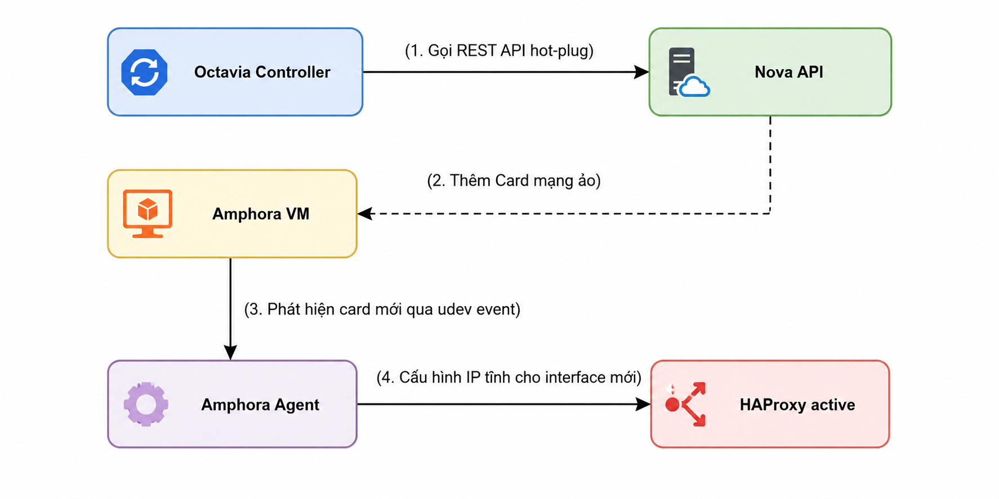
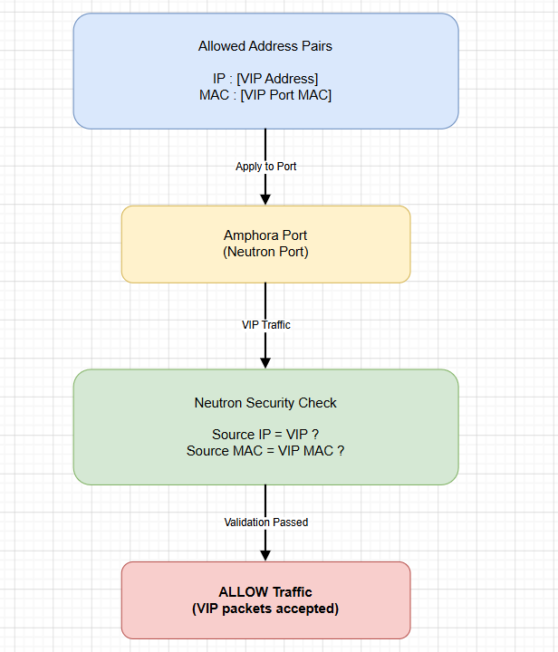

# NETWORKING TRONG OCTAVIA

> **Phiên bản tham chiếu**: OpenStack **2026.1 Gazpacho** + Octavia **14.x** + Neutron **24.x**

## I. VIP ALLOCATION VÀ NEUTRON PORT

Địa chỉ IP ảo (**Virtual IP - VIP**) là thực thể cốt lõi tiếp nhận lưu lượng truy cập từ client. Quá trình cấp phát VIP của Octavia dựa hoàn toàn vào việc tích hợp với Neutron Port API.

### 1. Cơ chế cấp phát VIP Port

Khi người dùng tạo Load Balancer và cung cấp tham số `--vip-subnet-id`, Octavia API sẽ giao tiếp với Neutron để thực hiện các bước sau:

1. **Tạo Neutron Port**: Tạo một cổng logic (Port) trong Neutron thuộc Subnet chỉ định. Cổng này sẽ được cấp phát một địa chỉ IP nội bộ (IP VIP) cùng một địa chỉ MAC duy nhất.

2. **Khóa địa chỉ (Device Owner)**: Port VIP này được Neutron ghi nhận thuộc quyền sở hữu của dịch vụ Octavia (`device_owner = Neutron:LOADBALANCERV2`), đảm bảo không bị thu hồi hoặc gán nhầm sang máy ảo khác.

3. **Cấu hình Security Group**: Một Security Group chuyên dụng của Load Balancer sẽ được tự động gắn vào Port này để chỉ mở các cổng mạng tương ứng với danh sách Listener mà người dùng định nghĩa.

### 2. Sự tách biệt giữa VIP Port và Card mạng vật lý

Điểm đặc biệt trong thiết kế mạng của Octavia là địa chỉ IP VIP **không bao giờ** được cấu hình trực tiếp vào card mạng chính của máy ảo Amphora như một IP thông thường. Nó hoạt động như một địa chỉ IP ảo chuyển tiếp, được quản lý động bởi phần mềm (Keepalived / HAProxy) trên Amphora.

## II. AMPHORA PLUGGING — CÁCH GẮN NETWORK VÀO VM AMPHORA

**Plugging** là kỹ thuật cắm nóng (Hot-plugging) các cổng mạng Neutron trực tiếp vào máy ảo Nova Node đang chạy mà không cần khởi động lại VM. Đây là công nghệ giúp Octavia vận hành mượt mà khi người dùng thay đổi cấu hình pool/subnet.



### Quy trình Plugging diễn ra chi tiết:

1. **Khởi động mạng quản trị**: Khi Amphora VM được spawn, card mạng đầu tiên kết nối vào mạng quản trị (LB Network) được cấu hình cứng để nhận diện Agent.
2. **Gọi cắm card mạng (Interface Attach)**: Khi người dùng khai báo Pool/Member nằm ở dải mạng private khác, Controller Worker sẽ gọi REST API của Nova để thực hiện cắm nóng một card mạng ảo (vNIC) mới kết nối với mạng private đó vào Amphora VM.
3. **Phản hồi hệ điều hành (Udev Events)**: Bên trong Amphora, Linux kernel phát hiện phần cứng mới qua udev event.
4. **Agent cấu hình IP**: `octavia-amphora-agent` nhận lệnh từ Controller qua cổng 9443, cấu hình địa chỉ IP tĩnh và định tuyến (Routing table) cho card mạng mới, sau đó ra lệnh HAProxy bắt đầu lắng nghe và chuyển tiếp lưu lượng trên card mạng này.

## III. VRRP (KEEPALIVED) CHO ACTIVE-STANDBY

Để duy trì trạng thái dự phòng lỗi High Availability (HA) tức thời cho mô hình **Active-Standby**, Octavia sử dụng giao thức truyền thông nhóm **VRRP** (Virtual Router Redundancy Protocol) thông qua công cụ phần mềm **Keepalived** cấu hình sẵn trên hai máy ảo Amphora.

### Cơ chế hoạt động của Keepalived

- **Đồng bộ VRRP Heartbeat**: Hai máy ảo Amphora (Master/Active và Backup/Standby) liên tục gửi gói tin quảng bá VRRP Heartbeat cho nhau qua mạng nội bộ.

- **Duy trì VIP**: Máy Active chịu trách nhiệm quảng bá ARP (Gratuitous ARP) gán địa chỉ MAC của nó với IP VIP, dẫn đường cho toàn bộ lưu lượng mạng bên ngoài đi vào card mạng của nó.

- **Chuyển đổi trạng thái tự động (Failover)**:

  - Nếu máy Active bị sập, máy Standby không nhận được gói tin VRRP từ máy Active trong vòng **3 giây** (thời gian định cấu hình).
  - Máy Standby ngay lập tức tự thăng cấp lên trạng thái Active.
  - Nó phát đi gói tin Gratuitous ARP để cập nhật bảng MAC table của các Switch vật lý và router ảo của Neutron, hướng dòng dữ liệu VIP chạy thẳng về card mạng của nó.
  - Quá trình chuyển đổi này diễn ra ở lớp mạng Layer-2/3 chỉ mất vài giây, hạn chế tối đa việc gián đoạn kết nối.

## IV. ALLOWED ADDRESS PAIRS TRONG NEUTRON

Trong kiến trúc mạng bảo mật của OpenStack Neutron, mặc định mỗi cổng mạng (Port) của máy ảo chỉ được phép gửi và nhận gói tin có địa chỉ IP và MAC khớp chính xác với thông số đã đăng ký lúc tạo VM (cơ chế chống giả mạo IP - **IP Anti-spoofing**).

Tuy nhiên, đối với mô hình HA Active-Standby của Octavia, cả hai máy ảo Amphora đều phải gánh chung một địa chỉ IP ảo (VIP). Nếu không có cơ chế cho phép, Neutron sẽ lập tức chặn (drop) toàn bộ các gói tin hướng tới VIP đi vào máy ảo Standby.

Octavia giải quyết bài toán này thông qua tính năng **Allowed Address Pairs** của Neutron:

```text
  Cấu hình allowed-address-pairs trên Port của Amphora:
  +-------------------------------------------------------------+
  | Allowed Address Pairs:                                      |
  | - IP: [Địa chỉ IP VIP] - MAC: [Địa chỉ MAC của VIP Port]    |
  +-------------------------------------------------------------+
  ==► Neutron Security check: CHO PHÉP gói tin mang IP VIP đi qua card mạng này.
```

### Cách thức hoạt động

- Khi khởi dựng hai máy ảo Amphora, Octavia Controller sẽ tự động gọi API Neutron để khai báo cấu hình Allowed Address Pairs trên các cổng mạng của cả hai máy ảo.
- Cấu hình này chỉ rõ: Cho phép card mạng của máy ảo Amphora được nhận và gửi các gói tin có chứa địa chỉ IP VIP, bên cạnh địa chỉ IP gốc của chính nó.
- Nhờ có Allowed Address Pairs, quá trình giật IP VIP qua Keepalived VRRP được Neutron chấp thuận hoàn toàn thông suốt mà không bị tường lửa bảo mật của Neutron chặn lại.

## V. FLOATING IP GẮN VỚI VIP

Để người dùng bên ngoài Internet (ngoài đám mây OpenStack) có thể truy cập được dịch vụ chạy sau Load Balancer, địa chỉ IP VIP nội bộ (Private IP) cần được liên kết với một địa chỉ **Floating IP** (Public IP).



### Quy trình liên kết Floating IP

1. **Lấy ID của VIP Port**: Người dùng cần lấy ID của cổng Neutron của Load Balancer vừa tạo (sử dụng lệnh `openstack loadbalancer show`).

2. **Yêu cầu cấp phát Floating IP**: Xin cấp phát một Floating IP từ mạng External/Provider Network.

3. **Gắn Floating IP vào VIP Port**: Thực hiện liên kết Floating IP trực tiếp vào VIP Port ID của Load Balancer thay vì gắn vào VM Instance thông thường.

### Bộ lệnh CLI thực thi liên kết mẫu

```bash
source /etc/kolla/admin-openrc

# 1. Tra cứu VIP Port ID của Load Balancer "web-lb":
VIP_PORT_ID=$(openstack loadbalancer show web-lb -f value -c vip_port_id)
echo "VIP Port ID: $VIP_PORT_ID"

# 2. Tạo mới một Floating IP trên dải mạng ngoài public:
FLOATING_IP=$(openstack floating ip create public -f value -c floating_ip_address)
echo "Floating IP vừa tạo: $FLOATING_IP"

# 3. Liên kết Floating IP vào VIP Port của Load Balancer:
openstack floating ip set --port $VIP_PORT_ID $FLOATING_IP

# 4. Xác minh liên kết thành công:
openstack floating ip list --port $VIP_PORT_ID
```

Sau khi hoàn tất liên kết này, mọi yêu cầu kết nối từ Internet gửi tới địa chỉ `$FLOATING_IP` sẽ được router Neutron tự động biên dịch địa chỉ tĩnh (Static NAT) chuyển tiếp mượt mà vào địa chỉ Private VIP, đi thẳng đến cổng xử lý HAProxy của cụm Amphora để điều phối tải.
