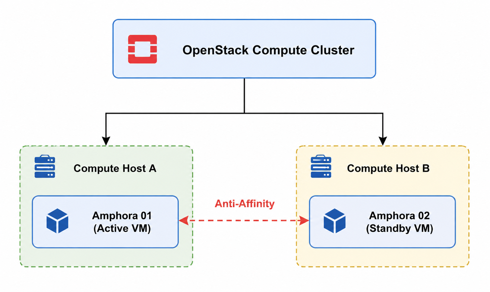
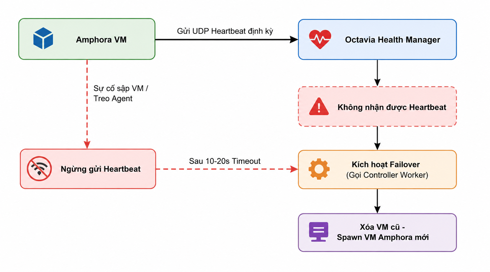

# HIGH AVAILABILITY & FAILOVER TRONG OCTAVIA

> **Phiên bản tham chiếu**: OpenStack **2026.1 Gazpacho** + Octavia **14.x**

## I. ACTIVE-STANDBY TOPOLOGY VỚI VRRP

Để bảo vệ hệ thống cân bằng tải khỏi các điểm lỗi đơn lẻ (Single Point of Failure - SPoF), Octavia cung cấp mô hình **Active-Standby Topology** như là lựa chọn tiêu chuẩn và tối ưu nhất cho môi trường sản xuất (Production).

### 1. Kiến trúc phân tách vai trò

Mô hình này yêu cầu Octavia khởi tạo đồng thời **hai** máy ảo Amphora (được gọi là một *Amphora Pair*) cho cùng một Load Balancer:

- **Active Node (Master)**: Là node trực tiếp nắm giữ địa chỉ Virtual IP (VIP). Nó tiếp nhận toàn bộ các request gửi tới VIP và điều phối tải đến các backend server theo thuật toán đã thiết lập.
- **Standby Node (Backup)**: Là node ở trạng thái chờ. Nó liên tục đồng bộ cấu hình ứng dụng (HAProxy config) từ Active Node thông qua chỉ thị của Octavia Controller và chạy ngầm tiến trình giám sát.

### 2. Giao thức VRRP và Keepalived

- Hai node liên tục gửi gói tin quảng bá **VRRP** (Virtual Router Redundancy Protocol) qua mạng nội bộ để chứng minh mình còn sống.
- Nếu node Active gặp sự cố (ví dụ sập nguồn điện host vật lý), node Standby sẽ lập tức phát hiện việc mất tín hiệu VRRP heartbeat.
- Ngay lập tức, node Standby tự động gán địa chỉ IP VIP lên card mạng của mình và phát tin ARP để chỉ hướng lưu lượng mạng chạy về phía nó, tiếp quản dịch vụ mà không làm gián đoạn trải nghiệm của người dùng cuối.

## II. ACTIVE-ACTIVE TOPOLOGY VÀ QUY TẮC ANTI-AFFINITY

Trong các hệ thống lớn, mô hình Active-Standby đôi khi gặp giới hạn về mặt hiệu năng vì chỉ có một node thực sự xử lý tải tại một thời điểm (node Standby bị lãng phí tài nguyên chờ). Để giải quyết bài toán này, Octavia hỗ trợ mô hình **Active-Active Topology**.

### 1. Cơ chế Active-Active

- Trong mô hình Active-Active, **tất cả** các máy ảo Amphora khởi tạo đều tham gia xử lý lưu lượng truy cập đồng thời.
- Việc phân phối tải đi vào các node Amphora này được thực hiện thông qua cơ chế định tuyến nhiều đường bằng nhau **ECMP (Equal-Cost Multi-Path Routing)** trên các Switch vật lý ở lớp mạng biên hoặc thông qua việc cấu hình DNS Round Robin.

### 2. Quy tắc Anti-Affinity (Chống đồng vị)

Để mô hình HA (cả Active-Standby lẫn Active-Active) thực sự có ý nghĩa vật lý, các máy ảo Amphora của cùng một Load Balancer tuyệt đối **không được phép chạy chung trên cùng một máy chủ vật lý (Compute Node)**. Nếu cả hai VM chạy chung một Host vật lý và host đó bị sập nguồn, cả hai VM sẽ chết cùng lúc, phá hỏng mọi nỗ lực thiết lập HA.

Octavia giải quyết triệt để bài toán này bằng cách tự động cấu hình quy tắc **Anti-Affinity** trong Nova:

- Khi khởi tạo cụm Amphora, Octavia gọi Nova API để tạo một **Server Group** chuyên dụng kèm chính sách `soft-anti-affinity` hoặc `hard-anti-affinity`.
- Nova Scheduler sẽ phân tích chính sách này để đảm bảo khi xếp lịch chạy (schedule), máy ảo `Amphora-01` và `Amphora-02` sẽ bị ép buộc đẩy sang hai Compute Node vật lý khác nhau, đảm bảo an toàn tuyệt đối khi xảy ra sự cố phần cứng host.

## III. AMPHORA FAILOVER TỰ ĐỘNG — HEALTH MANAGER PHÁT HIỆN LỖI → SPAWN LẠI

Bên cạnh việc chuyển dịch IP ảo tự động ở lớp mạng (VRRP), Octavia sở hữu một cơ chế tự phục hồi lỗi ở lớp hạ tầng đám mây (Cloud Infrastructure Auto-healing) do cấu phần **Octavia Health Manager** đảm nhiệm.

### Quy trình tự động khắc phục sự cố (Auto-healing Failover)

1. **Gửi Heartbeat**: Mỗi máy ảo Amphora được cài đặt sẵn agent liên tục phát các gói tin kiểm tra nhịp tim **UDP Heartbeat** về cổng bảo mật của dịch vụ `octavia-health-manager` chạy trên Controller Node.

2. **Phát hiện mất kết nối**: Nếu vì bất kỳ lý do gì (máy ảo bị treo kernel, hỏng mạng, hoặc tiến trình agent bị tắt) khiến Health Manager không nhận được gói tin heartbeat từ một Amphora cụ thể vượt quá khoảng thời gian timeout cấu hình (mặc định khoảng 10-20 giây):

   - Health Manager đánh dấu trạng thái Amphora đó là `ALLOCATED_BUT_FAILING` trong Database.
   - Phát tín hiệu khẩn cấp yêu cầu cấu phần `octavia-controller-worker` thực thi quy trình Failover.

3. **Spawn và Thay thế hạ tầng**:
   - Controller Worker gọi Nova API thực hiện xóa bỏ (Tear down) máy ảo Amphora bị lỗi.
   - Khởi tạo (Spawn) một máy ảo Amphora mới từ Glance image sạch.
   - Gắn lại (Attach) toàn bộ các Port mạng cũ (bao gồm cả IP quản trị và IP VIP) sang máy ảo mới.
   - Đồng bộ lại toàn bộ file cấu hình HAProxy từ database sang máy ảo mới để đưa Load Balancer trở lại trạng thái `ACTIVE` bình thường.

## IV. GRACEFUL FAILOVER VS EMERGENCY FAILOVER

Trong quá trình vận hành đám mây, có hai kịch bản thay thế Amphora (Failover) diễn ra với các mức độ ưu tiên và ảnh hưởng dịch vụ khác nhau:

### 1. Graceful Failover (Thay thế chủ động / An toàn)

- **Kịch bản**: Thường diễn ra khi người quản trị đám mây chủ động thực hiện bảo trì hệ thống (ví dụ: nâng cấp phiên bản HAProxy bên trong Amphora, hoặc nâng cấp OS kernel của Amphora).
- **Cơ chế hoạt động**:

  - Octavia sẽ khởi tạo máy ảo Amphora mới **trước**, cấu hình đầy đủ thông số mạng và nạp cấu hình HAProxy sẵn sàng.
  - Sau khi xác nhận máy mới đã ở trạng thái `ACTIVE`, Octavia mới thực hiện chuyển dịch cổng VIP port và chuyển hướng traffic sang máy mới.
  - Cuối cùng mới tiến hành tắt và xóa bỏ máy ảo cũ.

- **Ảnh hưởng**: Không gây ra bất kỳ downtime hay mất mát gói tin nào đối với kết nối của người dùng.

### 2. Emergency Failover (Thay thế khẩn cấp / Sự cố đột xuất)

- **Kịch bản**: Diễn ra tự động khi máy ảo Amphora đang hoạt động bị sập nguồn đột ngột, hỏng phần cứng hoặc mất kết nối mạng hoàn toàn.

- **Cơ chế hoạt động**:

  - Do máy cũ đã chết, Octavia buộc phải thực hiện quy trình ngắt kết nối port mạng của máy cũ ngay lập tức (Tear down).
  - Tiến hành spawn máy mới từ đầu, cấu hình mạng và nạp lại dữ liệu cấu hình.

- **Ảnh hưởng**:

  - *Đối với mô hình Single*: Dịch vụ sẽ bị downtime mất kết nối trong khoảng 2-3 phút (thời gian để Nova spawn và boot xong máy ảo mới).
  - *Đối với mô hình Active-Standby*: Không gây downtime lớn nhờ node Standby đã lập tức cướp VIP qua VRRP để duy trì luồng dữ liệu trước đó, máy mới sinh ra chỉ đóng vai trò thay thế node Standby bị thiếu hụt để tái lập cụm HA dự phòng.

