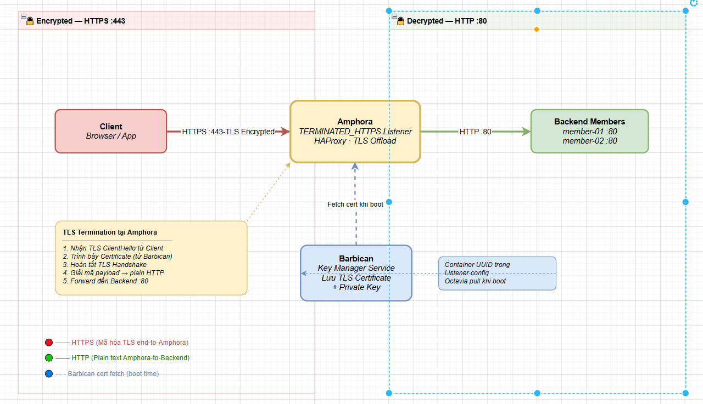
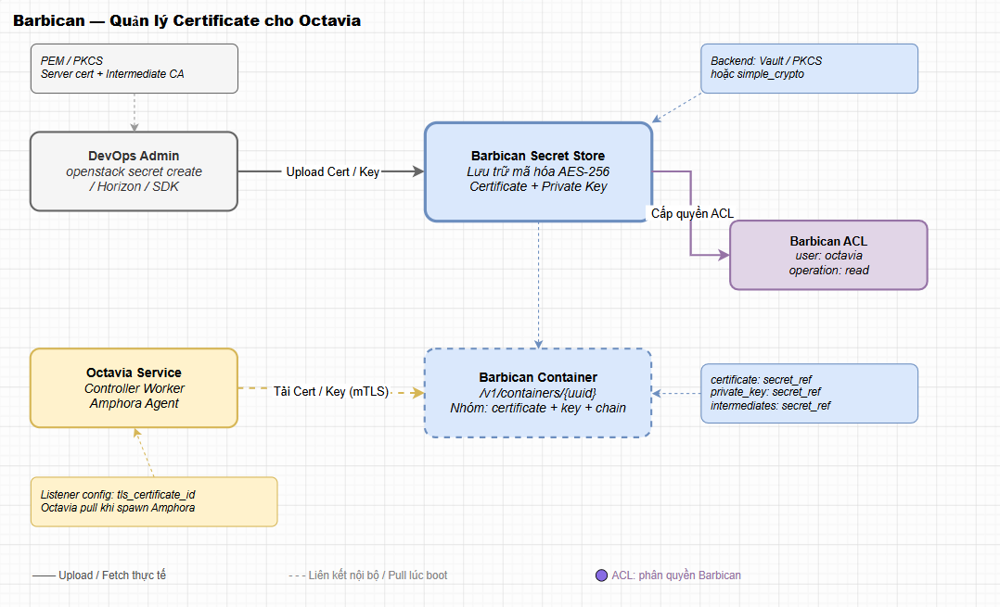
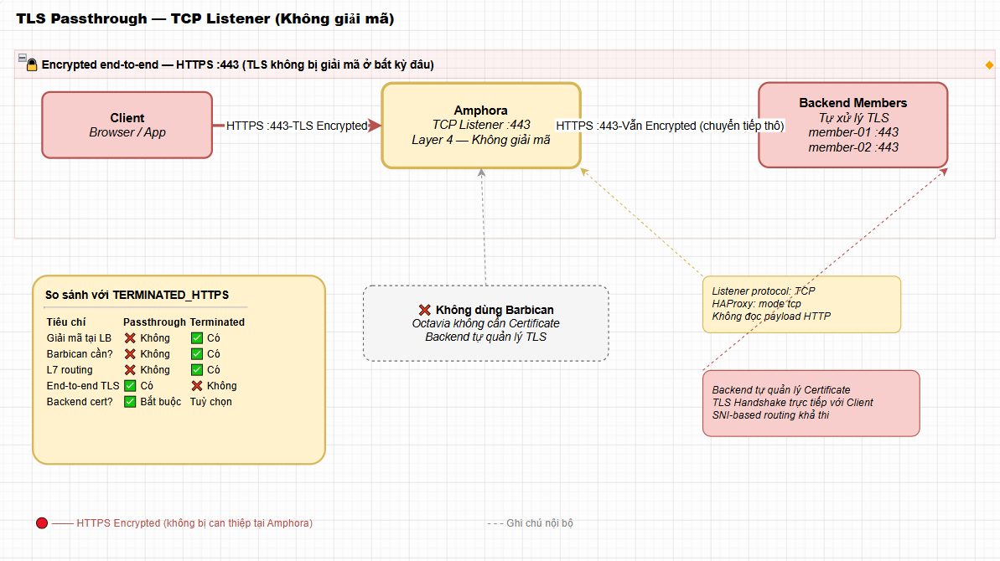
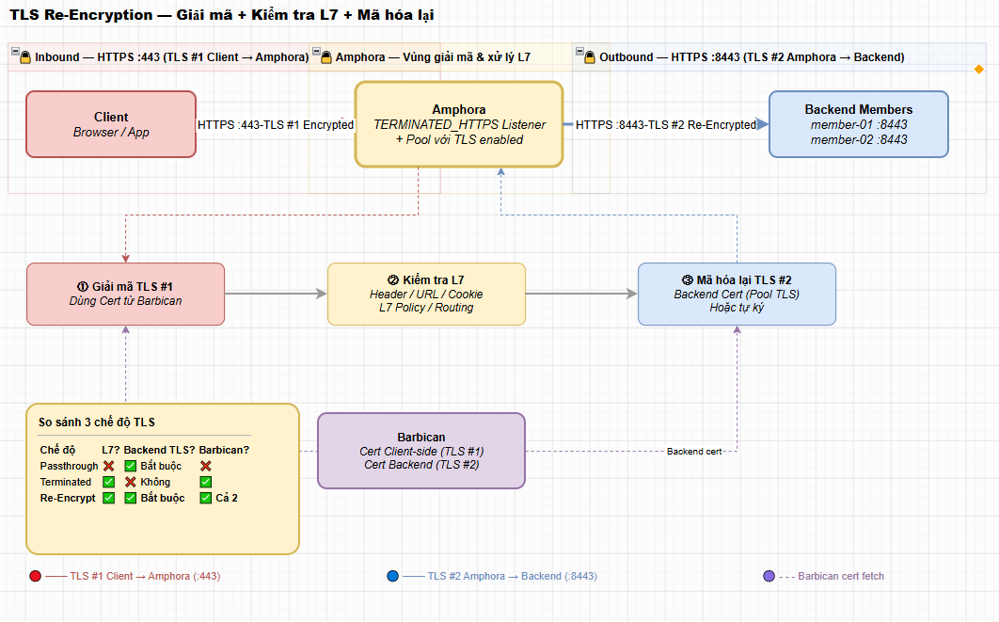
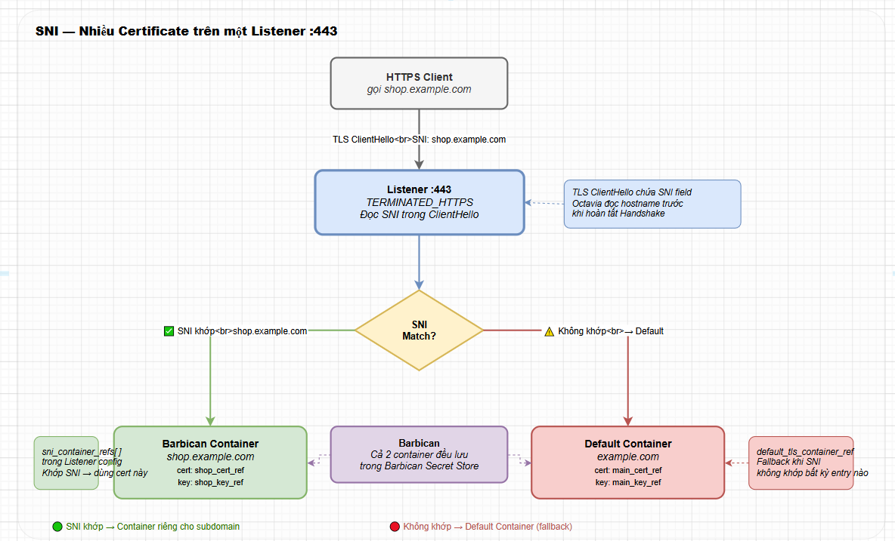

# TLS & HTTPS TRONG OCTAVIA

> **Phiên bản tham chiếu**: OpenStack **2026.1 Gazpacho** + Octavia **14.x** + Barbican **18.x**

## I. TLS TERMINATION TẠI LISTENER (TERMINATED_HTTPS)

**TLS Termination** (hay còn gọi là giải mã SSL/TLS tại đầu cuối) là cơ chế mà Load Balancer chịu trách nhiệm trực tiếp tiếp nhận, thương lượng bắt tay TLS và giải mã lưu lượng HTTPS đã mã hóa từ Client gửi tới.



### 1. Cơ chế hoạt động của `TERMINATED_HTTPS`

- Khi người dùng cấu hình Listener với giao thức `TERMINATED_HTTPS`, máy ảo Amphora của Octavia sẽ làm nhiệm vụ đầu cuối cho các phiên kết nối bảo mật.

- Amphora trực tiếp tải chứng chỉ bảo mật (Certificate) và khóa bí mật (Private Key) được lưu trữ an toàn trong dịch vụ quản lý mã khóa Barbican để nạp vào cấu hình HAProxy.

- Sau khi HAProxy giải mã gói tin HTTPS thành HTTP thô, nó sẽ phân tích L7 rules (nếu có) và chuyển tiếp gói tin không mã hóa này tới các máy chủ backend trong Pool (thường qua cổng `80` hoặc `8080`).

### 2. Ưu điểm nổi bật

- **Giảm tải cho Backend**: Các máy ảo ứng dụng không cần phải tốn tài nguyên CPU xử lý các thuật toán mã hóa/giải mã khóa phức tạp.

- **Quản lý chứng chỉ tập trung**: Thay vì phải copy chứng chỉ và cập nhật thủ công trên hàng chục máy ảo backend, người quản trị chỉ cần upload và thay mới chứng chỉ tại một nơi duy nhất là Barbican.

- **Hỗ trợ phân tích L7**: Vì Load Balancer có thể đọc được nội dung gói tin sau khi giải mã, nó có thể thực hiện định tuyến thông minh (L7 Switching) theo URL, Header hoặc Cookie.

## II. TÍCH HỢP BARBICAN ĐỂ LƯU CERTIFICATE

Octavia không lưu trữ trực tiếp chứng chỉ bảo mật và Private Key trong database của mình vì lý do an toàn thông tin. Thay vào đó, nó tích hợp sâu sắc với **OpenStack Barbican** (Key Manager Service) để quản lý các dữ liệu nhạy cảm này dưới dạng các Container bảo mật.

### Quy trình tích hợp và cấp quyền



#### Bước 1: Tạo các Secret và đóng gói vào Container trong Barbican

Người quản trị upload chứng chỉ (`cert.pem`) và khóa bí mật (`key.pem`) lên Barbican, sau đó nhóm chúng lại thành một đối tượng gọi là **TLS Container**:

```bash
source /etc/kolla/admin-openrc

# 1. Upload Private Key:
openstack secret store --name="web_private_key" \
  --payload-content-type="text/plain" \
  --payload="$(cat server.key)"

# 2. Upload Certificate:
openstack secret store --name="web_certificate" \
  --payload-content-type="text/plain" \
  --payload="$(cat server.crt)"

# 3. Tạo TLS Container kết hợp hai secrets trên:
openstack secret container create --name="web_tls_container" --type="certificate" \
  --secret="certificate=$(openstack secret list | grep web_certificate | awk '{print $2}')" \
  --secret="private_key=$(openstack secret list | grep web_private_key | awk '{print $2}')"
```

Lệnh trên sẽ trả về một địa chỉ URL container duy nhất (ví dụ: `http://controller:9311/v1/containers/uuid-hiển-thị`).

#### Bước 2: Cấp quyền (Access Control List - ACL) cho Octavia

Để dịch vụ Octavia có quyền đọc các khóa này khi build Amphora, ta cần gán quyền truy cập cho tài khoản hệ thống của Octavia:

```bash
# Lấy ID tài khoản người dùng hệ thống octavia:
OCTAVIA_USER_ID=$(openstack user show octavia -f value -c id)

# Cấp quyền ACL cho tài khoản Octavia truy cập Container chứa cert:
openstack acl user add -u $OCTAVIA_USER_ID http://controller:9311/v1/containers/uuid-hiển-thị
```

#### Bước 3: Khởi tạo Listener TERMINATED_HTTPS bằng CLI

```bash
# Tạo Listener sử dụng Container URL từ Barbican:
openstack loadbalancer listener create --name https-listener \
  --protocol TERMINATED_HTTPS --protocol-port 443 \
  --default-tls-container-ref http://controller:9311/v1/containers/uuid-hiển-thị \
  web-lb
```

## III. TLS PASSTHROUGH (TCP LISTENER)

Trong một số trường hợp, doanh nghiệp có các quy định bảo mật khắt khe không cho phép Load Balancer trung gian được giải mã gói tin (ví dụ: dữ liệu giao dịch tài chính, thông tin y tế). Khi đó, ta sử dụng giải pháp **TLS Passthrough**.



### Đặc điểm của TLS Passthrough

- **Cấu hình**: Khai báo Listener với giao thức **`TCP`** lắng nghe cổng `443` thay vì dùng `TERMINATED_HTTPS`.

- **Cơ chế hoạt động**: Amphora chỉ hoạt động ở Layer-4. Nó nhận gói tin TCP đã mã hóa từ Client và chuyển tiếp thô (Passthrough) toàn bộ dữ liệu này tới các máy chủ backend trong Pool. Quá trình bắt tay TLS và giải mã sẽ do chính các máy chủ backend đảm nhiệm.

- **Ưu và nhược điểm**:

  - *Ưu điểm*: Bảo mật tuyệt đối từ đầu cuối đến đầu cuối (End-to-End). Load Balancer không thể nhìn thấy nội dung dữ liệu bên trong. Không cần cấu hình Barbican.

  - *Nhược điểm*: Tiêu tốn CPU xử lý TLS trên tất cả các backend server. Load Balancer không thể sử dụng các tính năng L7 (như chuyển hướng URL, chèn header HTTP, hoặc session persistence bằng Cookie).

## IV. RE-ENCRYPTION (END-TO-END TLS)

Nếu doanh nghiệp vừa muốn bảo mật tuyệt đối đường truyền mạng nội bộ (không muốn chuyển tiếp HTTP không mã hóa từ Amphora đến Backend), vừa muốn sử dụng các tính năng thông minh L7 của Load Balancer, giải pháp tối ưu là **Re-encryption (Tái mã hóa)**.



### Cơ chế hoạt động

1. Client gửi request HTTPS (mã hóa lần 1) đến Listener.

2. Listener (`TERMINATED_HTTPS`) thực hiện giải mã bằng chứng chỉ trong Barbican để lấy nội dung HTTP gốc phục vụ phân tích L7 Rules.

3. Khi chuyển tiếp dữ liệu đến Pool, Octavia thiết lập một kết nối TLS mới (mã hóa lần 2) gửi đến backend cổng HTTPS (ví dụ cổng `8443` hoặc `443`).

4. Backend nhận dữ liệu và thực hiện giải mã lần 2.

### Cách cấu hình trong Octavia

Khi tạo Pool, ta khai báo giao thức kết nối hướng tới Backend là **`HTTPS`** (thay vì HTTP):

```bash
# Tạo Pool hướng kết nối HTTPS tới backend:
openstack loadbalancer pool create --name secure-backend-pool \
  --protocol HTTPS --lb-algorithm ROUND_ROBIN --listener https-listener
```

## V. SNI — NHIỀU CERT TRÊN MỘT LISTENER

Trong thực tế, một cụm Load Balancer có thể phục vụ cho nhiều trang web có tên miền (Domain) khác nhau chạy chung trên một địa chỉ IP ảo VIP (ví dụ: `example.com` và `shop.example.com`). Công nghệ **SNI (Server Name Indication)** cho phép Listener tự động trình diện đúng chứng chỉ tương thích với tên miền mà trình duyệt Client đang yêu cầu.



### Cách cấu hình SNI trong Octavia

Khi tạo Listener, ngoài việc khai báo chứng chỉ mặc định (`--default-tls-container-ref`), ta có thể cung cấp thêm danh sách các chứng chỉ bổ sung cho các tên miền phụ thông qua tham số `--sni-container-refs`:

```bash
# Tạo Listener HTTPS hỗ trợ SNI cho nhiều tên miền:
openstack loadbalancer listener create --name sni-multi-listener \
  --protocol TERMINATED_HTTPS --protocol-port 443 \
  --default-tls-container-ref http://controller:9311/v1/containers/main-site-uuid \
  --sni-container-refs \
    http://controller:9311/v1/containers/shop-site-uuid \
    http://controller:9311/v1/containers/blog-site-uuid \
  web-lb
```

Khi Client gửi gói tin TLS ClientHello, HAProxy trên Amphora sẽ đọc trường `server_name` trong header để chọn đúng chứng chỉ tương ứng trả về cho client thực hiện bắt tay bảo mật, giúp tối ưu hóa tài nguyên IP và đơn giản hóa thiết kế mạng.
