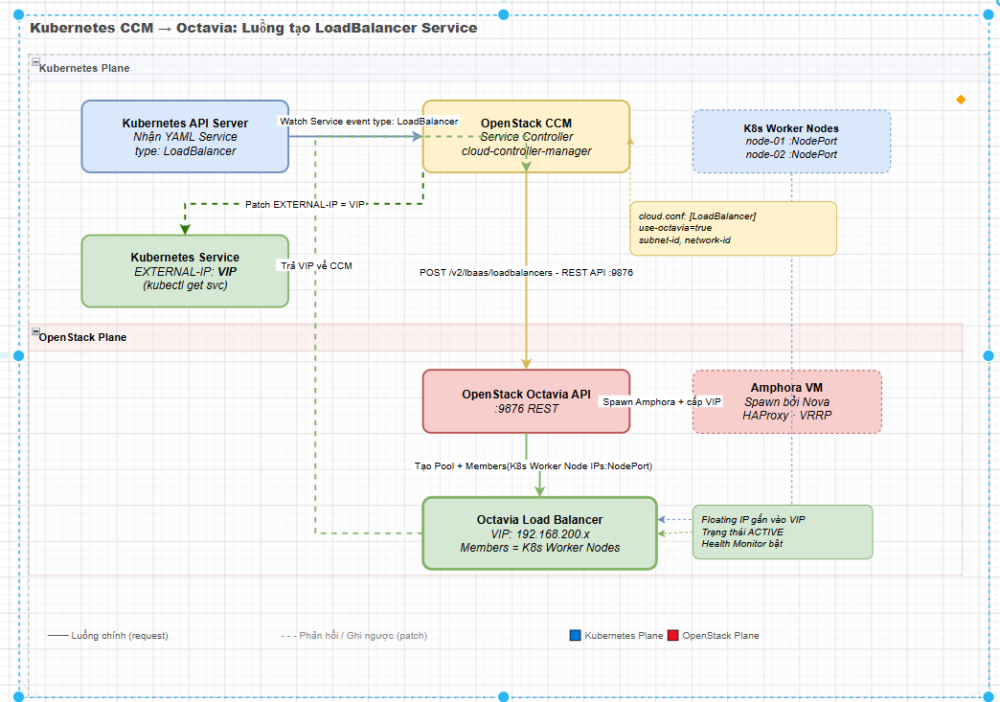

# TÍCH HỢP OCTAVIA VỚI KUBERNETES

> **Phiên bản tham chiếu**: OpenStack **2026.1 Gazpacho** + Octavia **14.x** + Kubernetes **1.31+**

## I. OPENSTACK CLOUD CONTROLLER MANAGER (CCM)

Trong kiến trúc của Kubernetes chạy trên môi trường đám mây, các thành phần tương tác trực tiếp với hạ tầng bên dưới (như Nova, Neutron, Cinder và Octavia) được quản trị tập trung bởi **OpenStack Cloud Controller Manager (CCM)**.

### 1. Vai trò của CCM

- CCM chạy như một tập hợp các tiến trình Controller bên trong Kubernetes Control Plane (thường là một DaemonSet hoặc Deployment trong namespace `kube-system`).

- Nó đóng vai trò "dịch dịch" từ các yêu cầu tài nguyên logic của Kubernetes (như Service, Node, Route) thành các lệnh gọi API thực tế tới OpenStack API Endpoint.

- Đối với mảng mạng, CCM chịu trách nhiệm trực tiếp trong việc giám sát các Service có kiểu `type: LoadBalancer` và tự động điều phối dịch vụ Octavia ở lớp dưới để cấu hình tương ứng.

## II. LUỒNG TẠO LOAD BALANCER KHI SERVICE TYPE: LOADBALANCER

Khi một lập trình viên triển khai một ứng dụng vào cụm Kubernetes và công bố ứng dụng ra ngoài bằng cách áp dụng cấu hình Service `type: LoadBalancer`, luồng xử lý tự động giữa hai hệ thống diễn ra như sau:



### Các bước diễn ra chi tiết

1. **CCM phát hiện Service**: Bộ điều phối Service Controller của OpenStack CCM liên tục kiểm tra trạng thái các Service. Khi thấy một Service mới được tạo với `type: LoadBalancer`, nó sẽ đánh dấu trạng thái của service này là `Pending`.

2. **Gọi API Octavia**: CCM sử dụng thông tin tài khoản admin trong file cấu hình để gọi trực tiếp tới Octavia REST API để yêu cầu tạo một thực thể Load Balancer tương ứng.

3. **Cấp phát VIP**: Octavia chỉ đạo Neutron cấp phát IP VIP cho Load Balancer.

4. **Tạo Listener & Pool**: CCM tự động ra lệnh tạo Listener trên cổng được khai báo trong YAML (ví dụ cổng 80 hoặc 443), tạo Pool backend và cấu hình cơ chế Health Check mặc định (thường là TCP check).

5. **Gán Members**: CCM thu thập địa chỉ IP private của **tất cả các máy ảo Worker Node** trong cụm Kubernetes để gán làm Member trong Pool của Octavia. Gói tin đi tới Load Balancer sẽ được chuyển tiếp tới một Worker Node ngẫu nhiên, sau đó `kube-proxy` hoặc OVN trên Node đó sẽ định tuyến tiếp đến đúng Pod đích.

6. **Cập nhật trạng thái**: Khi Octavia báo trạng thái Load Balancer là `ACTIVE`, CCM lấy địa chỉ IP VIP (hoặc Floating IP liên kết) để cập nhật ngược lại vào trường `status.loadBalancer.ingress` của Kubernetes Service. Lúc này lệnh `kubectl get svc` sẽ hiển thị địa chỉ IP thực tế tại cột `EXTERNAL-IP`.

## III. CÁC ANNOTATION TÙY CHỈNH (LOADBALANCER.OPENSTACK.ORG/*)

Để tùy biến sâu hành vi khởi tạo Load Balancer của Octavia từ bên trong Kubernetes mà không cần truy cập trực tiếp OpenStack CLI, Kubernetes hỗ trợ hệ thống các nhãn khai báo **Annotations** gắn trực tiếp trong phần metadata của tệp cấu hình Service YAML.

### Các Annotations phổ biến và ý nghĩa

- **`loadbalancer.openstack.org/subnet-id`**:

  - *Ý nghĩa*: Chỉ định chính xác ID của Subnet mạng Neutron nơi Load Balancer sẽ được sinh ra. Rất quan trọng nếu cụm K8s kết nối với nhiều phân vùng mạng khác nhau.

- **`loadbalancer.openstack.org/floating-network-id`**:

  - *Ý nghĩa*: ID của External Network (mạng ngoài). Nếu khai báo annotation này, CCM sẽ tự động xin cấp phát thêm một Floating IP công cộng và gán vào VIP Port của Octavia Load Balancer để có thể truy cập từ ngoài Internet.

- **`loadbalancer.openstack.org/flavor-id`**:

  - *Ý nghĩa*: Tên hoặc UUID của Octavia Flavor muốn sử dụng để build máy ảo Amphora (ví dụ chọn flavor cấu hình cao xử lý SSL Termination).

- **`loadbalancer.openstack.org/keep-floatingip-on-delete`**:

  - *Ý nghĩa*: Đặt bằng `true` nếu muốn giữ lại Floating IP khi Service Kubernetes bị xóa (mặc định sẽ xóa sạch để giải phóng tài nguyên).

- **`loadbalancer.openstack.org/connection-limit`**:

  - *Ý nghĩa*: Giới hạn số lượng phiên kết nối đồng thời tối đa cho phép đi qua Load Balancer nhằm chống lại các cuộc tấn công DDoS ở mức cơ bản.

## IV. CẤU HÌNH CLOUD.CONF — SECTION [LOADBALANCER]

File cấu hình chính của OpenStack CCM chạy trên Kubernetes Control Plane thường được lưu trữ dưới dạng một Secret hoặc đặt tại `/etc/kubernetes/cloud.conf`. Để CCM có thể giao tiếp đúng với Octavia, ta cần khai báo chi tiết các thông số trong block cấu hình `[LoadBalancer]`.

### Tệp cấu hình `cloud.conf` mẫu

```ini
[Global]
auth-url = http://controller:5000/v3
username = k8s-cloud-manager
password = mat-khau-bao-mat
project-name = k8s-production
project-domain-name = Default
user-domain-name = Default

[LoadBalancer]
# ID của subnet mặc định dùng để tạo VIP cho Load Balancer:
subnet-id = 6c8e9d01-abcd-1234-5678-abcdef098765

# ID của mạng ngoài dùng để gán Floating IP mặc định:
floating-network-id = 4d9a2c10-1234-abcd-efgh-56789abcdef0

# Kích hoạt cơ chế tự tạo Load Balancer qua Octavia:
use-octavia = true

# Tự động tạo Security Group cho các LB:
create-monitor = true
monitor-delay = 5s
monitor-timeout = 3s
monitor-max-retries = 3
```

## V. OCTAVIA INGRESS CONTROLLER (SO SÁNH VỚI NGINX INGRESS)

Bên cạnh giải pháp sử dụng Service `type: LoadBalancer` (tương ứng với mỗi service là một Load Balancer Octavia vật lý độc lập), Kubernetes hỗ trợ giải pháp Ingress để gom nhiều dịch vụ web chạy chung dưới một API Gateway duy nhất.

Tại đây, ta có sự so sánh lớn giữa **Octavia Ingress Controller** và **NGINX Ingress Controller**:

### Bảng so sánh chi tiết

| Tiêu chí | NGINX Ingress Controller | Octavia Ingress Controller |
| :--- | :--- | :--- |
| **Vị trí chạy thực tế** | Chạy như các Pod thông thường bên trong cụm Kubernetes (Sử dụng lực lượng của Worker Nodes). | Chạy trực tiếp tại tầng hạ tầng đám mây (trên máy ảo Amphora nằm ngoài cụm K8s). |
| **Cơ chế hoạt động** | Sử dụng duy nhất một Service Load Balancer của Octavia hướng ngoại, sau đó NGINX Pod tự phân tích header/url để chia traffic nội bộ (Layer 7). | Controller dịch trực tiếp các quy tắc Ingress (YAML) thành cấu hình L7 Policies và L7 Rules nạp thẳng vào HAProxy của Amphora. |
| **Tiêu hao tài nguyên K8s** | Tốn CPU/RAM của Worker nodes để chạy Pod Ingress Controller xử lý TLS/SSL và routing. | **Tiết kiệm tuyệt đối**: Toàn bộ tác vụ giải mã TLS và định tuyến L7 được chuyển dịch xuống máy ảo Amphora gánh. |
| **Khả năng quản trị** | DevOps quản trị hoàn toàn trong K8s. Thích hợp cho các cấu hình vi mô và cập nhật liên tục. | Tương tác trực tiếp và quản trị đồng bộ thông qua cả K8s Ingress API lẫn giao diện đám mây OpenStack. |
| **Khuyến nghị sử dụng** | Phù hợp cho đa số ứng dụng web microservices thông thường nhờ tính linh hoạt cao và thư viện plugin phong phú. | Khuyên dùng khi cần bảo mật nghiêm ngặt phân tách lớp mạng, hoặc xử lý lượng tải mã hóa SSL Termination cực lớn mà không muốn gây ảnh hưởng tới hiệu năng tính toán của Worker Nodes. |
