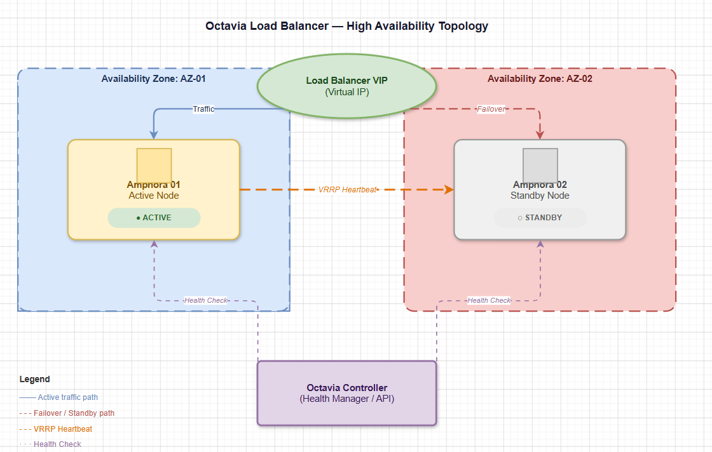
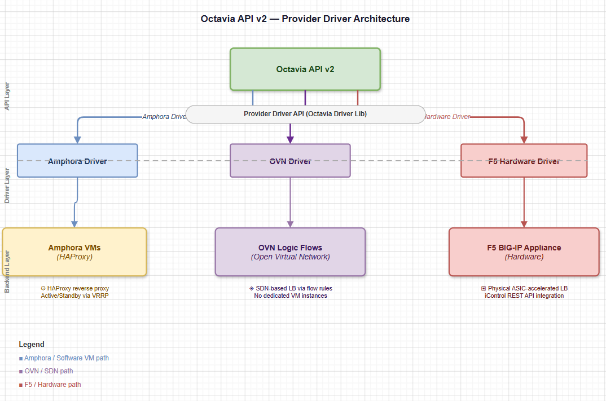

# CÁC KIẾN THỨC NÂNG CAO VỀ OCTAVIA

> **Phiên bản tham chiếu**: OpenStack **2026.1 Gazpacho** + Octavia **14.x**

## I. FLAVOR SYSTEM — TẠO FLAVOR TÙY CHỈNH

Hệ thống **Flavor** của Octavia hoạt động tương tự như Nova Flavor, cho phép quản trị viên đám mây định nghĩa các gói cấu hình Load Balancer khác nhau để người dùng lựa chọn tùy thuộc vào nhu cầu thực tế.

Một Flavor trong Octavia được cấu thành từ hai thành phần chính:

- **Flavor Profile**: Bản thiết kế chứa các tham số cấu hình hạ tầng thực tế (như kích thước VM trong Nova, hoặc các thông số phần mềm HAProxy).
- **Flavor**: Thực thể logic được gán nhãn tên thân thiện hiển thị cho người dùng lựa chọn khi tạo Load Balancer.

### Các tham số tùy chỉnh phổ biến trong Flavor Profile

- `loadbalancer_topology`: Định cấu hình chạy mô hình `SINGLE` hoặc `ACTIVE_STANDBY`.
- `compute_flavor`: ID của Nova Flavor quyết định cấu hình CPU/RAM cho máy ảo Amphora.
- `connection_limit`: Giới hạn tổng số kết nối đồng thời qua thiết bị.

### Bộ lệnh CLI tạo Flavor tùy chỉnh mẫu

```bash
source /etc/kolla/admin-openrc

# 1. Tạo một Flavor Profile định nghĩa cấu hình Active-Standby hiệu năng cao:
openstack loadbalancer flavorprofile create --name high-perf-profile \
  --provider amphora \
  --value '{"loadbalancer_topology": "ACTIVE_STANDBY", "compute_flavor": "large-lb-flavor"}'

# 2. Tạo một Flavor hiển thị cho người dùng liên kết với Profile trên:
openstack loadbalancer flavor create --name "High-Performance-LB" \
  --description "Mô hình Active-Standby chuyên dụng cho tải lớn" \
  --flavorprofile high-perf-profile \
  --enable

# 3. Người dùng sử dụng Flavor khi tạo Load Balancer:
openstack loadbalancer create --name prod-lb --flavor "High-Performance-LB" --vip-subnet-id private-subnet
```

## II. AVAILABILITY ZONE CHO OCTAVIA

Để đảm bảo khả năng chống chịu thảm họa cấp độ hạ tầng (như sập nguồn điện một phòng máy vật lý), Octavia hỗ trợ triển khai các máy ảo Amphora phân tách qua các **Availability Zones (AZ)** khác nhau.



### Cách thức hoạt động

- Quản trị viên ánh xạ Availability Zone của Octavia tới các Availability Zone hoặc Host Group tương ứng bên trong Nova.
- Khi người dùng tạo một Load Balancer Active-Standby kèm chỉ thị Availability Zone, Octavia Controller sẽ tự động ra lệnh cho Nova xếp lịch chạy:

  - Máy ảo `Amphora-01` (Active) chạy tại **AZ-01**.
  - Máy ảo `Amphora-02` (Standby) chạy tại **AZ-02**.

- Nếu toàn bộ Zone AZ-01 bị mất điện hoặc đứt cáp, hệ thống vẫn duy trì hoạt động thông suốt nhờ node Standby bên AZ-02 lập tức tiếp quản dịch vụ.

## III. QUOTA MANAGEMENT TRONG OCTAVIA

Giống như các dịch vụ OpenStack khác, Octavia sử dụng hệ thống **Quota** (Hạn ngạch) để giới hạn tài nguyên tối đa mà một Project có thể khởi tạo. Điều này ngăn chặn việc người dùng vô tình hoặc cố ý spam tạo quá nhiều máy ảo gây cạn kiệt tài nguyên của đám mây.

### Các thông số Quota chính

- **`loadbalancers`**: Số lượng Load Balancer tối đa được phép tạo.

- **`listeners`**: Số lượng Listener tối đa được phép tạo.

- **`pools`**: Số lượng Pool tối đa được phép tạo.

- **`members`**: Số lượng Member tối đa được phép thêm vào Pool.

- **`health_monitors`**: Số lượng cấu hình kiểm tra sức khỏe tối đa.

### Quản trị Quota bằng lệnh CLI

```bash
# Xem hạn ngạch hiện tại của một project cụ thể:
openstack loadbalancer quota show <PROJECT_ID>

# Thay đổi giới hạn hạn ngạch cho một project (ví dụ nâng số lượng LB tối đa lên 20):
openstack loadbalancer quota set --loadbalancers 20 <PROJECT_ID>

# Thiết lập giới hạn Quota về mặc định:
openstack loadbalancer quota reset <PROJECT_ID>
```

## IV. PROVIDER DRIVER — HỆ THỐNG PLUGGABLE BACKEND ĐA DẠNG

Mặc dù mặc định Octavia sử dụng image máy ảo Amphora (chạy HAProxy) để cân bằng tải, nhưng kiến trúc lõi của Octavia được thiết kế theo mô hình trình điều khiển **Provider Driver (Pluggable Backend)**. Điều này cho phép Octavia tích hợp và điều phối nhiều giải pháp phần cứng hoặc phần mềm cân bằng tải từ các bên thứ ba.



### Các Driver phổ biến hiện nay

- **Amphora Provider (`amphora`)**: Driver mặc định của hệ thống. Linh hoạt, miễn phí và dễ triển khai trên ảo hóa Nova.

- **OVN Provider (`ovn`)**: Tận dụng trực tiếp cấu trúc mạng Software-Defined Networking của OVN ở mức phần cứng/kernel ảo hóa.

- **F5 BIG-IP Driver**: Cho phép chuyển tiếp toàn bộ yêu cầu cấu hình Load Balancer xuống thiết bị phần cứng F5 vật lý chuyên dụng trong trung tâm dữ liệu để xử lý ở tốc độ dây mạng (Wire-speed).

- **A10 Networks / Radware Drivers**: Tích hợp các bộ Appliance cân bằng tải phần cứng tương ứng.

## V. OVN OCTAVIA PROVIDER (CÂN BẰNG TẢI KHÔNG DÙNG VM AMPHORA)

Một trong những cải tiến mạnh mẽ nhất cho mạng đám mây quy mô lớn là việc sử dụng trình điều khiển **OVN Octavia Provider**. Trình điều khiển này thay đổi hoàn toàn cách thức hoạt động truyền thống của cân bằng tải.

### 1. Nguyên lý hoạt động

- **Không dùng VM**: OVN Provider **không sinh bất kỳ máy ảo Amphora nào**.

- **Xử lý tại Lớp Mạng (SDN)**: Khi người dùng tạo Load Balancer, OVN Driver sẽ ghi trực tiếp các cấu hình logic của Load Balancer vào cơ sở dữ liệu OVN (Northbound DB).

- **Phân phối trên Kernel**: OVN dịch các logic này thành các luồng xử lý gói tin (OpenFlow / OVS Flows) được thực thi trực tiếp tại kernel Linux trên chính các Compute Node vật lý nơi máy ảo chạy.

### 2. Ưu và nhược điểm của OVN Provider

#### Ưu điểm

- **Tốc độ cực nhanh**: Triển khai Load Balancer gần như tức thời (dưới 1 giây) do không mất thời gian boot máy ảo.

- **Tiết kiệm tài nguyên tuyệt đối**: Hoàn toàn giải phóng tài nguyên CPU/RAM vì không cần chạy các máy ảo quản trị ngầm.

- **Phân tán cao (Distributed)**: Không có điểm nghẽn cổ chai (Bottleneck) tại một máy ảo Amphora trung gian. Gói tin đi thẳng từ card mạng của VM nguồn tới VM đích thông qua Open vSwitch.

#### Nhược điểm

- **Chỉ hỗ trợ Layer 4**: OVN chỉ xử lý được các gói tin ở mức TCP/UDP.

- **Không hỗ trợ L7 Rules và SSL/TLS Termination**: Do hoạt động ở mức lớp mạng thô, OVN không thể giải mã gói tin hay đọc URL/Cookie của HTTP. Nếu cần tính năng Layer 7, người vận hành bắt buộc phải quay lại sử dụng Amphora Provider.
