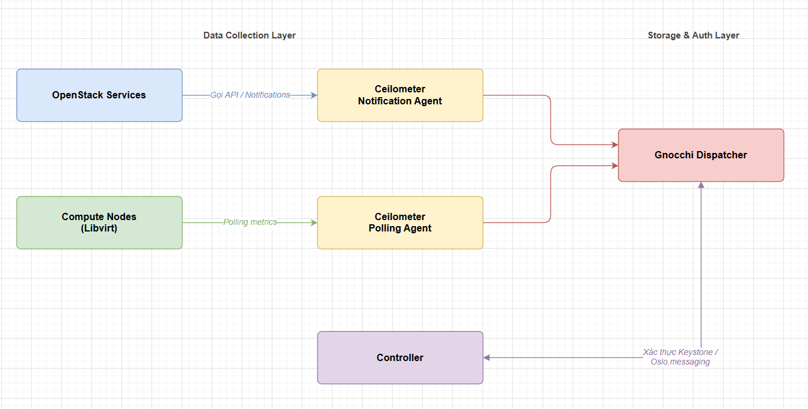
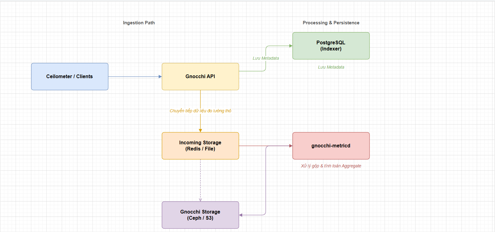
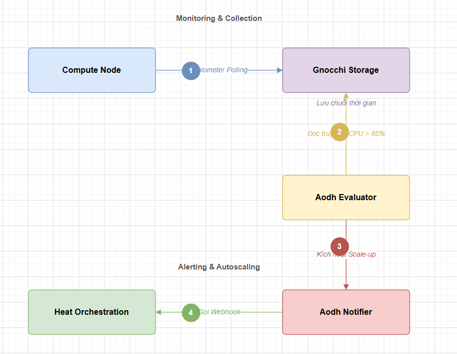

# TỔNG QUAN VỀ TELEMETRY (CEILOMETER & GNOCCHI & AODH) TRÊN OPENSTACK

> **Phiên bản tham chiếu**: OpenStack **2026.1 Gazpacho** + Ceilometer **22.x** + Gnocchi **4.x** + Aodh **18.x**

## I. CEILOMETER — THU THẬP DỮ LIỆU ĐO LƯỜNG (TELEMETRY)

**Ceilometer** là dịch vụ chịu trách nhiệm thu thập, lọc và chuyển tiếp toàn bộ dữ liệu đo lường (metrics) và sự kiện (events) từ các dịch vụ khác nhau của OpenStack về một nguồn quản lý tập trung. Nó đóng vai trò là "chốt chặn đầu tiên" (Data Collector) trong hệ sinh thái Telemetry.

### 1. Kiến trúc nội bộ của Ceilometer

- **Agent Polling (Ceilometer Polling Agent - `ceilometer-polling`)**:

  - Chạy trên các Compute Node để lấy các số liệu thô (ví dụ: chu kỳ CPU, dung lượng đĩa ảo đã đọc/ghi, lưu lượng card mạng ảo) bằng cách truy vấn trực tiếp hypervisor (libvirt, xen) hoặc thông qua SNMP.
  - Chạy trên Controller Node để gọi các API của Nova, Cinder, Neutron, Glance để lấy metadata trạng thái tài nguyên.

- **Notification Agent (Ceilometer Notification Agent - `ceilometer-notification`)**:

  - Lắng nghe trực tiếp trên hệ thống hàng đợi Message Queue (RabbitMQ) để hứng các tin nhắn thông báo (Notification Events) phát ra từ các dịch vụ khác (ví dụ: Nova phát sự kiện `compute.instance.create.end`, Neutron phát sự kiện tạo Port mới).
  - Nó tiến hành chuẩn hóa và chuyển đổi các event này thành dữ liệu đo lường (Sample).

- **Cơ chế Dispatcher (Thay thế cho Collector cũ)**:

  - Trong các phiên bản OpenStack mới nhất, thành phần *Collector* truyền thống ghi trực tiếp vào DB đã bị loại bỏ hoàn toàn nhằm tránh quá tải cơ sở dữ liệu.
  - Thay vào đó, Ceilometer sử dụng cơ chế **Dispatcher** (như `gnocchi` dispatcher). Notification Agent sẽ trực tiếp gửi dữ liệu đã chuẩn hóa sang Gnocchi API thông qua HTTP REST, tối ưu hiệu năng và tách biệt vai trò lưu trữ chuỗi thời gian.

### 2. Các thành phần phụ thuộc (Dependencies)

- **Keystone**: Cần thiết để xác thực tài khoản dịch vụ `ceilometer` và cấp quyền truy cập các API dịch vụ khác.

- **Oslo.messaging**: Thư viện framework nội bộ của OpenStack giúp đóng gói và chuẩn hóa các thông điệp trao đổi giữa các tiến trình.

- **Message Queue (MQ - RabbitMQ)**: Thành phần bắt buộc để Ceilometer lắng nghe và đón nhận các Notification message từ các dịch vụ core của đám mây.

## II. GNOCCHI — LƯU TRỮ METRIC CHUỖI THỜI GIAN (TIME-SERIES DATABASE)

**Gnocchi** là một dịch vụ chuyên dụng, độc lập được thiết kế để lưu trữ và quản lý dữ liệu chuỗi thời gian (Time-series) và Metadata tài nguyên trên quy mô cực lớn. Nó thay thế hoàn toàn cho database MySQL cũ của Ceilometer vốn dễ bị treo khi số lượng VM tăng cao.

### 1. Kiến trúc nội bộ của Gnocchi

- **Gnocchi API (`gnocchi-api`)**:

  - Cổng giao tiếp REST API nhận dữ liệu đo lường thô (Measures) từ Ceilometer gửi sang, đồng thời trả lời các truy vấn dữ liệu từ người dùng hoặc hệ thống Alarm (Aodh).

- **Gnocchi Metric Daemon (`gnocchi-metricd`)**:
  - Tiến trình chạy ngầm làm nhiệm vụ xử lý bất đồng bộ (Async). Nó lấy các gói tin dữ liệu đo lường thô từ bộ nhớ tạm (Incoming storage), thực hiện tính toán gộp (Aggregate) theo chính sách lưu trữ (Archive Policy) và lưu kết quả vào kho lưu trữ vĩnh viễn.

- **Indexer**:
  - Cơ sở dữ liệu chuyên dùng để lưu trữ mối quan hệ (Metadata) của tài nguyên (ví dụ: máy ảo nào, dung lượng bao nhiêu, liên kết với metric nào). Cơ sở dữ liệu khuyến nghị cho Indexer là **PostgreSQL** (hoặc MariaDB).

- **Storage**:

  - Nơi lưu trữ thực tế dữ liệu chuỗi thời gian đã được nén và gộp. Hỗ trợ các driver backend lưu trữ phân tán lớn như **Ceph (RADOS)**, **S3 compatible object storage**, **OpenStack Swift** hoặc đơn giản là tệp tin cục bộ (**File**).

### 2. Các thành phần phụ thuộc

- **PostgreSQL**: Bắt buộc để làm cơ sở dữ liệu Indexer tốc độ cao.

- **Kho lưu trữ ngoài (Ceph/S3/File)**: Phụ thuộc vào cấu hình lưu trữ vĩnh viễn (Storage driver). Đối với production lớn, Ceph là lựa chọn tối ưu nhất.

## III. AODH — HỆ THỐNG CẢNH BÁO TỰ ĐỘNG (ALARMING SERVICE)

**Aodh** là dịch vụ xử lý cảnh báo (Alarming) trong bộ Telemetry. Nhiệm vụ của Aodh là đánh giá liên tục các chỉ số tài nguyên thu thập được từ Gnocchi đối chiếu với các quy tắc do người dùng thiết lập, từ đó kích hoạt các hành động tương ứng (như gọi Webhook, gửi cảnh báo hoặc kích hoạt scale-up/scale-down hạ tầng).

### 1. Kiến trúc nội bộ của Aodh

- **Aodh API (`aodh-api`)**:

  - Cung cấp REST API v2 để người dùng tạo, sửa, xóa các quy tắc cảnh báo (Alarm Rules) và xem lịch sử kích hoạt cảnh báo.

- **Aodh Evaluator (`aodh-evaluator`)**:

  - Trình đánh giá chạy ngầm liên tục gửi yêu cầu query dữ liệu từ Gnocchi để so sánh với các ngưỡng quy tắc đặt ra.
  - Ví dụ: Đọc Gnocchi xem CPU của VM có vượt quá 90% liên tục trong 5 phút không.

- **Aodh Notifier (`aodh-notifier`)**:

  - Khi `aodh-evaluator` xác định trạng thái cảnh báo thay đổi (từ `ok` sang `alarm`), nó sẽ chuyển thông tin sang Notifier để kích hoạt hành động như: gửi tin nhắn qua RabbitMQ, gọi một REST Webhook hoặc gọi API của Heat để kích hoạt Autoscale.

- **Aodh Listener (`aodh-listener`)**:

  - Lắng nghe các sự kiện (Events) trực tiếp từ MQ để kích hoạt các cảnh báo dựa trên sự kiện (Event-based Alarms) mà không cần chờ chu kỳ của Evaluator.

### 2. Các thành phần phụ thuộc khác

- **Keystone**: Để xác thực quyền gọi API của các dịch vụ khác.

- **Gnocchi**: Đây là nguồn cung cấp dữ liệu số duy nhất để Aodh thực hiện đánh giá quy tắc.

- **Message Queue (MQ)**: Để giao tiếp nội bộ giữa Evaluator, Notifier và nhận diện sự kiện hệ thống.

## IV. SỰ PHỐI HỢP HOẠT ĐỘNG TRONG HỆ THỐNG TELEMETRY

Sự kết hợp giữa ba dịch vụ này tạo nên một vòng lặp tự động hóa giám sát và phản hồi tài nguyên khép kín trong đám mây OpenStack.

1. **Ceilometer** liên tục đi tuần và thu thập các chỉ số thô của máy ảo từ hypervisor (Ví dụ: Mức sử dụng CPU của VM-A là 88%).

2. Ceilometer đóng gói dữ liệu và bắn thẳng sang **Gnocchi**. Gnocchi ghi nhận metadata của VM-A vào cơ sở dữ liệu Indexer (PostgreSQL) và lưu chỉ số 88% vào kho lưu trữ chuỗi thời gian (Ceph).

3. **Aodh** chạy ngầm định kỳ 1 phút một lần hỏi Gnocchi: "Mức sử dụng CPU trung bình trong 5 phút qua của VM-A là bao nhiêu?".

4. Gnocchi tính toán và trả lời Aodh.

5. Nếu Aodh phát hiện con số trung bình vượt quá ngưỡng quy tắc (ví dụ quy tắc là > 85%), `aodh-evaluator` đổi trạng thái cảnh báo sang `alarm` và ra lệnh cho `aodh-notifier` thực thi hành động gọi Webhook cấu hình sẵn (ví dụ gọi webhook của Heat Autoscale để tự động sinh thêm 1 VM phụ tải)
