# DEPLOY OPENSTACK HA OCTAVIA ON ANOTHER OPENSTACK USE KOLLA-ANSIBLE USE CINDER LVM BACKEND

## I. MÔ HÌNH DEPLOYMENT

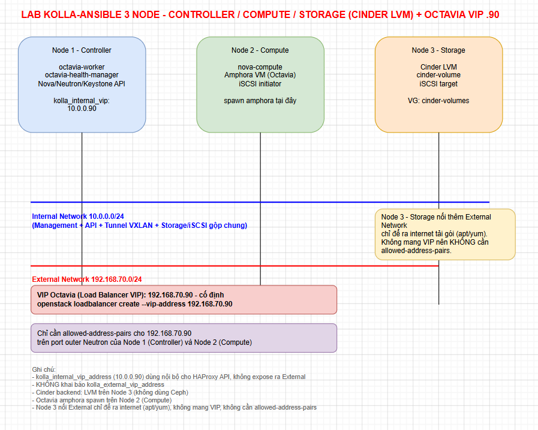

## II. Setup môi trường và quy hoạch IP

**Controller**:

```bash
Host name: controller
CPU  : 8 vCPU
RAM  : 8GB
Disk : 40GB
IP E  : 192.168.70.72
IP I  : 10.0.0.5
OS: Ubuntu 24.04
```

**Compute**:

```bash
Host name: compute
CPU  : 16 vCPU
RAM  : 16GB
Disk : 80GB
IP   : 192.168.70.74
IP I  : 10.0.0.6
OS: Ubuntu 24.04
```

**Storage**:

```bash
hostname: storage
CPU  : 4 vCPU
RAM  : 4GB
Disk : 15GB

Thêm 1 disk:
45GB
IP E  : 192.168.70.78
IP I  : 10.0.0.7
OS: Ubuntu 24.04
```

### 2. Phân hoạch IP

|   Node   |IP quy hoạch                                                                            |
|----------|----------------------------------------------------------------------------------------|
|Controller|192.168.70.72(eth2)/10.0.0.5(eth3)(enable Port Security cả 2 Interface2 dải)            |
|Compute   |192.168.70.74(eth2)/10.0.0.6(eth3)(enable Port Security cho dải external)               |
|Storage   |192.168.70.78(eth2)/10.0.0.7(eth3)                                                      |
|ext VIP   |192.168.70.90                                                                           |
|int VIP   |10.0.0.90                                                                               |

**Note**: Cần cấu hình **allowed address pairs** để OpenStack mẹ không block IP VIP: VIP Internal (10.0.0.90) allow trên Controller (do Keepalived chạy ở đây), và VIP External (192.168.70.90) allow trên Compute (do Octavia Amphora VM spawn ở đây).

## III. THỰC HIỆN LAB

### 1. Cấu hình trên Parent OpenStack (OpenStack Mẹ)

Vì các node Controller, Compute, Storage đang chạy dưới dạng VM trên một hệ thống OpenStack khác, ta cần cho phép các IP VIP (VIP của Internal API và VIP của Octavia) được phép đi qua port mạng của các VM này (tính năng port security của Neutron sẽ block gói tin broadcast/multicast và các IP không thuộc về port nếu không cấu hình).

- **Virtual IP Internal (API)**: Cấu hình `10.0.0.90` (dành cho node Controller nội bộ)
- **Virtual IP External (Octavia VIP)**: Cấu hình `192.168.70.90` (Chỉ dành cho Compute do Amphora VM spawn ở đây)

Thực hiện lệnh sau trên **OpenStack mẹ** để thêm `allowed-address-pairs`:

```bash
# Lấy Port ID của interface external (192.168.70.x) trên Node Compute
openstack port list --server <Tên-Node-Compute-VM>
openstack port set --allowed-address ip-address=192.168.70.90 <Port-ID-External-Compute>

# Lấy Port ID của interface internal (10.0.0.x) trên Node Controller
openstack port set --allowed-address ip-address=10.0.0.90 <Port-ID-Internal-Controller>
```

**Note**: Ta có thể thực hiện trên Dashboard OpenStack để cấu hình `allowed address pairs`, nếu có quyền `admin`:

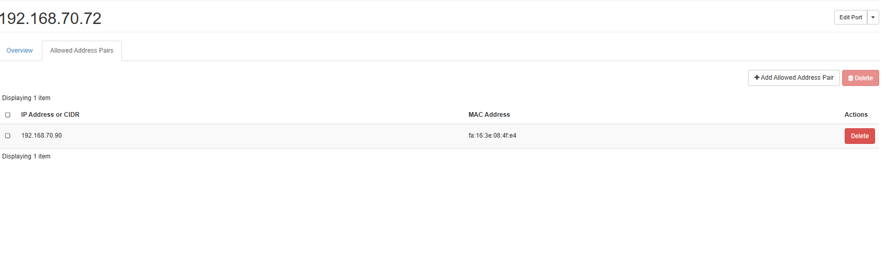

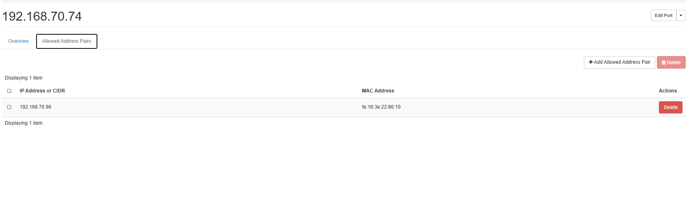

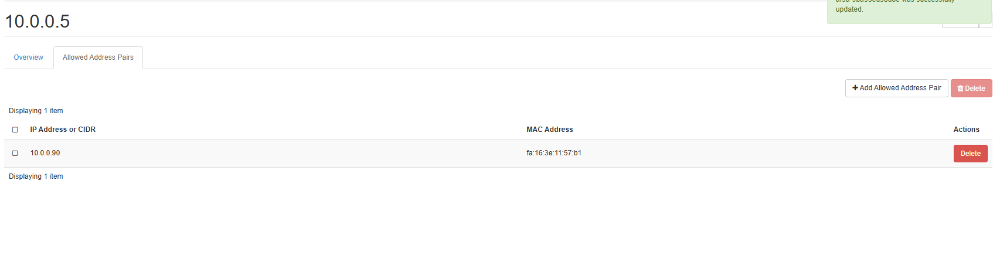

### 2. Chuẩn bị các node (Thực hiện trên cả 3 node)

#### Tắt swap + ufw trên 3 Node Storage và Compute + Controller

```bash
sudo swapoff -a
sudo sed -i '/ swap / s/^/#/' /etc/fstab

sudo systemctl disable --now ufw || true
```

Đặt cấu hình forward gói tin IPv4:

```bash
echo "net.ipv4.ip_forward=1" >> /etc/sysctl.conf
sysctl -p
```

#### Trên 3 Node

```bash
sudo apt update && sudo apt upgrade -y
sudo apt install -y chrony
sudo systemctl enable --now chrony
```

Verify clock đồng bộ:

```bash
chronyc tracking
# System time offset phải < 100ms.
```

#### Cài đặt các gói cơ bản và cấu hình cập nhật hệ thống

```bash
# Tải các gói trên Node Controller
sudo apt install python3-pip python3-dev libffi-dev gcc libssl-dev git -y

# Cực kỳ quan trọng: Phải comment dòng 127.0.1.1 trỏ vào hostname mặc định của Ubuntu. (Trên 3 Node)
# Nếu không RabbitMQ sẽ bind nhầm vào localhost và fail khi tạo cluster.
sudo sed -i '/127.0.1.1/s/^/#/' /etc/hosts

# Thêm hostname vào /etc/hosts trên cả 3 node để nhận diện nội bộ
# LƯU Ý: Chỉ khai báo dải IP Internal (10.0.0.x), KHÔNG khai báo dải External ở đây.
echo "10.0.0.5 controller" | sudo tee -a /etc/hosts
echo "10.0.0.6 compute" | sudo tee -a /etc/hosts
echo "10.0.0.7 storage" | sudo tee -a /etc/hosts
```

**Trên Controller (Node 1):** Tạo SSH Key và copy sang các node (bao gồm cả chính nó) để Ansible điều khiển không cần mật khẩu.

```bash
ssh-keygen -t rsa -N "" -f ~/.ssh/id_rsa
ssh-copy-id root@10.0.0.5
ssh-copy-id root@10.0.0.6
ssh-copy-id root@10.0.0.7
```

Test:

```bash
ssh controller hostname
ssh compute hostname
ssh storage hostname
```

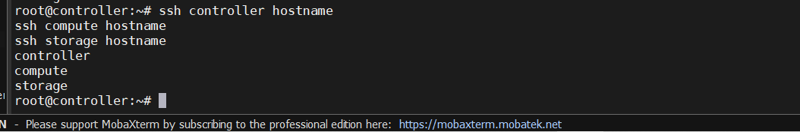

### 3. Cấu hình Cinder LVM trên Node Storage (Node 3)

Trên **Node 3 (Storage)**, bạn có 1 disk thứ 2 dung lượng 45GB (giả sử thiết bị là `/dev/vdb` hoặc `/dev/sdb`), ta cần tạo Volume Group có tên là `cinder-volumes`.

```bash
# Cài đặt lvm2 trên Storage
sudo apt install lvm2 -y

# Tạo Physical Volume và Volume Group
sudo pvcreate /dev/vdb
sudo vgcreate cinder-volumes /dev/vdb
```

### 4. Cài đặt Kolla-Ansible trên Controller (Node 1)

Cài đặt môi trường ảo (virtualenv) và Kolla-Ansible. Ở bài lab này do dùng Ubuntu 24.04 nên bắt buộc phải dùng bản release `2024.1` (Caracal).

```bash
sudo apt install python3-virtualenv -y
virtualenv kolla-venv
source kolla-venv/bin/activate

# Fix lỗi "Ansible requires the locale encoding to be UTF-8"
export LC_ALL=en_US.UTF-8
export LANG=en_US.UTF-8
pip install -U pip
pip install 'ansible>=8,<10' # Yêu cầu phiên bản Ansible 8/9 cho bản 2024.1
pip install git+https://opendev.org/openstack/kolla-ansible@unmaintained/2024.1

# Cài đặt các Ansible Galaxy dependencies (bắt buộc từ bản Zed/Antelope trở lên)
kolla-ansible install-deps

# Tạo thư mục config và copy file cấu hình mẫu
sudo mkdir -p /etc/kolla
sudo chown $USER:$USER /etc/kolla

cp -r kolla-venv/share/kolla-ansible/etc_examples/kolla/* /etc/kolla/
cp kolla-venv/share/kolla-ansible/ansible/inventory/multinode .
```

### 5. Cấu hình Inventory và Globals.yml

**Chỉnh sửa file `multinode` inventory:**

Mở file `multinode` vừa copy và chỉnh sửa các section tương ứng:

```ini
nano multinode

[control]
controller

[network]
controller

[compute]
compute

# Ở đây do dải external của Storage VM là eth2
[storage]
storage network_interface=eth2

# Kéo xuống tìm phần [monitoring], xóa hoặc thêm dấu # đằng trước chữ monitoring01 để vô hiệu hóa nó.

# Cấu hình cài đặt thành phần Octavia
[octavia-api:children]
control

[octavia-driver-agent:children]
control

[octavia-health-manager:children]
control

[octavia-housekeeping:children]
control

[octavia-worker:children]
control
```

**Tạo password cho Kolla:**

```bash
kolla-genpwd
```

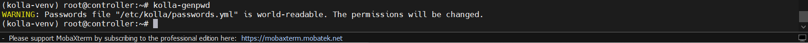

=> Mật khẩu đã được generate thành công!

=> Đây là một cảnh báo rất bình thường và hoàn toàn không phải lỗi. Thậm chí nó là một tính năng bảo mật tốt của Kolla!

- Lý do là file `/etc/kolla/passwords.yml` ban đầu bạn copy vào có quyền đọc quá lỏng lẻo (world-readable - ai trên hệ thống cũng đọc được). Vì file này chứa toàn bộ mật khẩu tối cao của cả cụm OpenStack (Database, RabbitMQ, Admin Dashboard...), nên lệnh kolla-genpwd khi sinh mật khẩu xong đã phát hiện ra điều này và tự động thắt chặt lại quyền file (chuyển về `chmod 600` - chỉ chủ sở hữu mới được đọc) để bảo mật hệ thống.

*Lưu ý: Bạn có thể xem và sửa các mật khẩu trong file `/etc/kolla/passwords.yml`, đặc biệt là `keystone_admin_password` để dễ đăng nhập Dashboard.*

**Chỉnh sửa file cấu hình chính `/etc/kolla/globals.yml`:**

```yaml
kolla_base_distro: "ubuntu"
kolla_install_type: "source"
openstack_release: "2024.1"

# Network IP quy hoạch (IP VIP)
kolla_internal_vip_address: "10.0.0.90"
# Không khai báo kolla_external_vip_address như ghi chú trên sơ đồ

# Giao diện mạng (Thay đổi 'eth0', 'eth1' thành tên thật khi chạy lệnh 'ip a')
network_interface: "eth3" # Interface mạng Internal (10.0.0.x)
neutron_external_interface: "eth2" # Interface mạng External (192.168.70.x)

# LƯU Ý QUAN TRỌNG: Giao diện neutron_external_interface không được có cấu hình IP tĩnh 
# hoặc DHCP trên HĐH host. OpenStack sẽ gỡ IP và dùng port này gắn vào br-ex.

# Enable các dịch vụ Storage
enable_cinder: "yes"
enable_cinder_backend_lvm: "yes"
cinder_volume_group: "cinder-volumes"

# Enable Octavia Load Balancer
enable_octavia: "yes"
octavia_auto_configure: "yes"
octavia_amp_flavor_id: "amphora"

# Octavia yêu cầu Redis để quản lý Taskflow (Jobboard)
enable_redis: "yes"
```

### 6. Cấu hình riêng cho Octavia

Octavia yêu cầu chứng chỉ (Certificates) để các API kết nối an toàn với máy ảo Amphora Loadbalancer. Chạy lệnh sau để Kolla tự động sinh chứng chỉ:

```bash
kolla-ansible -i multinode octavia-certificates
```

Lệnh này sẽ tự động generate các file chứng chỉ trong thư mục `/etc/kolla/config/octavia/`.

### 7. Triển khai (Deploy) OpenStack

Tiến hành chạy các playbook của Kolla-Ansible theo thứ tự:

```bash
# 1. Bootstrap servers (cài đặt docker, chuẩn bị môi trường trên các node)
kolla-ansible -i multinode bootstrap-servers

# 2. Prechecks (kiểm tra cấu hình, kết nối và port conflict)
kolla-ansible -i multinode prechecks

# 3. Pull images (tải OpenStack container images từ Docker Hub / Quay.io)
kolla-ansible -i multinode pull

# Xoá ip trên eth2 trên Controller đi
ip addr flush dev eth2

# SSH controller qua Compute bằng dải internal để chạy lệnh deploy
ssh root@10.0.0.5

# 4. Deploy (thực thi cài đặt OpenStack cluster)
kolla-ansible -i multinode deploy

# Deploy xong gán ip vào br-ext và bật br-int và ovs-system trên Openstack hạ tầng
ip link set br-ex up
ip addr add 192.168.70.72/24 dev br-ex
ip route add default via 192.168.70.1 dev br-ex
echo "nameserver 8.8.8.8" > /etc/resolv.conf
echo "nameserver 8.8.4.4" >> /etc/resolv.conf
# Nếu br-ex lệch MAC với eth 1 thì ép MAC br-ex = MAC eth1(trên controller+ Compute)
docker exec -it openvswitch_vswitchd ovs-vsctl set bridge br-ex other-config:hwaddr=fa:16:3e:08:4f:e4

# Ngoài ra ta phải chạy các lệnh sau để cấp mạng cho VM trên Compute Node. Trên Compute Node:
ip link set br-int up
ip link set ovs-system up
docker restart ovn_controller

# Ta có thể tạo script để gán tự động

# 5. Post-deploy (Tạo file credentials admin-openrc.sh)
kolla-ansible -i multinode post-deploy
```

### 8. Khởi tạo cấu hình mạng và Amphora Image cho Octavia

Sau khi deploy thành công, load file credentials để tương tác với OpenStack API:

```bash
source /etc/kolla/admin-openrc.sh
```

**Tải và upload Octavia Amphora Image:**
Octavia cần một image (Amphora VM) chứa HAProxy để hoạt động như một Load Balancer thực thụ.

```bash
# Tải gói openstackclient trên Controller
pip install openstackclient

# Tải Amphora image (ví dụ bản Ubuntu x64 qcow2 dành cho test/lab)
wget https://tarballs.opendev.org/openstack/octavia/test-images/test-only-amphora-x64-haproxy-ubuntu-focal.qcow2

# Check service oke không:
openstack service list

# Upload image lên Glance
openstack image create amphora-x64-haproxy \
  --container-format bare \
  --disk-format qcow2 \
  --private \
  --tag amphora \
  --file test-only-amphora-x64-haproxy-ubuntu-focal.qcow2 \
  --property hw_architecture='x86_64' \
  --property hw_rng_model=virtio
```

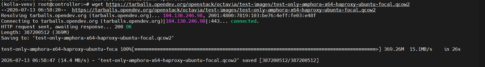

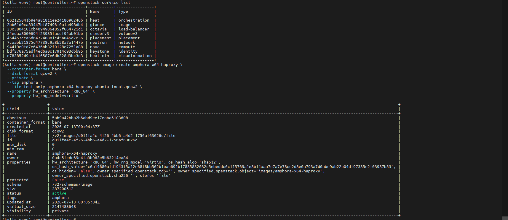

#### Tạo Flavor cho Amphora VM (Yêu cầu tối thiểu: 1 vCPU, 1GB RAM, 2GB Disk)

```bash
openstack flavor create --id amphora --vcpus 1 --ram 1024 --disk 2 amphora
```

**Note**: Nếu báo tồn tại thì khi deploy đã mặc định cài 1 flavor có tên amphora sẵn rồi và ta cần check lại để xem project nào có quyền dùng flavor này.

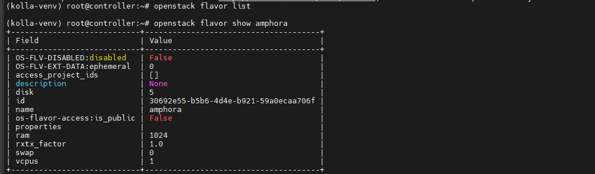
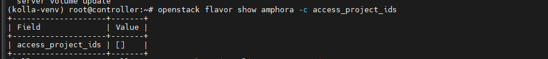

**Note 2**: Không có project nào có quyền thì ta tự gán quyền cho flavor đó vào project `service`:

```bash
# Lấy project_id
openstack project list | grep service

# Thêm quyền cho flavor amphora vào project service
openstack flavor set --project 0a3b64d5c6bc4299b600029eea1bc5a0 amphora
```

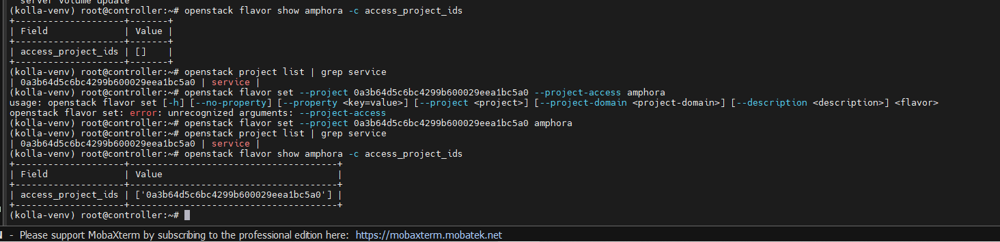

#### Tạo Public/External Network (ví dụ cho dải 192.168.70.x)

*(Điều chỉnh allocation-pool để tránh đụng IP đã cấp cho máy chủ)*:

```bash
openstack network create --external --provider-physical-network physnet1 --provider-network-type flat public1
openstack subnet create --no-dhcp \
  --allocation-pool start=192.168.70.100,end=192.168.70.200 \
  --network public1 \
  --subnet-range 192.168.70.0/24 public1-subnet
```

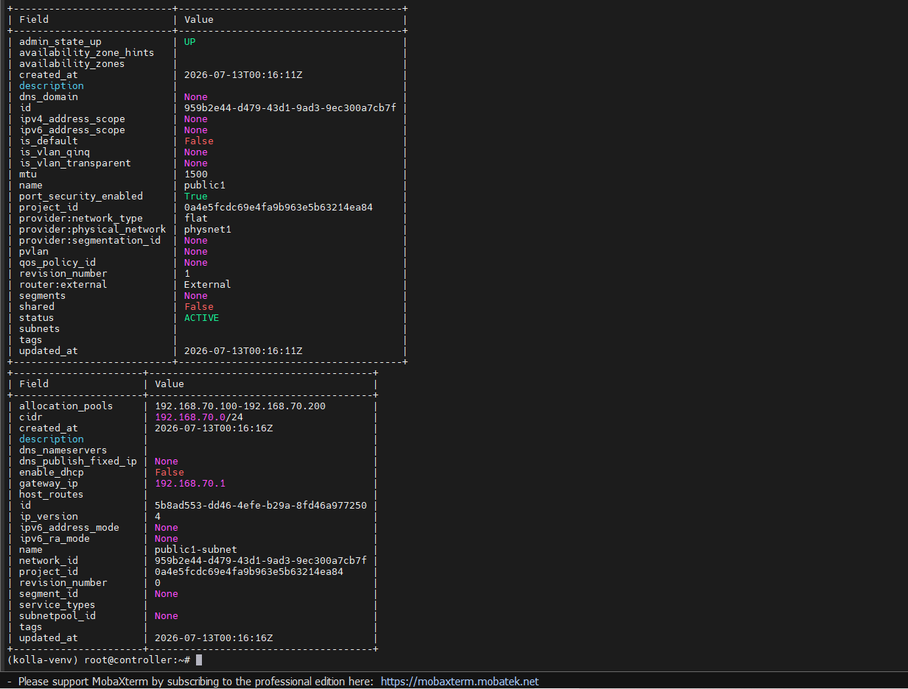

> **Lưu ý**: Kolla-Ansible thường có script `init-runonce` trong folder virtualenv, bạn có thể chạy script này để tạo flavor và mạng cơ bản nhanh chóng, nhưng khuyến nghị tạo thủ công để hiểu rõ topology hơn.

### 9. Khởi tạo Load Balancer thử nghiệm (Test Octavia VIP)

Tiến hành tạo một Load Balancer với **VIP tĩnh** `192.168.70.90` như quy hoạch:

```bash
# tải python-octaviaclient gói để tương tác octavia-lb
pip install python-octaviaclient

# Tạo LoadBalancer với VIP chỉ định trên mạng public1
openstack loadbalancer create --name lb-test-1 \
  --vip-network-id public1 \
  --vip-address 192.168.70.90
```

**Kiểm tra quá trình khởi tạo (Provisioning Status):**

```bash
watch -n 5 openstack loadbalancer show lb-test-1
```

- Đợi đến khi trạng thái chuyển từ `PENDING_CREATE` sang `ACTIVE`.
- Quá trình này sẽ mất một lúc do dịch vụ Nova cần spawn Amphora VM trên node Compute.
- Khi trạng thái là `ACTIVE`, nghĩa là Amphora VM đã boot thành công và nhận địa chỉ VIP `192.168.70.90`, bạn có thể kiểm tra ping từ Parent OpenStack network đến VIP này (đảm bảo allowed-address-pairs ở Bước 1 đã hoạt động đúng).
