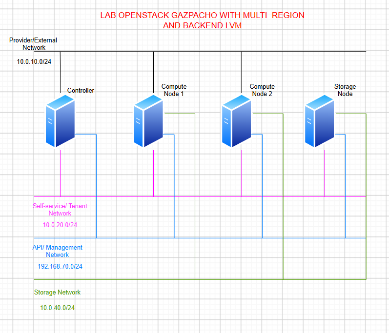

# DEPLOY OPENSTACK MULTI REGION GAZPACHO WITH BACKEND LVM

## I. TỔNG QUAN LAB

### 1. Topo Lab



### 2. Quy hoạch IP

| Node | Provider/External Network<br>(10.0.10.0/24) | API/Management Network<br>(192.168.70.0/24) | Storage Network<br>(10.0.40.0/24) | Self-service/Tenant Network<br>(10.0.20.0/24) |
|---|---|---|---|---|
| **Controller** | `eth0`: 10.0.10.11 | `eth1`: 192.168.70.72 | N/A | `eth2`: 10.0.20.21 |
| **Compute Node 1** | `eth0`: 10.0.10.12 | `eth1`: 192.168.70.74 | `eth2`: 10.0.40.41 | `eth3`: 10.0.20.22 |
| **Compute Node 2** | `eth0`: 10.0.10.13 | `eth1`: 192.168.70.76 | `eth2`: 10.0.40.42 | `eth3`: 10.0.20.23 |
| **Storage Node** | N/A | `eth0`: 192.168.70.78 | `eth1`: 10.0.40.43 | N/A |

### 3. Quy hoạch Phần cứng

| Node | OS | vCPU | RAM | Disk (ROM) | Ghi chú |
|---|---|---|---|---|---|
| **Controller** | Ubuntu 22.04.5 LTS | 4 | 6 GB | 50 GB | Cài đặt Control Plane (Keystone, Glance, Nova API, Neutron Server, Horizon...) |
| **Compute Node 1** | Ubuntu 22.04.5 LTS | 4 | 6 GB | 50 GB | Chạy các máy ảo Tenant (Nova Compute, OVS/OVN) |
| **Compute Node 2** | Ubuntu 22.04.5 LTS | 4 | 6 GB | 50 GB | Chạy các máy ảo Tenant (Nova Compute, OVS/OVN) |
| **Storage Node** | Ubuntu 22.04.5 LTS | 2 | 6 GB | 50 GB + 50GB (sdb) | Cài đặt Cinder Volume (Backend LVM) |

## II. THỰC HÀNH LAB

### 1. Cấu hình chung cho tất cả các node

Thực hiện trên tất cả các node (Controller, Compute 1, Compute 2, Storage).

#### 1.1. Cập nhật hệ thống và cài đặt các gói cần thiết

```bash
sudo apt update && sudo apt upgrade -y
sudo apt install python3 python3-pip git chrony vim -y
```

#### 1.2. Cấu hình phân giải tên miền (DNS)

Sửa file `/etc/hosts` trên tất cả các node để chúng có thể giao tiếp với nhau qua hostname.

```bash
cat <<EOF | sudo tee -a /etc/hosts
192.168.70.72   controller
192.168.70.74   compute1
192.168.70.76   compute2
192.168.70.78   storage
EOF
```

#### 1.3. Cấu hình đồng bộ thời gian (NTP)

Kolla-Ansible yêu cầu đồng bộ thời gian giữa các node để tránh các lỗi liên quan đến xác thực (Keystone) và clustering (RabbitMQ, Galera).

```bash
sudo systemctl enable chrony
sudo systemctl start chrony
```

#### 1.4. Tắt Firewall (Tùy chọn nhưng khuyến nghị trong Lab)

Để tránh việc các port bị block trong quá trình deploy các project trong OpenStack:

```bash
sudo ufw disable
```

#### 1.5. Thiết lập SSH Passwordless (Từ node triển khai đến các node khác)

Nếu bạn đứng từ Controller để chạy Kolla-Ansible, cần tạo SSH Key và copy sang tất cả các node.
*(Chỉ thực hiện trên node Controller/Deploy)*

```bash
# Tạo SSH Key (nhấn Enter cho tất cả các bước)
ssh-keygen -t rsa -N ""

# Copy key sang các node (bao gồm cả chính nó)
ssh-copy-id root@controller
ssh-copy-id root@compute1
ssh-copy-id root@compute2
ssh-copy-id root@storage
```
