# TƯƠNG TÁC API TRONG OPENSTACK

## I. MÔI TRƯỜNG

Môi trường Lab là ta sẽ thực hiện trên cụm OpenStack mà ta đã dựng sau [đây](https://github.com/tiend9/Tim-hieu-OPNsense/blob/main/15.Deployment_OPS/05.Deploy_OPS_with_Kolla_Ansible/04.Deploying_OpenStack_Backend_Swift_With_KollaAnsible.md). Đối Với các bài tương tác với Backend Ceph thì ta dùng cụm lab sau [đây](https://github.com/tiend9/Tim-hieu-OPNsense/blob/main/15.Deployment_OPS/02.Deploy_OPS_HA/01.Deloy_OPS_HA_on_another_OPS.md)

## II. THỰC HÀNH TƯƠNG TÁC API

### 1. Tương tác với KeyStone Services

#### 1.1 Lấy Token (v3/auth/tokens)

Đầu tiên tạo WorkSpace trong giao diện Postman

Tiếp theo, tạo **Enviroments** cho Lab → New Environment → đặt tên `OpenStack-Lab`.

**Note1**: Ta tạo biến môi trường để làm gì ?

Ta tạo biến môi trường dùng để lưu các biến mà request có thể dùng lại, thay vì bạn phải gõ đi gõ lại.

Ví dụ dễ hiểu:

- Bạn có API ở nhiều môi trường:

```text
Local: http://localhost:3000
Dev: https://dev-api.example.com
Production: https://api.example.com
```

- Thay vì mỗi request phải viết URL đầy đủ như:

```text
https://dev-api.example.    com/users
```

- Bạn tạo biến environment:

```text
baseUrl = https://dev-api.    example.com
```

- Rồi trong request dùng:

```text
{{baseUrl}}/users
```

=> Khi muốn chuyển từ **Dev** sang **Production**, bạn chỉ cần đổi **environment** hoặc đổi giá trị **baseUrl**, không cần **sửa từng request**.

**Environment** thường dùng để lưu:

```text
baseUrl — domain API
token — access token sau khi login
userId, orderId — ID dùng cho request tiếp theo
apiKey — khóa API
thông tin cấu hình theo từng môi trường: dev, staging, prod
```

**Note2**: Sau đây là bảng giá trị biến các Project service biến mà ta cần nhớ.

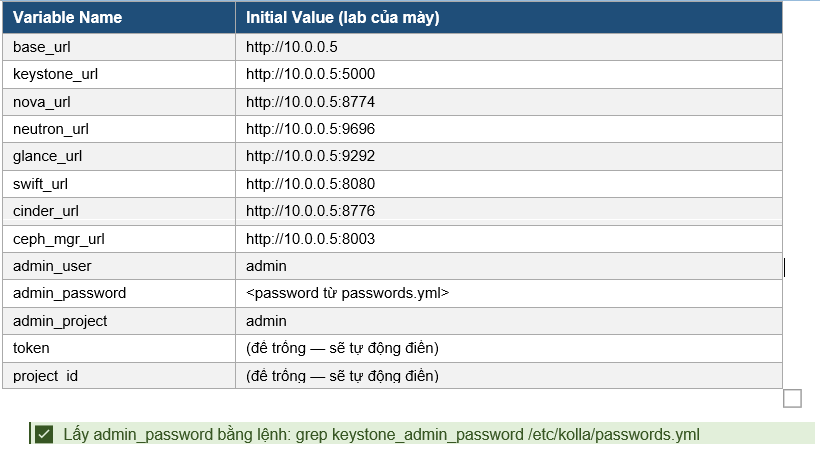

- Lấy `admin_password` bằng lệnh `grep keystone_admin_password /etc/kolla/passwords.yml` trên Controller

Và các biến này ta sẽ gán vào cụm lab, để setup các biến thuộc môi trường cụm lab **OpenStack Swift** mà ta cần test:

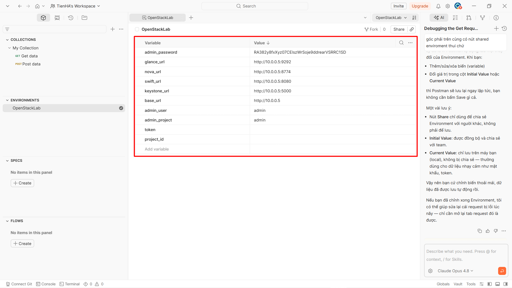

- `Ctrl + S` để lưu biến môi trường này vào và chọn dùng biến môi trường ở góc bên phải trên cùng của bảng biến

Sau đó, Tạo Request mới (ở dấu cộng ngay cạnh tab biến môi trường ):

```text
Method: Chuyển từ GET → POST
URL: {{keystone_url}}/v3/auth/tokens
```

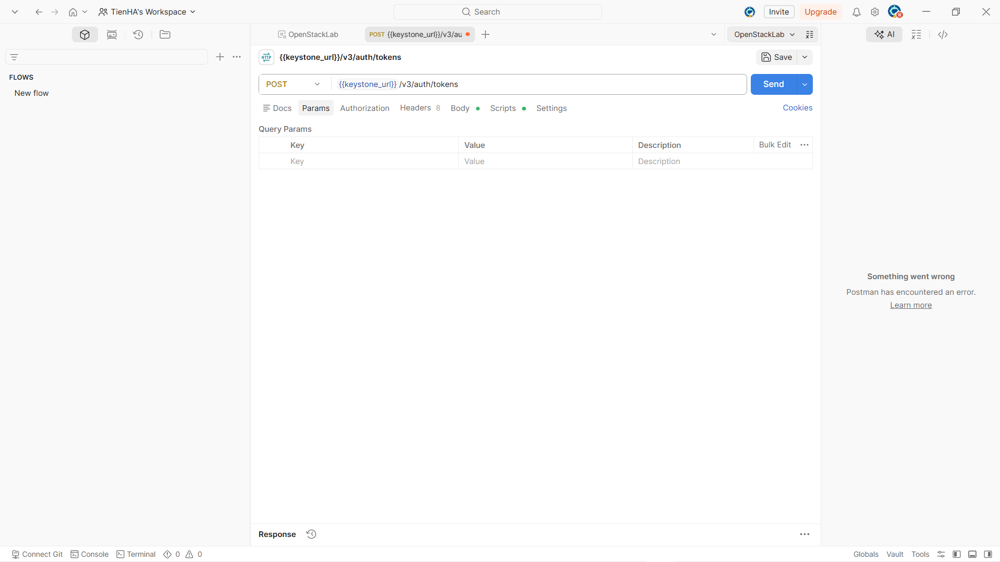

Phần Body lệnh `POST` chọn Format `RAW` và ta dán như sau:

```Json
{
  "auth": {
    "identity": {
      "methods": ["password"],
      "password": {
        "user": {
          "name": "{{admin_user}}",
          "domain": { "name": "Default" },
          "password": "{{admin_password}}"
        }
      }
    },
    "scope": {
      "project": {
        "name": "{{admin_project}}",
        "domain": { "name": "Default" }
      }
    }
  }
}
```

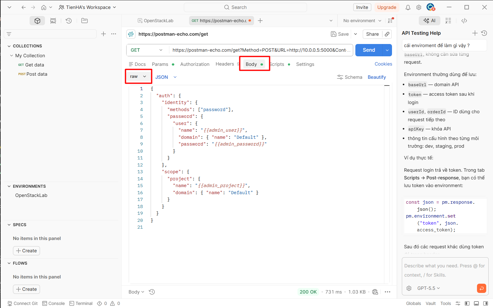

Tiếp theo ta tạo phần **test Script**

**Note3**: Trong Postman, phần Scripts có 2 phần chính:

- Pre-request
- Post-response

Nhiều người vẫn quen gọi là **Tests** hoặc **Post-request**, nhưng trong giao diện mới thường là **Post-response**.

Nói đơn giản:

- **Pre-request** chạy trước khi gửi request.
- **Post-response** chạy sau khi nhận response từ API.

1. **Pre-request** dùng để làm gì?

**Pre-request** dùng để chuẩn bị dữ liệu trước khi gọi API.

Ví dụ thường gặp:

- Tạo token hoặc lấy token trước khi gọi API chính
- Tạo timestamp, chữ ký bảo mật, random data
- Set biến vào environment
- Tự động thêm header
- Bỏ qua request trong một số điều kiện

2. **Post-response** dùng để làm gì?

**Post-response** chạy sau khi API trả kết quả.

Nó thường dùng để:

- Kiểm tra status code
- Kiểm tra response có đúng dữ liệu không
- Kiểm tra response body có field cần thiết không
- Lưu token, userId, orderId từ response vào environment
- Điều khiển request tiếp theo khi chạy collection

Vào tab `Tests`, dán script sau vào phần `post-res` để tự động parse và lưu token vào environment:

```javascript
// Lấy token từ response header X-Subject-Token
const token = pm.response.headers.get("X-Subject-Token");
pm.environment.set("token", token);

// Parse project_id từ body
const body = pm.response.json();
const projectId = body.token.project.id;
pm.environment.set("project_id", projectId);

console.log("Token saved:", token);
console.log("Project ID:", projectId);
```

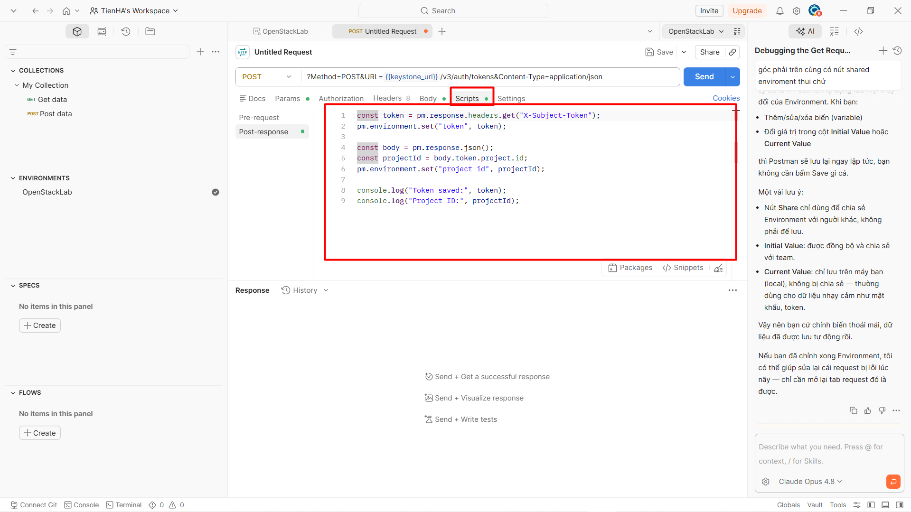

Cuối cùng, Click nút `Send` màu xanh để call API lấy Token KeyStone:

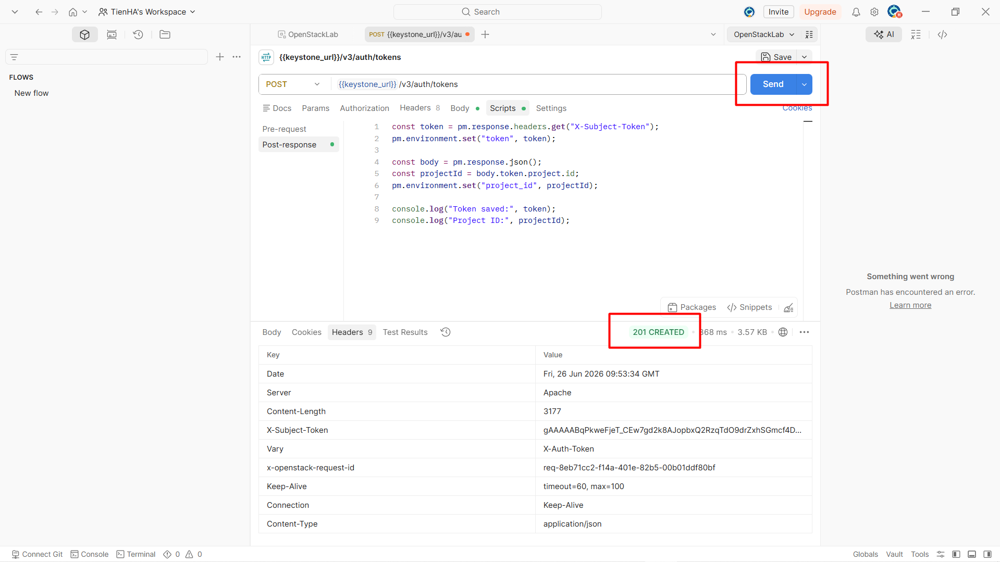

Check để xác nhận Token đã lưu:

- Click vào Environment đang dùng (góc trên phải) → click icon con mắt
- Kiểm tra biến token và `project_id` đã có giá trị chưa
- Hoặc mở Console (View → Show Postman Console) để xem log:

```text
Token saved: gAAAAABh...
Project ID: abc123...
```

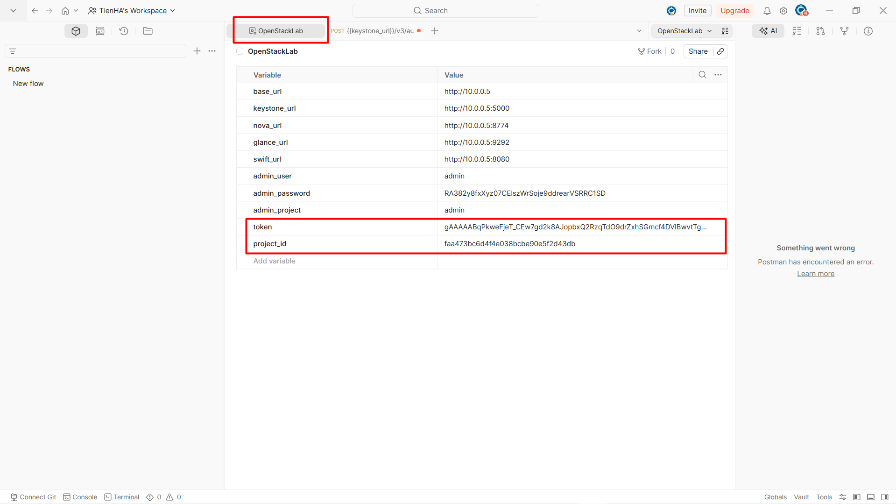

Token **Keystone** mặc định có hiệu lực 1 giờ. Sau khi hết hạn phải lấy lại.

**Note4**: Tại sao lấy token Fernet ở Keystone không phải phương thức `GET` mà lại là `POST`?

*Bản chất của vấn đề*:

- `GET` theo chuẩn HTTP là "lấy tài nguyên đã tồn tại" — không có body, không có side effect.

- `POST` là "tạo ra tài nguyên mới" — có body, có side effect.
Khi bạn gọi `/v3/auth/tokens`, bạn không phải đang đọc một token có sẵn — bạn đang yêu cầu Keystone tạo ra một token mới dựa trên credentials bạn cung cấp. Đây là hành động tạo mới (create), nên dùng `POST` là đúng chuẩn `REST`.(**Credentials** ta cung cấp ở đây chính là `admin_password` mà bạn phải lấy ở **Controller**)

- Lợi ích lấy Token Fernet để làm 1 cái **Credenticals thứ hai** để request các service khác nhanh hơn (do không lưu trong DB như `UUID`) do nó giúp tách biệt dữ liệu response trả về **header** với **metadata** (Phần body) để xử lí.

#### 1.2 Kiểm tra Token

Bước đầu tiên nhấp dấu `+` trên cùng để tạo 1 request mới.

Chỉnh phần header request sao cho hợp với bảng sau:

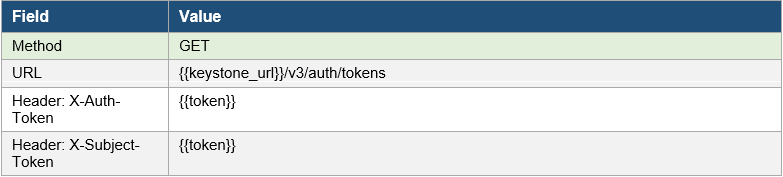

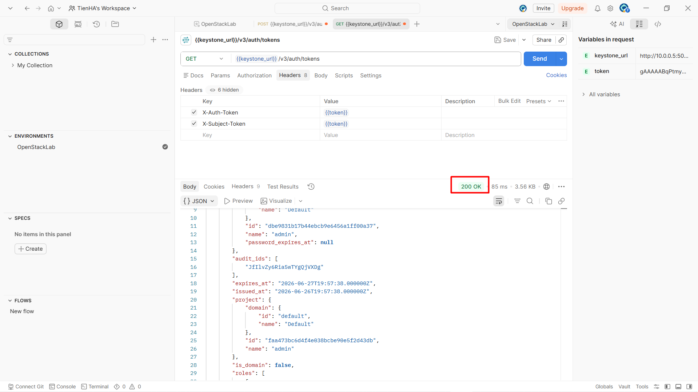

=> Kết quả trả về status `200` (thành công):

- Thông tin về token đang dùng, gồm user `admin` (domain `Default`).
- Project admin, các role (`manager`, `admin`, `member`, ~reader~)
- Thời gian hết hạn token (`2026-06-27`), và **service catalog** liệt kê các endpoint dịch vụ OpenStack (Neutron, v.v.).

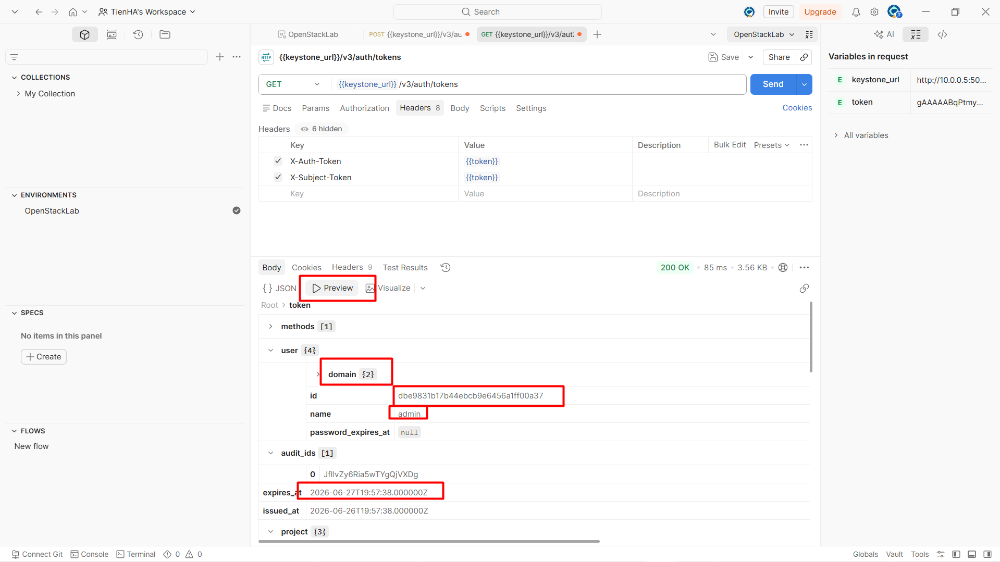

#### 1.3 Lấy danh sách các Users

Bước đầu tiên nhấp dấu `+` trên cùng để tạo 1 request mới.

Chỉnh phần header request sao cho hợp với bảng sau:

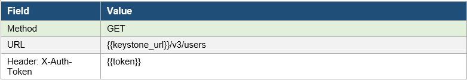

=> Kết quả trả về status `200` (thành công):

- Thông tin các `user` có trong Domain `Default`.

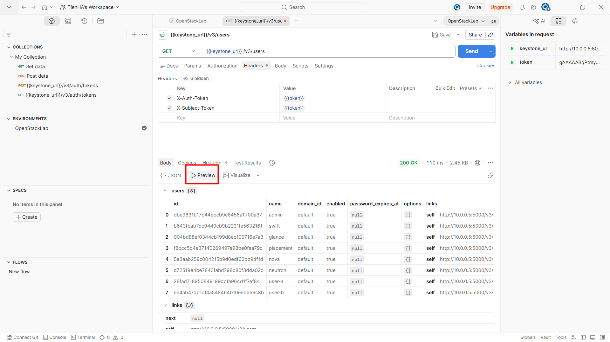

#### 1.4 Lấy danh sách Projects

Bước đầu tiên nhấp dấu `+` trên cùng để tạo 1 request mới.

Chỉnh phần header request sao cho hợp với bảng sau:

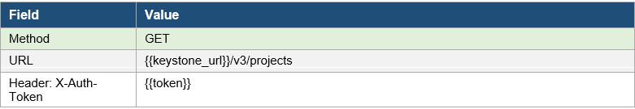

=> Kết quả trả về status `200` (thành công):

- Thông tin các `projects` có trong Domain `Default`.

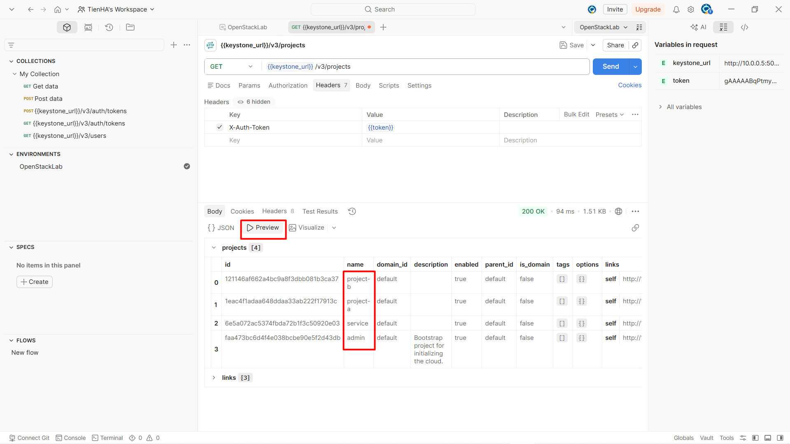

#### 1.5 Lấy Danh sách Services và Endpoints

Bước đầu tiên nhấp dấu `+` trên cùng để tạo 1 request mới.

Chỉnh phần header request sao cho hợp với bảng sau:

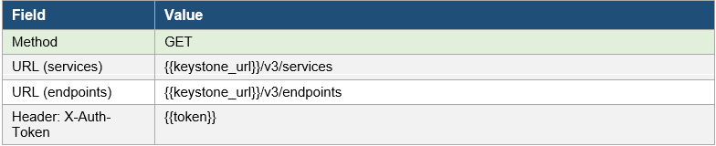

=> Kết quả trả về status `200` (thành công):

- Thông tin các `endpoint + services` có trong Domain `Default`.

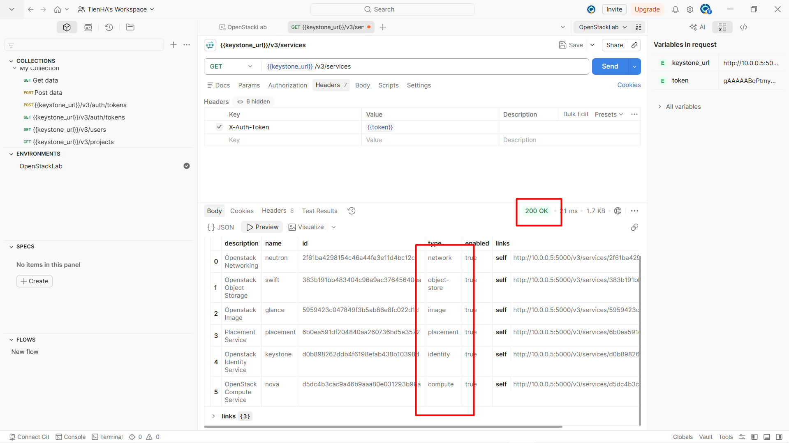

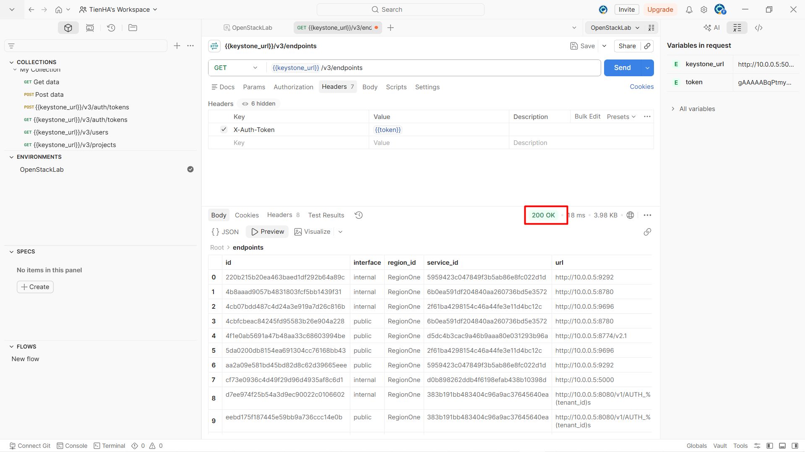

### 2. Tương tác với Nova Services

*Nova* là Compute Service quản lý vòng đời của VM (instances). Port mặc định: `8774`.

**Lưu ý**: `Header X-Auth-Token`: `{{token}}` là BẮT BUỘC cho tất cả **Nova API**.

#### 2.1 List Instances

Chúng ta sẽ tạo lệnh request với các trường thông tin như sau:

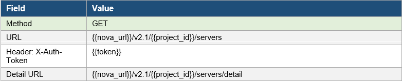

=> Kết quả trả về status `200` (thành công):

- Thông tin các `Instances` có trong Project `Project_ID`.

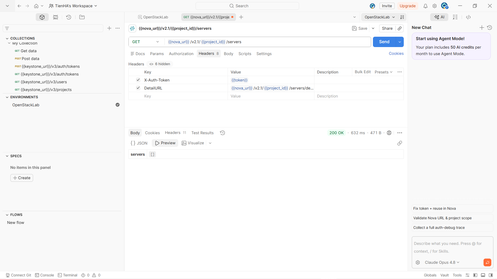

#### 2.3 Lấy Flavor_ID

Ta setup request `GET {{nova_url}}/v2.1/flavors` và `X_Auth_Token`

#### 2.4 Tạo Instances

Do máy ảo là **tài nguyên** chưa được tạo lên ta phải dùng Method `POST`:

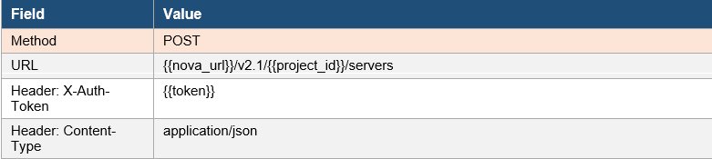

Phần Body ta chọn dạng `RAW` và set up như sau(nhớ dán `Flavor_id` và `Image_id` cả `Network_id` ):

```Json
{
  "server": {
    "name": "test-vm-postman",
    "imageRef": "<image_id>",
    "flavorRef": "<flavor_id>",
    "networks": [{ "uuid": "<network_id>" }],
    "security_groups": [{ "name": "default" }]
  }
}
```

Ta Lấy `image_id` bằng request `GET {{glance_url}}/v2/images` hoặc vào Controller lấy.

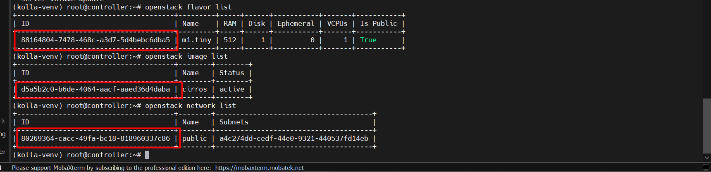

=> Kết quả trả về status `202` (thành công):

- Response trả về `202` là server đã nhận xác thực nhưng chưa chắc đã tạo tài nguyên thành công và check trên Controller thì VM đã bị state `ERROR`.

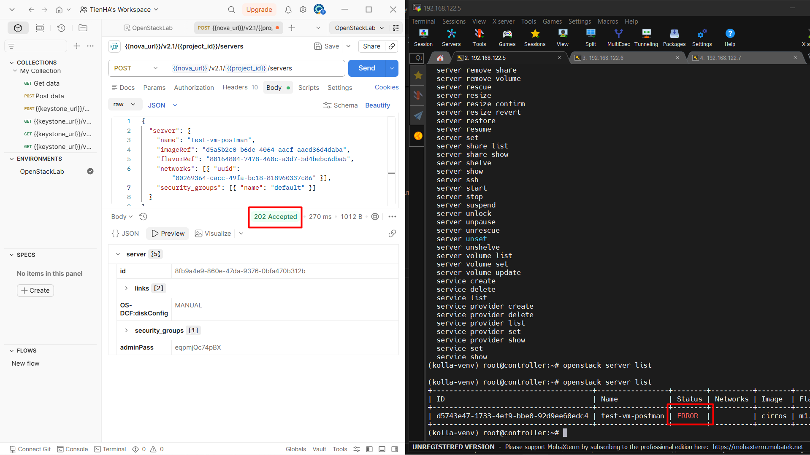

=> Qua đoạn này đến phần **2.5** sẽ hướng dẫn check ERROR của VM thông qua trường `fault`.

#### 2.5 Xem Chi Tiết Instance

**Note**: Để xem được lý do, mình sẽ tạo và gửi một request GET lấy chi tiết server vừa tạo (`test-vm-postman`) — field `fault` sẽ cho biết chính xác vì sao VM bị `ERROR`.

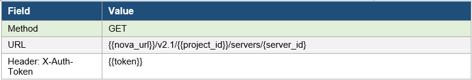

=> Kết quả từ trường `fault` chỉ ra rằng lỗi nằm do Compute (service chết, ...). Từ đó ta rút gọn đi các bước kiểm tra.

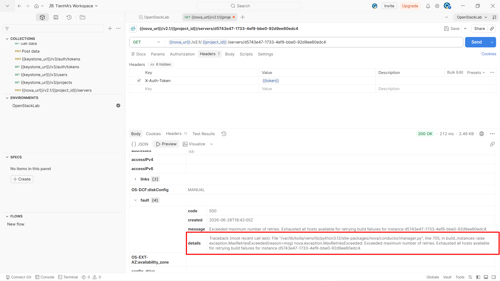

#### 2.6 Các Action với VM (Start/ Stop/ Reboot/ Delete)

Actions **Start; Stop; Reboot; Pause; Unpause VM** ta Set up request như sau:

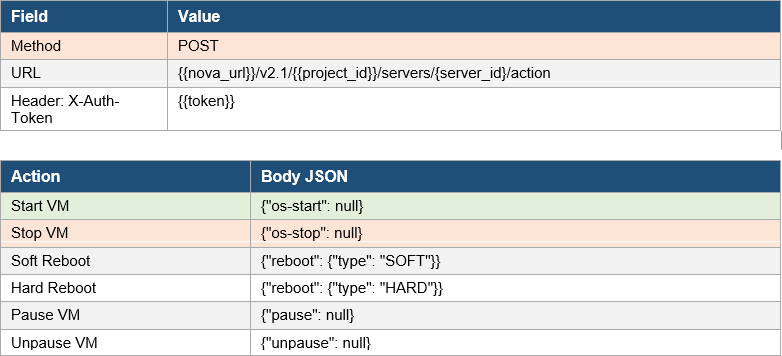

Giả sử ta có 1 VM chưa `START` như sau:

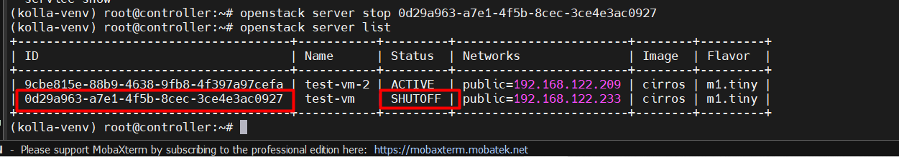

=> Kết quả các action trả về `2xx` là thành công:

- Bật VM:

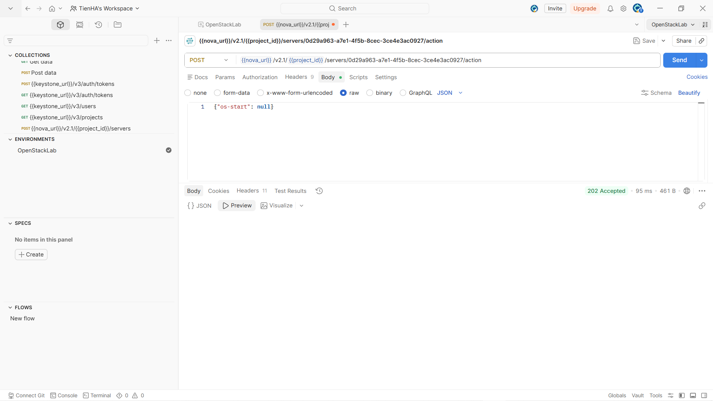

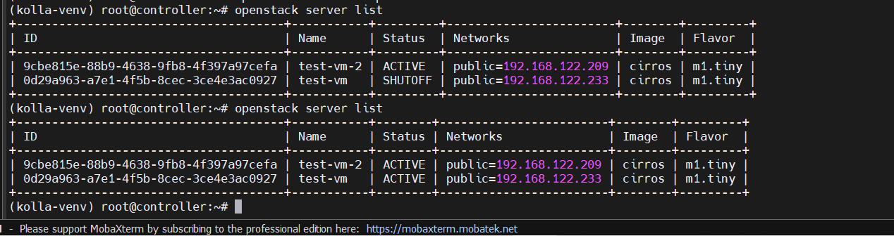

- Stop VM:

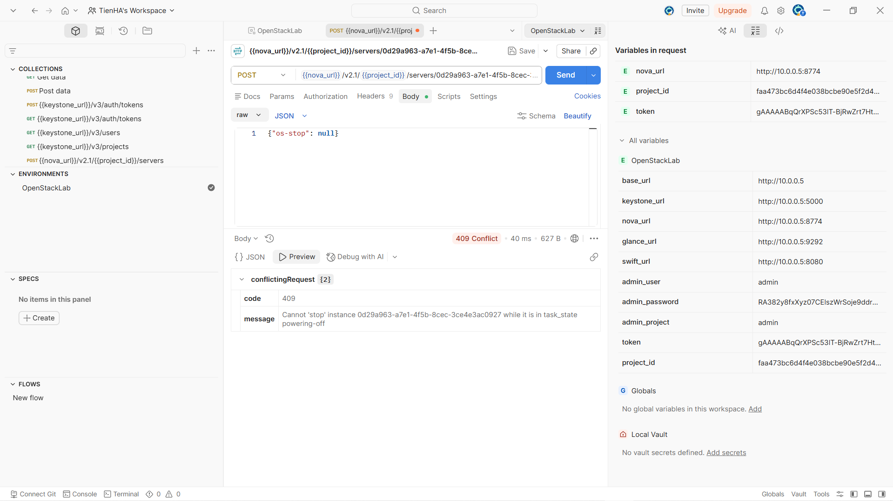

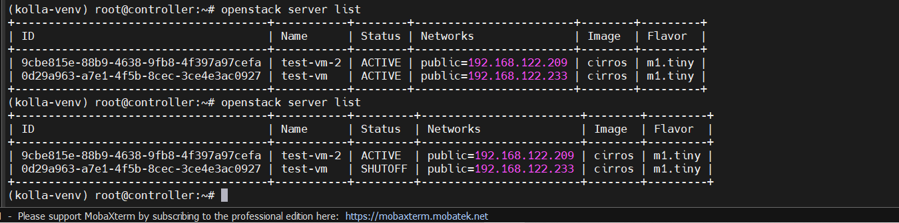

...

Đối với Action **Delete VM** ta Setup request như sau:

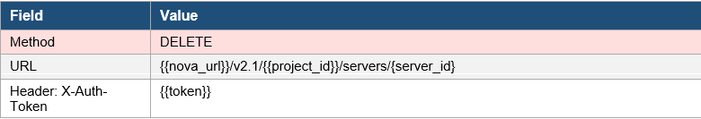

=> Kết quả trả về status `204` (thành công):

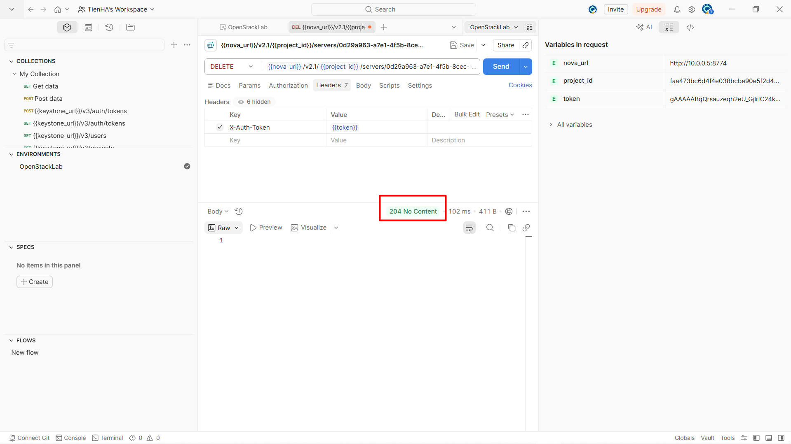

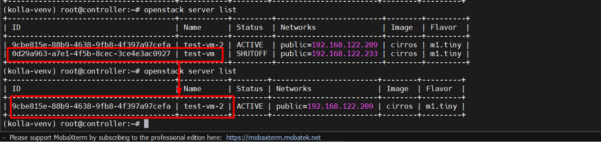

#### 2.7 Flavors và Keypairs

Đối với các action với **Flavor** và **Keypairs** ta Set up request như sau:

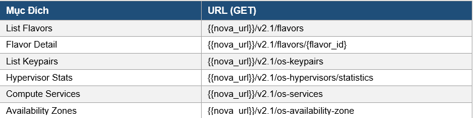

**Note**: Đối với các action mà resource chưa có trước như tạo Flavor thì ta dùng Method `POST`.

### 3. Tương tác với Network Services

*Neutron* là Network Service quản lý networks, subnets, routers, security groups, floating IPs. Port: `9696`.

**Lưu ý**: `Header X-Auth-Token`: `{{token}}` là **BẮT BUỘC** cho tất cả **Neutron API**.

#### 3.1 List Networks

Ta setup request `GET {{neutron_url}}/v2.0/networks` và `X_Auth_Token`

#### 3.2 Create Network

Ta setup request `POST {{neutron_url}}/v2.0/networks` và `X_Auth_Token`

Và thêm phần Boby với Format là `RAW`:

```Json
{
  "network": {
    "name": "private-net",
    "admin_state_up": true
  }
}
```

#### 3.3 Create Subnet

Ta setup request `POST {{neutron_url}}/v2.0/subnets` và `X_Auth_Token`

Và thêm phần Boby với Format là `RAW`:

```Json
{
  "subnet": {
    "network_id": "<network_id>",
    "ip_version": 4,
    "cidr": "192.168.100.0/24",
    "name": "private-subnet",
    "gateway_ip": "192.168.100.1",
    "dns_nameservers": ["8.8.8.8", "8.8.4.4"]
  }
}
```

**Note**: Lấy `network_id` bằng request `GET {{neutron_url}}/v2.0/networks` ở trên hoặc trong Controller.

=> Kết quả trả về status `200` (thành công) ta sẽ check list network:

- Đầu tiên là tạo private network `private-net`:

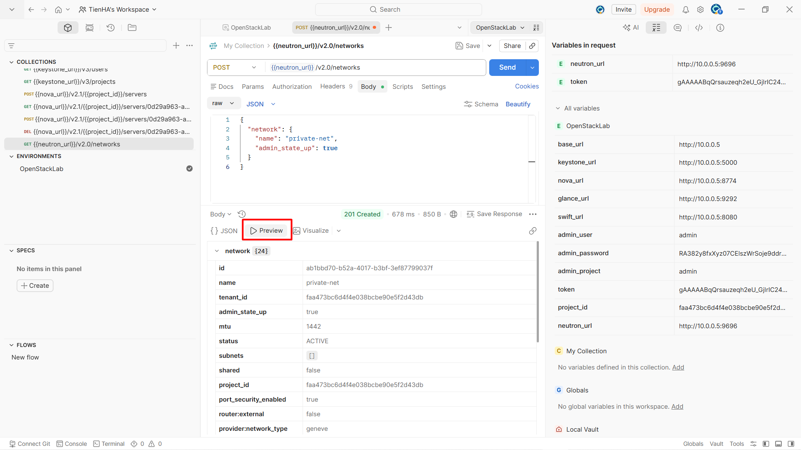

- Tiếp theo tạo subnet `private-subnet`:

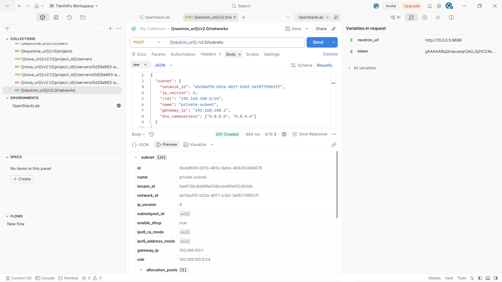

- Cuối cùng check xem `private-net` và `private-subnet` đã được tạo thành công:

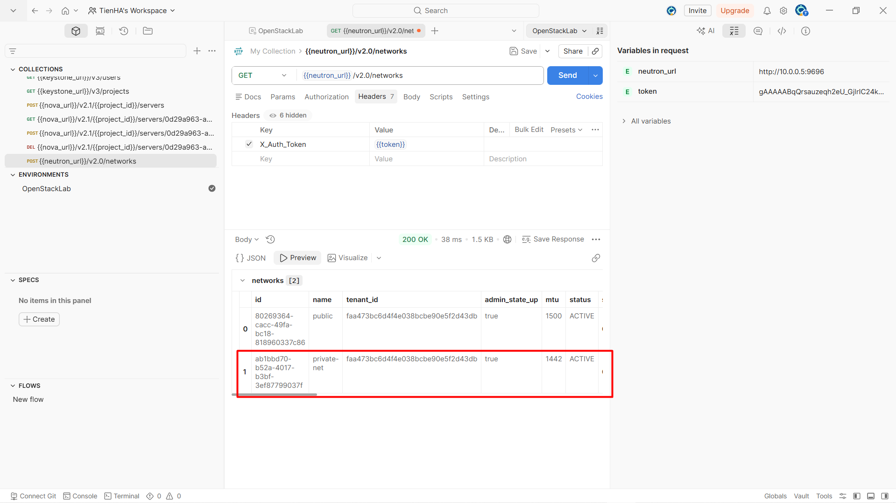

#### 3.4 Router Operations

Đối với các action với `Router` ta Set up request như sau:

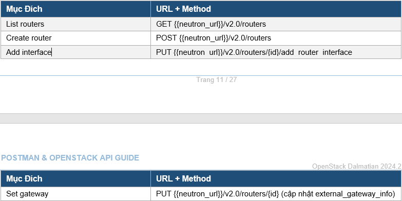

**Note**: Phương thức `PUT` trong HTTP dùng để cập nhật (update) hoặc thay thế (replace) toàn bộ một tài nguyên tại một URL cụ thể.

Đặc điểm của `PUT`:

- Gửi dữ liệu lên server để thay thế hoàn toàn tài nguyên đã tồn tại tại URL đó. Nếu tài nguyên chưa tồn tại, một số API sẽ tạo mới nó.

- `PUT` thường gửi tới URL có ID cụ thể, ví dụ: PUT /v2.0/networks/{network_id}.

- Gọi `PUT` nhiều lần với cùng một body sẽ cho ra cùng một kết quả — không tạo thêm bản sao. Đây là điểm khác biệt quan trọng so với `POST`.

#### 3.5 Floating IPs

Đối với các action với `Floating IPs` ta Set up request như sau:

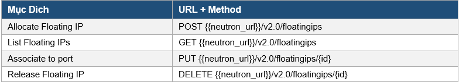

**Note**: Body tạo Floating IP:

```Json
{
  "floatingip": {
    "floating_network_id": "<public_network_id>"
  }
}
```

#### 3.6 Security Groups

Đối với các action với `Security Groups` ta Set up request như sau:

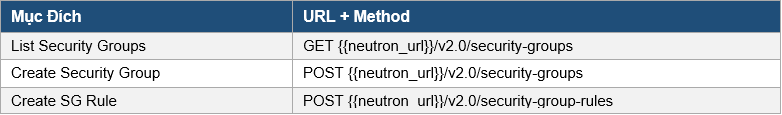

**Note**: Body tạo Security Group:

```Json
{
  "security_group": {
    "name": "web-sg",
    "description": "Security group for web servers"
  }
}
```

### 4. Tương tác với Glance Service

Phần tương tác với Service Glance ta sẽ đọc tài liệu ở [đây](https://github.com/tiend9/Tim-hieu-OPNsense/blob/main/15.Deployment_OPS/04.Working_with_API_OPS/01.OpenStack_Postman_API_Guide.pdf) đã hướng dẫn chi tiết.

### 5. Tương tác với Cinder Service - Block Storage

Phần tương tác với Service Cinder ta sẽ đọc tài liệu ở [đây](https://github.com/tiend9/Tim-hieu-OPNsense/blob/main/15.Deployment_OPS/04.Working_with_API_OPS/01.OpenStack_Postman_API_Guide.pdf) đã hướng dẫn chi tiết.

### 6. Tương tác với Ceph Service

Phần tương tác với Service Ceph ta sẽ đọc tài liệu ở [đây](https://github.com/tiend9/Tim-hieu-OPNsense/blob/main/15.Deployment_OPS/04.Working_with_API_OPS/01.OpenStack_Postman_API_Guide.pdf) đã hướng dẫn chi tiết.

### 7. Tương tác với Swift Service - Object Storage

Phần tương tác với Service Swift ta sẽ đọc tài liệu ở [đây](https://github.com/tiend9/Tim-hieu-OPNsense/blob/main/15.Deployment_OPS/04.Working_with_API_OPS/01.OpenStack_Postman_API_Guide.pdf) đã hướng dẫn chi tiết.

### 8. SETUP COLLECTION VÀ AUTO-TOKEN

**Note**: Giải thích một số khái niệm cơ bản trong Postman:

- **Environment (Môi trường) là gì?**
  Environment trong Postman là một tập hợp các biến (variables) dưới dạng key-value. Nó cho phép bạn lưu trữ các thông số thay đổi theo từng môi trường làm việc (ví dụ: Dev, Test, Prod) như địa chỉ IP, URL của API, username, password. Nhờ đó, bạn có thể chạy cùng một request trên nhiều môi trường khác nhau chỉ bằng cách chuyển đổi Environment mà không cần sửa URL hay body của request.

- **Collection là gì?**
  Collection là một thư mục dùng để nhóm và tổ chức các API request có liên quan với nhau. Bạn có thể lưu các request thành từng thư mục con, gán script chạy tự động cho cả collection, xuất/nhập (export/import) để chia sẻ cho team, hoặc chạy toàn bộ các request trong collection tuần tự bằng tính năng Collection Runner.

- **Auto-Token (Tự động lấy Token) là gì?**
  Trong OpenStack, để gọi bất kỳ API nào (Nova, Neutron, Cinder...), bạn đều cần gắn header `X-Auth-Token`. Thay vì phải copy/paste token thủ công mỗi khi token hết hạn (thường là 1 tiếng), ta có thể sử dụng tính năng **Tests** (hoặc **Pre-request Script**) của Postman kết hợp với biến Environment để tự động trích xuất và lưu Token vào biến sau khi gửi request xác thực tới Keystone. Các request tiếp theo chỉ việc gọi lại biến `{{token}}` mà không cần làm gì thêm.

Phần tương tác với **Collection** và **Auto-Token** ta sẽ đọc tài liệu ở [đây](https://github.com/tiend9/Tim-hieu-OPNsense/blob/main/15.Deployment_OPS/04.Working_with_API_OPS/01.OpenStack_Postman_API_Guide.pdf) đã hướng dẫn chi tiết.