# DEPLOY OPENSTACK KOLLA ANSIBLE BACKEND SWIFT

## I. MÔ HÌNH

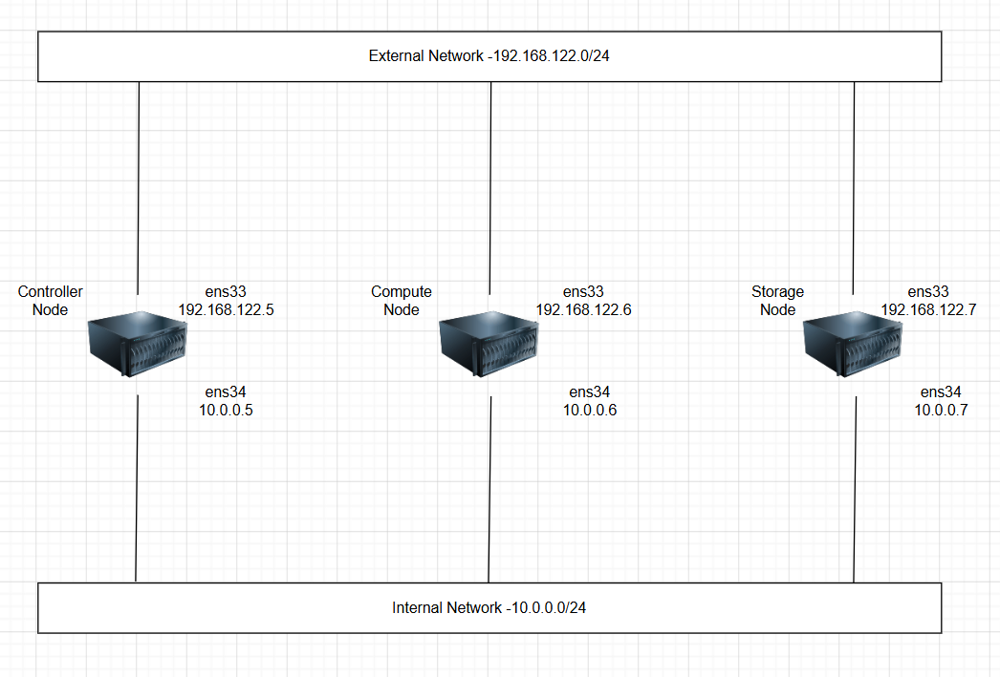

## II. SETUP MÔI TRƯỜNG VÀ QUY HOẠCH IP

### 1. Tạo VM

**Controller**:

```bash
CPU  : 4 vCPU
RAM  : 6GB
Disk : 80GB
IP E  : 192.168.122.5
IP I  : 10.0.0.5
```

**Compute**:

```bash
CPU  : 2 vCPU
RAM  : 4GB
Disk : 40GB
IP   : 192.168.122.6
IP I  : 10.0.0.6
```

**Storage**:

```bash
CPU  : 2 vCPU
RAM  : 4GB
Disk : 40GB

Thêm 2 disk:
50GB
50GB

IP : 192.168.122.7
IP I  : 10.0.0.7
```

### 2. Phân hoạch IP

|   Node   |IP quy hoạch          |
|----------|----------------------|
|Controller|192.168.122.5/10.0.0.5|
|Compute   |192.168.122.6/10.0.0.6|
|Storage   |192.168.122.7/10.0.0.7|

## III. THỰC HIỆN LAB

### `Bước 1`: Đặt Hostname

Trên Controller:

```bash
hostnamectl set-hostname controller
```

Trên Compute:

```bash
hostnamectl set-hostname compute
```

Trên Storage:

```bash
hostnamectl set-hostname storage
```

### `Bước 2`: Cấu hình IP tĩnh + Cài và bật chrony (NTP) + Kiểm tra Interface

Đặt cấu hình forward gói tin IPv4:

```bash
echo "net.ipv4.ip_forward=1" >> /etc/sysctl.conf
sysctl -p
```

Trên 3 Node:

```bash
sudo apt install -y chrony
sudo systemctl enable --now chrony
```

Verify clock đồng bộ:

```bash
chronyc tracking
# System time offset phải < 100ms.
```

Check interface:

```bash
ip -br a
```

Mong đợi:

```bash
ens33 UP 192.168.122.x
ens34 UP 10.0.0.x
```

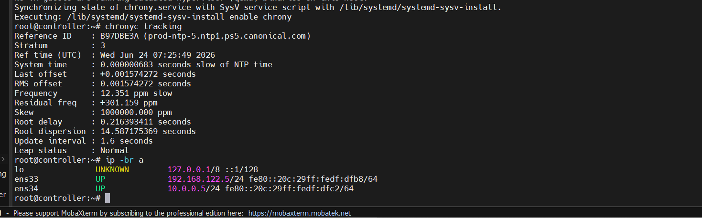

### `Bước 3`: Khai hosts + Tắt swap và UFW

Trên cả 3 Node:

```bash
nano /etc/hosts

# Dán
10.0.0.5 controller
10.0.0.6 compute
10.0.0.7 storage

192.168.122.5 controller-ext
192.168.122.6 compute-ext
192.168.122.7 storage-ext

# Uncomment dòng
127.0.1.1   controller # Tương tự với các node khác
```

Kiểm tra:

```bash
ping controller
ping compute
ping storage
```

Tắt swap + ufw trên 2 Node Storage và Compute + Controller:

```bash
sudo swapoff -a
sudo sed -i '/ swap / s/^/#/' /etc/fstab

sudo systemctl disable --now ufw || true
```

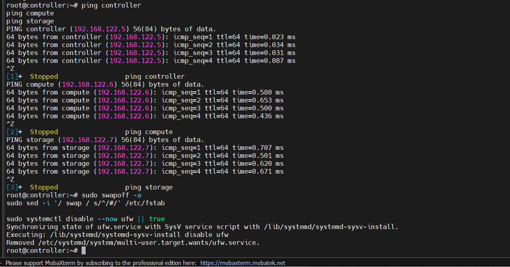

### `Bước 4`: Gen SSH Key để remote Compute và Storage Node

Trên **Controller**:

```bash
ssh-keygen

# Gen ra Public và Private key(Giữ lại Private key và gửi Pub key sang remote host)
```

Copy key:

```bash
ssh-copy-id root@10.0.0.5
ssh-copy-id root@10.0.0.6
ssh-copy-id root@10.0.0.7
# Khi chạy /root/.ssh/id_rsa.pub thì file public key sẽ được thêm vào /root/.ssh/authorized_keys trên máy Compute
```

**Note**:

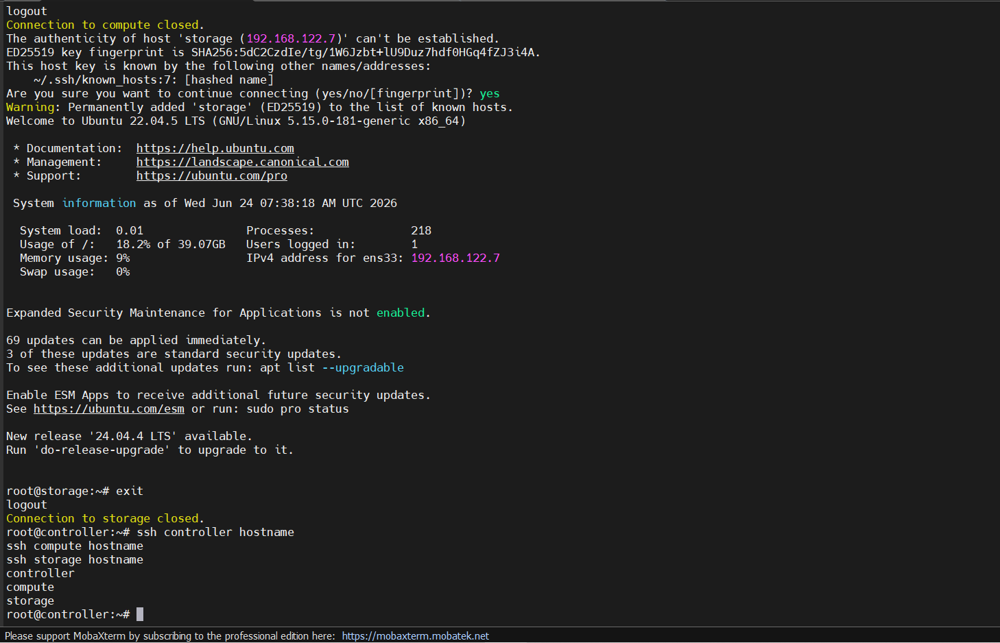

- Nếu ta nhập mật khẩu tài khoản `root` mà vẫn không ssh vào compute được thì trong file config bên Compute cấm đăng nhập quyền `root`. Ta fix bằng cách:

```bash
# Trên Controller; Compute; Storage Node
nano /etc/ssh/sshd_config

# Sửa:
PermitRootLogin no
PasswordAuthentication no

# Thành 
PermitRootLogin yes
PasswordAuthentication yes

# Tương tự với Storage Node

# Restart service
systemctl restart ssh
```

- Ngoài ra, check tài khoản `root` của Compute; Storage Node có bị **Lock** mật khẩu `root` không:

```bash
# Check cả 3 Node
passwd -S root

# có chữ L là bị lock mật khẩu tk root và ta cần đặt pass mới để nó pass SSH
passwd root

# Nó sẽ hỏi:
New password:
Retype new password:

# Ta đặt mật khẩu mới và thực hiện lệnh ssh-copy-id lại
```

Test:

```bash
ssh controller hostname
ssh compute hostname
ssh storage hostname
```

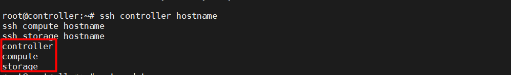

=> **Tác dụng**: để **Controller** đăng nhập sang **Compute** và **Storage** mà không cần nhập mật khẩu, vì **Kolla-Ansible** dùng **Ansible** để tự động chạy lệnh trên các node.

**Ví dụ**: Khi ta chạy:

```bash
kolla-ansible -i multinode bootstrap-servers
```

Thì **Controller** sẽ SSH sang:

```bash
192.168.122.6 (compute)
192.168.122.7 (storage)
```

Để:

- Cài Docker
- Tạo user
- Tạo thư mục
- Copy file cấu hình
- Deploy container

Nếu không có **SSH key** thì **Ansible** sẽ:

```bash
UNREACHABLE!
Permission denied
```

### `Bước 5`: Cài Kolla_Ansible

Chỉ thực hiện trên **Controller**:

- Cài các gói system cần thiết để build Python packages (gcc, libffi, openssl...):

```bash
apt update
apt install python3-dev python3-venv python3-pip libffi-dev gcc libssl-dev -y
```

Tạo **Virtual Environment** (tránh conflict version với system packages):

```bash
python3 -m venv ~/kolla-venv
source ~/kolla-venv/bin/activate
pip install -U pip
```

Tiếp theo, cài **Kolla**:

```bash
# Cài OpenStack Dalmatian (2024.2)
pip install "ansible-core>=2.16,<2.17.99"
pip install "kolla-ansible==19.8.0"
kolla-ansible install-deps

# mấy deps của kolla-ansible không có thì ta cài thủ công từ git
ansible-galaxy collection install \
  git+https://opendev.org/openstack/ansible-collection-kolla.git,2024.2-eol \
  --force

# Chạy lại
kolla-ansible install-deps
```

Kiểm tra:

```bash
kolla-ansible --version
ansible --version
# Nên dùng Python 3.10+
```

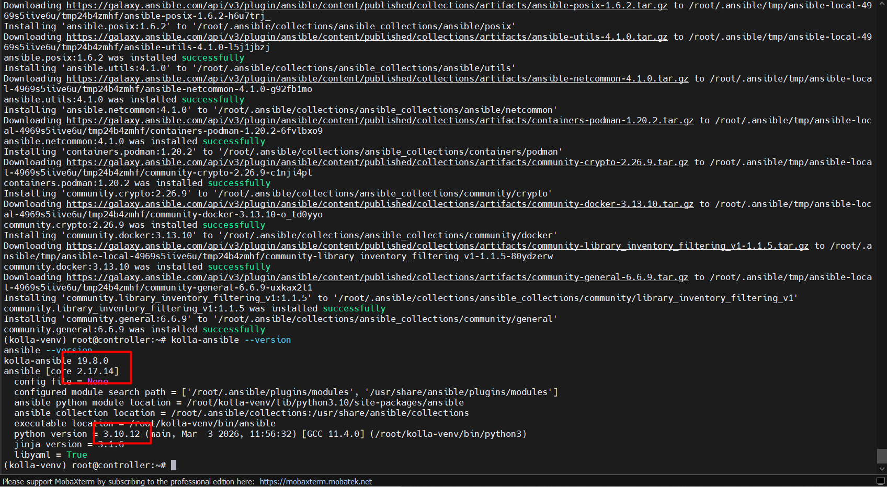

**Note**: **Kolla-Ansible** và **OpenStack release** phải khớp nhau. (Như trong đây bản Kolla-Ansible là bản `19.08` thích hợp với phiên bản **Dalmatian**)

### `Bước 6`: Tạo thư mục cấu hình

Trên Controller:

```bash
# Nếu cài trong venv ~/kolla-venv:
mkdir -p /etc/kolla
cp -r ~/kolla-venv/share/kolla-ansible/etc_examples/kolla/* /etc/kolla
cp ~/kolla-venv/share/kolla-ansible/ansible/inventory/multinode .

# Nếu cài global (pip3 install) thì đường dẫn là /usr/local/share/kolla-ansible/...
```

Nếu đường dẫn không có, ta có thể check bằng cách:

```bash
find / -name multinode
```

Nếu có thì check file:

```bash
ls /etc/kolla
```

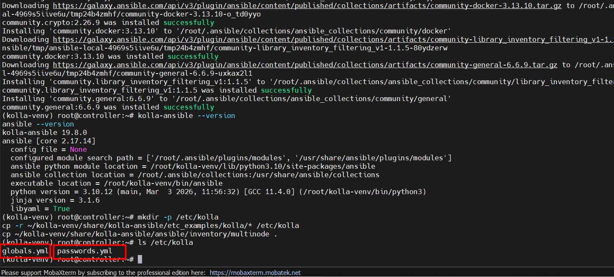

### `Bước 7`: Sửa Inventory

Trên Controller Node:

```bash
nano multinode

# Cấu hình như sau:(Nhớ bỏ dòng mẫu)
[control]
controller ansible_host=10.0.0.5

[network]
controller

[compute]
compute ansible_host=10.0.0.6

[storage]
storage ansible_host=10.0.0.7

[swift-storage]
storage

[monitoring]
controller
```

Check Swift:

```bash
grep -n swift multinode

# Để chắc Storage node nằm trong các group Swift.
```

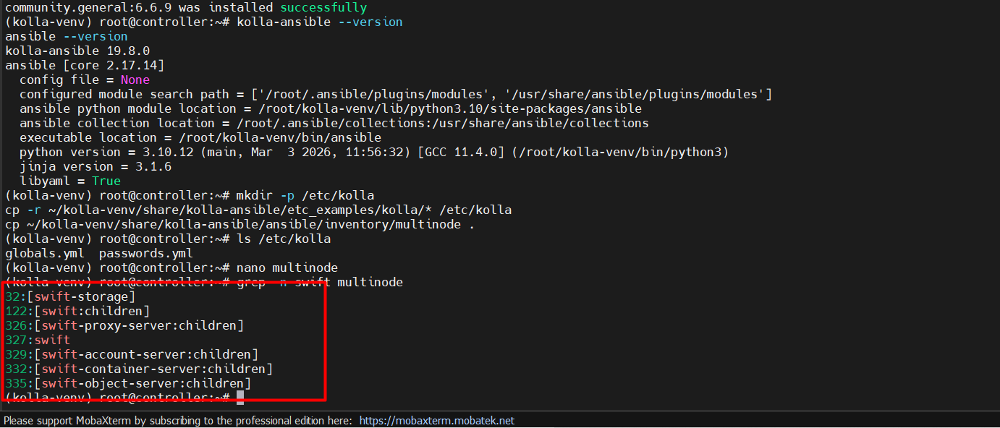

### `Bước 8`: Viết file cấu hình `globals.yml` + `ansible.cfg`

Trên Controller Node:

```bash
nano /etc/kolla/globals.yml

# Dán cấu hình:
openstack_service_workers: "1"
kolla_base_distro: "ubuntu"
kolla_install_type: "binary"

openstack_release: "2024.2"

network_interface: "ens34"
tunnel_interface: "ens34"
storage_interface: "ens34"

neutron_external_interface: "ens33"

kolla_internal_vip_address: "10.0.0.5"

enable_haproxy: "no"
enable_keepalived: "no"
enable_proxysql: "no"

enable_swift: "yes"
enable_swift_s3api: "yes"

swift_replication_factor: 1
swift_devices_match_mode: "strict"
swift_devices_name: "sdb,sdc"

enable_ceph: "no"
enable_cinder: "no"

neutron_plugin_agent: "ovn"

prechecks_enable_host_os_checks: false

neutron_bridge_name: "br-ex"
neutron_physical_networks: "physnet1"

neutron_api_workers: "1"
neutron_rpc_workers: "1"

enable_heat: "no"
```

Tạo file `ansible.cfg` riêng:

```bash
cat > ~/ansible.cfg <<EOF
[defaults]
host_key_checking = False
pipelining = True
forks = 20

[privilege_escalation]
become = True
EOF
```

### `Bước 9`: Chuẩn bị Swift Disk + Cấu hình xác thực KeyStone với SwiftS3APi

Trên **Storage**:

Xem Disk:

```bash
lsblk
```

Output mong muốn:

```bash
sdb 50G
sdc 50G
```

Format cho chúng:

```bash
apt install xfsprogs -y

mkfs.xfs -f /dev/sdb
mkfs.xfs -f /dev/sdc
```

Tạo thư mục Mount:

```bash
mkdir -p /srv/node/sdb
mkdir -p /srv/node/sdc
```

Thực hiện mount với file system vừa tạo:

```bash
mount /dev/sdb /srv/node/sdb
mount /dev/sdc /srv/node/sdc
```

Cuối cùng tạo Swift Ring:

```bash
# Trên Controller:
mkdir -p /etc/kolla/config/swift
cd /etc/kolla/config/swift

# Cài swift tools: 
apt install swift swift-account swift-container swift-object -y

# Tạo account ring
swift-ring-builder account.builder create 10 1 1
swift-ring-builder account.builder add r1z1-10.0.0.7:6001/sdb 100
swift-ring-builder account.builder add r1z1-10.0.0.7:6001/sdc 100
swift-ring-builder account.builder rebalance

# Tạo container ring
swift-ring-builder container.builder create 10 1 1
swift-ring-builder container.builder add r1z1-10.0.0.7:6002/sdb 100
swift-ring-builder container.builder add r1z1-10.0.0.7:6002/sdc 100
swift-ring-builder container.builder rebalance

# Tạo Object ring
swift-ring-builder object.builder create 10 1 1
swift-ring-builder object.builder add r1z1-10.0.0.7:6000/sdb 100
swift-ring-builder object.builder add r1z1-10.0.0.7:6000/sdc 100
swift-ring-builder object.builder rebalance

# Kiểm tra
ls -lh /etc/kolla/config/swift/

# Phải ra:
account.builder
account.ring.gz

container.builder
container.ring.gz

object.builder
object.ring.gz

# Cấu hình xác thực KeyStone với SwiftS3APi
mkdir -p /etc/kolla/config/swift

cat >> /etc/kolla/config/swift/proxy-server.conf << 'EOF'
[filter:s3token]
use = egg:swift#s3token
auth_uri = http://10.0.0.5:5000/v3
auth_url = http://10.0.0.5:5000/v3
project_domain_id = default
user_domain_id = default
project_name = service
username = swift
password = <password_swift>
EOF

# Lấy password swift trước:
grep swift_keystone_password /etc/kolla/passwords.yml
```

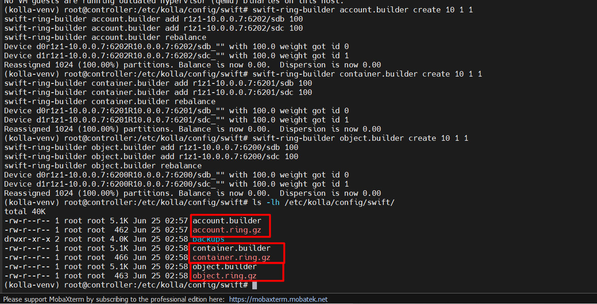

### `Bước 10`: Mount disk persistent

Trên Storage. Lấy **UUID**:

```bash
blkid

# lấy uuid rồi dán vào /etc/fstab
# Ví dụ:
UUID=1111-2222 /srv/node/sdb xfs defaults,noatime,nodiratime 0 0
UUID=3333-4444 /srv/node/sdc xfs defaults,noatime,nodiratime 0 0

# Test
mount -a
```

=> Không báo lỗi thì oke

### `Bước 11`: Tạo password + Ping các node kiểm tra conectivity

Trên Controller Node:

```bash
kolla-genpwd
```

File:

```bash
/etc/kolla/passwords.yml

# Trong đó sẽ lưu trũ các password. Ví dụ như:
keystone_admin_password: xxxxxxxxx
database_password: xxxxxxxxx
rabbitmq_password: xxxxxxxxx
```

Sẽ được sinh tự động

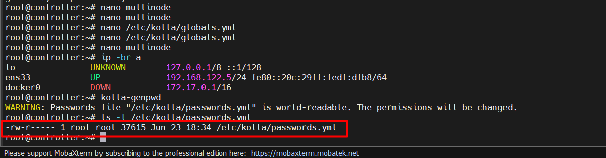

Kiểm tra conectivity:

```bash
ansible -i multinode all -m ping
```

Mong đợi:

```bash
controller | SUCCESS | "pong"
compute    | SUCCESS | "pong"
storage    | SUCCESS | "pong"
```

### `Bước 12`: Bootstrap Server

Trên controller Node

```bash
kolla-ansible bootstrap-servers -i multinode
# Lệnh này sẽ tự cài Docker lên các node compute và storage
```

=> Thường mất `>10` phút

Mong đợi:

```bash
openstack.kolla
```

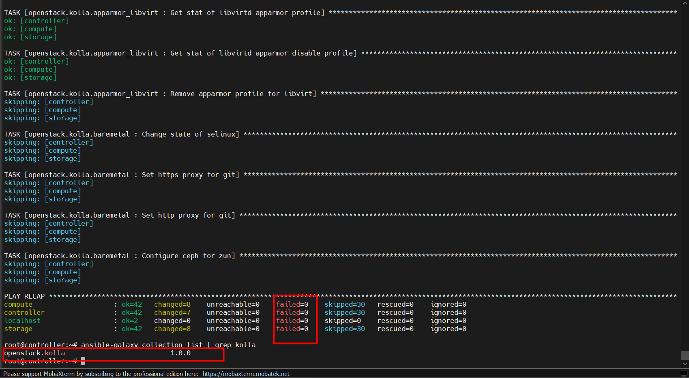

### `Bước 13`: Check virtualization trên Compute

Trước deploy nên kiểm tra:

```bash
egrep -c '(vmx|svm)' /proc/cpuinfo # Phải ra >0
lsmod | grep kvm # Phải ra kvm_amd hoặc kvm_intel
```

Nếu: `0`

=> Thì Nova không chạy VM được. phải bật ảo hoá KVM

### `Bước 14`: Precheck

Chạy trên Node Controller:

```bash
kolla-ansible prechecks -i multinode
```

Check Docker:

```bash
docker ps
docker info
```

Đặc biệt:

```bash
docker info | grep Cgroup
```

Ubuntu 22.04 phải ra:

```text
Cgroup Version: 2
```

Nếu lỗi:

- `docker`
- `memory`
- `hostname`

=> Thì sửa trước khi deploy

### `Bước 15`: Deploy

Trên 3 Node cấu hình phân giải DNS:

```bash
nano /etc/systemd/resolved.conf

# Sửa dòng:
DNS=8.8.8.8 8.8.4.4

# Restart
systemctl restart systemd-resolved
```

Chạy trên Controller:

```bash
# Nếu pass. Và chạy trên Terminal 2 ngay sau khi flush IP ở ens33 :
kolla-ansible pull -i multinode
```

**Note**:

- Khi **Kolla-Ansible** deploy `OVN/OVS`, nó sẽ:

1. Tạo bridge `br-ex`
2. Gắn interface `ens33` (neutron_external_interface) vào bridge `br-ex`
3. Interface `ens33` bị mất IP → SSH qua `ens33` bị đứt

=> Cách fix: `neutron_external_interface` PHẢI KHÔNG có IP trước khi deploy. Doc chính thức ghi rõ: "`This interface should be active without IP address.`"

- Bỏ IP khỏi `ens33` TRƯỚC deploy:

```bash
# Trước deploy, trên Controller + Compute Node(Storage Node không cần vì dùng dải internal):
ip addr flush dev ens33
# Rồi deploy, OVS sẽ không kill SSH vì ens33 đã không có IP
```

Cuối cùng mới `deploy`:

```bash
kolla-ansible deploy -i multinode

# Thường mất 30-60p trên máy Lab
```

Sau deploy. Check:

```bash
docker ps
```

Mong đợi:

```text
keystone
glance_api
nova_api
nova_compute
neutron_server
swift_proxy_server
swift_object_server
```

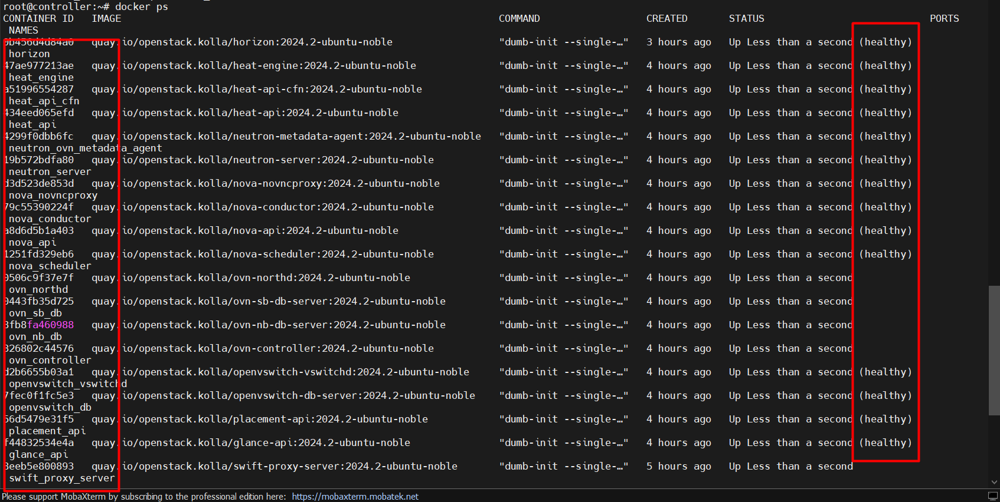

Sau đó chạy lại, để **Swift** nhận cấu hình nhận Disk:

```bash
kolla-ansible reconfigure -i multinode
```

### `Bước 16`: Destroy nếu deploy lỗi

```bash
kolla-ansible -i multinode destroy --yes-i-really-really-mean-it
```

Sau đó:

```bash
docker volume prune -f
rm -rf /etc/kolla/config/*
```

### `Bước 17`: Post Deploy

```bash
kolla-ansible post-deploy -i multinode
```

Nó sẽ:

- Tạo file `admin-openrc.sh`
- Tạo cloud config cho **OpenStack Client**
- Cấu hình endpoint cần thiết cho `admin`

-> Thông thường file được tạo ở `/etc/kolla/admin-openrc.sh`

Copy file **OpenRC** và chuyển về `~`:

```bash
cp /etc/kolla/admin-openrc.sh ~/
```

Nếu không thấy chắc do version nên ta có thể tự tạo

```bash
# Lấy password admin từ file password.yml
grep keystone_admin_password /etc/kolla/passwords.yml

# keystone_admin_password: S1D9OxEYr7hE1Hbk4fZQqnDeOWjLjcRsaLXu4cTT


cat > ~/admin-openrc.sh <<EOF
export OS_AUTH_URL=http://10.0.0.5:5000/v3
export OS_USERNAME=admin
export OS_PASSWORD='S1D9OxEYr7hE1Hbk4fZQqnDeOWjLjcRsaLXu4cTT'
export OS_PROJECT_NAME=admin
export OS_USER_DOMAIN_NAME=Default
export OS_PROJECT_DOMAIN_NAME=Default
export OS_IDENTITY_API_VERSION=3
EOF
```

### `Bước 18`: Cài OpenStack Client

**Note**:

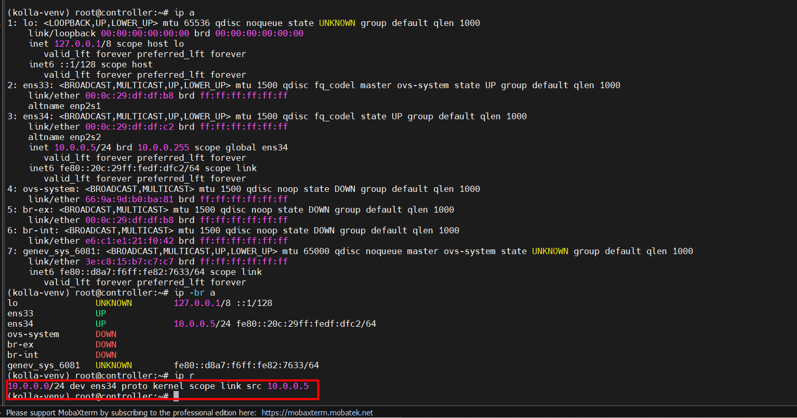

- `br-ex` và `br-int` DOWN là bình thường — chúng là OVS bridge, không phải Linux interface thông thường.
- Vấn đề ta đang thấy là Controller không có default gateway ra internet. Đây là do `ens33` đã bị `OVN` lấy vào `br-ex`.
- Thêm lại gateway tạm thời để dùng được internet:

```bash
ip link set br-ex up
ip addr add 192.168.122.5/24 dev br-ex
ip route add default via 192.168.122.2 dev br-ex
ip link set br-int up
ip link set ovs-system up
# Test
ping -c 2 8.8.8.8

# Sau khi làm xong các bước này controller SSH trở lại có thể tạo script systemd để auto cấu hình nhận IP br-ex mỗi khi boot

# Ngoài ra ta phải chạy các lệnh sau để cấp mạng cho VM trên Compute Node. Trên Compute Node:
ip link set br-int up
ip link set ovs-system up
docker restart ovn_controller

# Sau bước này khi reboot có thể lại mất cấu hình lên ta lên tạo script systemd để auto bật khi reboot lại!
```

Trên Controller Node tải gói `Openstack client`:

```bash
pip3 install python-openstackclient
```

Chạy nạp biến môi trường:

```bash
source ~/admin-openrc.sh
```

Test:

```bash
openstack service list
```

Nếu ra:

```bash
keystone
glance
nova
neutron
swift
```

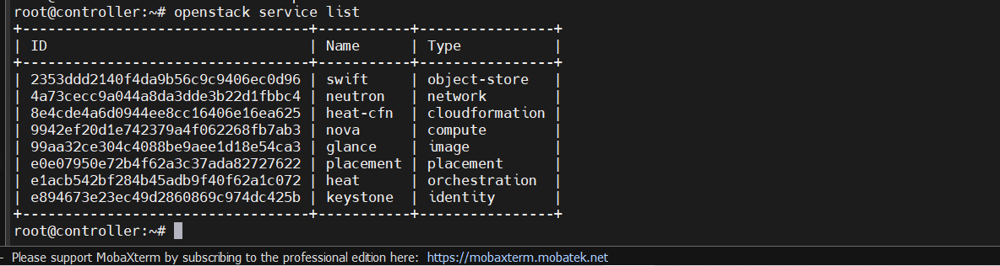

### Lưu ý quan trọng

Một chỗ rất quan trọng của VMware. VMware Network Requirement

- Port Group của mạng `192.168.122.0/24`:

```bash
Promiscuous Mode : Accept
MAC Address Changes : Accept
Forged Transmits : Accept
```

- Nếu không bật 3 cái này thì:

```text
Floating IP không ping được
Provider Network không hoạt động
DHCP của Neutron lỗi
```

### `Bước 19`: Kiểm tra Swift sau deploy

Thêm một bước xác nhận:

```bash
openstack container create test-container
```

Upload file:

```bash
echo hello > test.txt
openstack object create test-container test.txt
```

List:

```bash
openstack object list test-container
```

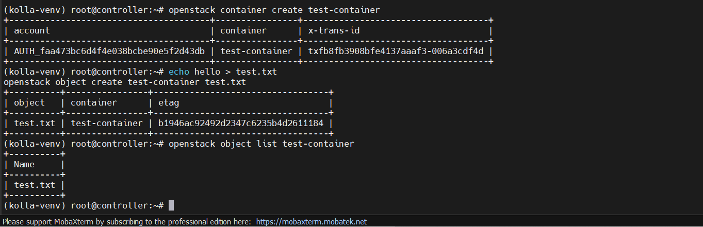

Nếu thấy file xuất hiện thì Swift hoạt động.

### `Bước 20`: Tạo external Network cho cụm

```bash
openstack network create public \
  --external \
  --provider-network-type flat \
  --provider-physical-network physnet1
```

Và:

```bash
openstack subnet create public-subnet \
  --network public \
  --subnet-range 192.168.122.0/24 \
  --gateway 192.168.122.1 \
  --allocation-pool start=192.168.122.200,end=192.168.122.250 \
  --no-dhcp
```

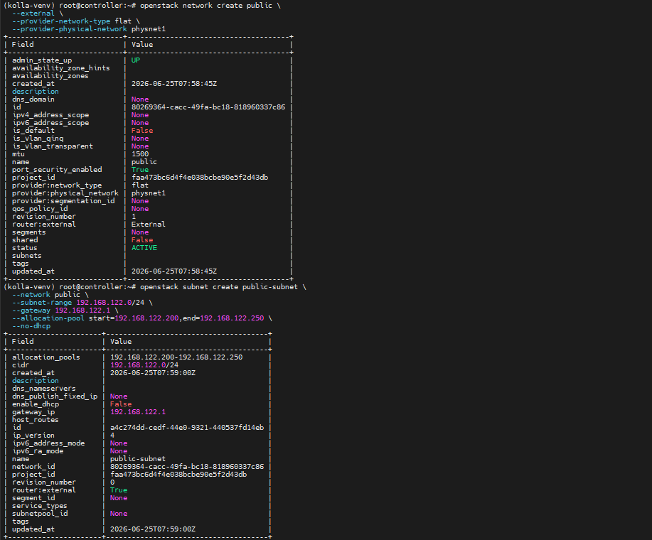

Nếu không có bước này: **Floating IP** không hoạt động

### `Bước 21`: Kiểm tra sau Deploy

Nạp:

```bash
source ~/admin-openrc.sh

#thêm:
openstack endpoint list
openstack compute service list
openstack network agent list

# Nếu thấy:
up
enabled

# Thì cluster sống.
```

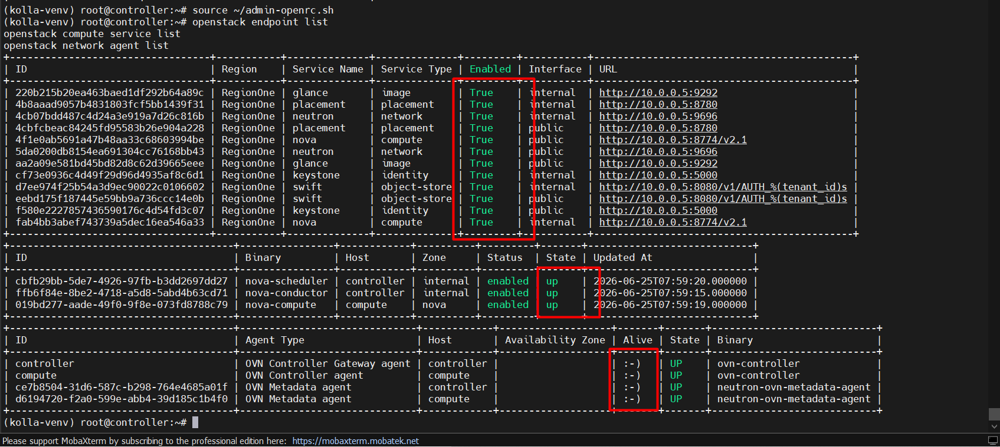

Ngoài ra, bạn cần tạo 1 VM để chắc chắn cluster đang sống:

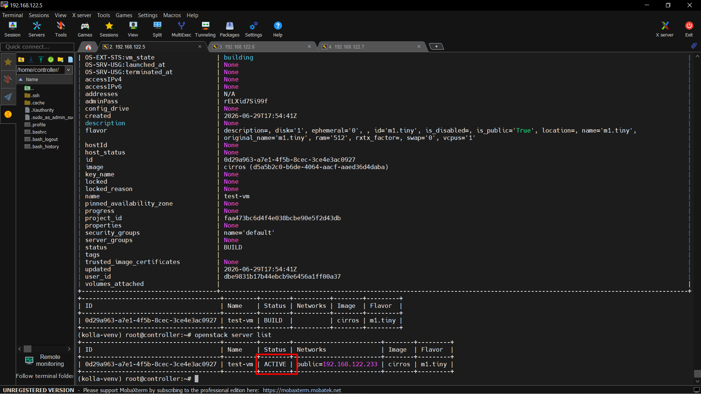
