# BUILD MÔI TRƯỜNG CÀI OPNSENSE trên OpenStack

## 1. Chuẩn bị

- Một cụm OpenStack để lab  
- Tải bộ cài OPNsense (bản dvd/nano, kiến trúc amd64).

## 2. MỤC TIÊU

- Dùng KVM đóng gói image OPNsense rồi đẩy lên Glance Service cụm OpenStack  
- Dùng Openstack tạo máy ảo, gắn ISO OPNsense.

## 3. CÁC BƯỚC

Sau khi tải được file `.iso` của OPNsense, ta sẽ có file `OPNsense-26.1-dvd-amd64.iso` chính là bộ cài (installer) của OPNsense. Tuy nhiên, không nên dùng ISO này trực tiếp để tạo image chạy production trên OpenStack. Thay vào đó, bạn dùng ISO để cài OPNsense lên một VM, sau đó mới tạo image từ VM đó.(Ở đây ta sẽ dùng WebVirtCloud để tạo image cho OPNsense)

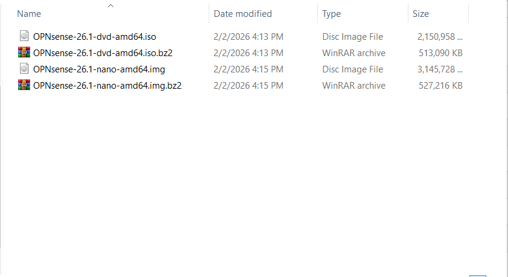

Các bước cấu hình WebVirtCloud để tạo image OPNsense tham khảo tại [đây](https://github.com/tiend9/system-intership/blob/master/TienHA/15.KVM/16.WebVirtCloud/02.Install_Web_Virt_Cloud.md)

### Đóng gói Golden image OPNSense live bằng KVM

Khởi tạo ổ cứng cài đặt OS:

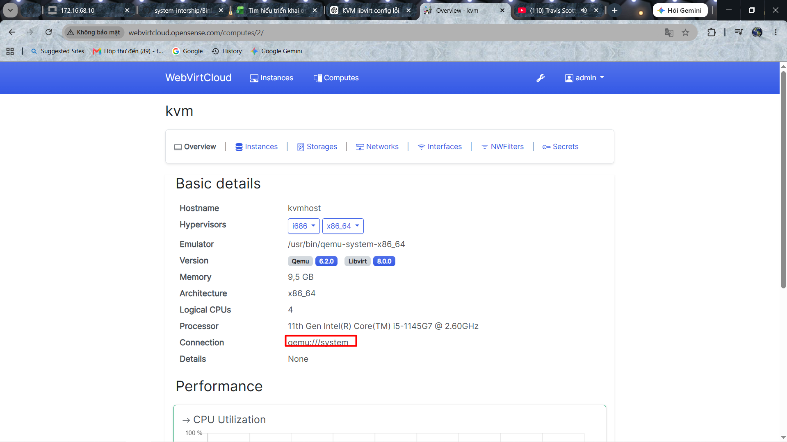

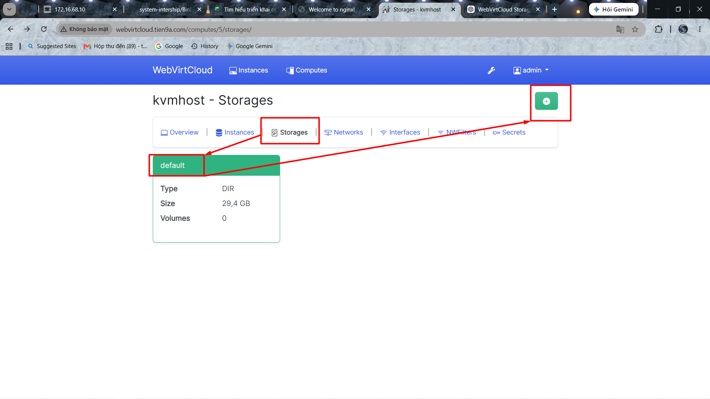

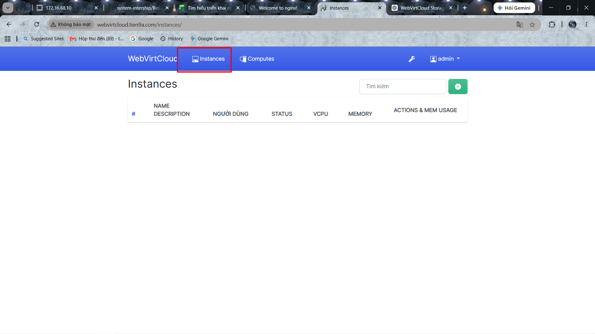

Add tên Volume mình tạo `hat_OPNsense` và chọn Format `Qcow2` và size `20G` hoặc tí có thể tự tạo lúc tạo VM:

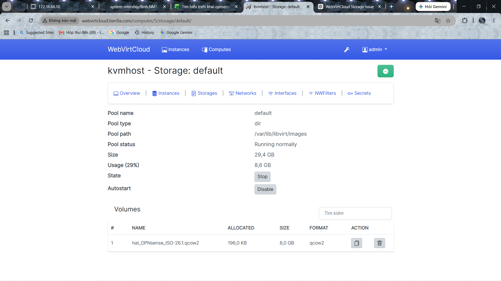

Vào pool `iso` để upload file `.iso` OPNsense:

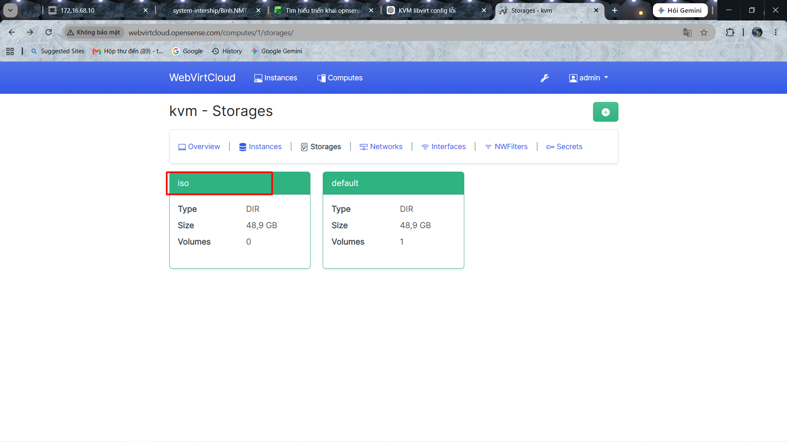

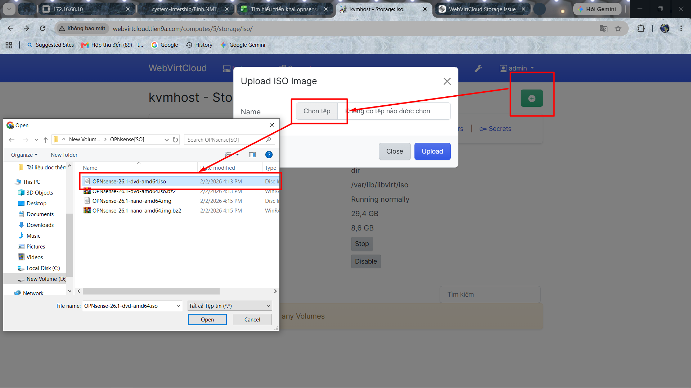

- Đoạn này phải cấp quyền cho user có quyền upload file iso lên pool iso:

```bash
chgrp www-data /var/lib/libvirt/iso
chmod 775 /var/lib/libvirt/iso
```

Hoặc có thể `scp` từ Windows vào Host:

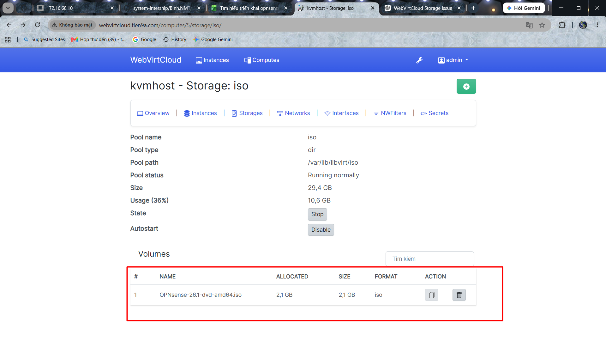

Bước tiếp theo, Tạo VM `hat_OPNsense.qcow2.template`:

- Disk: chọn file `hat_OPNsense.qcow2` (ổ cứng để cài).
- CD-ROM / ISO: chọn `OPNsense-26.1-dvd-amd64.iso` từ pool iso.
- Boot Device: CD-ROM trước, Hard Disk sau.

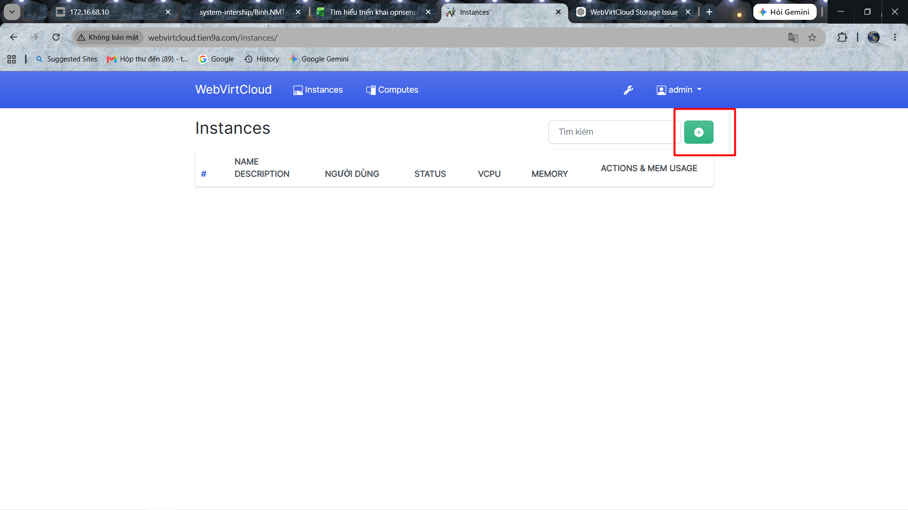


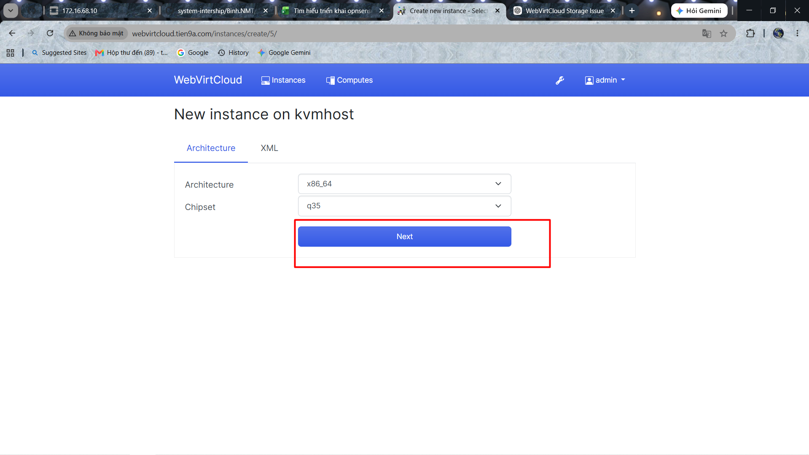

Có thể tạo bằng `virt-install` do WebVirtCloud mình không hỗ trợ tạo VM từ volume có sẵn.

```bash
virt-install \
  --name hat_OPNsense.qcow2.template \
  --memory 4096 \
  --vcpus 2 \
  --disk path=/var/lib/libvirt/images/hat_OPNsense.qcow2,size=20,format=qcow2,bus=virtio \
  --cdrom /var/lib/libvirt/iso/OPNsense-26.1-dvd-amd64.iso \
  --network network=default,model=virtio \
  --graphics vnc,listen='0.0.0.0' \
  --os-variant freebsd13.0 \
  --boot cdrom,hd \

# Sau đó(Ngay lập tức)
virsh destroy hat_OPNsense.qcow2.template

# VM sẽ ở trạng thái Shutoff
```

Sau khi tạo xong VM , ta sẽ vào web quản lý của WebVirtCloud để setup nốt:

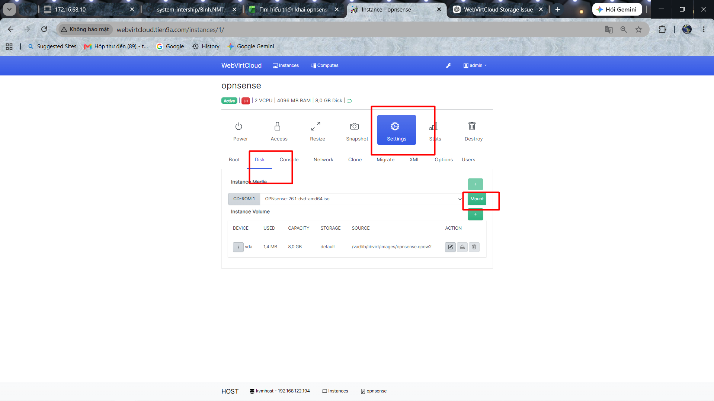

Thực hiện chỉnh sửa disk boot vào file `iso` đã upload:

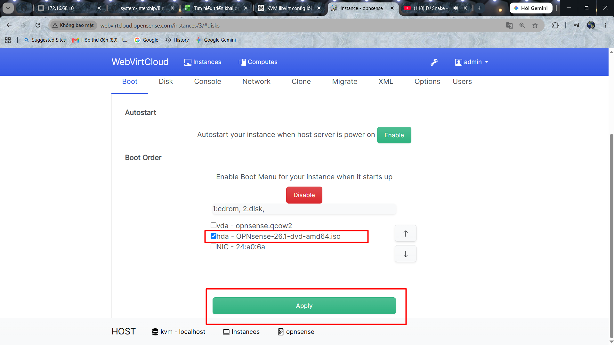

Bật máy ảo và truy cập console:

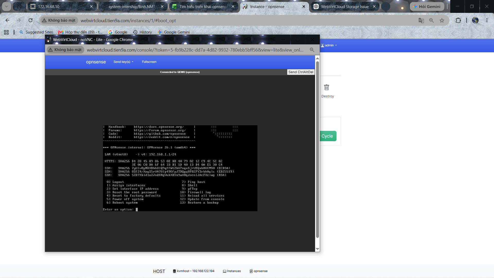

Sau khi add CD-ROM vào, thì ta đã có file để boot con Firewall OPNsense. Ta set up booting:

- Ở dấu nhắc:

```text
login:
```

- Nhập:

```text
installer
```

Password:

```text
opnsense
```

(Đây là tài khoản cài đặt mặc định của OPNsense.)

- Nếu tài khoản installer không đăng nhập được (tùy bản phát hành), dùng:

```text
login: root
password: opnsense
```

Sau đó chạy:

```text
opnsense-installer
```

để bắt đầu trình cài.

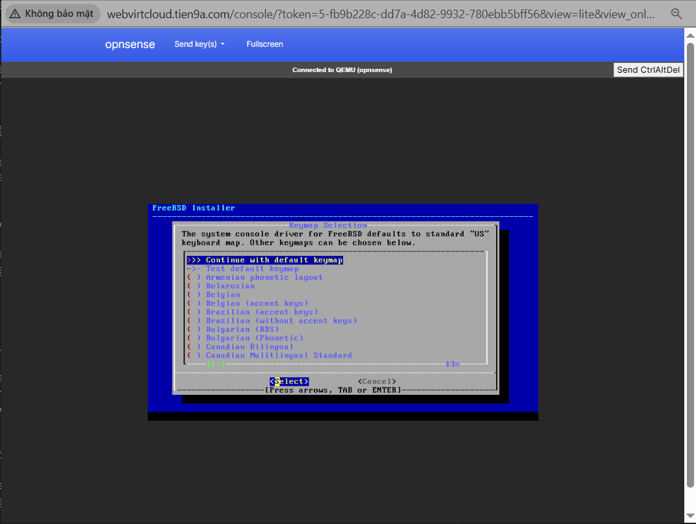

Làm tiếp như sau:

- Chọn `Continue with default keymap`
- Nhấn `Enter`
- Chọn `Install`
- `Enter`
- Chọn ổ đĩa `20GB` VirtIO/QCOW2 (`vtbd0` hoặc `ada0` bằng cách ấn `Enter` )
- `Enter`
- Chọn `Auto (ZFS)` hoặc `Auto (UFS)`
- Nếu chỉ để lab thì Auto (ZFS) là lựa chọn mặc định, cứ dùng được.
- Xác nhận `YES` để xóa toàn bộ ổ đĩa.
- Đợi khoảng 2–5 phút để copy hệ điều hành.
- Khi báo **Installation Complete**
- Chọn Reboot
- Bản mới nhất có thể yêu đổi mật khẩu `root`

Ta check network trên KVM Host và gán interface cho VM trong KVMHost (Ở đây inteface `eth0` đã có rồi)

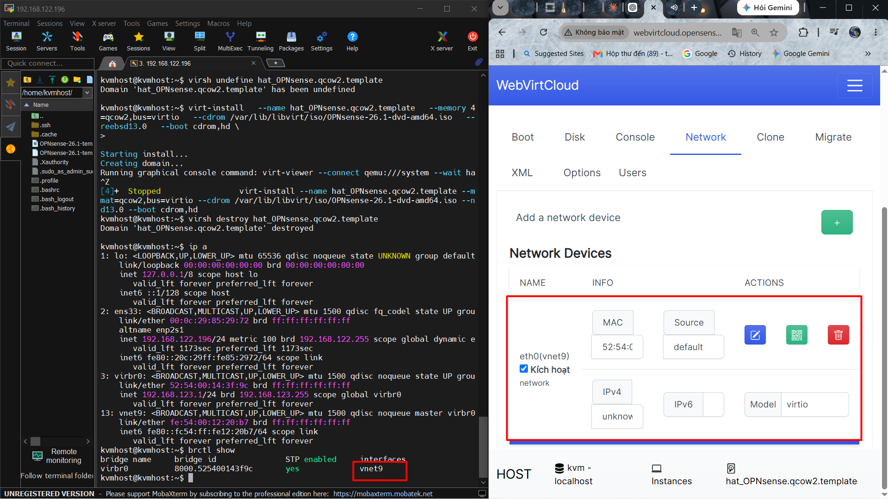

Sau khi Reboot thành công ta tắt VM đi và chỉnh sửa lại VM cho boot bằng ổ cứng:

```bash
# VM sẽ ở trạng thái Shutoff
virsh shutdown hat_OPNsense.qcow2.template
```

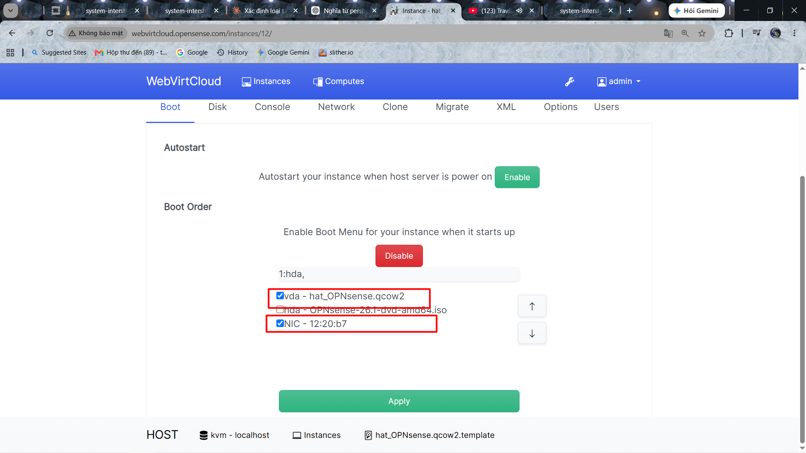

Tiếp theo chỉnh sửa lại file `.xml` VM để bổ sung channel trong (để máy guest giao tiếp với máy ảo sau này sử dụng `qemu-guest-agent`), sau đó save lại.

- Truy cập `Settings` > `XML` > `EDIT SETTINGS`:

```xml
<devices>
<channel type='unix'>
  <target type='virtio' name='org.qemu.guest_agent.0'/>
</channel>
</devices>
```

Sau khi chỉnh sửa xong ta bật VM lên và kiểm tra lại:

- Check trong VM boot từ đâu:

```bash
# Nhập tài khoản
login: root
password: opnsense

# Nhấp 8 để vào shell

mount | grep " on / "

# or

df -h

# Nếu thấy root là `zroot...zfs` là đã boot từ volume ngoài là đúng
# Nếu thấy `/dev/iso9660` thì vẫn boot từ iso
```

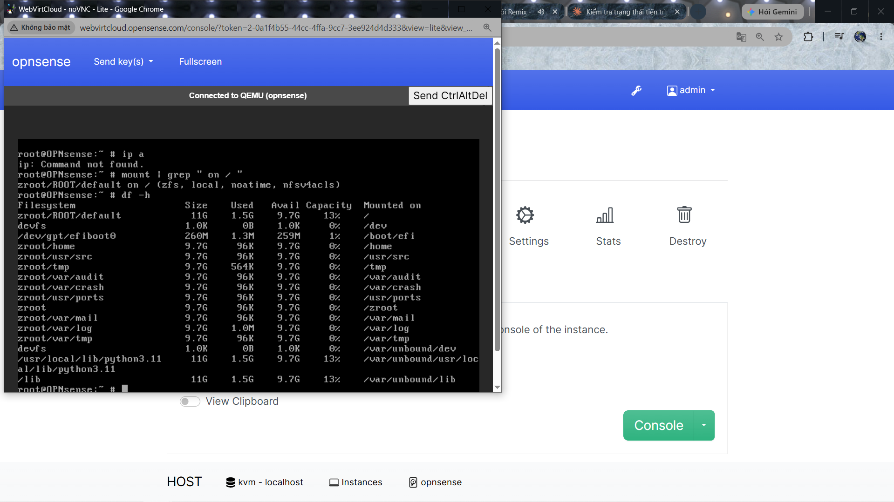

**Note**: Các bước xong các bạn lên Snapshot tránh sai sót trong quá trình đóng gói image OPNsense.

**Note2**: Do OPNsense là 1 nhánh tách ra từ pfSense, nên nó sẽ dùng hệ điều hành BSD khác so với Linux.

Tiếp theo, ta cần **"Thiết lập Môi trường"**:

- Đầu tiên, sẽ là thiết lập môi trường cơ bản:

```bash
# Set up DNS:
echo "nameserver 8.8.8.8" > /etc/resolv.conf
echo "nameserver 1.1.1.1" >> /etc/resolv.conf

# Gán lại NIC duy nhất này thành WAN
Do you want to configure LAGGs now? [y/N]: n

Do you want to configure VLANs now? [y/N]: n

Enter the WAN interface name or 'a' for auto-detection: vtnet0

Enter the LAN interface name or 'a' for auto-detection
(or nothing if finished): [Enter] (để trống, không gán LAN)

Do you want to proceed? [y/N]: y

# Menu OPNsense nhấp 2 để vào setup IP WAN để test kết nối Internet
Configure IPv4 address WAN interface via DHCP? (y/n) n

Enter the new WAN IPv4 address: 192.168.123.10        ← IP tĩnh bạn muốn đặt
Enter the new WAN IPv4 subnet bit count: 24           ← /24 = 255.255.255.0

Configure IPv6 address WAN interface via DHCP6? (y/n) n
Enter the new WAN IPv6 address, or press ENTER for none: (Enter)

Do you want to revert to HTTP as the webConfigurator protocol? (y/n) n

# Add route:
route add default 192.168.123.1

# Cho phép SSH vào WAN - Chọn option 8 trong menu OPNsense để vào shell
# Tắt firewall tạm thời trước khi cấu hình
pfctl -d

# Khởi động SSH service
/usr/local/etc/rc.d/openssh onestart
```

> **Nguyên nhân gốc rễ cần hiểu:**
> OPNsense khi gán interface làm WAN qua console sẽ **tự động bật 2 tùy chọn**:
> `blockpriv=1` (chặn toàn bộ dải IP private RFC1918) và `blockbogons=1` (chặn bogon networks).
> Vì lab dùng dải private `192.168.123.0/24` làm WAN nên SSH bị chặn ngay ở tầng này.
> Ngoài ra, rule SSH ghi vào `config.xml` phải được `configd` translate sang pfctl theo **đúng thứ tự**:
> `configd restart` → `filter reload` → `pfctl -e`. Sai thứ tự thì rule không có hiệu lực dù đã ghi vào config.

- Tạo **1 script duy nhất** để bật SSH + tắt blockpriv/blockbogons + thêm rule pass:

```bash
vi /tmp/allow_ssh.php

# Nội dung:
<?php
require_once('/usr/local/etc/inc/config.inc');
require_once('/usr/local/etc/inc/util.inc');

// 1. Bật SSH service
$config['system']['ssh']['enabled']         = 'enabled';
$config['system']['ssh']['permitrootlogin'] = '1';
$config['system']['ssh']['authmode']        = 'password';
$config['system']['ssh']['port']            = '22';

// 2. Tắt block private/bogon trên WAN (lab dùng dải private làm WAN)
unset($config['interfaces']['wan']['blockpriv']);
unset($config['interfaces']['wan']['blockbogons']);

// 3. Thêm rule pass SSH từ WAN
$ssh_rule = [
    'type'        => 'pass',
    'interface'   => 'wan',
    'ipprotocol'  => 'inet',
    'protocol'    => 'tcp',
    'source'      => ['any' => true],
    'destination' => ['network' => 'wanip', 'port' => '22'],
    'descr'       => 'Allow SSH from WAN',
];

if (!isset($config['filter']['rule'])) {
    $config['filter']['rule'] = [];
}
array_unshift($config['filter']['rule'], $ssh_rule);

write_config('Allow SSH from WAN + disable blockpriv/blockbogons');
echo 'Done' . PHP_EOL;
?>

# Chạy script rồi xóa file tạm đi
php /tmp/allow_ssh.php
rm -f /tmp/allow_ssh.php

# Reload đúng thứ tự: configd restart → filter reload → bật pfctl
service configd restart
/usr/local/sbin/configctl filter reload
pfctl -e

# Kiểm tra SSH đang lắng nghe
sockstat -l | grep :22
```

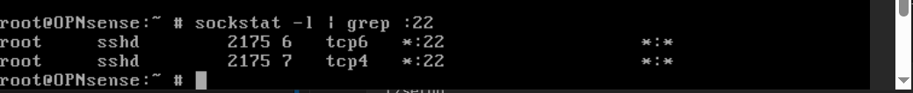

- Nếu vẫn chưa SSH được có thể do `<sshlockout>` tự động block IP khi đăng nhập sai liên tiếp:

```bash
# Xác nhận IP có đang bị lockout không
pfctl -t sshlockout -T show

# Nếu có thì xoá IP ra khỏi bảng Lockout
pfctl -t sshlockout -T delete [IP_address_bị_chặn]
```

- Tiếp theo đó. Cấu hình TimeZone:

```bash
tzsetup
# hoặc set trực tiếp qua menu console / web UI: System > Settings > General
```

- Cài `qemu-guest-agent` (`BẮT BUỘC` để OpenStack quản lý được):

```bash
pkg update && pkg upgrade -y
pkg install -y qemu-guest-agent
pkg install -y jq


# Enable service
sysrc qemu_guest_agent_enable="YES"
service qemu-guest-agent start
service qemu-guest-agent status
```

- Cấu hình console output ra serial (để OpenStack/nova console-log đọc được):

```bash
# Chỉnh /boot/loader.conf
echo 'console="comconsole,vidconsole"' >> /boot/loader.conf
echo 'comconsole_speed="115200"' >> /boot/loader.conf
```

- Cấu hình cho phép resize / nhận thông tin từ metadata (tương đương `cloud-init`):

  - Kiểm tra metadata service có truy cập được không: Test xem từ VM gọi tới metadata service được không (chỉ chạy khi VM đã thật sự nằm trên OpenStack):

  ```bash
  fetch -o - http://169.254.169.254/openstack/latest/meta_data.json
  ```

  - Nếu lệnh fetch trả về JSON chứa `hostname`, `uuid`, `public_keys`... là metadata service hoạt động bình thường.

- Viết script đọc metadata và áp dụng cấu hình. Tạo file script PHP để ghi hostname vào `config.xml`:

```bash
vi /usr/local/etc/openstack_set_hostname.php

# Script PHP để ghi hostname vào config.xml
<?php
require_once("/usr/local/etc/inc/config.inc");
require_once("/usr/local/etc/inc/util.inc");
require_once("/usr/local/etc/inc/interfaces.inc");

if ($argc < 2 || empty($argv[1])) {
    echo "Usage: php openstack_set_hostname.php <hostname>\n";
    exit(1);
}

$new_hostname = trim($argv[1]);

// Tach domain neu hostname co dang fqdn (vd: web01.example.com)
$parts = explode(".", $new_hostname, 2);
$config['system']['hostname'] = $parts[0];
if (isset($parts[1])) {
    $config['system']['domain'] = $parts[1];
}

write_config("Set hostname from OpenStack metadata: {$new_hostname}");

echo "Hostname set to: {$new_hostname}\n";
exit(0);
?>
```

- Script PHP để thêm SSH key vào `config.xml` (đúng cách OPNsense quản lý):

```bash
vi /usr/local/etc/openstack_set_sshkey.php

# Nội dung
<?php
require_once("/usr/local/etc/inc/config.inc");
require_once("/usr/local/etc/inc/util.inc");
require_once("/usr/local/etc/inc/interfaces.inc");

if ($argc < 2 || empty($argv[1])) {
    echo "Usage: php openstack_set_sshkey.php <ssh_public_key>\n";
    exit(1);
}

$ssh_key   = trim($argv[1]);
$target_user = "root";
$found     = false;

if (isset($config['system']['user'])) {
    foreach ($config['system']['user'] as &$user) {
        if ($user['name'] === $target_user) {
            $user['authorizedkeys'] = base64_encode($ssh_key);
            $found = true;
            break;
        }
    }
    unset($user);
}

if (!$found) {
    echo "Khong tim thay user {$target_user} trong config.\n";
    exit(1);
}

write_config("Set SSH key for {$target_user} from OpenStack metadata");
exec("/usr/local/sbin/configctl sshd restart");

echo "SSH key da duoc them cho user {$target_user}\n";
exit(0);
?>
```

- Script chính `openstack_init.sh`:

```bash
vi /usr/local/etc/openstack_init.sh

# Nội dung

#!/bin/sh
#
# openstack_init.sh - Lay metadata tu OpenStack va cau hinh OPNsense khi boot lan dau
METADATA_URL="http://169.254.169.254/openstack/latest/meta_data.json"
NETWORK_URL="http://169.254.169.254/openstack/latest/network_data.json"
FLAG_FILE="/conf/.openstack_init_done"
LOG="/var/log/openstack_init.log"

# Chi chay 1 lan duy nhat (lan boot dau tien cua moi instance)
if [ -f "$FLAG_FILE" ]; then
    exit 0
fi

if [ ! -f /conf/sshd/ssh_host_rsa_key ]; then
    echo "[$(date)] Tao lai SSH host keys..." >> "$LOG"
    ssh-keygen -t rsa     -b 4096 -f /conf/sshd/ssh_host_rsa_key    -N "" >> "$LOG" 2>&1
    ssh-keygen -t ecdsa   -b 521  -f /conf/sshd/ssh_host_ecdsa_key  -N "" >> "$LOG" 2>&1
    ssh-keygen -t ed25519         -f /conf/sshd/ssh_host_ed25519_key -N "" >> "$LOG" 2>&1
    chmod 600 /conf/sshd/ssh_host_*
    chmod 644 /conf/sshd/ssh_host_*.pub
    /usr/local/etc/rc.d/openssh onerestart >> "$LOG" 2>&1
fi

echo "[$(date)] Bat dau lay OpenStack metadata..." >> "$LOG"

# Kiem tra jq da duoc cai chua
if ! command -v jq >/dev/null 2>&1; then
    echo "[$(date)] LOI: jq chua duoc cai dat. Bo qua." >> "$LOG"
    exit 1
fi

# Doi network san sang (toi da 30s), bo -q de log loi ro hon
for i in $(seq 1 30); do
    if fetch -o /tmp/metadata.json "$METADATA_URL" >> "$LOG" 2>&1; then
        break
    fi
    sleep 1
done

if [ ! -s /tmp/metadata.json ]; then
    echo "[$(date)] Khong lay duoc metadata sau 30s, bo qua." >> "$LOG"
    exit 1
fi

# Lay thong tin tu metadata
NEW_HOSTNAME=$(jq -r '.hostname // empty' /tmp/metadata.json 2>>"$LOG")
UUID=$(jq -r '.uuid // empty' /tmp/metadata.json 2>>"$LOG")

echo "[$(date)] Instance UUID: $UUID" >> "$LOG"

# Set hostname bang script PHP (ghi thang vao config.xml)
if [ -n "$NEW_HOSTNAME" ]; then
    echo "[$(date)] Set hostname: $NEW_HOSTNAME" >> "$LOG"
    php /usr/local/etc/openstack_set_hostname.php "$NEW_HOSTNAME" >> "$LOG" 2>&1
else
    echo "[$(date)] Khong co hostname trong metadata, bo qua." >> "$LOG"
fi

# Lay SSH public key tu metadata (neu co), ghi vao config.xml
SSH_KEY=$(jq -r '.public_keys // {} | to_entries[0].value // empty' /tmp/metadata.json 2>>"$LOG")

if [ -n "$SSH_KEY" ]; then
    echo "[$(date)] Set SSH key tu metadata." >> "$LOG"
    php /usr/local/etc/openstack_set_sshkey.php "$SSH_KEY" >> "$LOG" 2>&1
else
    echo "[$(date)] Khong co SSH key trong metadata, bo qua." >> "$LOG"
fi

# Lay network_metadata.json
echo "[$(date)] Bat dau lay network metadata..." >> "$LOG"

for i in $(seq 1 30); do
    if fetch -o /tmp/network_data.json "$NETWORK_URL" >> "$LOG" 2>&1; then
        break
    fi
    sleep 1
done

if [ ! -s /tmp/network_data.json ]; then
    echo "[$(date)] Khong lay duoc network metadata, bo qua phan IP tinh." >> "$LOG"
else
    echo "[$(date)] Set static IP WAN tu network metadata..." >> "$LOG"
    php /usr/local/etc/openstack_set_network.php /tmp/network_data.json >> "$LOG" 2>&1
fi

# Danh dau da chay xong, tranh chay lai lan sau reboot
touch "$FLAG_FILE"
echo "[$(date)] Hoan thanh setup tu metadata." >> "$LOG"

exit 0
```

- Script PHP set static IP cho WAN vào `config.xml`:

```bash
vi /usr/local/etc/openstack_set_network.php

# Nội dung
<?php
require_once("/usr/local/etc/inc/config.inc");
require_once("/usr/local/etc/inc/util.inc");
require_once("/usr/local/etc/inc/interfaces.inc");

if ($argc < 2 || empty($argv[1])) {
    echo "Usage: php openstack_set_network.php <network_data.json path>\n";
    exit(1);
}

$network_json = file_get_contents($argv[1]);
if (!$network_json) {
    echo "LOI: Khong doc duoc file network_data.json\n";
    exit(1);
}

$network_data = json_decode($network_json, true);
if (!$network_data) {
    echo "LOI: Parse JSON that bai\n";
    exit(1);
}

// Lay thong tin network dau tien (WAN)
$networks = $network_data['networks'] ?? [];
if (empty($networks)) {
    echo "Khong co thong tin network trong metadata\n";
    exit(1);
}

$wan_net = $networks[0]; // network dau tien = WAN

$ip       = $wan_net['ip_address']  ?? '';
$netmask  = $wan_net['netmask']     ?? '';
$dns_list = $wan_net['dns_nameservers'] ?? ['8.8.8.8'];

// Lay gateway tu routes (tim route default 0.0.0.0)
$gateway = '';
foreach ($wan_net['routes'] ?? [] as $route) {
    if ($route['network'] === '0.0.0.0' && $route['netmask'] === '0.0.0.0') {
        $gateway = $route['gateway'];
        break;
    }
}

if (empty($ip) || empty($netmask) || empty($gateway)) {
    echo "LOI: Thieu IP/Netmask/Gateway trong metadata\n";
    exit(1);
}

echo "IP     : $ip\n";
echo "Netmask: $netmask\n";
echo "Gateway: $gateway\n";
echo "DNS    : " . implode(", ", $dns_list) . "\n";

// Convert netmask sang CIDR prefix (OPNsense luu dang /24 cho gateway)
function mask2cidr($netmask) {
    $long = ip2long($netmask);
    $base = ip2long('255.255.255.255');
    return 32 - log(($long ^ $base) + 1, 2);
}
$cidr = (int)mask2cidr($netmask);

// Ghi vao config.xml - phan interface WAN
if (!isset($config['interfaces']['wan'])) {
    $config['interfaces']['wan'] = [];
}

$config['interfaces']['wan']['ipaddr']  = $ip;
$config['interfaces']['wan']['subnet']  = $cidr;
$config['interfaces']['wan']['enable']  = true;

// Ghi gateway
if (!isset($config['gateways']['gateway_item'])) {
    $config['gateways']['gateway_item'] = [];
}

// Xoa gateway WAN cu neu co
foreach ($config['gateways']['gateway_item'] as $k => $gw) {
    if ($gw['interface'] === 'wan') {
        unset($config['gateways']['gateway_item'][$k]);
    }
}

$config['gateways']['gateway_item'][] = [
    'interface'   => 'wan',
    'gateway'     => $gateway,
    'name'        => 'WAN_GW',
    'weight'      => '1',
    'ipprotocol'  => 'inet',
    'descr'       => 'WAN Gateway - set by openstack metadata',
    'defaultgw'   => true,
];

// Ghi DNS
$config['system']['dnsserver'] = [];
foreach (array_slice($dns_list, 0, 2) as $dns) {
    $config['system']['dnsserver'][] = $dns;
}

write_config("Set WAN static IP from OpenStack metadata: {$ip}/{$cidr} gw {$gateway}");

// Reload interface WAN de ap dung ngay (khong can reboot)
exec("/usr/local/sbin/configctl interface reconfigure wan");

echo "Da set WAN static IP: {$ip}/{$cidr} gateway {$gateway}\n";
exit(0);
?>
```

- Cấp quyền và đăng ký chạy lúc boot qua `rc.d`:

```bash
chmod +x /usr/local/etc/openstack_init.sh
chmod +x /usr/local/etc/openstack_set_hostname.php
chmod +x /usr/local/etc/openstack_set_sshkey.php
chmod +x /usr/local/etc/openstack_set_network.php

# Tạo rc.d nếu chưa có, gọi script chạy nền lúc boot
vi /usr/local/etc/rc.d/openstack_init

# Paste nội dung:

#!/bin/sh
# PROVIDE: openstack_init
# REQUIRE: NETWORKING
# KEYWORD: shutdown

. /etc/rc.subr

name="openstack_init"
rcvar="openstack_init_enable"
start_cmd="openstack_init_run"
stop_cmd=":"

openstack_init_run()
{
    /usr/local/etc/openstack_init.sh &
}

load_rc_config $name
: ${openstack_init_enable:="NO"}
run_rc_command "$1"
```

Sau khi lưu file và thoát `vi`, ta chạy tiếp 2 lệnh sau ở ngoài shell để cấp quyền và bật service:

```bash
chmod +x /usr/local/etc/rc.d/openstack_init
sysrc openstack_init_enable="YES"
```

- Test thử trước khi đóng gói image:

```bash
rm -f /conf/.openstack_init_done
sh /usr/local/etc/openstack_init.sh
cat /var/log/openstack_init.log

# Kiểm tra hostname đã ghi vào config chưa
grep -A1 "<hostname>" /conf/config.xml
grep -A10 "<wan>" /conf/config.xml
```

- Reset trước khi snapshot/đóng image (bắt buộc):

```bash
rm -f /conf/.openstack_init_done
rm -f /var/log/openstack_init.log
rm -f /tmp/metadata.json
rm -f /tmp/network_data.json
```

- Update hệ thống và dọn dẹp:

```bash
# Xóa log, lịch sử cũ
cat /dev/null > /var/log/messages
history -c
rm -f /root/.history
```

- **Bảo mật trước khi đóng gói**: Tùy thuộc vào nhu cầu sử dụng Image, bạn có thể chọn 1 trong 2 cách sau:

**Cách 1: Ép dùng SSH Key và Random Password (Khuyến nghị cho Môi trường Thực tế / Production)**
Cách này tắt đăng nhập bằng mật khẩu, chỉ cho phép dùng SSH Key do OpenStack tự động inject vào qua script metadata ở trên.

```bash
vi /tmp/revert_ssh.php

# Nội dung:
<?php
require_once('/usr/local/etc/inc/config.inc');
require_once('/usr/local/etc/inc/util.inc');

$config['system']['ssh']['authmode'] = 'pubkey';
if (isset($config['system']['user'])) {
    foreach ($config['system']['user'] as &$user) {
        if ($user['name'] === 'root') {
            $user['password'] = password_hash(bin2hex(random_bytes(22)), PASSWORD_DEFAULT); 
            break;
        }
    }
    unset($user);
}
if (isset($config['filter']['rule'])) {
    foreach ($config['filter']['rule'] as $key => $rule) {
        if ($rule['descr'] === 'Allow SSH from WAN' || $rule['descr'] === 'Allow all IPv4 from WAN') {
            unset($config['filter']['rule'][$key]);
        }
    }
    $config['filter']['rule'] = array_values($config['filter']['rule']);
}
write_config('Secure image: enforce SSH keys, randomize password and remove WAN rules');
echo "Done! SSH secured (Keys only) and temporary WAN rules removed.\n";
?>
```

**Cách 2: Giữ nguyên đăng nhập bằng Mật khẩu (Chỉ dùng cho Lab)**
Tất cả các máy ảo tạo ra sẽ dùng chung một mật khẩu `opnsense`. Kém bảo mật nhưng tiện lợi để test nhanh.

```bash
vi /tmp/revert_ssh.php

# Nội dung:
<?php
require_once('/usr/local/etc/inc/config.inc');
require_once('/usr/local/etc/inc/util.inc');

// Vẫn cho phép Password
$config['system']['ssh']['authmode'] = 'password';

// Reset mật khẩu về mặc định là opnsense (phòng khi bạn đã đổi)
if (isset($config['system']['user'])) {
    foreach ($config['system']['user'] as &$user) {
        if ($user['name'] === 'root') {
            $user['password'] = password_hash('opnsense', PASSWORD_DEFAULT);
            break;
        }
    }
    unset($user);
}

// Xóa các rule Firewall tạm thời
if (isset($config['filter']['rule'])) {
    foreach ($config['filter']['rule'] as $key => $rule) {
        if ($rule['descr'] === 'Allow SSH from WAN' || $rule['descr'] === 'Allow all IPv4 from WAN') {
            unset($config['filter']['rule'][$key]);
        }
    }
    $config['filter']['rule'] = array_values($config['filter']['rule']);
}
write_config('Clean WAN rules but keep Password Auth');
echo "Done! Password auth kept (pass: opnsense). WAN rules removed.\n";
?>
```

=> ở đây, chúng ta sẽ chọn **Cách 1**.

Chạy script và dọn dẹp file script tạm:

```bash
php /tmp/revert_ssh.php
rm -f /tmp/revert_ssh.php
```

- Reset cấu hình về mặc định trước khi đóng gói (tránh image bị dính cấu hình của VM gốc)

  - Đây là bước quan trọng nhất với OPNsense vì toàn bộ cấu hình firewall (IP, rule, cert...) nằm trong `config.xml`. Nếu không reset, mọi VM clone ra từ image sẽ bị trùng cấu hình.

```bash
# Backup config.xml mẫu trước (factory default) nếu cần
cp /conf/config.xml /root/config.xml.bak

# Không dùng option 4

# Chi xoá ttin thừa VM này
cat /dev/null > /var/log/auth.log

# Để đưa OPNsense về trạng thái sạch trước khi snapshot
```

- Reset config network WAN trước khi snapshot:

```bash
vi /tmp/reset_network.php

<?php
require_once('/usr/local/etc/inc/config.inc');
require_once('/usr/local/etc/inc/util.inc');

// Đưa WAN về DHCP mặc định, xóa IP tĩnh đã set lúc build
$config['interfaces']['wan']['ipaddr'] = 'dhcp';
unset($config['interfaces']['wan']['subnet']);

// Xóa gateway tĩnh đã tạo lúc build
if (isset($config['gateways']['gateway_item'])) {
    foreach ($config['gateways']['gateway_item'] as $k => $gw) {
        if ($gw['interface'] === 'wan') {
            unset($config['gateways']['gateway_item'][$k]);
        }
    }
    $config['gateways']['gateway_item'] = array_values($config['gateways']['gateway_item']);
}

write_config('Reset WAN to DHCP before snapshot - clean golden image');
echo "Done! WAN reset to DHCP.\n";
?>

# Chạy script và dọn dẹp
php /tmp/reset_network.php
rm -f /tmp/reset_network.php
```

- Check list trước khi snapshot:

```bash
# 1. Kiem tra jq da cai
which jq

# 2. Kiem tra 4 file ton tai va co noi dung dung
ls -la /usr/local/etc/openstack_*.{sh,php}

# 3. Kiem tra rc.d duoc dang ky
ls /usr/local/etc/rc.d/openstack_init

# 4. Kiem tra qemu-guest-agent chay duoc
service qemu-guest-agent status

# Xoá key ssh:
rm -f /conf/sshd/ssh_host_*
```

- Tắt VM và Snapshot:

```bash
shutdown -p now
```

=> Sau đó tạo snapshot tên ví dụ `OPNsense-basic` trên WebVirtCloud trước khi tối ưu image.

- Tối ưu image (thực hiện trên host KVM):

```bash
# và chỉ cần đảm bảo đã dọn dẹp thủ công trong guest và xoá các snapshot internal

sudo virt-sparsify --compress --convert qcow2 \
  /var/lib/libvirt/images/hat_OPNsense.qcow2 \
  OPNsense-26.1-template.qcow2
```

- Convert và upload lên OpenStack/Glance:

**Nếu bạn có quyền truy cập CLI của OpenStack (Admin), bạn chạy lệnh sau:**

```bash
qemu-img convert -f qcow2 -O raw \
  OPNsense-26.1-template.qcow2 \
  OPNsense-26.1-template.raw

glance image-create --name "OPNsense-26.1-template" \
  --file OPNsense-26.1-template.raw \
  --disk-format raw \
  --container-format bare \
  --visibility public \
  --property os_type=freebsd \
  --property hw_qemu_guest_agent=yes \
  --min-disk 20 \
  --min-ram 1024 \
  --progress
```

**Lựa chọn cho User không có quyền CLI (Upload qua giao diện web Horizon):**

Vì file định dạng `raw` là sparse file trên Linux (dung lượng thực chỉ ~`2GB` nhưng báo ảo là `20GB`), nếu dùng WinSCP copy file `.raw` sang Windows, file sẽ bị phình to ra đúng `20GB`, việc copy và upload sẽ mất cực kì nhiều thời gian.
Do đó, nếu OpenStack của bạn cho phép tải lên định dạng `QCOW2`, hãy kéo trực tiếp file `OPNsense-26.1-template.qcow2` về Windows.

1. Đăng nhập vào OpenStack Horizon > **Project** > **Compute** > **Images** > **Create Image**.
2. Điền thông tin:
   - **Image Name**: `OPNsense-26.1-template`
   - **File**: (Chọn file `OPNsense-26.1-template.qcow2` hoặc file `.raw` từ máy tính)
   - **Format**: Chọn `QCOW2` (hoặc `Raw` tùy vào file bạn chọn)
   - **Minimum Disk (GB)**: `20`
   - **Minimum RAM (MB)**: `1024`
   - Bấm **Create Image**.
3. **QUAN TRỌNG (Gắn Metadata)**: Sau khi tạo xong, bấm vào mũi tên thả xuống bên cạnh Image vừa tạo > Chọn **Update Metadata**.
4. Ở khung bên trái (Custom), gõ và thêm lần lượt các thông số sau vào khung bên phải:
   - `os_type` = `freebsd`
   - `hw_qemu_guest_agent` = `yes`
   - `hw_vif_model` = `virtio`
   - `hw_disk_bus` = `virtio`
5. Bấm **Save**. Image đã sẵn sàng để tạo máy ảo!

